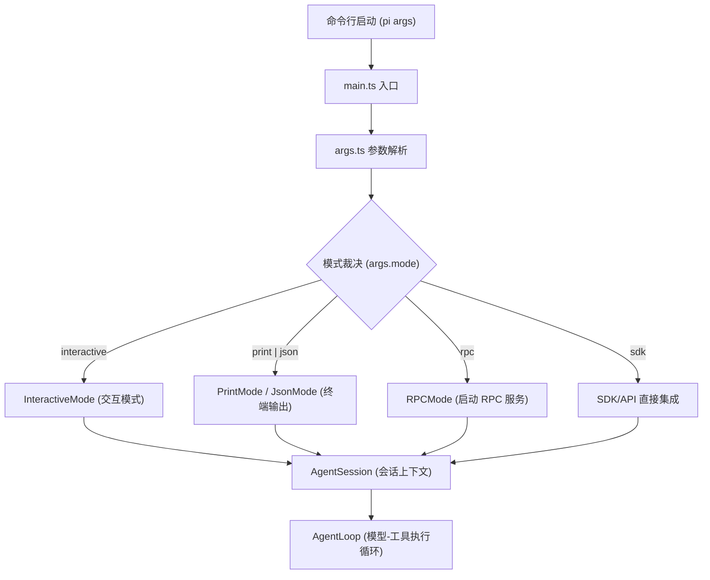

# 0. Pi 的产品身份

## 0.1 真实世界的问题

在接触 Pi 之前，前端工程师最容易犯的错误是把 AI 代理（AI Agent）简单等同于“一个带网页的 Chatbot”或者“IDE 里的智能输入助手（如 Copilot）”。这种直觉偏差在实际研发中会产生严重问题：
1. **暗箱操作与失控**：如果仅仅是对话，当模型被允许执行代码、修改文件时，用户无法精确审计其每一步操作，容易导致本地代码库被意外污染，或者在生产环境误执行了危险命令。
2. **缺乏状态恢复与复现性**：传统的 Chat 界面是一次性的。当一个复杂的代码重构进行到一半由于网络或者模型限制中断时，你无法把这个会话完美分叉（Fork）、保存（Checkpoint）或者与同事分享。
3. **功能堆砌与体积臃肿**：如果把各种团队特有的审查规则、特定的打包命令、甚至鉴权弹窗全都硬编码到核心引擎里，整个工具就会迅速退化为无法升级和维护的“巨石系统”。

Pi 作为一个 **最小终端编码代理框架（Minimal Terminal Coding Harness）**，正是为了解决这些问题而设计的。它不与特定的 IDE 强绑定，而是作为一个以工作区（Workspace）为中心、默认对工作区拥有完全操作权限的“安全执行壳”。它保证了所有的输入、执行、裁决和输出都是结构化且可审计的。

## 0.2 极简示例

你可以直接将文件内容通过管道传给 Pi，并限制其只能使用只读类工具来安全地审计代码：

```bash
# 通过管道将文件内容作为上下文，并限制只能使用 read, grep, find, ls 等只读工具进行分析
cat packages/coding-agent/src/main.ts | pi -p "分析 main 函数的初始化逻辑，只用 read 工具查看相关依赖" --tools read,grep,find,ls
```

在这种只读模式下，即使模型尝试调用 `write` 或 `bash` 工具来修改工作区，Pi 的执行壳也会直接在客户端层面予以拒绝，确保了宿主环境的绝对安全。

## 0.3 源码结构与数据流

Pi 的设计遵循清晰的 Monorepo 拆分哲学，将整个系统分为四个核心包：
- **`packages/coding-agent`**：产品的 CLI 外壳与 Session 运行时。负责命令行参数解析、全局与项目设置的管理、会话的历史读写以及扩展资源的发现和调度。
- **`packages/agent`**：状态化的核心代理循环。定义了代理的消息流（AgentMessage）、转译与准备逻辑，并在本地驱动模型-工具执行的循环状态机。
- **`packages/ai`**：统一的模型 Provider 客户端。抽象了流式文本输出、思考块（Thinking）处理、多模态输入以及跨厂商的 OAuth/API Key 统一接口。
- **`packages/tui`**：终端交互组件库。基于终端绘图单元，负责渲染输入框、状态栏、Markdown 消息以及多级级联选择器。

#### 0.3.1 运行模式与数据分流

Pi 的入口会根据命令行参数，将流量分发到四种不同的执行模式：
1. **Interactive（交互模式）**：默认模式，启动 TUI 界面，支持快捷键、多行编辑和队列打断。
2. **Print/Json（打印模式）**：用于一次性脚本调用，以纯文本或标准 JSON 格式输出代理流事件。
3. **RPC（服务集成模式）**：启动本地服务器，通过 RPC 协议对外提供 Agent 能力。
4. **SDK（程序化集成）**：允许第三方 TypeScript 模块直接导入 `AgentSession` 进行编程集成。

下列 Mermaid 图展示了从命令行启动到四种模式分流的数据流：



#### 0.3.2 源码责任表

| 核心环节 | 系统责任 | 源码证据 | 核心审计点 |
| :--- | :--- | :--- | :--- |
| **命令行入口** | 解析参数，构建初始配置 | [main.ts#L424](packages/coding-agent/src/main.ts#L424) | 确认哪些 CLI 参数能覆盖 `settings.json` 的全局配置 |
| **参数解析** | 将 arguments 转为 Args 结构 | [args.ts#L59](packages/coding-agent/src/cli/args.ts#L59) | 确认模式（mode）、工具白名单（tools）和资源开关的默认值 |
| **会话运行时** | 组装模型、工具、设置与扩展资源 | [agent-session.ts#L252](packages/coding-agent/src/core/agent-session.ts#L252) | 检查 `prompt()` 提交时如何调度 slash commands |
| **提交入口** | 接收 Prompt 并进行前置校验与派发 | [agent-session.ts#L962](packages/coding-agent/src/core/agent-session.ts#L962) | 审计当代理忙碌时，新的 Prompt 是如何加入缓冲队列的 |
| **状态化代理** | 保存 Turn 历史，管理 steer/followUp 消息 | [agent.ts#L166](packages/agent/src/agent.ts#L166) | 检查代理状态（State）是如何随着每一轮交互流转的 |
| **核心执行循环**| 驱动 LLM 响应与 Tool 调用的闭环 | [agent-loop.ts#L95](packages/agent/src/agent-loop.ts#L95) | 确认工具的返回结果是如何流式合并回上下文的 |
| **工具批次控制**| 裁决工具是并行（Parallel）还是串行执行 | [agent-loop.ts#L384](packages/agent/src/agent-loop.ts#L384) | 检查当批次内含有 `sequential` 执行模式的工具时如何进行阻断 |

## 0.4 设计考量与折衷

#### 0.4.1 为什么要设计成 Harness（执行壳）？

Pi 不是 IDE 插件，而是一个与你的工作目录紧密结合的 **Harness**。这意味着它不负责帮你做美化渲染或代码高亮，而是重点管好以下 **四大边界**：
- **输入边界**：所有的输入（管道数据、图片、本地文件引用、系统环境变量）在进入模型前必须经过明确的转译和过滤。
- **状态边界**：代理的记忆是不透明的，Pi 将其持久化为标准 JSONL 文件，让模型的每一次思考、每一次工具调用都有迹可循，随时可做分叉和回滚。
- **裁决边界**：当模型决定执行 `bash` 操作时，底层的操作系统才是裁决者。Pi 负责拦截工具参数，通过 `beforeToolCall` 事件给用户或安全策略提供“拒绝”的机会。
- **输出边界**：模型的输出不仅仅是文本，更是执行结果。Harness 必须捕捉标准输出（stdout）、标准错误（stderr）以及工具返回值，并重新结构化反馈给模型。

#### 0.4.2 为什么坚持“小内核，大外挂”？

在开发 Pi 时，最诱人的决定是把“自动重试”、“后台持续执行（Background daemon）”或“计划生成（Planning mode）”塞进内核。但我们选择予以拒绝。
因为真实的工程仓库千差万别，如果内核过大，会导致以下后果：
- **安全沙箱难以维护**：把太多底层进程管理塞进 core，会使得安全审计和权限控制漏洞百出。
- **扩展与版本脱节**：团队内部往往有特定的代码风格、特定的构建流，这些如果写在 core 里，一旦 Pi 发布新版本，用户的本地修改就会因代码冲突而无法顺利升级。

因此，Pi 的内核只保留了最基础的 Model-Tool 循环和资源发现协议，而将具体的工程逻辑交给资源系统（Prompt 模板、Skills、Extensions）。

## 0.5 常见误区与排错

#### 0.5.1 误区一：以为 Pi 内部集成了 MCP（Model Context Protocol）协议
* **事实**：Pi 的内核极其精简，并不直接内置 MCP Client/Server 桥接。Pi 通过可组合的 TypeScript Extensions 来支持工具发现。如果你需要外部 MCP 服务的工具，应该编写或配置一个 Extension，在扩展的启动事件中去拉取并动态注册这些工具。

#### 0.5.2 误区二：误以为 bash 工具会维持后台状态
* **事实**：Pi 默认提供的 `bash` 工具在每次调用时，都是在当前工作目录下启动的一个独立的子进程。这意味着你在上一次 `bash` 调用中执行了 `export MY_VAR=1`，在下一次 `bash` 调用中是**无法**读取到该环境变量的。如果需要全局变量，应该将其写入项目级 `settings.json` 的 `shellCommandPrefix` 中。

#### 0.5.3 误区三：混淆模型能力与 Harness 能力
* **排错诊断**：当代理拒绝执行某个文件修改或报工具调用格式错误时，开发者常误认为是 Pi 框架的问题。实际上，应首先查看本地 debug 日志（如 `~/.pi/agent/pi-debug.log`），确认 Harness 是否正确地把工具声明发送给了 Provider。如果 Harness 发送正确，则是当前选择的模型本身不支持或不理解该工具的 Schema。

## 0.6 练习题

#### 0.6.1 基础使用题
在当前仓库下启动 Pi 的只读模式，使用 `-p` 选项让 Pi 总结 `packages/coding-agent/src/main.ts` 中的 `MainOptions` 接口定义，并限制只允许使用 `read` 工具。
* *答题线索*：利用 `pi -p "..." --tools read` 来实现。

#### 0.6.2 原理分析题
仔细阅读 `packages/coding-agent/src/main.ts` 源码，画出一幅草图，描述命令行参数被解析后，主流程是如何一步步初始化 `AuthStorage`、`ModelRegistry`、`SettingsManager` 和 `ResourceLoader` 并最终将其注入 `AgentSession` 构造函数的。

#### 0.6.3 扩展实践题
通过传入命令行参数 `--no-extensions` 启动 Pi，观察控制台输出。同时在 `~/.pi/agent/settings.json` 中配置一个包含 2 个自定义 Skills 的路径，重新启动并比对在无扩展状态下，系统资源加载器的输出差异。
