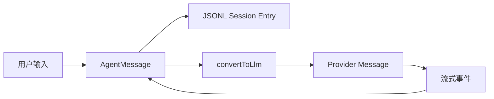

# 第0章 前端工程师进入 Agent 世界的前置知识

## 0.1 本章解决的问题

本书默认读者会 JavaScript、TypeScript、React 或 Vue，但从未写过 agent harness。这个起点没有问题。pi 的核心不是 Python notebook，也不是模型魔法，而是一个 TypeScript 运行时：它把用户输入、模型流式输出、工具调用、文件系统状态、会话树、扩展事件和终端 UI 组织成可恢复的工作循环。

读 pi 源码前必须先建立五个模型：消息协议、流式事件、工具闭环、追加式持久化、运行时边界。低层 loop 入口是 [agent-loop.ts#L31](/source-code/packages/agent/src/agent-loop.ts#L31)，状态封装从 [agent.ts#L166](/source-code/packages/agent/src/agent.ts#L166) 开始，产品层会话由 [agent-session.ts#L252](/source-code/packages/coding-agent/src/core/agent-session.ts#L252) 承担。后续章节会反复回到这三个位置。

## 0.2 前端工程师需要补齐的 TypeScript/Node 模型

前端工程师最容易把 agent 理解成“一个会调用工具的聊天组件”。这个类比只对了一半。React 组件的核心是 state -> render；agent harness 的核心是 transcript -> model request -> streamed events -> side effects -> transcript。它也有状态，但状态会跨进程、跨会话、跨工具调用持久化。

| 模式 | 在 pi 中的含义 | 阅读源码时关注什么 |
|---|---|---|
| discriminated union | `AgentMessage`、`AgentEvent`、`SessionEntry` 通过 `role` 或 `type` 分支 | 每个分支是否能进入模型、是否能持久化、是否只给 UI 看 |
| `AsyncIterable` | provider 的流式输出不是一次性字符串 | `for await` 中什么时候更新 UI，什么时候拿最终 message |
| `AbortSignal` | 用户按 Escape、RPC abort、工具超时都需要向下传播 | signal 是否传到 provider、工具、扩展 UI 和 shell |
| schema 校验 | 工具参数来自模型，不能相信 TypeScript 类型 | tool call 执行前是否做运行时校验 |
| append-only file | session 是 JSONL 树，不是内存数组 | 每次副作用后是否能从文件恢复 |
| reducer | 流式 delta 合并成最终 assistant message | partial message 和最终 message 的边界 |
| adapter | provider、工具、UI、扩展都被适配成统一接口 | 新增能力时是否污染核心 loop |

这些模型比具体函数名更重要。函数名会变化，但责任边界不会轻易变化。

## 0.3 LLM 消息不是 UI 消息

pi 有多层消息。低层 `Agent` 默认只把 `user`、`assistant`、`toolResult` 转成 provider 能理解的消息，默认转换逻辑在 [agent.ts#L31](/source-code/packages/agent/src/agent.ts#L31)。coding-agent 产品层还扩展了 `bashExecution`、`custom`、`compactionSummary`、`branchSummary` 等内部消息，再由 [messages.ts#L148](/source-code/packages/coding-agent/src/core/messages.ts#L148) 判断哪些进入模型上下文。

这个分离是 agent harness 的第一条设计红线：用户看到的、session 保存的、模型看到的，不应该被混成一种结构。否则你无法表达“这条 shell 输出只记录但不发给模型”“这个扩展通知只给 UI 看”“这个 branch summary 只在恢复上下文时使用”。

## 0.4 Tool Use 闭环

工具调用不是模型执行代码。模型只能输出结构化请求，例如“调用 `read`，参数是某个路径”。runtime 负责查找工具、校验参数、执行副作用、截断输出、构造 tool result，再把结果回灌给模型。准备工具调用的核心在 [agent-loop.ts#L562](/source-code/packages/agent/src/agent-loop.ts#L562)，tool result message 的构造在 [agent-loop.ts#L727](/source-code/packages/agent/src/agent-loop.ts#L727)。

最小闭环是：

1. 用户消息进入上下文。
2. provider 流式返回 assistant message。
3. assistant message 中出现 `toolCall` block。
4. loop 根据工具名找到 `AgentTool`。
5. schema 校验参数。
6. 执行工具并捕获错误。
7. 生成 `toolResult` 消息。
8. 把 tool result 追加到上下文。
9. 如果任务未结束，继续下一轮 provider 请求。

如果第 7 步缺失，模型不知道工具执行结果。如果第 8 步缺失，工具调用只是一次本地副作用，不会形成可推理的链路。如果错误没有变成 tool result，模型无法根据失败调整策略。

## 0.5 流式事件是运行时协议

pi 不把模型响应当成一个最终字符串。`streamAssistantResponse()` 从 [agent-loop.ts#L275](/source-code/packages/agent/src/agent-loop.ts#L275) 开始消费 provider 事件，并向上发出 `message_start`、`message_update`、`message_end` 等 agent 事件。这个事件流同时服务 TUI、RPC、JSON mode、测试、扩展和 session 持久化。

前端工程师可以把它类比为服务端状态同步协议。`message_update` 类似增量 patch，适合 UI 实时渲染；`message_end` 才是可以稳定写入 session 的最终事实；`tool_execution_*` 是工具副作用的观察点；`agent_end` 是一次运行的结算点。

## 0.6 文件系统式状态

pi 不是把所有配置放进数据库。它大量使用文件系统：

- `~/.pi/agent` 保存全局配置、认证、packages、sessions。
- 项目 `.pi` 保存项目级 settings、extensions、skills、themes、prompts。
- `AGENTS.md` / `CLAUDE.md` 提供项目规则。
- session 是追加式 JSONL。
- packages 贡献 extensions、skills、prompt templates、themes。

资源加载由 `DefaultResourceLoader` 负责，它会加载 context files、extensions、prompts、themes 和 skills，入口见 [resource-loader.ts#L152](/source-code/packages/coding-agent/src/core/resource-loader.ts#L152)。这种设计让 pi 像开发工具而不是 SaaS：配置可审计、可复制、可放进项目目录。

## 0.7 本书阅读方法

每章按同一条线索阅读：用户怎么用；runtime 做了什么；模型能看到什么；harness 私下保存什么；源码落在哪里；失败时如何恢复；如果你要复刻，哪些是 MVP，哪些是生产级能力。

读源码时不要先追所有调用链。先问六个问题：

1. 这个模块解决什么不可省略的问题。
2. 它拥有哪一类状态。
3. 它向模型暴露什么。
4. 它执行哪些副作用。
5. 它如何持久化。
6. 它允许哪些扩展点。

能回答这六个问题，你就不是在背 pi 的实现，而是在学习如何设计自己的 agent harness。
