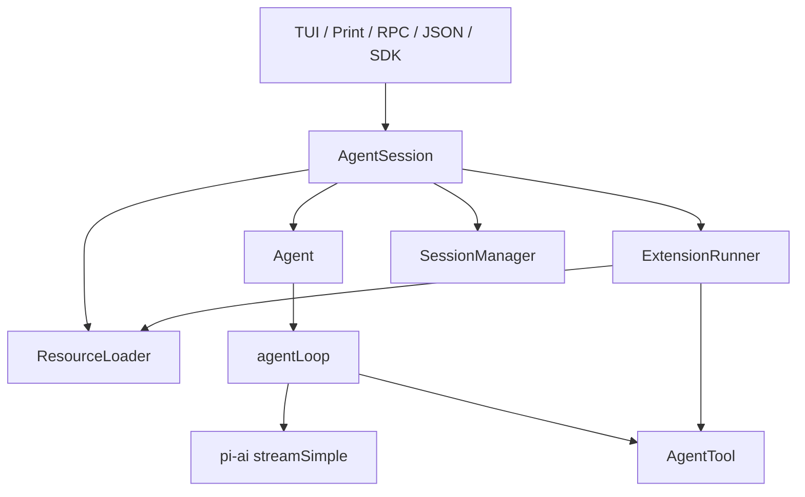

# 第1章 架构总览：pi 是小内核加扩展生态

## 1.1 pi 解决什么系统问题

pi 是 terminal coding harness。它的目标不是做 IDE，也不是托管 agent 平台，而是在本地项目目录里提供一个可扩展、可恢复、可脚本化的 coding agent 运行时。用户可以安装、登录 provider、选择模型、引用文件、运行 shell、让模型读写代码、恢复 session、导出记录，并通过 extensions、skills、prompt templates、themes、packages、SDK、RPC 和 JSON mode 扩展它。

官方文档的中心判断是“小核心，复杂工作流通过扩展生态完成”。这意味着 pi 刻意不把 MCP、sub-agent、permission popup、plan mode、todo、background bash 做进核心。复刻 pi 时，第一件事不是复制某个 UI，而是复制这种边界：核心提供稳定协议和运行时，产品能力通过资源和扩展增长。

## 1.2 四层架构

| 层 | 包 | 责任 |
|---|---|---|
| Provider 层 | `packages/ai` | 模型注册、API 适配、OAuth/API key、流式事件、usage/cost |
| Agent Core | `packages/agent` | agent loop、工具闭环、基础 `Agent`、可嵌入 `AgentHarness` |
| Product Harness | `packages/coding-agent` | CLI/TUI/RPC/JSON、内置工具、session、settings、extensions、resources |
| Terminal UI | `packages/tui` 与 coding-agent modes | 编辑器、渲染、键盘、overlay、自定义组件 |

低层 loop 从 [agent-loop.ts#L31](/source-code/packages/agent/src/agent-loop.ts#L31) 开始；`Agent` 状态封装从 [agent.ts#L166](/source-code/packages/agent/src/agent.ts#L166) 开始；产品级 `AgentSession` 从 [agent-session.ts#L252](/source-code/packages/coding-agent/src/core/agent-session.ts#L252) 开始；可嵌入 harness 从 [agent-harness.ts#L164](/source-code/packages/agent/src/harness/agent-harness.ts#L164) 开始。

## 1.3 用户视角的完整链路

用户在项目目录运行 `pi`。启动时，pi 读取 settings、auth、models、context files、extensions、skills、prompt templates、themes 和 packages。进入 interactive mode 后，用户在编辑器输入任务，可以通过 `@file` 引用文件、粘贴图片、用 `!command` 或 `!!command` 运行 shell、用 slash command 切模型或管理 session。

一次普通 prompt 的路径是：

1. mode 层收集文本、图片、文件引用和输入来源。
2. `AgentSession.prompt()` 处理 slash command、input extension、prompt template 和 skill 展开，入口见 [agent-session.ts#L962](/source-code/packages/coding-agent/src/core/agent-session.ts#L962)。
3. `_runAgentPrompt()` 调用低层 `Agent.prompt()`，见 [agent-session.ts#L918](/source-code/packages/coding-agent/src/core/agent-session.ts#L918)。
4. `agentLoop()` 调 provider、执行工具、产生事件。
5. `AgentSession._handleAgentEvent()` 消费事件，负责 session 写入、UI 广播、扩展事件、自动压缩和重试判断，入口见 [agent-session.ts#L469](/source-code/packages/coding-agent/src/core/agent-session.ts#L469)。
6. session 以 JSONL 树追加保存，用户可以继续、恢复、分叉、导出。

这个链路解释了为什么 pi 不是“CLI 包了一层模型 API”。它是一个多消费者事件系统：同一套事件同时驱动 UI、持久化、扩展、RPC 和测试。

## 1.4 核心设计不变量

pi 的设计可以压缩成七个不变量：

1. provider 差异只能在 provider 层收敛，不能泄漏进 agent loop。
2. 模型看到的消息由转换边界决定，不能等同于 UI 或 session 消息。
3. 工具是显式注册、可校验、可观察、可拦截的能力。
4. session 是 append-only JSONL 树，不能退化成线性聊天数组。
5. 扩展是产品能力增长接口，不是核心 loop 的补丁。
6. runtime 配置变化要在安全点生效，不能修改正在进行的 provider 请求。
7. 所有关键过程要能被事件观察，才能支持 TUI、RPC、eval 和调试。

## 1.5 自定义 harness 的架构位置

`AgentHarness` 是给“我想复用 pi 的低层能力，但做自己的产品外壳”的开发者准备的。它不等同于 `AgentSession`。`AgentSession` 是 pi CLI 产品；`AgentHarness` 是更通用的嵌入层，负责 turn snapshot、save point、pending session writes、queue、tools、resources、model、compaction、tree navigation 等。

如果你要做 Web UI、团队内部 agent、IDE 插件、远程执行平台，应该学习 `AgentSession` 如何产品化，再判断哪些能力通过 `AgentHarness` 复用，哪些能力自己实现。第22章和第23章会把这个迁移路径整理成检查表。

## 1.6 常见误解

误解一：pi 的核心能力等于内置工具。实际核心是 loop、事件、session、资源和扩展边界；工具只是其中一种能力。

误解二：所有高级功能都应该做进核心。pi 的策略相反。权限门、计划模式、todo、MCP、sub-agent、远程执行都可以由 extension 或 package 提供。

误解三：RPC/SDK 是附加功能。对复刻者来说，RPC/SDK 是验证 harness 设计是否干净的方式。如果只能在 TUI 中工作，说明业务逻辑和界面耦合过深。
