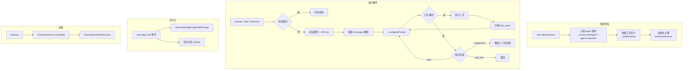
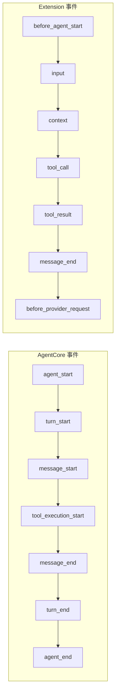
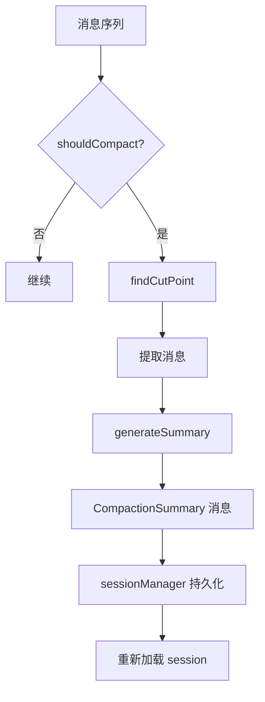
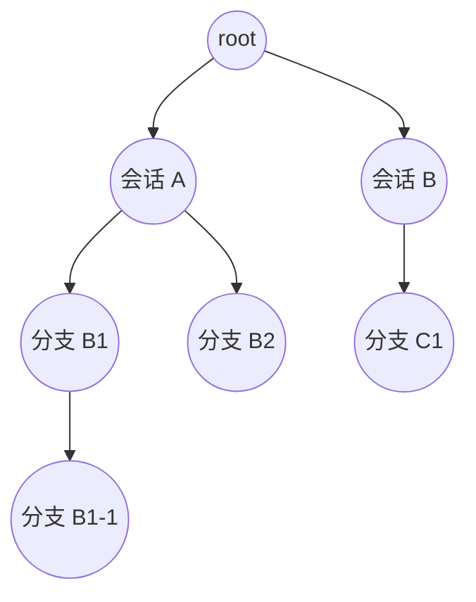
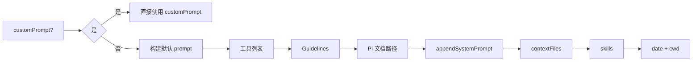
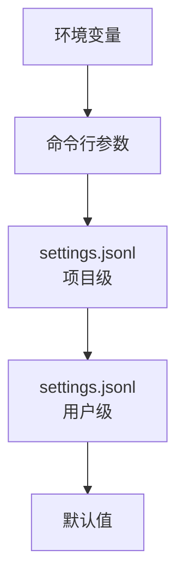
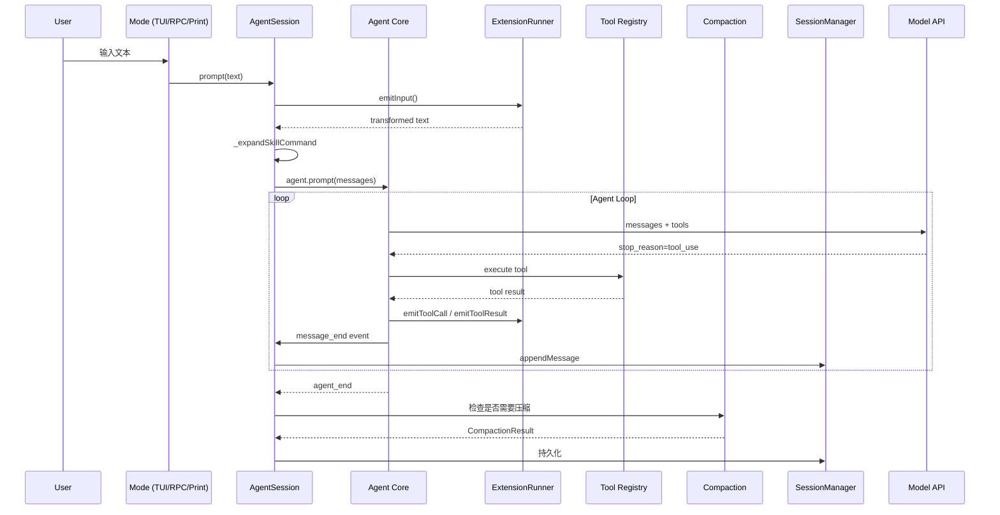

# 第1章 架构总览：基于 pi 源码的核心模块图

> **本章目标**：建立对 pi Code Agent 核心架构的全局理解，以 `packages/coding-agent/src/core/` 的真实源码结构为事实基准。
>
> **pi 源码对照**：
> - `packages/coding-agent/src/core/index.ts` — 核心模块导出（架构地图）
> - `packages/coding-agent/src/core/agent-session.ts` — 核心会话抽象
> - `packages/coding-agent/src/core/agent-session-runtime.ts` — 会话运行时工厂
> - `packages/coding-agent/src/core/agent-session-services.ts` — 会话服务创建
>
> **本章结束能做什么**：能画出 pi 核心架构图，解释 `AgentSession` 如何串联工具系统、扩展系统、上下文管理、持久化四大模块。
> **阅读时间**：约 20 分钟。

---

## 1.1 为什么看 pi 架构

pi 是一个**代码领域 Code Agent 产品**，同时也是一个**可扩展的 Agent 框架**。它的核心价值在于：三种运行模式（交互/TUI、打印/RPC、命令行）共享同一套 `AgentSession`，而扩展系统、工具系统、压缩系统都围绕这个核心类编织在一起。

理解 pi 架构 = 理解一个工业级 Agent 系统如何用最小复杂度实现最大可扩展性。

### 1.1.1 pi 的三层封装

```
┌─────────────────────────────────────────────────────────────┐
│  Mode 层（modes/）                                         │
│  interactive · print · rpc                                  │
│  负责 I/O、键盘事件、终端渲染                                │
├─────────────────────────────────────────────────────────────┤
│  AgentSession 层（core/）                                   │
│  会话抽象、事件订阅、prompt 编排、工具管理                     │
│  compaction、model 选择、扩展绑定                            │
├─────────────────────────────────────────────────────────────┤
│  Agent Core 层（packages/agent/）                            │
│  纯状态机：无 I/O、只接收消息、yield 事件                     │
└─────────────────────────────────────────────────────────────┘
```

**最关键的设计**：Mode 层（交互/TUI）和 Agent Core 完全解耦。`AgentSession` 作为中间层，把 Agent Core 的状态机包装成用户可见的会话概念，同时接入扩展系统、工具系统、压缩系统。

### 1.1.2 核心模块目录结构

pi 源码核心在 `packages/coding-agent/src/core/`：

```
core/
├── agent-session.ts          ← ⭐ 核心会话抽象（所有模式的共享基座）
├── agent-session-runtime.ts  ← Session 运行时工厂
├── agent-session-services.ts ← 创建 Session 所需的服务
├── session-manager.ts        ← Session 持久化（JSONL + tree 结构）
├── messages.ts              ← 自定义消息类型 + convertToLlm
├── system-prompt.ts         ← buildSystemPrompt 构建
├── skills.ts               ← Skills 加载、验证、prompt 注入
├── slash-commands.ts       ← 斜杠命令注册与分发
│
├── tools/                  ← 工具系统（工厂模式）
│   ├── index.ts           ← createToolDefinition() 工厂
│   ├── bash.ts, read.ts, edit.ts, write.ts
│   ├── grep.ts, find.ts, ls.ts
│   ├── truncate.ts        ← 结果截断
│   └── file-mutation-queue.ts ← 文件变更队列
│
├── compaction/             ← 上下文压缩系统
│   ├── index.ts, compaction.ts
│   ├── branch-summarization.ts
│   └── utils.ts
│
├── extensions/            ← 扩展系统（插件架构）
│   ├── index.ts, types.ts
│   ├── loader.ts          ← jiti 加载 + 虚拟模块
│   ├── runner.ts          ← ExtensionRunner 生命周期
│   └── wrapper.ts         ← 工具包装
│
├── event-bus.ts           ← 事件总线
├── settings-manager.ts     ← 多级配置
├── auth-storage.ts        ← API Key / OAuth 存储
├── model-registry.ts      ← 多 Provider 模型注册
├── resource-loader.ts     ← skills/prompts/themes 加载
└── ...（其他支持模块）
```

---

## 1.2 AgentSession：核心抽象

### 1.2.1 为什么需要 AgentSession

三种运行模式（interactive / print / rpc）都需要：
- 管理 Agent 的生命周期
- 订阅 Agent 事件
- 处理工具调用
- 管理会话持久化
- 处理上下文压缩

如果没有 `AgentSession`，每个模式都要自己写这些逻辑——代码重复、行为不一致。

`AgentSession` 的设计目标：**一个类，三种模式共用**。

### 1.2.2 AgentSession 核心职责

```typescript
// packages/coding-agent/src/core/agent-session.ts（关键接口）
export class AgentSession {
    // --- 生命周期 ---
    subscribe(listener: AgentSessionEventListener): () => void  // 事件订阅
    dispose(): void  // 清理资源

    // --- 状态访问（只读） ---
    get state(): AgentState
    get model(): Model<any> | undefined
    get thinkingLevel(): ThinkingLevel
    get isStreaming(): boolean
    get systemPrompt(): string

    // --- Prompting ---
    prompt(text: string, options?: PromptOptions): Promise<void>
    steer(text: string, images?: ImageContent[]): Promise<void>  // 流式插队
    followUp(text: string, images?: ImageContent[]): Promise<void>  // 流式排队
    sendCustomMessage(message, options?): Promise<void>

    // --- Model 管理 ---
    setModel(model: Model<any>): Promise<void>
    cycleModel(direction?: 'forward' | 'backward'): Promise<ModelCycleResult | undefined>

    // --- 工具管理 ---
    getActiveToolNames(): string[]
    getAllTools(): ToolInfo[]
    setActiveToolsByName(toolNames: string[]): void

    // --- Compaction ---
    get isCompacting(): boolean
}
```

### 1.2.3 Session 生命周期图



### 1.2.4 事件订阅机制

`AgentSession` 使用**代理模式**：在内部订阅 `Agent` 的事件（`_handleAgentEvent`），再转发给外部监听器：

```typescript
// agent-session.ts（第 120-160 行）
private _handleAgentEvent = async (event: AgentEvent): Promise<void> => {
    // 1. 扩展事件优先
    await this._emitExtensionEvent(event)

    // 2. 转发给外部监听器
    this._emit(event.type === 'agent_end'
        ? { ...event, willRetry: this._willRetryAfterAgentEnd(event) }
        : event)

    // 3. 处理会话持久化
    if (event.type === 'message_end') {
        if (event.message.role === 'custom') {
            // 自定义消息 -> CustomMessageEntry
            this.sessionManager.appendCustomMessageEntry(...)
        } else if (/* user/assistant/toolResult */) {
            // 普通消息 -> SessionMessageEntry
            this.sessionManager.appendMessage(event.message)
        }
    }
}
```

---

## 1.3 工具系统（Tools）

### 1.3.1 工具工厂模式

pi 用**工厂模式**统一创建 7 种内置工具：

```typescript
// core/tools/index.ts
export type ToolName = 'read' | 'bash' | 'edit' | 'write' | 'grep' | 'find' | 'ls'

export function createToolDefinition(
    toolName: ToolName,
    cwd: string,
    options?: ToolsOptions
): ToolDef {
    switch (toolName) {
        case 'read':  return createReadToolDefinition(cwd, options?.read)
        case 'bash':  return createBashToolDefinition(cwd, options?.bash)
        case 'edit':  return createEditToolDefinition(cwd, options?.edit)
        case 'write': return createWriteToolDefinition(cwd, options?.write)
        case 'grep':  return createGrepToolDefinition(cwd, options?.grep)
        case 'find':  return createFindToolDefinition(cwd, options?.find)
        case 'ls':    return createLsToolDefinition(cwd, options?.ls)
    }
}
```

### 1.3.2 工具分类

| 工具 | 分类 | 读/写 | 说明 |
|------|------|-------|------|
| `read` | 只读 | R | 文件读取，支持 offset/limit |
| `grep` | 只读 | R | 内容搜索（rg 封装） |
| `find` | 只读 | R | 文件查找 |
| `ls` | 只读 | R | 目录列表 |
| `bash` | 混合 | R/W | 命令执行 |
| `edit` | 写入 | W | 精准编辑（diff patch） |
| `write` | 写入 | W | 完整覆盖写入 |

### 1.3.3 工具 → Agent 的桥接

```typescript
// core/tools/tool-definition-wrapper.ts
export function createToolDefinitionFromAgentTool(
    tool: AgentTool<any>,
    name: string
): ToolDefinition { ... }

// AgentSession._installAgentToolHooks() 把工具 hooks 安装到 Agent
this.agent.beforeToolCall = async ({ toolCall, args }) => {
    return await this._extensionRunner.emitToolCall({ type: 'tool_call', ... })
}
this.agent.afterToolCall = async ({ toolCall, args, result, isError }) => {
    return await this._extensionRunner.emitToolResult({ type: 'tool_result', ... })
}
```

---

## 1.4 扩展系统（Extensions）

### 1.4.1 扩展架构分层

```
Extension（用户写的 .ts 文件）
        ↓ 工厂函数
ExtensionFactory
        ↓ jiti 动态加载
ExtensionRunner（生命周期管理）
        ↓ 事件分发
各个 Handler（事件处理函数）
```

### 1.4.2 ExtensionRunner 核心方法

```typescript
// core/extensions/runner.ts
export class ExtensionRunner {
    // 生命周期绑定
    bindCore(actions, contextActions, providerActions): void
    bindCommandContext(actions?): void
    setUIContext(uiContext?): void

    // 事件发射
    emit(event): Promise<RunnerEmitResult>        // 普通事件
    emitMessageEnd(event): Promise<AgentMessage>  // message_end（可替换消息）
    emitToolCall(event): Promise<ToolCallEventResult>  // 工具调用拦截
    emitToolResult(event): Promise<ToolResultEventResult> // 工具结果拦截
    emitContext(messages): Promise<AgentMessage[]>  // 上下文拦截
    emitBeforeAgentStart(...): Promise<BeforeAgentStartCombinedResult>

    // 工具和命令查询
    getAllRegisteredTools(): RegisteredTool[]
    getToolDefinition(name): ToolDefinition | undefined
    getRegisteredCommands(): ResolvedCommand[]
    getCommand(name): ResolvedCommand | undefined
}
```

### 1.4.3 事件体系

pi 的扩展系统通过**事件总线**连接 Agent 生命周期和扩展 Handler：



---

## 1.5 上下文与压缩（Compaction）

### 1.5.1 为什么需要压缩

Code Agent 的会话会越来越长。超过模型的 context window 后，必须**压缩历史消息**而不是丢弃。

### 1.5.2 压缩管道



关键函数：`prepareCompaction()` → `compact()` → 结果存入 `CompactionEntry`。

### 1.5.3 分支摘要（Branch Summarization）

树形会话结构中，导航到其他分支时，当前分支需要被摘要以便后续返回：

```typescript
// compaction/branch-summarization.ts
export async function generateBranchSummary(
    entries: SessionEntry[],
    options: GenerateBranchSummaryOptions,
): Promise<BranchSummaryResult>
```

---

## 1.6 会话持久化（Session Manager）

### 1.6.1 Session 树结构



每个 `SessionEntry` 有 `id` + `parentId`，构成树形结构。存储格式为**追加写入的 JSONL**。

### 1.6.2 SessionEntry 类型

```typescript
// session-manager.ts
export type SessionEntry =
    | SessionMessageEntry      // 消息
    | ThinkingLevelChangeEntry // 思考级别变更
    | ModelChangeEntry         // 模型变更
    | CompactionEntry          // 压缩记录
    | BranchSummaryEntry       // 分支摘要
    | CustomEntry             // 扩展自定义数据
    | CustomMessageEntry       // 扩展注入消息（进 LLM 上下文）
    | LabelEntry              // 标签/书签
    | SessionInfoEntry         // 会话元信息
```

---

## 1.7 System Prompt 与 Skills

### 1.7.1 buildSystemPrompt 的组装顺序



### 1.7.2 Skills 的加载链路

```typescript
// skills.ts: loadSkills()
loadSkills() → loadSkillsFromDir() → loadSkillFromFile()
                                    → 验证 frontmatter
                                    → 解析 name/description
                                    → 返回 Skill[]
formatSkillsForPrompt() → 格式化为 <available_skills> XML 块
```

---

## 1.8 多层配置系统

pi 的配置来自多个层级，按优先级（高到低）合并：



---

## 1.9 整体数据流



---

## 1.10 关键设计原则

| 原则 | 体现 |
|------|------|
| **单一职责** | 每个模块只做一件事（tools/ 只管工具，compaction/ 只管压缩） |
| **工厂模式** | `createToolDefinition()` 统一工具创建 |
| **事件驱动** | Agent Core → AgentSession → ExtensionRunner 事件层层转发 |
| **扩展优先** | 核心路径都留了扩展钩子（before_agent_start, tool_call, tool_result 等） |
| **可恢复** | JSONL 追加写入，crash-safe，支持 branch/session 切换 |

---

## 1.11 后续章节预告

| 章节 | 主题 | 核心源码 |
|------|------|----------|
| 第2章 | Agent Loop | `packages/agent/src/agent-loop.ts` |
| 第3章 | Tools 系统 | `core/tools/index.ts` 及各工具文件 |
| 第5章 | System Prompt | `core/system-prompt.ts` |
| 第7章 | Context Engineering | `core/compaction/` + `core/messages.ts` |
| 第10章 | Extension System | `core/extensions/runner.ts` + `loader.ts` |
| 第14章 | Skills 系统 | `core/skills.ts` |
| 第15章 | 会话持久化 | `core/session-manager.ts` |

---

> **下一步阅读**：[第2章 Agent Loop](./chapter-02-agent-loop.md) — 理解 Agent 如何用 AsyncGenerator 暴露状态机事件。
