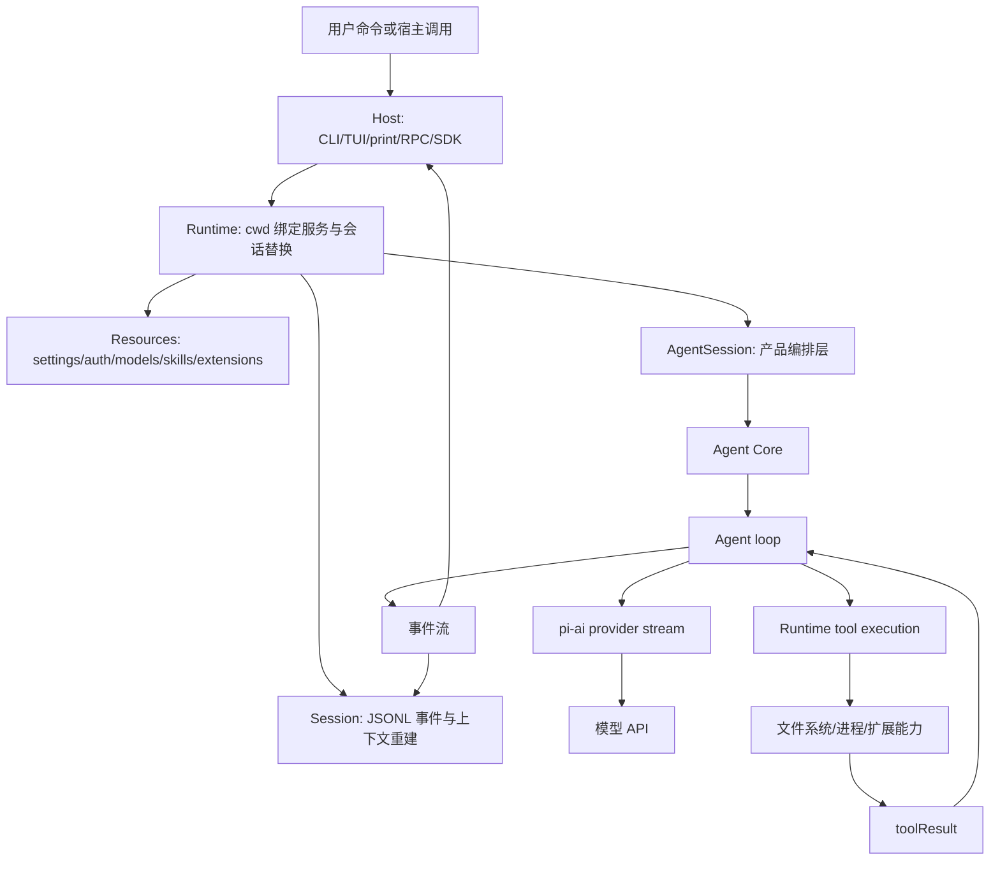

# 1. Pi 的依赖 DAG 与 Harness 边界

## 1.1 问题场景

如果把 Pi 理解成“一个带 CLI 的聊天程序”，复刻时最容易把参数解析、模型调用、文件读写、会话保存和终端渲染写进同一个入口文件。这个设计能跑第一次对话，但第二步就会失败：print/json/RPC/TUI 无法共享状态，provider 切换会污染工具层，会话恢复不知道该恢复模型还是恢复 UI，扩展系统只能变成一堆全局回调。

Pi 的核心不是某个界面，而是一个 harness：它把模型决策、runtime 执行、本地状态、宿主外壳分成可替换的边界。读者复刻 Pi 时，必须先定义 `Runtime / Agent / Provider / Tool / Session / Host` 六个概念，否则后面所有章节都会退化成功能清单。

## 1.2 用户如何使用

用户看到的是同一个 `pi` 命令：

```bash
pi
pi -p "review this diff"
pi --mode json -p "list risks"
pi --mode rpc
```

这些模式的输入输出不同，但不应该对应四套 agent。交互模式接收键盘输入，print/json 模式把事件写到 stdout，RPC 模式用 JSONL 请求响应，SDK 则让 Node 程序直接创建 session。复刻品要保证这些入口最后都进入同一个 session/runtime/agent 事件流。

## 1.3 源码定位

核心边界从这些源码入口开始：

| 边界 | 当前实现 |
|---|---|
| CLI 入口 | [main.ts#L424](packages/coding-agent/src/main.ts#L424) |
| 产品层 session | [agent-session.ts#L252](packages/coding-agent/src/core/agent-session.ts#L252) |
| SDK 汇合点 | [sdk.ts#L202](packages/coding-agent/src/core/sdk.ts#L202) |
| 通用 Agent loop | [agent-loop.ts#L95](packages/agent/src/agent-loop.ts#L95) |
| provider stream 分发 | [stream.ts#L43](packages/ai/src/stream.ts#L43) |
| 工具注册 | [index.ts#L81](packages/coding-agent/src/core/tools/index.ts#L81) |
| session 持久化 | [session-manager.ts#L711](packages/coding-agent/src/core/session-manager.ts#L711) |
| TUI 宿主 | [tui.ts#L239](packages/tui/src/tui.ts#L239) |

## 1.4 生命周期图



## 1.5 关键代码片段

源码位置：[agent-session.ts#L252](packages/coding-agent/src/core/agent-session.ts#L252)。片段之后继续看构造函数如何订阅 agent 事件：[agent-session.ts#L319](packages/coding-agent/src/core/agent-session.ts#L319)。

```ts
export class AgentSession {
  readonly agent: Agent;
  readonly sessionManager: SessionManager;
  readonly settingsManager: SettingsManager;

  private _resourceLoader: ResourceLoader;
  private _customTools: ToolDefinition[];
  private _modelRegistry: ModelRegistry;
}
```

解释：`AgentSession` 是产品层 orchestrator。输入是已经装配好的 agent、settings、session、resources、model registry；输出不是模型文本，而是一组可以被 host 订阅的事件和命令。它持有 runtime 私有状态，例如资源、扩展、工具注册表和 compaction/retry 状态。复刻最小版可以先只保留 `agent`、`sessionManager`、`settingsManager`，但不能把这些状态塞进 provider。

源码位置：[stream.ts#L43](packages/ai/src/stream.ts#L43)。片段之后继续看 stream 如何要求 provider 注册过的 `stream` 函数：[stream.ts#L58](packages/ai/src/stream.ts#L58)。

```ts
export function streamSimple<TApi extends Api>(
  model: Model<TApi>,
  context: Context,
  options?: SimpleStreamOptions,
): AssistantMessageEventStream {
  const streamFn = getStreamFunction(model.api);
  return streamFn(model, context, options);
}
```

解释：`pi-ai` 只根据 `model.api` 找协议适配器。输入是标准化 `Model` 和 `Context`，输出是 `AssistantMessageEventStream`。它不知道 cwd、session 文件、TUI 或文件系统。复刻时如果让 provider 直接读写项目文件，就会破坏“模型协议”和“本地执行”之间的隔离。

## 1.6 机制拆解

模型能看到的是 system prompt、历史消息、可用 tool schema 和当前请求。Pi runtime 私下保留的是 cwd、settings、auth、session 文件路径、扩展实例、stdout guard、TUI 组件和本地工具执行器。用户输入先进入 host，再交给 `AgentSession`；模型返回 tool call 后，执行权转到 runtime 工具；工具结果再作为 `toolResult` 回灌给 Agent loop。这个闭环让不同 host 共用同一内核，也让扩展只能通过注册点进入系统。

复刻时可以按依赖方向实现：`Provider` 不依赖 `Tool`，`Agent` 不依赖 `TUI`，`Host` 不直接操作 provider，`Session` 不直接调用模型。依赖方向一旦反过来，功能会短期变快，长期不可替换。

## 1.7 设计不变量

- 不变量：模型只提出结构化意图，runtime 执行本地动作。原因：模型不应拥有文件系统权限。违反后果：无法审计、无法禁用工具、无法安全回放。复刻建议：所有工具都实现 `schema + execute`。
- 不变量：provider 层只做协议适配。原因：多厂商支持依赖统一 stream 协议。违反后果：Agent loop 被绑定到某个 SDK。复刻建议：把 OpenAI/Anthropic/Google 差异放入 provider adapter。
- 不变量：host 只消费事件和提交用户意图。原因：TUI、print、RPC 必须共享内核。违反后果：每个界面都会产生不同会话语义。复刻建议：先实现 headless host，再接 TUI。
- 不变量：session 是 append-only 事实来源。原因：恢复、fork、compaction 都依赖可重建历史。违反后果：中断或重试后上下文不一致。复刻建议：任何事件先能落盘，再谈 UI。

## 1.8 失败模式与最小复刻任务

常见失败模式：

- 把 `main()` 写成业务中心，导致 SDK/RPC 无法复用。
- 把工具执行写进 provider，导致 provider 测试必须访问本地文件。
- 把 TUI 状态当成 session 状态，导致 print/json 输出无法恢复。

最小可用版：定义 `Provider.stream(context)`、`Tool.execute(args)`、`Agent.runTurn(message)`、`Session.append(entry)`、`Host.render(event)` 五个接口，跑通一次文本回复。

接近 Pi 的增强版：加入 tool call、toolResult 回灌、JSONL session、cwd 绑定 settings、多个 host。

生产级暂缓项：extension runtime、compaction、OAuth、TUI overlay、stdout guard 和诊断聚合。

## 1.9 验收清单

- 能画出 `Host -> Runtime -> AgentSession -> Agent -> Provider/Tool -> Session -> Host` 数据流。
- 能解释 `AgentSession` 为什么不是 UI 组件。
- 能解释 `pi-ai` 为什么不应该知道文件系统。
- 能定义六个核心接口，并指出每个接口的禁止依赖。
- 能用最小实现跑通一次用户输入、模型回复、事件输出。
