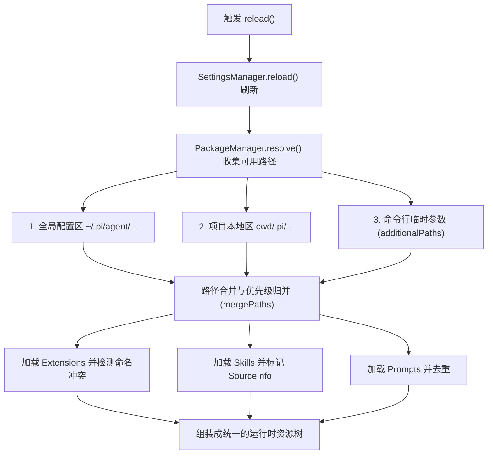

# 1. 小内核与可组合边界

## 1.1 真实世界的问题

在日常开发中，每个团队、甚至每个前端工程师都会沉淀出自己独特的工程习惯。例如：有的团队要求在写 React 组件前先生成 Storybook 结构；有的团队有一套固定的 eslint 规则；还有的团队需要通过 internal API 查接口元数据。

如果一个 AI 代理引擎（AI Agent）试图把这些因人而异、因项目而异的工作流和规则全部写死在内核代码里，将会导致两个灾难性的后果：
1. **核心逻辑极易崩溃**：内核充斥着大量的条件判断分支，升级底层依赖或修改核心逻辑时，极易引入 Regression 故障。
2. **升级路径被彻底堵死**：用户的自定义修改和核心代码交织在一起，一旦上游框架发布新版本，由于代码合并冲突（Code Conflict），用户将完全无法进行平滑升级。

因此，解答“为什么 Pi 运行如此轻快，且极易定制？”的关键，就在于建立 **小内核（Small Core）** 与 **可组合资源（Composable Resources）** 的清晰边界，避免用开发者的个性化习惯去“搞乱”核心代码。

## 1.2 极简示例

Pi 的小内核哲学鼓励我们只在内核中维护基础调度，将个性化需求放到项目本地的资源包中。你可以在项目的根目录下，通过创建一个 `.pi` 目录来添加项目级的专有规则与技能包：

```
# 项目根目录下的 .pi 组合结构
my-project/
├── .pi/
│   ├── settings.json       # 项目级设置（可覆盖全局 settings，如禁用特定主题）
│   ├── prompts/
│   │   └── review.md       # 自定义 slash 命令 `/review` 的 Prompt 模板
│   └── skills/
│       └── SKILL.md        # 项目级专有开发指南（例如：如何遵循本项目特有的状态管理规范）
├── src/
└── package.json
```

当你在这个项目目录下运行 `pi` 并执行 `/reload` 刷新时，这些本地资源就会自动归并到运行上下文中，无需对全局安装的 Pi 进行任何侵入式修改。

## 1.3 源码结构与数据流

为了确保核心引擎的健壮与纯粹，Pi 设定了严格的内核与可组合资源边界。

#### 1.3.1 内核与组合资源对比

| 模块类型 | 内核功能（Core） | 组合资源（Resource / Extension） |
| :--- | :--- | :--- |
| **功能特征** | 必须通用、稳定、跨不同团队和工作流 | 高度定制化、易变、具有团队或项目特异性 |
| **具体职责** | 命令行参数解析、Session 状态读写、Agent 循环、统一 Provider SDK、TUI 窗口系统 | Prompt 模版、Skills（专有任务指南）、TypeScript 扩展（自定义工具与拦截钩子） |
| **加载位置** | `packages/` 编译出的固化二进制或 Node 模块 | 全局状态区、项目 `.pi` 目录、临时参数指定的路径 |

#### 1.3.2 为什么不把 MCP、Sub-agent、Plan 模式等塞进内核？

1. **安全与审计边界**：如果将 Sub-agent、Plan 模式（即允许模型自动拆分任务并在后台自循环）做在 core 核心，意味着进程的生命周期控制权被完全交给了不可预测的模型。如果模型陷入无限循环或尝试并发启动多重子进程，客户端层面将极难对其进行阻断、审计或提供实时的权限弹窗（Permission Gate）。
2. **依赖隔离**：MCP (Model Context Protocol) 往往需要拉取外部服务依赖。将其移出内核，交由 TypeScript 扩展（Extensions）来承载，能最大程度保证 core 内核无第三方网络副作用，实现极致的安全防线。

#### 1.3.3 ResourceLoader 归并机制

在运行时，所有的外部资源都是通过 `ResourceLoader` 接口来进行统一加载和刷新的。

- **接口定义**：[resource-loader.ts#L28](packages/coding-agent/src/core/resource-loader.ts#L28) 中定义了 `ResourceLoader` 必须提供 `getExtensions`、`getSkills`、`getPrompts` 等标准方法。
- **具体实现**：`DefaultResourceLoader` 实现于 [resource-loader.ts#L152](packages/coding-agent/src/core/resource-loader.ts#L152)，它在构造时会解析 `cwd` 和全局的 `agentDir`。
- **刷新过程**：当我们在终端触发 `/reload` 或者是调用 `reload()` 方法时（代码见 [resource-loader.ts#L321](packages/coding-agent/src/core/resource-loader.ts#L321)），系统会依次启动 settings 重新读取、PackageManager 解析包来源，最后把全局（Global）、项目（Project）以及临时（Temporary）目录下的三路路径进行路径合并。

下列 Mermaid 图展示了 `ResourceLoader` 在 `reload` 时的三路路径扫描与资源树归并逻辑：



## 1.4 设计考量与折衷

#### 1.4.1 解耦资源发现与执行引擎

`ResourceLoader` 的核心使命是**发现**资源并将其格式化为标准元数据（Metadata），而绝不参与资源的**执行**裁决。例如，它把扩展（Extensions）加载进内存，但至于扩展里的哪些事件应该拦截，由 `AgentSession` 在运行时进行分发。这样设计能保证：一旦某个扩展代码有语法错误挂掉，顶多只是该扩展加载失败并报 Diagnostic 错误，而不会让 Pi 的核心 CLI 崩溃退出。

#### 1.4.2 配置合并的 Deep Merge 算法

在 settings.json 的合并上，我们没有采用简单的深拷贝覆盖，而是通过 `deepMergeSettings` 算法进行递归合并。
其源码逻辑位于 [settings-manager.ts#L118](packages/coding-agent/src/core/settings-manager.ts#L118)：
```typescript
function deepMergeSettings(base: Settings, overrides: Settings): Settings {
	const result: Settings = { ...base };
	for (const key of Object.keys(overrides) as (keyof Settings)[]) {
		const overrideValue = overrides[key];
		const baseValue = base[key];
		// 若为嵌套对象，则递归 merge；若为数组或基本类型，以 overrideValue 优先覆盖
		if (
			typeof overrideValue === "object" && overrideValue !== null && !Array.isArray(overrideValue) &&
			typeof baseValue === "object" && baseValue !== null && !Array.isArray(baseValue)
		) {
			result[key] = { ...baseValue, ...overrideValue };
		} else {
			result[key] = overrideValue;
		}
	}
	return result;
}
```
这保证了用户可以仅仅在项目级的 `.pi/settings.json` 中重写一行 `theme` 或 `defaultModel`，而自动保留全局配置中已经配置好的 `thinkingBudgets` 或 `npmCommand` 等高成本配置。

## 1.5 常见误区与排错

#### 1.5.1 误区一：为了执行一个简单的固定流程而编写复杂的 Extension
* **事实**：不要一上来就写 Extension。如果你只是需要快速引导模型完成一次“固定的 Code Review”，或者输入一个命令输出一长串代码格式要求，直接写一个 Prompt 模板即可。只有当你想在模型做某事时弹确认窗，或者调用第三方 Node 库（如进行网络请求）时，才需要编写 Extension。

#### 1.5.2 误区二：在 Project（项目）级 settings.json 中误配置了全局级参数
* **事实**：有些参数（例如 `npmCommand` 或 `shellPath`）与具体的本机开发环境强相关，应该始终配置在全局的 `~/.pi/agent/settings.json` 中。如果误提交到了项目的 `.pi/settings.json` 中并推送到 Git，其他平台或同事运行此项目时，可能会因为 shell 路径找不到而启动失败。

#### 1.5.3 误区三：将 Pi Packages 误认为是 Node 依赖包
* **排错诊断**：当你在 `.pi/settings.json` 的 `packages` 字段中加入了一个包资源，Pi 无法解析它。请检查这是否是一个用 npm 发布并附带 `pi-package.json` 的专有 Pi 扩展包，而不是普通的 Node.js 库。Pi 的包分发系统是独立于系统的 Node runtime 之外的资源分发单元。

## 1.6 练习题

#### 1.6.1 基础使用题
创建一个项目本地级 `.pi` 目录，并在其中编写一个 `settings.json`，配置项目专用的默认模型与默认思考等级，启动 Pi 并确认 footer 的输出已变成项目级配置所期望的默认值。

#### 1.6.2 原理分析题
阅读 [resource-loader.ts#L890](packages/coding-agent/src/core/resource-loader.ts#L890) 的 `detectExtensionConflicts` 源码，解释 `ResourceLoader` 在加载多个扩展（Extensions）时，是如何检测并上报工具（Tools）和参数标志（Flags）冲突的？如果冲突发生，Pi 是选择崩溃退出，还是继续运行？

#### 1.6.3 扩展实践题
编写一个极简脚本，导入 `DefaultResourceLoader` 并加载当前工作目录，调用其 `reload()` 方法，并在控制台上把当前环境已成功加载的所有 skills 和 prompts 列表打印出来。
* *答题线索*：可使用 `tsx` 运行此本地测试脚本。可以通过实例化 `DefaultResourceLoader` 来完成。
