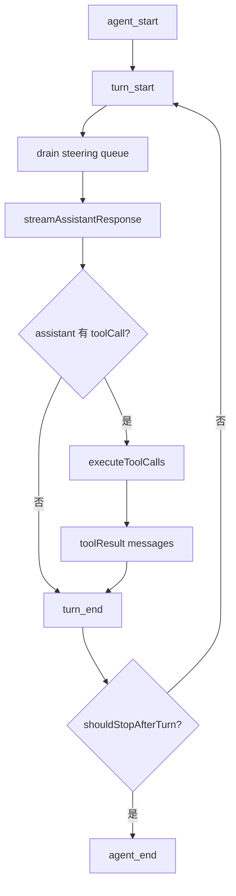

# 第2章 Agent Loop：从一次 prompt 到任务完成

## 2.1 Agent Loop 的问题边界

LLM 每次只能生成下一段内容或下一步工具请求，但 coding 任务需要多轮推理、多次文件读取、多次命令执行和错误修正。Agent Loop 解决的就是“把模型的下一步生成变成可持续完成任务的运行时循环”。

pi 的低层入口是 [agentLoop()#L31](/source-code/packages/agent/src/agent-loop.ts#L31) 和 [agentLoopContinue()#L64](/source-code/packages/agent/src/agent-loop.ts#L64)。它们返回 `EventStream`，不是直接返回字符串。这个选择决定了后续架构：UI 不需要等待最终文本，RPC 可以输出 JSONL 事件，测试可以断言中间过程，session 可以只在稳定边界写入。

## 2.2 两层循环

核心循环在 [agent-loop.ts#L155](/source-code/packages/agent/src/agent-loop.ts#L155)。它有两种队列语义：

- steering：用户在 agent 运行中追加的指令，进入当前工作流的下一轮 turn。
- follow-up：用户排队的下一件事，等当前 agent run 结束后再处理。

这比“用户输入就立刻打断 provider 请求”更可控。provider request 和工具执行都有副作用，随意并发会造成 transcript 顺序不确定、工具结果丢失、UI 状态混乱。pi 把用户继续输入变成队列，在安全点 drain。

## 2.3 流式 assistant reducer

`streamAssistantResponse()` 从 [agent-loop.ts#L275](/source-code/packages/agent/src/agent-loop.ts#L275) 开始执行 provider 请求。它先运行 `transformContext`，再 `convertToLlm`，再调用 `streamSimple`。这三个边界分别代表：

1. 内部上下文变换：扩展、压缩、产品消息决定是否进入模型。
2. provider 消息转换：把 pi 的 `AgentMessage` 转成 provider API 能接受的 `Message`。
3. provider 适配：不同模型协议统一成 assistant event stream。

流式事件进入 reducer 后，`start` 创建 partial assistant message，`text_delta`、`thinking_delta`、`toolcall_delta` 更新 partial，最终事件产生完整 assistant message。相关 reducer 从 [agent-loop.ts#L306](/source-code/packages/agent/src/agent-loop.ts#L306) 附近开始。partial 适合 UI，final message 适合 session。

## 2.4 工具执行路径

当 assistant message 包含 tool call，loop 调用 [executeToolCalls()#L373](/source-code/packages/agent/src/agent-loop.ts#L373)。工具执行不是简单 `tools[name](args)`，而是一个有边界的管道：

1. 根据 tool name 查找 `AgentTool`。
2. 调用 `prepareToolCall()`，入口见 [agent-loop.ts#L562](/source-code/packages/agent/src/agent-loop.ts#L562)。
3. 运行参数校验和参数预处理。
4. 运行 `beforeToolCall` hook，允许扩展阻止或修改。
5. 根据 sequential/parallel 规则执行。
6. 捕获工具错误并转成 error tool result。
7. 运行 `afterToolCall` hook，允许扩展修改结果。
8. 生成 `toolResult` message。
9. 发出 `tool_execution_*` 和 `message_*` 事件。

如果工具声明或全局配置要求 sequential，工具串行执行；否则可并行。这个差异很重要：读文件工具通常可以并行，写文件或 shell 工具可能必须串行。

## 2.5 事件是协议，不是日志

loop 发出的事件至少包括 `agent_start`、`turn_start`、`message_start`、`message_update`、`message_end`、`tool_execution_start`、`tool_execution_update`、`tool_execution_end`、`turn_end`、`agent_end`。`Agent` 通过事件更新内部状态；`AgentSession` 通过事件持久化、触发扩展和通知 UI。

这意味着事件必须稳定、结构化、有明确时机。`message_update` 不是最终事实；`message_end` 才是稳定消息。`tool_execution_update` 可以显示 shell 输出；`tool_execution_end` 才能记录 exit code 或最终结果。复刻时如果只输出字符串日志，后续 RPC、eval、扩展 UI 都会很难做。

## 2.6 错误语义

pi 的 loop 设计倾向于“能进入 transcript 的错误就进入 transcript”。工具参数错、工具不存在、工具抛错，都应该转成 tool result，让模型能恢复。provider 失败则生成 assistant error message 或触发 retry/compaction 策略。用户 abort 通过 `AbortSignal` 下传，不应该伪装成普通失败。

复刻时要区分三类错误：

- 可恢复工作错误：文件不存在、命令失败、工具参数不合法，进入上下文。
- 运行时错误：provider 认证失败、网络失败、扩展异常，展示给用户并考虑 retry。
- 控制流错误：abort、session switch、tree navigation，不应被模型误解成任务失败。

## 2.7 复刻原则

MVP loop 必须具备：用户消息追加；provider 流式消费；assistant final message；tool call 校验执行；tool result 回灌；事件流；abort signal；错误消息；最大轮次或 stop 条件。

生产级 loop 继续补：steering/follow-up 队列；parallel/sequential 工具执行；before/after hooks；context transform；provider payload hook；save point；auto retry；overflow compaction；session tree；可观测 trace。
