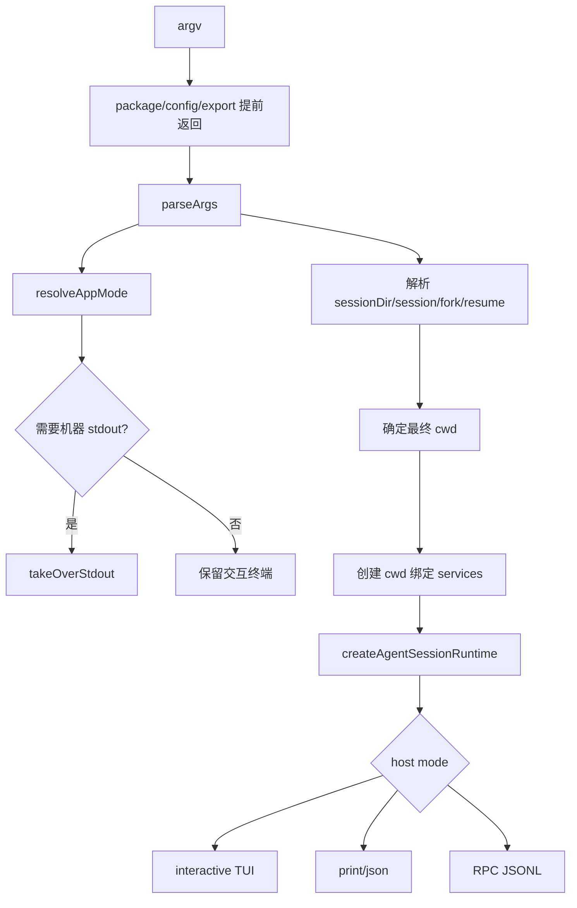

# 2. 启动链路：CLI、模式选择、CWD 与诊断

## 2.1 问题场景

启动链路决定 Pi 的第一组不可逆分叉：是否接管 stdout，是否进入交互 UI，session cwd 是否来自当前目录还是恢复文件，诊断应该打印到哪里，哪些资源要在创建 runtime 之前解析。如果复刻品先创建服务再决定 session cwd，恢复另一个项目的 session 时就会加载错 `.pi/settings.json`、错 AGENTS 文件、错 provider 注册和错扩展。

## 2.2 用户如何使用

用户用同一个二进制进入不同模式：

```bash
pi
pi "fix the failing check"
pi -p "summarize packages/agent"
pi --mode json -p "emit machine-readable events"
pi --mode rpc
pi --session path/to/session.jsonl
```

交互模式保留 stdout 给终端 UI；print/json/RPC 模式必须把机器协议写到 stdout，并把非协议日志转到 stderr。`--session`、`--resume`、`--fork` 这类参数还会影响最终 cwd，因此 cwd 决策必须早于 cwd-bound services。

## 2.3 源码定位

| 责任 | 当前实现 |
|---|---|
| 参数解析 | [args.ts#L59](packages/coding-agent/src/cli/args.ts#L59) |
| 模式推导 | [main.ts#L99](packages/coding-agent/src/main.ts#L99) |
| CLI 入口 | [main.ts#L424](packages/coding-agent/src/main.ts#L424) |
| stdout 接管分叉 | [main.ts#L455](packages/coding-agent/src/main.ts#L455) |
| session cwd 决策 | [main.ts#L491](packages/coding-agent/src/main.ts#L491) |
| runtime 创建 | [main.ts#L613](packages/coding-agent/src/main.ts#L613) |
| print/json host | [print-mode.ts#L32](packages/coding-agent/src/modes/print-mode.ts#L32) |
| RPC host | [rpc-mode.ts#L53](packages/coding-agent/src/modes/rpc/rpc-mode.ts#L53) |
| TUI host | [interactive-mode.ts#L237](packages/coding-agent/src/modes/interactive/interactive-mode.ts#L237) |
| stdout guard | [output-guard.ts#L45](packages/coding-agent/src/core/output-guard.ts#L45) |

## 2.4 生命周期图



## 2.5 关键代码片段

源码位置：[main.ts#L424](packages/coding-agent/src/main.ts#L424)。片段之后继续看模式分叉如何影响 stdout：[main.ts#L455](packages/coding-agent/src/main.ts#L455)。

```ts
const parsed = parseArgs(args);
if (parsed.diagnostics.length > 0) {
  for (const d of parsed.diagnostics) {
    const color = d.type === "error" ? chalk.red : chalk.yellow;
    console.error(color(`${d.type === "error" ? "Error" : "Warning"}: ${d.message}`));
  }
}
let appMode = resolveAppMode(parsed, process.stdin.isTTY);
const shouldTakeOverStdout = appMode !== "interactive";
```

解释：输入是原始 argv 和 stdin 是否为 TTY。输出是 `appMode` 和 stdout 控制策略。诊断先走 stderr，因为 print/json/RPC 的 stdout 可能要保持机器可解析。复刻时，模式选择不能只是 UI 判断；它还决定输出协议、信号处理和进程生命周期。

源码位置：[main.ts#L491](packages/coding-agent/src/main.ts#L491)。片段之后继续看 runtime 如何在确定 cwd 后创建：[main.ts#L613](packages/coding-agent/src/main.ts#L613)。

```ts
const cwd = process.cwd();
const agentDir = getAgentDir();
const startupSettingsManager = SettingsManager.create(cwd, agentDir);
const sessionDir =
  (parsed.sessionDir ? normalizePath(parsed.sessionDir) : undefined) ??
  (envSessionDir ? expandTildePath(envSessionDir) : undefined) ??
  startupSettingsManager.getSessionDir();
let sessionManager = await createSessionManager(parsed, cwd, sessionDir, startupSettingsManager);
```

解释：启动 cwd 只用于查找 session 目录；真正的 runtime cwd 来自 `sessionManager.getCwd()`。这能处理恢复跨项目 session 的场景。复刻最小版可以暂时不支持跨 cwd resume，但要把“启动 cwd”和“session cwd”分成两个变量。

## 2.6 机制拆解

用户输入首先被 `parseArgs()` 归类为模式、消息、文件参数、模型参数、工具参数和诊断。`resolveAppMode()` 再结合 stdin 是否是 TTY 决定 interactive、print/json 或 RPC。只有确定 session 文件和 cwd 后，Pi 才创建 cwd-bound services。模型不会看到这些启动细节；它只会在后续 system prompt 和 messages 里看到被 runtime 选择后的上下文。

执行权边界是：CLI 可以拒绝非法参数，可以决定 host，可以接管 stdout；但 CLI 不应该直接创建工具或调用 provider。工具、resources、models 都应该由 runtime 服务装配后交给 `AgentSession`。

## 2.7 设计不变量

- 不变量：先决定最终 cwd，再创建 cwd-bound services。原因：settings、resources、extensions 都依赖 cwd。违反后果：resume/fork 加载错项目规则。复刻建议：`resolveSessionTarget()` 返回 `{ cwd, sessionFile }`。
- 不变量：机器协议模式必须保护 stdout。原因：JSON/RPC 输出不能被 warning 污染。违反后果：外部脚本解析失败。复刻建议：stdout 只写协议，诊断写 stderr。
- 不变量：早退命令不创建 runtime。原因：`--help`、config/package/export 不需要加载模型。违反后果：无凭证时连帮助都无法显示。复刻建议：把 early command 放在 runtime 创建前。
- 不变量：CLI 不保存业务状态。原因：host 要可替换。违反后果：SDK/RPC 复用失败。复刻建议：CLI 只传配置给 runtime factory。

## 2.8 失败模式与最小复刻任务

常见失败模式：

- `pi --mode json` 输出了彩色 warning，导致 JSON parser 报错。
- 恢复另一个目录的 session 后仍读取当前目录 `.pi/settings.json`。
- `--help` 触发 provider 鉴权检查。

最小可用版：实现 `parseArgs -> resolveMode -> resolveSessionTarget -> createRuntime -> runHost`，支持 interactive 和 print 两种模式。

接近 Pi 的增强版：支持 `--mode json`、`--mode rpc`、`--session`、`--fork`、stdout guard、diagnostics。

生产级暂缓项：缺失 cwd 的交互选择、package/config 子命令、Windows self-update 清理、完整 signal cleanup。

## 2.9 验收清单

- 能说明 `appMode !== "interactive"` 为什么会触发 stdout 接管。
- 能说明启动 cwd 和 session cwd 的差异。
- 能写出不会污染 JSON stdout 的错误输出策略。
- 能实现恢复 session 前不创建 cwd-bound services。
- 能从命令行跑通 print 和 interactive 共用同一 runtime。
