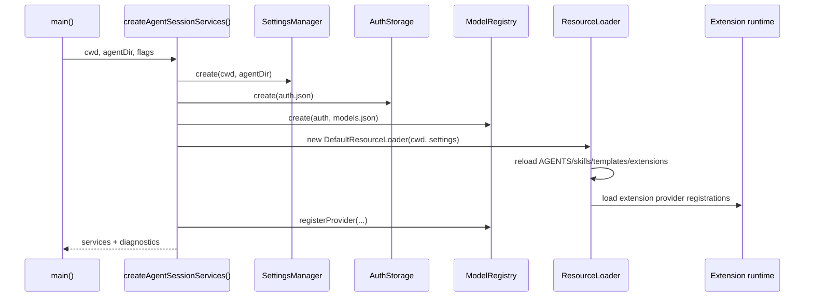

# 3. CWD 绑定服务：Settings、Auth、ModelRegistry、ResourceLoader

## 3.1 问题场景

Pi 的很多能力看似是全局配置，实际必须绑定 cwd/session：项目规则来自当前目录祖先链，`.pi/settings.json` 是项目局部配置，扩展和 skills 可能来自项目 package，session 恢复可能切到另一个 cwd。如果复刻品把 settings、auth、models、resources 做成全局单例，跨项目 resume 后会出现模型凭证、工具列表、AGENTS 规则和 extension provider 全部错位。

## 3.2 用户如何使用

用户通过这些入口间接触发服务装配：

```bash
pi --model openai/gpt-5.1-codex
pi --tools read,grep,find,ls -p "review only"
pi --session other/project/session.jsonl
pi package install team-preset
pi --no-extensions
```

用户不会直接创建 `SettingsManager` 或 `ResourceLoader`，但这些对象决定模型、工具、系统提示词、扩展和诊断。复刻品要让用户只需要选择 cwd/session，runtime 自动装配对应服务。

## 3.3 源码定位

| 责任 | 当前实现 |
|---|---|
| services 工厂 | [agent-session-services.ts#L130](packages/coding-agent/src/core/agent-session-services.ts#L130) |
| settings manager | [settings-manager.ts#L245](packages/coding-agent/src/core/settings-manager.ts#L245) |
| model registry | [model-registry.ts#L335](packages/coding-agent/src/core/model-registry.ts#L335) |
| auth storage | [auth-storage.ts#L24](packages/coding-agent/src/core/auth-storage.ts#L24) |
| resource loader 接口 | [resource-loader.ts#L28](packages/coding-agent/src/core/resource-loader.ts#L28) |
| system prompt builder | [system-prompt.ts#L28](packages/coding-agent/src/core/system-prompt.ts#L28) |
| prompt templates | [prompt-templates.ts#L194](packages/coding-agent/src/core/prompt-templates.ts#L194) |
| skills | [skills.ts#L387](packages/coding-agent/src/core/skills.ts#L387) |
| extension loader | [loader.ts#L413](packages/coding-agent/src/core/extensions/loader.ts#L413) |

## 3.4 生命周期图



## 3.5 关键代码片段

源码位置：[agent-session-services.ts#L130](packages/coding-agent/src/core/agent-session-services.ts#L130)。片段之后继续看 extension provider 如何注册到 model registry：[agent-session-services.ts#L146](packages/coding-agent/src/core/agent-session-services.ts#L146)。

```ts
const cwd = resolvePath(options.cwd);
const agentDir = options.agentDir ? resolvePath(options.agentDir) : getAgentDir();
const authStorage = options.authStorage ?? AuthStorage.create(join(agentDir, "auth.json"));
const settingsManager = options.settingsManager ?? SettingsManager.create(cwd, agentDir);
const modelRegistry = options.modelRegistry ?? ModelRegistry.create(authStorage, join(agentDir, "models.json"));
const resourceLoader = new DefaultResourceLoader({ cwd, agentDir, settingsManager });
await resourceLoader.reload();
```

解释：输入是最终 cwd 和 agentDir；输出是一组同 cwd 绑定的服务。`AuthStorage` 默认绑定全局 agentDir，`SettingsManager` 和 `ResourceLoader` 同时绑定 cwd 和 agentDir，`ModelRegistry` 依赖 auth 和 models 文件。复刻时至少要把配置读取、凭证读取、模型解析和资源扫描拆成四个对象，而不是散落在 CLI 中。

源码位置：[resource-loader.ts#L28](packages/coding-agent/src/core/resource-loader.ts#L28)。片段之后继续看 AGENTS 上下文如何作为资源返回：[resource-loader.ts#L57](packages/coding-agent/src/core/resource-loader.ts#L57)。

```ts
export interface ResourceLoader {
  reload(): Promise<void>;
  getContextFiles(): ContextFile[];
  getPromptTemplates(): PromptTemplate[];
  getSkills(): LoadedSkill[];
  getExtensions(): ExtensionsResource;
  getDiagnostics(): ResourceDiagnostic[];
}
```

解释：`ResourceLoader` 是用户空间资源进入 runtime 的边界。输入是 cwd、settings、CLI flags 和 package 资源；输出是已经解析好的上下文文件、templates、skills、extensions 和 diagnostics。复刻最小版可以只实现 AGENTS 文件加载，但接口应预留多资源类型。

## 3.6 机制拆解

模型能看到的是资源装配后的结果：系统提示词里的项目规则、skills 描述、tool snippets 和用户消息。runtime 私下保留的是资源来源、冲突诊断、extension 实例、provider 注册和 settings 写入能力。用户输入不直接修改这些服务；它通过命令或 CLI flags 改变装配参数。错误传播分两类：配置错误可作为 diagnostics 展示，致命装配错误阻止 session 创建。

服务装配的关键是“同一个 cwd 产生同一组 runtime 事实”。只要 cwd/session 换了，服务就要重新解析；只要服务没换，host 可以重绑定而不改变业务语义。

## 3.7 设计不变量

- 不变量：服务工厂只接受已解析 cwd。原因：资源和项目设置依赖 cwd。违反后果：跨项目 session 规则错乱。复刻建议：禁止在 service factory 内调用 `process.cwd()`。
- 不变量：ResourceLoader 输出资源，不直接调用 Agent loop。原因：资源是上下文，不是执行器。违反后果：加载阶段产生副作用。复刻建议：扩展也通过 runner 注册能力。
- 不变量：ModelRegistry 依赖 AuthStorage，但 AuthStorage 不依赖模型选择。原因：凭证可被多个 provider 共享。违反后果：切模型时丢凭证。复刻建议：auth 只负责存取 token/key。
- 不变量：diagnostics 是服务创建的一等输出。原因：资源冲突和配置问题需要暴露给 host。违反后果：用户只看到模型失败。复刻建议：`createServices()` 返回 `{ services, diagnostics }`。

## 3.8 失败模式与最小复刻任务

常见失败模式：

- settings 全局单例导致项目 A 的工具白名单影响项目 B。
- extension 注册 provider 后没有进入 ModelRegistry，`--model` 找不到。
- AGENTS 文件加载顺序不可预测，模型行为漂移。

最小可用版：实现 `createServices({ cwd, agentDir })`，返回 settings、auth、modelRegistry、resourceLoader，resourceLoader 只加载 AGENTS 文件。

接近 Pi 的增强版：加入 prompt templates、skills、extensions、package resources、diagnostics、provider registration。

生产级暂缓项：资源冲突 UI、扩展 flag value、settings 写入锁、多来源 package dedup。

## 3.9 验收清单

- 能解释为什么 `createAgentSessionServices()` 必须在 session cwd 决定后调用。
- 能列出 Settings、Auth、ModelRegistry、ResourceLoader 的输入输出。
- 能实现一个不会污染其他 cwd 的服务工厂。
- 能把 AGENTS 文件内容注入后续 system prompt。
- 能在资源冲突时返回 diagnostics，而不是静默覆盖。
