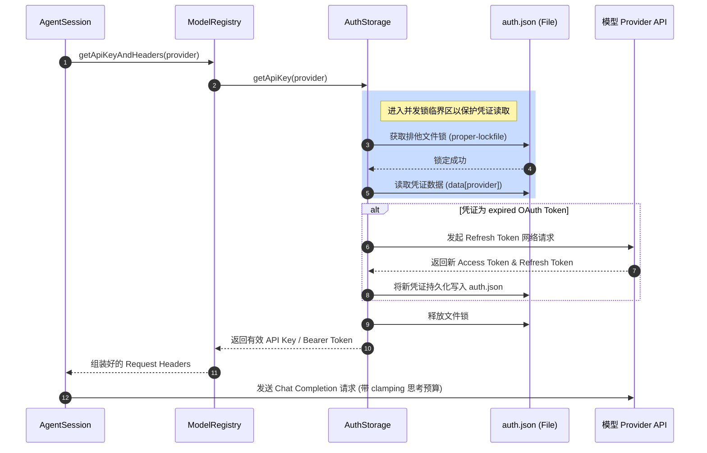

# 3. 鉴权、Provider 与模型选择

## 3.1 真实世界的问题

在日常的多模型协作开发中，前端工程师常常面临以下令人头疼的工程难题：
1. **多环境密钥加载冲突**：在同一个终端内，针对测试环境和生产环境配置了不同的环境变量（如 `OPENAI_API_KEY`），但由于某些持久化配置文件默认覆盖了环境变量，导致调用的模型始终指向错误且扣费高昂的生产账号。
2. **OAuth 凭证过期导致长会话中断**：当通过订阅服务登录并运行一个长达半小时的复杂代码生成任务时，OAuth 的 Access Token 突然过期。如果代理不具备无缝并发刷新和文件锁定机制，整个代理会话就会因接口报 401 错误而轰然倒塌。
3. **推理模型（Thinking Model）巨额 Token 消费失控**：像 Claude 3.7 Sonnet 或 DeepSeek-R1 这样的推理模型，如果不在客户端强制约束其“思考预算（Thinking Budget）”，模型可能会针对一个极其简单的问题在后台疯狂输出数万个思考 Token，导致单次会话的 API 消费瞬间爆表。

本章将引导你理解 Pi 的统一 Model-Provider 鉴权设计，帮助你精准控制每一笔推理开销。

## 3.2 极简示例

你可以通过在全局配置目录下的 `models.json` 里添加本地 Ollama 模型，并显式指定其推理（reasoning）属性和思考 Token 上限，从而在本地无缝进行安全且零成本的调试：

```json
// ~/.pi/agent/models.json
{
  "providers": {
    "ollama": {
      "baseUrl": "http://localhost:11434/v1",
      "api": "openai-compatible"
    }
  },
  "models": [
    {
      "provider": "ollama",
      "id": "deepseek-r1:8b",
      "name": "Ollama DeepSeek-R1 8B",
      "reasoning": true,
      "thinkingLevelMap": {
        "minimal": 1024,
        "low": 2048,
        "medium": 4096,
        "high": 8192
      },
      "contextWindow": 16384,
      "maxTokens": 4096,
      "input": ["text"]
    }
  ]
}
```

## 3.3 源码结构与数据流

#### 3.3.1 凭证读取优先级

在发起任何大模型请求前，Pi 会按照以下由高到低的严格顺序解析当前 Provider 的鉴权凭证：
1. **CLI 临时覆盖**：通过命令行 `pi --api-key <key>` 传入的临时密钥，只在本次运行生命周期有效。
2. **`auth.json` 存储区**：已登录保存的 API 密钥或有效的 OAuth Token，具有持久化最高优先级。
3. **系统环境变量**：从当前 Shell 中读取的标准环境变量（例如 `OPENAI_API_KEY`）。
4. **`models.json` 中的 Fallback 密钥**：在自定义 Provider 声明中直接填写的备用 API 密钥。

#### 3.3.2 核心模块协作与 line numbers

- **模型加载与归并**：[model-registry.ts#L384](/source-code/packages/coding-agent/src/core/model-registry.ts#L384) 的 `loadModels()` 负责在启动时合并内置模型定义与用户 `models.json` 的配置。它允许通过 `compat` 字段重写 API 字段属性（如兼容老旧推理服务）。
- **动态注册接口**：[model-registry.ts#L796](/source-code/packages/coding-agent/src/core/model-registry.ts#L796) 的 `registerProvider` 允许 TypeScript 扩展在运行时动态添加新型 Provider，赋予了 Pi 理论上可以连接任何私有大模型网关的能力。
- **并发锁与凭证存储**：[auth-storage.ts#L462](/source-code/packages/coding-agent/src/core/auth-storage.ts#L462) 的 `getApiKey` 是核心鉴权解析函数，它在读取 OAuth Token 时会自动执行锁控制，防止多进程下刷新冲突。
- **思考级钳制（Clamp）**：当用户在 TUI 交互中通过 Shift+Tab 键切换推理级别时，系统会调用 [agent-session.ts#L1576](/source-code/packages/coding-agent/src/core/agent-session.ts#L1576) 的 `_clampThinkingLevel`。该函数读取当前模型的元数据（Metadata），并在发起大模型请求之前，将推理深度强行 clamp 在模型允许的 budget 范围内，防范 Token 溢出。

#### 3.3.3 请求鉴权与 Token 刷新序列图

下列 Mermaid 泳道图展示了一个请求发起时，鉴权凭证的读取与 OAuth 自动刷新（配合文件锁机制）的完整生命周期：



## 3.4 设计考量与折衷

#### 3.4.1 为什么要 Auth 存储必须选用 File Locking？

因为在实际开发中，开发者可能会在 tmux 或不同的终端窗口中并发运行多个 `pi` 实例。如果这些实例刚好在同一时间检测到 OAuth Access Token 过期，它们就会同时向云端发起刷新请求。这会导致两件事情：
- 先刷新成功的 Token 会被后刷新成功的 Token 冲掉，导致第一个窗口在下一次调用时立刻报 Token 无效。
- 产生严重的网络竞态，甚至可能因为写文件冲突导致 `auth.json` 损坏或清空。

通过 `proper-lockfile` 锁机制，Pi 确保了只有一个进程能进入刷新临界区，其他并发进程将自动排队等待文件更新。

#### 3.4.2 为什么 Thinking Token 限制要在 Client 侧执行？

很多推理大模型本身不支持在接口层传入具体的思考 Token 阈值，它们只提供一个统一的 `max_tokens` 参数。如果由模型自行裁决，它可能会把所有的 Token 预算全部配给“思考（Thinking）”，而导致真正返回的代码正文被截断。

Pi 通过在 Client 侧强行根据 `thinkingLevelMap` 来折算并拆分 `thinking_budget` 与 `max_tokens`，实现了即使在模型本身不支持细粒度限制的情况下，也能保证客户端的绝对开销安全。

## 3.5 常见误区与排错

#### 3.5.1 误区一：在终端修改了 ANTHROPIC_API_KEY，但 Pi 依然使用的是旧密钥
* **排错诊断**：因为 Pi 优先从 `~/.pi/agent/auth.json` 读取持久化的凭证，只有当该文件中没有该 Provider 的记录时，才会退回读取环境变量。如果你需要换用环境变量，请在交互终端运行 `/logout anthropic`，或者手动删除 `auth.json` 中对应的 provider 键值。

#### 3.5.2 误区二：修改了 models.json 后，控制台报配置解析错误，自定义模型全部消失
* **排错诊断**：`models.json` 具有严格的 JSON 语法规范（不能有末尾逗号、不能有单引号、不能有注释）。一旦语法错误，Pi 启动时会抛出 JSON 解析异常，并选择“安全回退”——即仅加载系统内置的基础模型以保证运行。请使用在线 JSON 格式化工具确认你的 `models.json` 语法无误，然后执行 `/reload` 重新加载。

#### 3.5.3 误区三：切换到推理模型后，模型不进行逻辑思考，回答极其简短
* **排错诊断**：请检查你的 settings 或是 `/settings` 状态，确保当前的 reasoning（思考）开关处于启用状态，并且 `thinkingLevel` 未被误设置为 `off`。如果设置为 `off`，Pi 会在请求时故意剔除 thinking 字段，导致支持推理的模型强制退化为普通的快速回答模式。

## 3.6 练习题

#### 3.6.1 基础使用题
启动 Pi，使用命令行指令 `/model` 或者是快捷键 `Ctrl+P` 循环切换当前的模型，仔细观察终端底部 footer（状态栏）内关于当前所选模型名称以及对应计费预算（Token Cost）的动态变化。

#### 3.6.2 原理分析题
仔细阅读 [auth-storage.ts#L81](/source-code/packages/coding-agent/src/core/auth-storage.ts#L81) 与 [auth-storage.ts#L136](/source-code/packages/coding-agent/src/core/auth-storage.ts#L136) 的源码，解释 `AuthStorage` 在执行 `lockSync` 与异步 `lock` 时，各自传入了哪些特定的配置参数？当检测到 Lock 被 Compromised（损坏/抢占）时，系统是如何进行异常处理的？

#### 3.6.3 扩展实践题
在本地 `models.json` 中配置一个自定义 Provider，使其 baseUrl 指向一个本地运行的 Node.js 虚拟服务器。编写该服务器代码，当收到 Pi 携带的 `Authorization` 头部请求时，验证其是否包含预期的动态令牌，从而模拟企业内部私有 Provider 的动态 API 鉴权接入。
