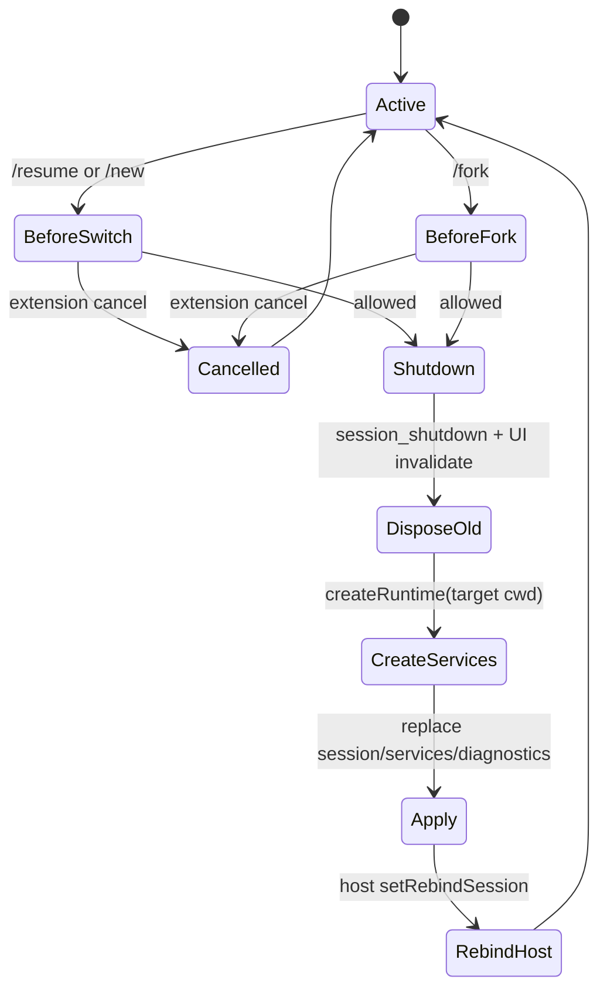

# 4. AgentSessionRuntime：new、resume、fork、import、reload

## 4.1 问题场景

会话替换不是“换一个 session 文件路径”。Pi 的 session 绑定 cwd、settings、resources、extensions、model registry、host rebind 和 TUI extension UI。`/new`、`/resume`、`/fork`、`/import`、`reload` 任何一个动作都可能让旧 extension context 失效。如果复刻品只替换内存中的 messages，旧扩展仍会写入旧 session，TUI 仍订阅旧 Agent，cwd-bound services 也不会重建。

## 4.2 用户如何使用

典型操作：

```bash
pi --session path/to/session.jsonl
/new
/resume
/fork
/import path/to/exported.jsonl
/reload
```

用户期待的是“当前界面仍在，但背后的 session/runtime 已经安全换掉”。复刻品要在替换前允许 extension 拦截，在替换时关闭旧 session，在替换后让 host 重新绑定新 session。

## 4.3 源码定位

| 责任 | 当前实现 |
|---|---|
| runtime 类 | [agent-session-runtime.ts#L68](packages/coding-agent/src/core/agent-session-runtime.ts#L68) |
| shutdown 和 dispose | [agent-session-runtime.ts#L161](packages/coding-agent/src/core/agent-session-runtime.ts#L161) |
| switch session | [agent-session-runtime.ts#L187](packages/coding-agent/src/core/agent-session-runtime.ts#L187) |
| new session | [agent-session-runtime.ts#L212](packages/coding-agent/src/core/agent-session-runtime.ts#L212) |
| fork session | [agent-session-runtime.ts#L246](packages/coding-agent/src/core/agent-session-runtime.ts#L246) |
| import JSONL | [agent-session-runtime.ts#L340](packages/coding-agent/src/core/agent-session-runtime.ts#L340) |
| runtime 创建 | [agent-session-runtime.ts#L393](packages/coding-agent/src/core/agent-session-runtime.ts#L393) |
| session manager | [session-manager.ts#L711](packages/coding-agent/src/core/session-manager.ts#L711) |
| JSONL fork | [jsonl-repo.ts#L133](packages/agent/src/harness/session/jsonl-repo.ts#L133) |

## 4.4 生命周期图



## 4.5 关键代码片段

源码位置：[agent-session-runtime.ts#L161](packages/coding-agent/src/core/agent-session-runtime.ts#L161)。片段之后继续看新 runtime 如何覆盖当前引用：[agent-session-runtime.ts#L171](packages/coding-agent/src/core/agent-session-runtime.ts#L171)。

```ts
private async teardownCurrent(reason: SessionShutdownEvent["reason"], targetSessionFile?: string): Promise<void> {
  await emitSessionShutdownEvent(this.session.extensionRunner, {
    type: "session_shutdown",
    reason,
    targetSessionFile,
  });
  this.beforeSessionInvalidate?.();
  this.session.dispose();
}
```

解释：输入是替换原因和目标 session 文件；输出是一个已关闭的旧 session。这里先通知扩展，再同步执行 host teardown，最后 dispose。复刻时不能直接丢弃旧对象，否则扩展和 UI 会持有 stale context。

源码位置：[agent-session-runtime.ts#L187](packages/coding-agent/src/core/agent-session-runtime.ts#L187)。片段之后继续看 `createRuntime` 如何重建 cwd-bound services：[agent-session-runtime.ts#L201](packages/coding-agent/src/core/agent-session-runtime.ts#L201)。

```ts
const previousSessionFile = this.session.sessionFile;
const sessionManager = SessionManager.open(sessionPath, undefined, options?.cwdOverride);
assertSessionCwdExists(sessionManager, this.cwd);
await this.teardownCurrent("resume", sessionManager.getSessionFile());
this.apply(
  await this.createRuntime({
    cwd: sessionManager.getCwd(),
    agentDir: this.services.agentDir,
    sessionManager,
    sessionStartEvent: { type: "session_start", reason: "resume", previousSessionFile },
  }),
);
```

解释：输入是目标 session path；输出是全新的 session/services 组合。`sessionManager.getCwd()` 决定后续服务 cwd。复刻时必须让 runtime factory 闭包保留 process-global 参数，同时每次替换都重新解析 cwd-bound 服务。

## 4.6 机制拆解

模型看不到 runtime 替换本身，只会在新 session 的上下文中继续运行。runtime 私下处理的是 extension hook、session shutdown、旧 UI 解绑、新服务创建、新 session_start event 和 host rebind。用户触发替换命令后，执行权先在 host，然后进入 `AgentSessionRuntime`；如果扩展取消，系统回到旧 session；如果允许，旧 session 被销毁，新 session 接管。

这也是为什么 runtime 独立于 `AgentSession`：`AgentSession` 代表一个活的会话，`AgentSessionRuntime` 代表可以替换活会话的宿主边界。

## 4.7 设计不变量

- 不变量：会话替换必须先 shutdown 旧 session。原因：扩展需要释放资源。违反后果：旧 hook 继续写入。复刻建议：替换前发 `session_shutdown`。
- 不变量：替换后必须重建 cwd-bound services。原因：settings/resources/models 可能随 cwd 变化。违反后果：新 session 用旧项目规则。复刻建议：runtime 持有 `createRuntime` factory。
- 不变量：host 必须 rebind。原因：TUI/print/RPC 订阅的是当前 session。违反后果：界面继续显示旧事件。复刻建议：提供 `setRebindSession()`。
- 不变量：取消替换不能产生半替换状态。原因：extension hook 可拒绝操作。违反后果：session 和 UI 指向不同对象。复刻建议：所有 destructive 操作放在 hook 通过之后。

## 4.8 失败模式与最小复刻任务

常见失败模式：

- `/resume` 后 prompt 仍写入旧 session 文件。
- `/fork` 后扩展持有旧 `ctx`，继续调用旧 session manager。
- `/import` 覆盖文件后没有切 cwd，resources 错乱。

最小可用版：实现 `Runtime.currentSession`、`switchSession(path)`、`newSession()`，替换时 dispose 旧 session 并调用 host rebind。

接近 Pi 的增强版：加入 `session_before_switch`、`session_before_fork`、`session_shutdown`、`session_start`、fork/import、cwd override。

生产级暂缓项：stale context 防护、extension UI teardown、branch selected text、跨 cwd 缺失提示。

## 4.9 验收清单

- 能解释为什么 session replacement 不属于 Agent loop。
- 能实现 `switchSession()` 时重建 services。
- 能保证 host 在替换后订阅新 session。
- 能处理 extension 取消替换。
- 能说明 stale extension context 的风险。

## 4.10 本章实现关卡

本章给 mini Pi 增加可替换 session runtime。

新增文件：

- `src/runtime/agent-session-runtime.ts`：持有当前 session、services 和 rebind 回调。
- `src/session/session-store.ts`：创建或打开 JSONL session 文件。
- `src/runtime/session-events.ts`：定义 `session_start`、`session_shutdown`、`session_replaced`。

最小 runtime API：

```ts
export interface AgentSessionRuntime {
  current(): AgentSessionFacade;
  newSession(cwd: string): Promise<void>;
  resumeSession(file: string): Promise<void>;
  setRebindHost(callback: () => Promise<void>): void;
}
```

运行观察：

```bash
npm run mini -- --session tmp/a.jsonl -p "first"
npm run mini -- --session tmp/a.jsonl --resume -p "second"
```

期望第二次运行加载同一个 session，并且 host 订阅新 facade。失败样例是 `/resume` 后 prompt 仍写入旧文件。下一章会接入 faux provider stream。
