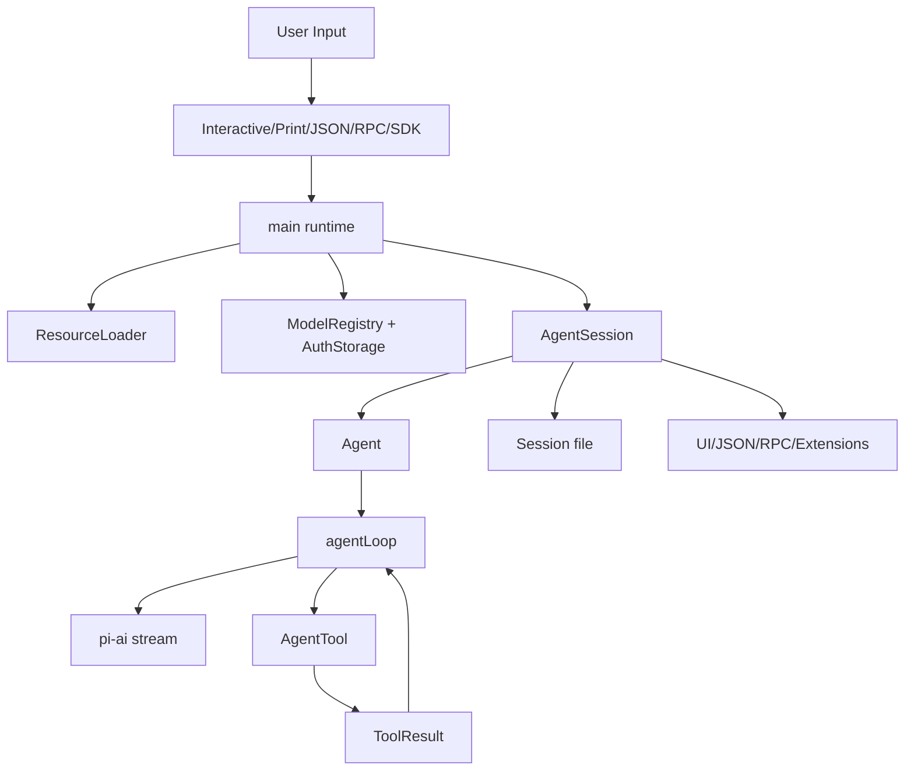

# 4. 架构总览：ai、agent、coding-agent、tui

## 4. 本章解决的问题

pi 的架构不是一个大 CLI 文件，而是多层 runtime：`packages/ai` 统一 provider 和流式协议，`packages/agent` 提供 message loop、tool 执行和事件，`packages/coding-agent` 产品化为 CLI/TUI/RPC/SDK、session、settings、resources 和 extensions，`packages/tui` 负责终端组件。

创造者视角要看边界：哪一层能知道 provider 私有协议，哪一层能执行工具，哪一层能写 session，哪一层只负责显示。新手视角只需先记住：UI 不是大脑，模型不是手，本地 runtime 才是把它们接起来的身体。

## 4. 四层责任

| 层 | 核心责任 | 不该负责 |
|---|---|---|
| ai | 模型类型、API 类型、stream event、usage/cost、provider compatibility | session tree、TUI、slash command |
| agent | agent loop、tool call、tool result、queue、agent events | settings、packages、terminal UI |
| coding-agent | CLI、auth、model registry、resource loader、session、extensions、modes | provider 私有协议细节 |
| tui | 编辑器、渲染、键盘、overlay | agent 业务状态和 provider 请求 |

`packages/ai` 的 API/model/message 类型从 [types.ts#L6](/source-code/packages/ai/src/types.ts#L6) 开始。低层 agent event 类型在 [types.ts#L403](/source-code/packages/agent/src/types.ts#L403)。coding-agent 的产品入口在 [main.ts#L424](/source-code/packages/coding-agent/src/main.ts#L424)。

## 4. 运行时数据流

箭头的含义很关键：TUI 不直接调用 provider，provider 不知道 session 文件，extension 不应该绕过 session 私自改 transcript。所有长期事实都要经过明确的消息、事件或 session 边界。

## 4. 启动时加载什么

启动时，`main()` 依次处理 offline、package/config 子命令、CLI 参数、迁移、settings、session 选择、resource paths、auth storage、runtime services 和 mode。package/config 子命令会在普通 CLI 解析前短路，见 [main.ts#L436](/source-code/packages/coding-agent/src/main.ts#L436)。

resource loader 会加载 extensions、skills、prompts、themes、context files、system prompt 和 append system prompt。context file 候选名是 `AGENTS.md`、`AGENTS.MD`、`CLAUDE.md`、`CLAUDE.MD`，见 [resource-loader.ts#L58](/source-code/packages/coding-agent/src/core/resource-loader.ts#L58)。`.pi/SYSTEM.md` 和 `~/.pi/agent/SYSTEM.md` 会替换默认 system prompt，发现逻辑在 [resource-loader.ts#L853](/source-code/packages/coding-agent/src/core/resource-loader.ts#L853)。

## 4. 运行时再加载什么

不是所有东西都只能启动时确定。`/reload` 可以让 resource loader 重新读取 settings、packages 和资源。extensions 也可以通过 `extendResources()` 增加 skill、prompt、theme 路径，入口在 [resource-loader.ts#L281](/source-code/packages/coding-agent/src/core/resource-loader.ts#L281)。

模型列表也不是纯静态。`ModelRegistry` 会合并 built-in models、`models.json`、provider overrides、model overrides 和 extension 注册的 provider。加载 custom models 的入口在 [model-registry.ts#L459](/source-code/packages/coding-agent/src/core/model-registry.ts#L459)，动态 provider 注册在 [model-registry.ts#L796](/source-code/packages/coding-agent/src/core/model-registry.ts#L796)。

## 4. 常见误解

误解一：所有能力都应该放进 agent loop。实际 loop 应该小，只关心消息、工具和事件；settings、auth、resources、TUI 都在外层。

误解二：provider adapter 可以随便把字段传上来。实际 provider 必须遵守统一 `AssistantMessageEvent` 合约，否则 TUI、JSON mode、tool loop 和 session 都会出错。

误解三：扩展越强越好。extension 有本地执行权，适合实现需要 runtime 权限的能力；单纯流程指导更适合 skill 或 prompt template。

## 4. 进一步阅读

读 `packages/coding-agent/docs/usage.md` 的 Design Principles，读 `packages/coding-agent/docs/settings.md` 的 Resources，读 `packages/coding-agent/docs/custom-provider.md` 理解 provider extension。源码继续读 [resource-loader.ts#L152](/source-code/packages/coding-agent/src/core/resource-loader.ts#L152)、[model-registry.ts#L335](/source-code/packages/coding-agent/src/core/model-registry.ts#L335)、[system-prompt.ts#L28](/source-code/packages/coding-agent/src/core/system-prompt.ts#L28)。
