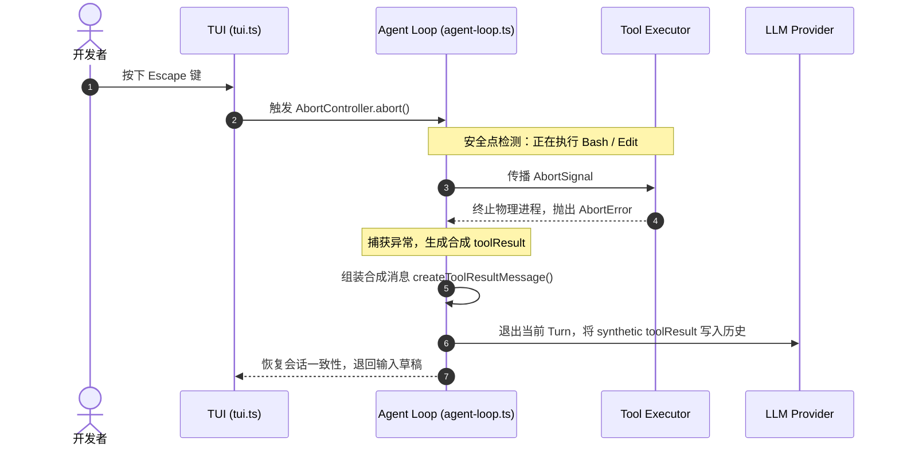

# 5. 消息队列与中断

## 5.1 真实场景下的问题

当我们在日常开发中使用大语言模型（LLM）时，通常的交互结构是同步的“发出提示词 -> 等待生成 -> 返回结果”。但在使用 Agent 时，这会带来两个显著的痛点：
1. **中途引导的诉求（Steering）**：当 Agent 正在自主执行一个包含多步文件修改的任务时（例如修改了第 3 个文件），你突然发现它理解偏了，希望在不破坏当前已改文件状态的前提下，插入一句话：“只修改核心 API，不需要修改测试用例”，让它在下一步决策时能够立刻纠偏。
2. **后续任务的预设（Follow-up）**：当你让 Agent 跑一个长达两分钟的项目构建任务时，你脑海中已经想好了下一步指令：“构建完后，顺便帮我生成一份 CHANGELOG 摘要”，你希望把这个任务提前排入队列，而不是傻等它运行完毕。
3. **及时中止的物理一致性（Abort）**：如果 Agent 运行的 bash 任务失控，疯狂在控制台打印日志，或者 LLM 陷入无限工具调用循环，你按下一个快捷键（如 `Escape`）打断它时，系统不仅要向物理终端发送终止信号，还要保证底层的 Session 树不被破坏，且已经生成的日志和部分文件修改能够被安全地保存和回灌。

如果直接暴力干掉 Node 进程，会导致内存状态丢失、半路修改的文件损坏，甚至把 Gemini CLI 本身意外杀掉。本章将详细拆解 Pi Agent 的双重消息队列机制与中断处理体系。

## 5.2 最小使用示例

1. **测试中途引导（Steering）**：
   输入一条耗时较长的任务，比如：
   ```text
   列出当前仓库下的所有 .ts 文件，并逐个解释它们的作用
   ```
   当 Agent 开始逐个读取并流式输出解释时，在编辑器中输入纠偏词并直接按下回车：
   ```text
   停止解释，只列出名字即可
   ```
   你会注意到，当前这轮文件的读取和输出完成之后，Agent 会自动吸纳这句新消息，并在下一轮决策中只输出文件列表。
2. **测试后续预设（Follow-up）**：
   在输入框中输入主指令，然后按下 `Alt+Enter`（或根据 keybindings 绑定的后续指令键）提交后续追加指令：
   ```text
   (Alt+Enter 提交) 任务完成后，清理编译生成的临时文件
   ```
   主指令执行期间，底层的 `followUpQueue` 会保管这条消息。一旦 Agent 发现没有更多工具调用，工作流程即将收尾时，它会自动从队列中取出该消息作为新的 user message 激活新一轮交互。
3. **安全中止运行（Abort）**：
   当 Agent 正在执行 bash 工具或进行大文本流式输出时，按下 `Escape`。控制台会立刻中断输出，并在物理终端安全打印 `Interrupted` 消息。此时，先前已修改的文件和工具返回的已生成日志依然保持完整，并且刚才正在编辑的草稿会原样退回到你的编辑器中。

## 5.3 源码结构与数据流

#### 5.3.1 核心双队列机制

在底层 Agent 的状态控制中，消息队列的分类管理位于 [agent.ts#L166](packages/agent/src/agent.ts#L166) 的 `Agent` 类中：

```typescript
export class Agent {
	private readonly steeringQueue: PendingMessageQueue; // 中途引导队列
	private readonly followUpQueue: PendingMessageQueue; // 后续追加队列
```

在 [agent.ts#L212-L213](packages/agent/src/agent.ts#L212)，这两个队列在构造函数中被分别实例化。它们通过 `QueueMode`（`one-at-a-time` 仅保留最新一条，或 `all` 全部排队）来控制消息的漏斗合并逻辑。

#### 5.3.2 键盘中断的时序与 Safe Points（安全点）机制

为了保证 Agent 在中止任务时不会让 Session transcript（会话副本）处于非法状态（例如只有 `toolCall` 消息而没有对应的 `toolResult` 消息，这会导致 LLM 在下一次请求时拒绝响应），Pi 引入了**安全点（Safe Points）**与**合成/虚拟工具结果**机制。



在 [agent-loop.ts#L451](packages/agent/src/agent-loop.ts#L451) 的工具批量执行入口中，每一轮工具调用的前后都会密集进行 `signal?.aborted` 检测：
1. **准备阶段拦截**：在 `prepareToolCall`（[agent-loop.ts#L562](packages/agent/src/agent-loop.ts#L562)）中，如果检测到 `signal?.aborted` 已经为 true，则立刻短路，返回一个 `Operation aborted` 的即时失败结果，防止物理动作触发。
2. **执行中传播**：在 `executePreparedToolCall`（[agent-loop.ts#L628](packages/agent/src/agent-loop.ts#L628)）中，物理 `signal` 被传入具体工具的 `execute` 方法（例如启动外部 bash 进程或进行文件流重写）。当 signal 触发 abort 时，具体的工具实现会快速干掉子进程并抛出异常。
3. **合成结果回灌**：当异常被抛出，`executePreparedToolCall` 捕获后，调用 `createToolResultMessage`（[agent-loop.ts#L727](packages/agent/src/agent-loop.ts#L727)）为被强行中止的工具调用合成一个合法的 `toolResult`。这个合成结果会写入到当前的 `messages` 历史中，标志着本次 Assistant turn 完整收束。

## 5.4 设计考量与折中方案

#### 5.4.1 为什么不能中途立即抹除数据
在传统 TUI 设计中，用户敲下中断键，第一直觉是清屏并丢弃当前任务。但在 Agent 环境中，这样做会带来隐式状态不一致：
- **物理副作用残留**：如果 Agent 正在运行 `edit` 写入文件，而在中途断开连接且不作记录，用户在后续对话中询问“你刚才修改了什么？”，模型对已发生的修改毫不知情，因为它的上下文中没有记录那次 `toolResult`。
- **折中设计**：Pi 坚持在 `agent-loop.ts` 中保持 Transcript 一致性。中断会中止接下来的 LLM 生成流或后续的工具调用链，但必须为已经执行或被中止的 tool call 合成一条包含 `aborted` 标识的 `toolResult` 并灌回上下文。

#### 5.4.2 物理 Abort 与 LLM Abort 的差异
- **LLM 接口中断**：若 LLM 仍在流式输出（Streaming），通过 abort 关联的 fetch 请求，可以在网络层直接斩断 token 传输。
- **本地 Bash 中断**：对于通过 `bash` 工具启动的子进程，Pi 需要向整个进程组发送 `SIGINT` 或 `SIGTERM`。这在 Windows 和 Unix 平台上的实现存在差异。Pi 在工具层做了适配，保证按键能够有效传递到下属进程。

## 5.5 常见误解与排错指南

#### 5.5.1 误区：按下 Escape 会清空输入框内的草稿
- **真相**：在 Pi 的交互模式设计中，为了防止用户误触导致辛辛苦苦打好的字丢失，`Escape` 的逻辑是：首先触发 `AbortController` 杀掉后台任务，然后从 Session 队列和 compaction 队列中收回未发出的 steering 消息，**原样写回编辑器的输入框中**，使其变为可编辑状态。

#### 5.5.2 误区：Steering 能够立刻撤销已经发出的文件写入
- **真相**：由于 Safe Points 机制，Steering 消息只有在当前 Assistant turn 已经发起的工具调用收束后（即当前 `executeToolCalls` 完成后）才会作为下一轮的 prompt 输入。所以，如果你看到 Agent 正在写入一个大文件，想取消它，应该先按 `Escape` 进行物理 Abort，然后再发起引导指令。

## 5.6 课后练习

#### 5.6.1 使用级练习
启动交互模式，提交指令：`!sleep 10 && echo 'done'`。在此长任务运行期间，观察 TUI 的加载动画。按下 `Escape` 键中断它，验证任务是否立刻中止，且控制台是否输出了 `Interrupted` 或 synthetic error 信息。

#### 5.6.2 原理级练习
仔细阅读 [agent-loop.ts#L628](packages/agent/src/agent-loop.ts#L628) 的 `executePreparedToolCall` 及 [agent-loop.ts#L727](packages/agent/src/agent-loop.ts#L727) 的 `createToolResultMessage` 实现。请回答：
1. 当 Abort 信号触发导致物理工具抛出 Error 时，合成 `toolResult` 是如何被填入 content 的？
2. 为什么在并发执行工具模式下（`executeToolCallsParallel`），捕获到 `signal?.aborted` 后需要先 `break` 循环而不是直接抛错？

#### 5.6.3 扩展级练习
编写一个 ad-hoc 测试脚本（可存放于临时测试路径），在其中手动创建 `Agent` 实例。
- **任务**：向 `Agent` 依次追加 10 个具有依赖关系的模拟 `followUp` 消息（例如 `Step 1` 到 `Step 10`）。
- **要求**：订阅 Agent 的事件流，当处理到第 3 个 turn 时，程序自动触发 `agent.abort()`，并打印出队列在中断发生时的剩余积压状态，验证后续的 `Step 4` 到 `Step 10` 消息能否被成功拦截、清理并回退。
