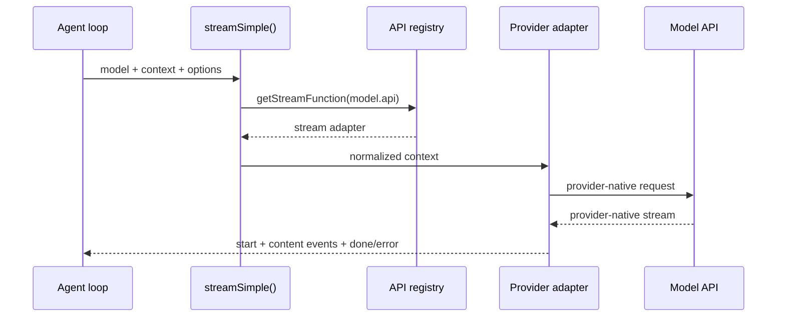

# 5. pi-ai：消息类型、模型类型与流事件协议

## 5.1 问题场景

如果 Agent loop 直接调用某个厂商 SDK，复刻品很快会被供应商细节拖住：有的模型叫 tool call，有的叫 function call；有的返回 thinking，有的把 reasoning 混进文本；有的 stream 先给 usage，有的最后给 usage；有的 stop reason 是 `tool_use`，有的是 `requires_action`。Pi 用 `pi-ai` 先把 provider 差异收敛成统一事件协议，让 Agent loop 只处理 `text/thinking/toolcall/done/error`。

## 5.2 用户如何使用

用户通常不直接调用 `pi-ai`，而是通过 Pi 选择模型：

```bash
pi --model openai/gpt-5.1-codex
pi --model anthropic/claude-sonnet-4-5
pi --model google/gemini-2.5-pro
```

对用户来说，模型不同但工具调用和流式输出体验应尽量一致。复刻时先做 faux provider，再接真实 provider，可以避免一开始就把 loop 写成某个厂商 SDK 的 wrapper。

## 5.3 源码定位

| 责任 | 当前实现 |
|---|---|
| API 类型 | [types.ts#L6](packages/ai/src/types.ts#L6) |
| Provider 类型 | [types.ts#L23](packages/ai/src/types.ts#L23) |
| Context 和 Tool schema | [types.ts#L327](packages/ai/src/types.ts#L327) |
| stream 事件协议 | [types.ts#L340](packages/ai/src/types.ts#L340) |
| streamSimple 分发 | [stream.ts#L43](packages/ai/src/stream.ts#L43) |
| API provider registry | [api-registry.ts#L23](packages/ai/src/api-registry.ts#L23) |
| registerApiProvider | [api-registry.ts#L66](packages/ai/src/api-registry.ts#L66) |
| built-in provider lazy stream | [register-builtins.ts#L162](packages/ai/src/providers/register-builtins.ts#L162) |

## 5.4 生命周期图



## 5.5 关键代码片段

源码位置：[types.ts#L327](packages/ai/src/types.ts#L327)。片段之后继续看 stream event union：[types.ts#L347](packages/ai/src/types.ts#L347)。custom provider 文档也按同一顺序要求 adapter 推送 start、content events、done/error，见 [custom-provider.md#L448](packages/coding-agent/docs/custom-provider.md#L448)。

```ts
export interface Context {
  systemPrompt?: string;
  messages: Message[];
  tools?: Tool[];
}

export type AssistantMessageEvent =
  | { type: "start"; partial: AssistantMessage }
  | { type: "text_start"; contentIndex: number; partial: AssistantMessage }
  | { type: "text_delta"; contentIndex: number; delta: string; partial: AssistantMessage }
  | { type: "text_end"; contentIndex: number; content: string; partial: AssistantMessage }
  | { type: "thinking_start"; contentIndex: number; partial: AssistantMessage }
  | { type: "thinking_delta"; contentIndex: number; delta: string; partial: AssistantMessage }
  | { type: "thinking_end"; contentIndex: number; content: string; partial: AssistantMessage }
  | { type: "toolcall_start"; contentIndex: number; partial: AssistantMessage }
  | { type: "toolcall_delta"; contentIndex: number; delta: string; partial: AssistantMessage }
  | { type: "toolcall_end"; contentIndex: number; toolCall: ToolCall; partial: AssistantMessage }
  | { type: "done"; reason: Extract<StopReason, "stop" | "length" | "toolUse">; message: AssistantMessage }
  | { type: "error"; reason: Extract<StopReason, "aborted" | "error">; error: AssistantMessage };
```

解释：输入给 provider 的是标准 `Context`，而不是 Pi 的 session entry。输出是标准 assistant stream 事件，而不是 vendor raw event。真实 Pi 事件里，tool call 的完整字段名是 `toolCall`，参数字段在 content block 中叫 `arguments`，custom provider 文档示例见 [custom-provider.md#L512](packages/coding-agent/docs/custom-provider.md#L512)。复刻最小版可以先实现 `start/text_delta/done` 子集，但只要加入工具调用，就必须保留 `toolcall_end.toolCall` 这种真实语义，避免把教学字段 `call/args` 当成 Pi 协议。

源码位置：[api-registry.ts#L66](packages/ai/src/api-registry.ts#L66)。片段之后继续看调用方如何通过 `streamSimple()` 分发：[stream.ts#L43](packages/ai/src/stream.ts#L43)。

```ts
export function registerApiProvider<TApi extends Api, TOptions extends StreamOptions>(
  provider: ApiProvider<TApi, TOptions>,
  sourceId?: string,
): void {
  apiProviderRegistry.set(provider.api, {
    provider: {
      api: provider.api,
      stream: wrapStream(provider.api, provider.stream),
      streamSimple: wrapStreamSimple(provider.api, provider.streamSimple),
    },
    sourceId,
  });
}
```

解释：注册键是 `api`，不是显示用的 `provider`。输入是协议适配器，输出是 registry 中的 stream 函数。`wrapStream` 会校验 `model.api` 是否匹配，防止把 OpenAI model 送进 Anthropic adapter。复刻时要区分 `provider` 和 `api`：前者面向用户和鉴权，后者面向协议。

## 5.6 机制拆解

模型能看到的是被 adapter 转换后的 provider-native messages 和 tools。Agent loop 只看到统一事件。runtime 私下保留 provider 选择、api key、headers、baseUrl、transport 和 abort signal。错误传播也必须统一：provider raw error 被 adapter 转成 `error` event 或抛出，再由 loop 决定 retry、overflow recovery 或终止。

`pi-ai` 的价值是让 Agent loop 可以说：“给我一个 `AssistantMessageEventStream`。”它不关心这个 stream 来自 SSE、WebSocket、Responses API、Messages API 还是 faux provider。

## 5.7 设计不变量

- 不变量：`api` 决定协议适配器。原因：同一 provider 可能有多个 API。违反后果：请求字段和响应解析错位。复刻建议：registry key 用 `model.api`。
- 不变量：provider adapter 输出统一事件。原因：Agent loop 不能理解所有厂商 raw event。违反后果：每加一个厂商都要改 loop。复刻建议：先写 adapter contract 测试。
- 不变量：工具 schema 是 context 的一部分。原因：模型只能调用已暴露工具。违反后果：工具权限不可控。复刻建议：context.tools 每轮由 runtime 传入。
- 不变量：abort signal 贯穿 stream。原因：用户中断要影响网络请求。违反后果：TUI 显示已中断但请求仍在跑。复刻建议：stream options 必须包含 `signal`。

## 5.8 失败模式与最小复刻任务

常见失败模式：

- 用 provider name 直接选择 adapter，接入 OpenAI-compatible provider 时协议错。
- 把 tool call delta 当成最终 tool call，导致 JSON 参数不完整。
- provider 抛错后没有形成统一 error event，session 断在半条 assistant 消息。

最小可用版：实现 `ApiProvider` registry、`streamSimple(model, context)`、一个 faux provider，输出 `start/text_delta/done`。

接近 Pi 的增强版：加入 `toolcall_start/toolcall_delta/toolcall_end`、thinking、usage、error、abort。

生产级暂缓项：lazy loading、prompt cache、WebSocket cache、provider-specific diagnostics。

## 5.9 验收清单

- 能解释 `provider` 和 `api` 的区别。
- 能实现一个 faux provider 并让 Agent loop 不知道它是假 provider。
- 能把 provider raw stream 转成统一事件。
- 能在 event 协议中表达 tool call 和 error。
- 能说明为什么 `pi-ai` 不保存 session。

## 5.10 本章实现关卡

本章让 mini Pi 拥有第一个 provider：faux provider。它不访问网络，只按脚本输出标准事件。

新增文件：

- `src/provider/types.ts`：定义 `ModelContext`、`AssistantEvent`、`Model`。
- `src/provider/faux.ts`：根据输入消息返回 text 或 tool call。
- `src/provider/registry.ts`：按 `model.api` 找 stream adapter。

最小事件流：

```ts
yield { type: "start", partial: assistant };
yield { type: "text_start", contentIndex: 0, partial: assistant };
yield { type: "text_delta", contentIndex: 0, delta: "I will inspect the file.", partial: assistant };
yield { type: "text_end", contentIndex: 0, content: "I will inspect the file.", partial: assistant };
yield { type: "toolcall_start", contentIndex: 1, partial: assistant };
yield {
  type: "toolcall_end",
  contentIndex: 1,
  toolCall: { type: "toolCall", id: "call_1", name: "read", arguments: { path: "package.json" } },
  partial: assistant,
};
yield { type: "done", reason: "toolUse", message: assistant };
```

这是“接近真实 Pi”的事件形状。教学版 faux provider 可以内部少发 `*_start`/`*_end`，但第 18 章会要求在真实协议映射处恢复完整事件名和字段名。

运行观察：

```bash
npm run mini -- --provider faux -p "read package"
```

期望 host 能看到 text delta 和 tool call event，但工具还不执行。失败样例是 provider 直接读文件。下一章会把 provider 和 model/auth 解析分开。
