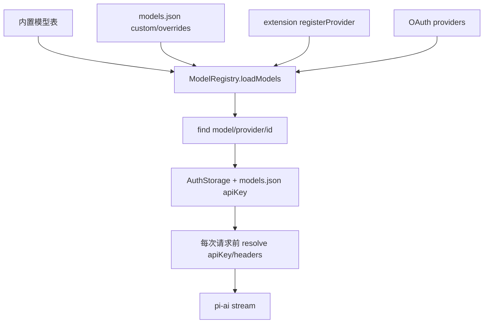

# 6. 模型选择、鉴权与 Provider 注册

## 6.1 问题场景

模型选择不是从字符串里拆出 provider 和 model id 那么简单。Pi 要合并内置模型、`models.json`、provider override、extension provider、OAuth provider、API key、headers、baseUrl、thinking 能力和 session 恢复模型。如果复刻品只硬编码一个模型，用户第一次切 provider、恢复旧 session 或 token 过期时就会失败。

## 6.2 用户如何使用

用户通过这些方式影响模型和鉴权：

```bash
pi --model openai/gpt-5.1-codex
pi --provider anthropic --model claude-sonnet-4-5
pi --api-key sk-...
pi --models sonnet:high,gpt-5.1-codex:medium
/login github-copilot
```

用户期望 Pi 能找到模型、判断凭证是否存在、在请求前刷新 token，并在 session 恢复时尽量恢复原模型。

## 6.3 源码定位

| 责任 | 当前实现 |
|---|---|
| ModelRegistry 类 | [model-registry.ts#L32](packages/coding-agent/src/core/model-registry.ts#L32) |
| built-in/custom 合并 | [provider-composer.ts#L168](packages/coding-agent/src/core/provider-composer.ts#L168) |
| custom wins merge | [provider-composer.ts#L198](packages/coding-agent/src/core/provider-composer.ts#L198) |
| provider auth status | [model-registry.ts#L95](packages/coding-agent/src/core/model-registry.ts#L95) |
| getApiKeyForProvider | [model-registry.ts#L119](packages/coding-agent/src/core/model-registry.ts#L119) |
| dynamic provider registration | [model-registry.ts#L131](packages/coding-agent/src/core/model-registry.ts#L131) |
| AuthStorage credential type | [auth-storage.ts#L24](packages/coding-agent/src/core/auth-storage.ts#L24) |
| auth file permissions | [auth-storage.ts#L67](packages/coding-agent/src/core/auth-storage.ts#L67) |
| 请求前解析 key | [agent-loop.ts#L300](packages/agent/src/agent-loop.ts#L300) |

## 6.4 生命周期图


```mermaid
flowchart TD
    BuiltIn[内置模型表] --> Registry[ModelRegistry.loadModels]
    ModelsJson[models.json custom/overrides] --> Registry
    Extensions[extension registerProvider] --> Registry
    OAuth[OAuth providers] --> Registry
    Registry --> Find[find model/provider/id]
    Find --> Auth[AuthStorage + models.json apiKey]
    Auth --> Request[每次请求前 resolve apiKey/headers]
    Request --> Stream[pi-ai stream]
```

## 6.5 关键代码片段

源码位置：[provider-composer.ts#L168](packages/coding-agent/src/core/provider-composer.ts#L168)。片段之后继续看自定义模型如何覆盖内置模型：[provider-composer.ts#L198](packages/coding-agent/src/core/provider-composer.ts#L198)。

```ts
const models: Model<Api>[] = baseModels.map((model) => ({
  ...model,
  baseUrl: config.oauth === "radius" ? model.baseUrl : (config.baseUrl ?? model.baseUrl),
  compat: mergeCompat(model.compat, config.compat),
}));
for (const definition of config.models ?? []) {
  const existingIndex = models.findIndex((model) => model.id === definition.id);
  const defaults = existingIndex >= 0 ? models[existingIndex] : models[0];
  const model = modelFromJson(providerId, definition, config, defaults);
  if (existingIndex >= 0) models[existingIndex] = model;
  else models.push(model);
}
```

解释：`applyModelsJson` 的输入是内置模型表和 `models.json` 中的 provider 配置；输出是合并后的可选模型列表。`models.json` 既能新增模型（`models.push`），也能按同 id 覆盖内置模型（`models[existingIndex] = model`）。复刻时先支持 built-in + custom merge，再加入 modelOverrides 级别的字段级覆盖。

源码位置：[model-registry.ts#L119](packages/coding-agent/src/core/model-registry.ts#L119)。片段之后继续看请求层如何每次调用前解析 key：[agent-loop.ts#L300](packages/agent/src/agent-loop.ts#L300)。

```ts
async getApiKeyForProvider(provider: string): Promise<string | undefined> {
  try {
    return (await this.runtime.getAuth(provider))?.auth.apiKey;
  } catch {
    return undefined;
  }
}
```

解释：输入是 provider id；输出是当前请求要用的 key。它委托给 `ModelRuntime.getAuth` 解析（内部先查凭证存储，再查 models.json 的 provider 配置），解析失败时返回 `undefined` 而不是抛出。复刻时不要在启动时把 token 固化进 model；要在每次请求前解析。

## 6.6 机制拆解

模型能看到的是最终选中的 `model.id`、能力和 provider-native 请求参数。runtime 私下保留 credential source、OAuth refresh、headers、baseUrl、provider display name、fallback 诊断。用户输入 `--model` 只决定候选模型，是否可用还要看 registry 和 auth。extension provider 通过 `registerProvider()` 进入 registry，而不是直接 patch provider stream。

错误传播要区分：模型不存在是用户配置错误；凭证缺失是 auth 错误；provider 5xx 或 overflow 是请求期错误。复刻品至少要把这三类错误分开。

## 6.7 设计不变量

- 不变量：model metadata 不直接等于 credentials。原因：凭证会刷新和覆盖。违反后果：OAuth 过期后继续用旧 token。复刻建议：请求前调用 `getApiKeyAndHeaders()`。
- 不变量：custom model 以 `provider + id` 覆盖。原因：不同 provider 可有同名 model。违反后果：覆盖错模型。复刻建议：merge key 用二元组。
- 不变量：extension provider 走 registry。原因：动态 provider 要可卸载和诊断。违反后果：reload 后残留旧 adapter。复刻建议：注册时保存 source id。
- 不变量：auth source 要可解释。原因：用户需要排查 key 来自环境变量还是 auth.json。违反后果：多 key 场景不可调试。复刻建议：返回 auth status。

## 6.8 失败模式与最小复刻任务

常见失败模式：

- `--model` 找到模型但没有凭证，直到 provider request 才报不可读错误。
- OAuth token 启动时读取，长会话中过期后不刷新。
- extension provider reload 后旧 provider 仍然可选。

最小可用版：实现 `ModelRegistry`，支持内置模型、`find(provider,id)`、`getApiKey(provider)`。

接近 Pi 的增强版：加入 `models.json`、provider overrides、headers/baseUrl、OAuth、extension register/unregister。

生产级暂缓项：thinking level map、provider display name、command-backed config、capability downgrade。

## 6.9 验收清单

- 能解释 model、provider、api 三者区别。
- 能实现 built-in model 和 custom model 合并。
- 能在每次请求前解析 API key。
- 能描述 extension provider 如何注册和卸载。
- 能把缺模型、缺凭证、请求失败分成不同错误。

## 6.10 本章实现关卡

本章让 mini Pi 能用统一 registry 选择 faux model，并为真实 provider 预留鉴权边界。

新增文件：

- `src/provider/model-registry.ts`：保存模型元数据。
- `src/provider/auth.ts`：按 provider 读取 API key 或返回缺凭证诊断。
- `src/provider/models.json`：示例 custom model 配置。

最小配置样例：

```json
{
  "models": [
    { "provider": "faux", "api": "faux", "id": "scripted", "displayName": "Faux Scripted" }
  ]
}
```

运行观察：

```bash
npm run mini -- --model faux/scripted -p "hello"
```

期望 registry 找到 `{ provider: "faux", api: "faux", id: "scripted" }`，stream adapter 由 `api` 决定。失败样例是用 provider name 直接选择 adapter，导致 OpenAI-compatible provider 无法复用。下一章会把 services、provider、session 汇合成 facade。
