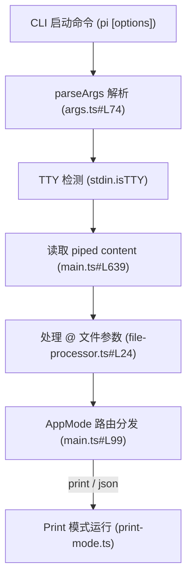

# 6. CLI 参数与只读审查

## 6.1 真实场景下的问题

随着 AI 编码代理在日常开发中的普及，它已不仅限于“人坐在电脑前通过终端输入聊天”。在许多高级工作流中，我们希望将 Pi 嵌入到更宏大的自动化管线里，例如：
- **CI/CD 流水线（如 GitHub Actions）**：在代码提交时自动扫描变更、审核 PR 并输出安全建议。
- **Git Hooks（如 pre-commit）**：在提交前自动对暂存区（Staged）的代码文件进行质量审查。
- **编辑器插件定制**：让 IDE 在后台拉起 Pi 进程，通过管道喂给它代码，然后读取返回结果呈现在编辑器浮窗中。

在这些非交互（Non-interactive）场景中，根本没有物理终端（TTY）可供用户交互。如果直接调用交互模式，程序会因为等待 `process.stdin` 的用户输入而导致流水线彻底死锁。此外，若在自动化脚本中盲目赋予 Agent 写入（`write`/`edit`）和执行命令（`bash`）的权限，一旦模型生成了错误的脚本或产生恶意副作用，后果将不堪设想。

本章将详细介绍 Pi 如何利用非交互模式（Print 模式与 JSON 模式）、管道 I/O 自动路由以及细粒度的只读工具限制，打造一条安全、无死锁的自动化审查流水线。

## 6.2 最小使用示例

1. **管道输入与 Print 模式（Text Print）**：
   你可以直接使用 Unix/Windows 管道，将文件内容输入给 Pi，并让它通过 `-p`（或 `--print`）参数一次性输出最终答案：
   ```bash
   cat package.json | pi -p "这个 package.json 里有哪些核心依赖？"
   ```
   Pi 会检测到输入不是 TTY，自动切换为 Text print 模式，处理完成后退出进程，整个过程无需任何人工敲击回车。
2. **附加本地文件引用（`@` 语法）**：
   无需手动 cat 文件，Pi 的 CLI 参数支持通过 `@` 符号前缀直接附加本地代码文件：
   ```bash
   pi @src/index.ts "分析此文件的异常处理是否完善"
   ```
   多个 `@` 符号的文件参数会被 CLI 自动提取为 Attachment，拼装进初始 prompt 中发送给模型。
3. **安全只读审查（Read-Only Auditing）**：
   为了防止自动化审查时发生文件写回或失控的 bash 副作用，可以使用 `--tools` 参数限缩工具范围，配合 `--no-session` 保证会话的单次临时性：
   ```bash
   pi --tools read,grep,find,ls --no-session -p "对当前项目结构进行安全漏洞审计"
   ```
   在此配置下，Agent 只能进行读取与搜索，写文件（`write`）、编辑（`edit`）和 Shell（`bash`）工具在运行时都会被强制隐去。

## 6.3 源码结构与数据流

#### 6.3.1 核心解析与执行流程



#### 6.3.2 关键机制源码解析

1. **命令行参数提取**：
   在 [args.ts#L74](/source-code/packages/coding-agent/src/cli/args.ts#L74)，`parseArgs` 函数对传入的命令行数组进行线性扫描。当匹配到 `--mode` 且指定为 `json` 或 `rpc` 时，将结果记入 `Mode` 字段。若带有 `@` 符号前缀的参数，则在 [args.ts#L165-L166](/source-code/packages/coding-agent/src/cli/args.ts#L165) 处统一将其截出，塞入 `fileArgs` 数组中。
2. **TTY 自动侦测与管道读取**：
   在 [main.ts#L639](/source-code/packages/coding-agent/src/main.ts#L639) 中，程序会调用 `readPipedStdin()`。其底层实现为：
   ```typescript
   if (process.stdin.isTTY) {
       return undefined;
   }
   ```
   如果 `stdin.isTTY` 为 `false`（说明输入来自管道，例如 `cat file | pi`），`readPipedStdin()` 将自动唤醒 `process.stdin` 读取数据流并返回。
3. **非交互式运行模式决定**：
   程序在 [main.ts#L99](/source-code/packages/coding-agent/src/main.ts#L99) 的 `resolveAppMode` 中决定最终执行渲染器。如果 `parsed.print` 为 `true`，或者 `stdin.isTTY` 为 `false`，则最终路由为 `print`（或 `json`）模式，不再拉起交互式 TUI，避开终端界面的初始化开销。
4. **`@` 文件参数的装配**：
   在 [main.ts#L128](/source-code/packages/coding-agent/src/main.ts#L128) 处，解析出的 `fileArgs` 被传入 `processFileArguments()`（[file-processor.ts#L24](/source-code/packages/coding-agent/src/cli/file-processor.ts#L24)），它会依次读取文件内容、检测类型、对图片进行自动尺寸压缩，并构建起初始的 Attachment。

## 6.4 设计考量与折中方案

#### 6.4.1 只读工具链（Read-Only Tooling）的设计防御性
为什么 Pi 没有像很多商业 Agent 一样，由服务器或内核层提供复杂的 OAuth 弹窗权限验证？
- **简易而严密**：Pi 选择了在启动装配阶段，由 `buildSessionOptions`（[main.ts#L369-L377](/source-code/packages/coding-agent/src/main.ts#L369)）进行工具白名单过滤。如果命令行配置了 `--tools read,grep,find,ls`，工具装配器只向底层的 `Agent` 挂载这四个只读类的核心工具。由于底层 loop 无法调用没有挂载的工具，从根本上绝育了模型生成 `rm -rf` 并在 `bash` 里执行物理毁灭的通道。

#### 6.4.2 Stdin 管道数据优先于命令行文本

- **行为统一**：当同时提供管道输入与命令行尾随文本时（如 `cat code.ts | pi -p "分析这段代码"`），[initial-message.ts#L20](/source-code/packages/coding-agent/src/cli/initial-message.ts#L20) 内部实现会将管道数据合并并作为上下文的引用前缀。这确保了在非 TTY 下，数据流向是统一且确定性的，方便与各类 Shell pipeline 结合。

## 6.5 常见误解与排错指南

#### 6.5.1 误区：在 CI 脚本中直接运行 pi "List files" 会自动退出
- **现象**：在 CI 服务器（如 Jenkins、GitHub Actions）中直接运行 `pi "List files"`，流水线会卡死在构建阶段，直至系统超时。
- **原因**：因为没有传入 `-p` 或 `--print` 参数，且 CI 没有 piped stdin，Pi 会认为它应当拉起交互式 TUI。然而 CI 环境没有 TTY 终端支持，程序会陷入获取终端行列宽度或等待 stdin 输入的阻塞循环。
- **排查**：在 CI 脚本中运行 Pi 时，**必须**显式加上 `-p` 或者 `--mode json`。

#### 6.5.2 误区：只读审查参数 `--tools` 可以被大模型在对话中通过指令绕过
- **现象**：有开发者担心大模型足够“聪明”后，可以通过自己生成 shell 语句并向 Pi 呼吁“请帮我安装并使用写工具”来强行修改文件。
- **原因**：LLM 只能建议调用哪些在 Schema 注册的工具，工具的实体注册和执行路由（[agent-loop.ts#L373](/source-code/packages/agent/src/agent-loop.ts#L373)）完全由 Pi 运行时控制。如果 `--tools` 未声明 `write` 和 `bash`，运行时根本就没有这些工具的执行实体，模型发起的任何额外工具调用都只会在 Safe Points 触发 ToolNotFound 异常。

## 6.6 课后练习

#### 6.6.1 使用级练习
在命令行上利用管道将当前项目的 `package.json` 输送给 Pi，在不启动交互界面的情况下，使用 Print 模式让其提取出所有的 `devDependencies` 并输出在标准输出（stdout）中：
```bash
cat package.json | pi -p "列出所有开发依赖"
```
验证其退出状态码（`echo $?`）是否为 0。

#### 6.6.2 原理级练习
阅读并分析 [file-processor.ts#L24](/source-code/packages/coding-agent/src/cli/file-processor.ts#L24) 的 `processFileArguments` 方法。请回答：
1. 它是如何解析和区分文本文件和二进制图片文件（PNG/JPG/GIF）的？
2. 如果传入的 `@file` 路径是一个不存在的文件，它是会直接抛出进程异常崩溃，还是以 diagnostics 警告形式收集？

#### 6.6.3 扩展级练习
编写一个自定义的 Shell/Node 审查脚本 `readonly-audit.sh`。
- **要求 1**：通过环境变量或参数传入一段待审查的代码库路径。
- **要求 2**：在脚本内部拉起 Pi，配置 `--no-builtin-tools` 和 `--tools read,grep,find,ls` 以及 `--no-session` 参数，防止会话残留污染。
- **要求 3**：传入你自定义的 extension path（可选），自动对输入路径下的所有 `.ts`/`.js` 文件进行安全规则静态审查，并把审查结果以 JSONL 事件流形式输出到控制台。
