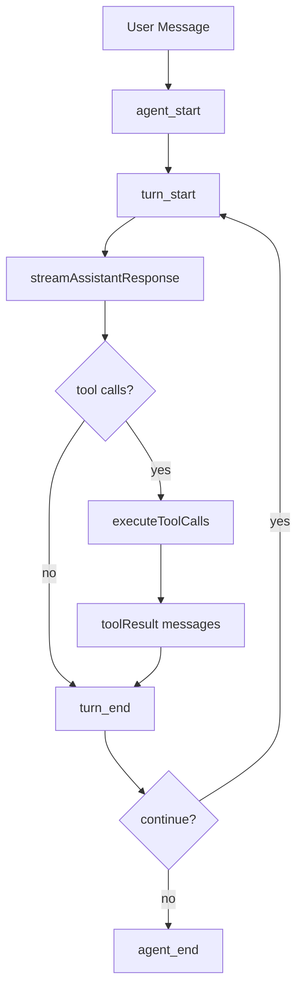

# 7. Agent Loop：从用户输入到下一轮模型调用

## 7. 本章解决的问题

LLM 只能生成下一段内容，或者在支持 tool calling 的模型里生成下一组工具请求。前端小白很容易把 agent 理解成“一个超长 prompt 加几个函数”，但真正的 coding agent 要把用户输入、模型流式输出、工具执行、工具结果、后续模型调用和中途插队消息串成一个可恢复、可观察、可停止的运行时。

pi 的低层循环入口是 `agentLoop()`，它把新的用户消息加入上下文并返回事件流，见 [agent-loop.ts#L31](/source-code/packages/agent/src/agent-loop.ts#L31)。`agentLoopContinue()` 用于 retry 等“上下文里已经有用户消息或 tool result”的场景，并拒绝从 assistant 消息继续，因为 provider 下一轮必须从 user 或 tool result 语义恢复，见 [agent-loop.ts#L64](/source-code/packages/agent/src/agent-loop.ts#L64)。真正共享的执行函数是 `runLoop()`，见 [agent-loop.ts#L155](/source-code/packages/agent/src/agent-loop.ts#L155)。

## 7. 生命周期

一次 run 的核心阶段是：`agent_start`、`turn_start`、插入 steering 消息、provider stream、assistant final、tool execution、tool result messages、`turn_end`、保存点准备、停止判断、follow-up drain、`agent_end`。事件类型在 [types.ts#L403](/source-code/packages/agent/src/types.ts#L403) 定义。



低层循环把“一个 assistant 响应加它触发的工具结果”定义为一个 turn。`runAgentLoop()` 会先发 `agent_start` 和首个 `turn_start`，再把用户消息作为普通 message 生命周期事件发出去，见 [agent-loop.ts#L95](/source-code/packages/agent/src/agent-loop.ts#L95)。之后 `runLoop()` 的内层循环持续处理 tool calls 和 steering 消息，外层循环只负责 agent 本来要停下时再检查 follow-up，见 [agent-loop.ts#L173](/source-code/packages/agent/src/agent-loop.ts#L173) 和 [agent-loop.ts#L253](/source-code/packages/agent/src/agent-loop.ts#L253)。

对 pi agent 创造者来说，这个拆分很重要：steering 是“当前任务还没结束时插入下一轮模型调用前的用户修正”，follow-up 是“当前 agent 没有更多工具要跑后再追加一个新问题”。这两个队列在类型层分开，`getSteeringMessages` 和 `getFollowUpMessages` 分别定义在 [types.ts#L230](/source-code/packages/agent/src/types.ts#L230) 和 [types.ts#L243](/source-code/packages/agent/src/types.ts#L243)。对新手读者来说，可以把它理解成：Enter 是让正在工作的人下一步先看你的补充，Alt+Enter 是等他这一轮忙完再交一个新任务。

## 7. Tool loop

`streamAssistantResponse()` 把 provider stream 合成一条 assistant message，并在 LLM 边界把 `AgentMessage[]` 转成 provider 能理解的 `Message[]`，见 [agent-loop.ts#L275](/source-code/packages/agent/src/agent-loop.ts#L275)。它在 `start` 事件中把 partial assistant 先放入上下文，在 delta 事件中持续替换最后一条 assistant，在 `done` 或 `error` 时落成 final message，见 [agent-loop.ts#L313](/source-code/packages/agent/src/agent-loop.ts#L313) 和 [agent-loop.ts#L343](/source-code/packages/agent/src/agent-loop.ts#L343)。

工具循环从 assistant 内容中提取 `toolCall` block，见 [agent-loop.ts#L203](/source-code/packages/agent/src/agent-loop.ts#L203)。`executeToolCalls()` 根据全局模式和单个工具的 `executionMode` 决定串行或并行，见 [agent-loop.ts#L373](/source-code/packages/agent/src/agent-loop.ts#L373)。`prepareToolCall()` 先查找工具、执行兼容性参数预处理、做 runtime schema 校验，再调用 `beforeToolCall`，见 [agent-loop.ts#L562](/source-code/packages/agent/src/agent-loop.ts#L562)。真正执行工具的是 `executePreparedToolCall()`，工具异常会被包装成 error tool result，而不是直接打断 agent，见 [agent-loop.ts#L628](/source-code/packages/agent/src/agent-loop.ts#L628)。`afterToolCall` 可以替换 content、details、isError 或 terminate，见 [agent-loop.ts#L665](/source-code/packages/agent/src/agent-loop.ts#L665)。最终 tool result message 在 [agent-loop.ts#L727](/source-code/packages/agent/src/agent-loop.ts#L727) 构造。

这里的设计重点是把失败分层。工具参数错、工具不存在、工具被 hook 阻止、工具执行抛错，都应该进入 tool result，让模型知道发生了什么并有机会修正，错误结果的通用构造在 [agent-loop.ts#L710](/source-code/packages/agent/src/agent-loop.ts#L710)。provider 流式错误则会落成 assistant error message，随后结束本次 run，见 [agent-loop.ts#L193](/source-code/packages/agent/src/agent-loop.ts#L193)。abort 是控制流，不是普通任务失败；低层循环把 aborted assistant 也作为终止原因处理，避免继续调用工具。

`prepareNextTurn` 是 pi 后续把 harness save point 接入低层循环的关键。它发生在 assistant 和 tool results 已经进入当前上下文、`turn_end` 已发出之后，允许 harness 用新的 context、model、thinking level 准备下一次 provider request，见 [agent-loop.ts#L222](/source-code/packages/agent/src/agent-loop.ts#L222)。这解释了为什么 system prompt、tools、resources 的变更不能随意修改正在流式返回的 provider request，只能影响下一个 turn。

## 7. 最小 loop 伪代码

```ts
while (!abortSignal.aborted) {
  const assistant = await streamProvider(messages, tools, abortSignal);
  messages.push(assistant);
  const calls = assistant.content.filter((block) => block.type === "toolCall");
  if (calls.length === 0) break;
  for (const call of calls) {
    const result = await executeTool(call, abortSignal);
    messages.push({ role: "toolResult", toolCallId: call.id, content: result });
  }
}
```

这段伪代码只适合帮助新手建立直觉。生产级实现还需要这些不变量：

- provider request 使用的是该 turn 的快照；中途配置变化只能进入下一次 request。
- assistant message 必须先落入上下文，tool result 才能按 provider 协议回灌。
- tool execution 的 UI 完成顺序可以不同，但 transcript 中 tool result 必须稳定。
- 用户插队消息必须在安全点 drain，不能插入正在执行的工具中间。
- `shouldStopAfterTurn` 是 policy hook，不是工具实现的一部分，定义见 [types.ts#L208](/source-code/packages/agent/src/types.ts#L208)。
- 每个 run 最终都要发 `agent_end`，事件流用它作为结束条件，见 [agent-loop.ts#L145](/source-code/packages/agent/src/agent-loop.ts#L145)。

失败边界也要说清楚：低层 loop 不知道 session 如何持久化、不知道 UI 如何渲染、不负责自动压缩，也不决定某个命令是否危险。它只保证消息、工具和事件的协议顺序。权限、安全策略、资源重载和 session 保存由上层 coding-agent 或 harness 接管。
