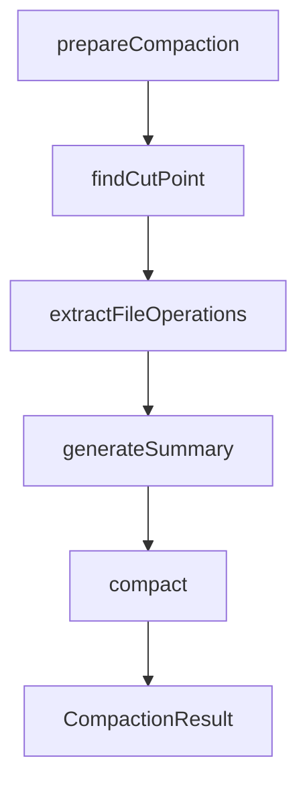
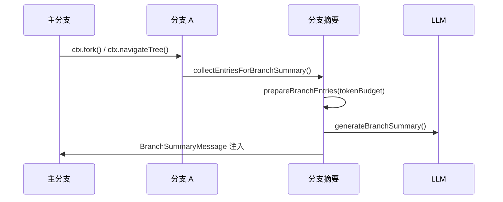
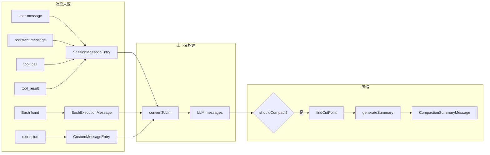

# 第7章 Context Engineering：消息、压缩与分支摘要

> **本章目标**：深入理解 pi 如何用自定义消息类型扩展 LLM 协议，以及如何通过压缩系统管理无限增长的会话上下文。
>
> **pi 源码对照**：
> - `packages/coding-agent/src/core/messages.ts` — 自定义消息类型定义
> - `packages/coding-agent/src/core/compaction/index.ts` — 压缩系统导出
> - `packages/coding-agent/src/core/compaction/compaction.ts` — 压缩核心逻辑
> - `packages/coding-agent/src/core/compaction/branch-summarization.ts` — 分支摘要
> - `packages/coding-agent/src/core/compaction/utils.ts` — 文件操作追踪
>
> **本章结束能做什么**：能解释 pi 的消息类型体系、压缩的 cut-point 算法、分支摘要的 token 预算策略，以及 `convertToLlm` 如何把自定义消息转成 LLM 可读格式。
> **前置阅读**：第1章（架构总览）、第3章（工具系统）。

---

## 1. 为什么需要 Context Engineering

Code Agent 的问题：**会话越来越长，超过 context window 后怎么办？**

pi 的解法不是简单地"截断"，而是：

1. **自定义消息类型**：在标准 LLM 协议之外定义 `BashExecution`、`BranchSummary`、`CompactionSummary` 等消息
2. **convertToLlm 变换**：把这些自定义消息转成 LLM 可读的标准格式
3. **压缩系统**：当 context 快满时，用 LLM 自己生成摘要替换历史
4. **分支摘要**：在树形会话中导航时，自动摘要被离开的分支

---

## 2. 自定义消息类型体系

### 2.1 四种扩展消息

```typescript
// core/messages.ts
export interface BashExecutionMessage {
    role: 'bashExecution'
    command: string
    output: string
    exitCode: number | undefined
    cancelled: boolean
    truncated: boolean
    fullOutputPath?: string
    timestamp: number
    /** !! 前缀：排除在 LLM 上下文之外 */
    excludeFromContext?: boolean
}

export interface CustomMessage<T = unknown> {
    role: 'custom'
    customType: string
    content: string | (TextContent | ImageContent)[]
    display: boolean
    details?: T
    timestamp: number
}

export interface BranchSummaryMessage {
    role: 'branchSummary'
    summary: string
    fromId: string
    timestamp: number
}

export interface CompactionSummaryMessage {
    role: 'compactionSummary'
    summary: string
    tokensBefore: number
    timestamp: number
}
```

### 2.2 消息类型的角色映射

LLM 协议本身只有 `user` / `assistant` / `tool` 三种 role。pi 用扩展 role 处理不同语义：

| 消息类型 | role | 进入 LLM 上下文 | 说明 |
|----------|------|----------------|------|
| 用户消息 | `user` | ✅ | 用户输入 |
| Assistant 消息 | `assistant` | ✅ | 模型回复，含 tool_use |
| 工具结果 | `toolResult` | ✅ | 工具执行结果 |
| Bash 执行 | `bashExecution` | ✅（可排除） | 用户用 `!` 触发的 shell 命令 |
| 自定义消息 | `custom` | ✅ | 扩展注入的上下文 |
| 分支摘要 | `branchSummary` | ✅ | 从其他分支返回时的上下文 |
| 压缩摘要 | `compactionSummary` | ✅ | 历史被压缩后的摘要 |

### 2.3 BashExecution 的特殊设计

`BashExecutionMessage` 不是工具调用，而是**用户直接触发的 shell 命令**。它的结果直接显示给用户，但也需要进入 LLM 上下文（让模型知道执行了什么）：

```typescript
// messages.ts: bashExecutionToText()
export function bashExecutionToText(msg: BashExecutionMessage): string {
    let text = `Ran \`${msg.command}\`\n`
    if (msg.output) {
        text += `\`\`\`\n${msg.output}\n\`\`\``
    } else {
        text += '(no output)'
    }
    if (msg.cancelled) {
        text += '\n\n(command cancelled)'
    } else if (msg.exitCode !== null && msg.exitCode !== undefined && msg.exitCode !== 0) {
        text += `\n\nCommand exited with code ${msg.exitCode}`
    }
    if (msg.truncated && msg.fullOutputPath) {
        text += `\n\n[Output truncated. Full output: ${msg.fullOutputPath}]`
    }
    return text
}
```

---

## 3. convertToLlm：消息到 LLM 格式的变换

### 3.1 为什么需要 convertToLlm

pi 的 `AgentMessage`（内部格式） ≠ LLM API 的 `Message`（协议格式）。需要双向变换。

```typescript
// core/messages.ts
export function convertToLlm(messages: AgentMessage[]): Message[] {
    return messages
        .map((m): Message | undefined => {
            // 根据 role 分发到不同的转换函数
        })
        .filter((m): m is Message => m !== undefined)
}
```

### 3.2 变换规则

```typescript
// 伪代码展示变换逻辑
function convertToLlm(messages: AgentMessage[]): Message[] {
    return messages
        .filter(msg => !msg.excludeFromContext)  // 排除 !! 命令
        .map(msg => {
            switch (msg.role) {
                case 'user':
                    return { role: 'user', content: msg.content }
                case 'assistant':
                    return { role: 'assistant', content: msg.content }
                case 'toolResult':
                    return { role: 'user', content: [{ type: 'tool_result', ... }] }
                case 'bashExecution':
                    return { role: 'user', content: bashExecutionToText(msg) }
                case 'custom':
                    return { role: 'user', content: formatCustomMessage(msg) }
                case 'branchSummary':
                    return {
                        role: 'user',
                        content: BRANCH_SUMMARY_PREFIX + msg.summary + BRANCH_SUMMARY_SUFFIX
                    }
                case 'compactionSummary':
                    return {
                        role: 'user',
                        content: COMPACTION_SUMMARY_PREFIX + msg.summary + COMPACTION_SUMMARY_SUFFIX
                    }
            }
        })
}
```

### 3.3 摘要消息的 XML 包裹

```typescript
// 压缩摘要包裹
export const COMPACTION_SUMMARY_PREFIX = `The conversation history before this point was compacted into the following summary:\n\n<summary>\n`
export const COMPACTION_SUMMARY_SUFFIX = `\n</summary>`

// 分支摘要包裹
export const BRANCH_SUMMARY_PREFIX = `The following is a summary of a branch that this conversation came back from:\n\n<summary>\n`
export const BRANCH_SUMMARY_SUFFIX = `\n</summary>`
```

这样 LLM 看到的是一个被 `<summary>` 标签包裹的结构化摘要，模型会把它当作"参考上下文"而非"需要回复的对话"。

---

## 4. 压缩系统详解

### 4.1 什么时候压缩

```typescript
// compaction/compaction.ts
export function shouldCompact(
    contextTokens: number,
    contextWindow: number,
    settings: CompactionSettings
): boolean {
    if (!settings.enabled) return false
    return contextTokens > contextWindow - settings.reserveTokens
}
```

关键参数：
- `reserveTokens`：压缩后保留的空间（默认 16384）
- `keepRecentTokens`：保留最近的 token 数（默认 20000）

### 4.2 压缩的四个阶段



### 4.3 寻找 Cut Point

**目标**：在保留最近 `keepRecentTokens` 的同时，保证不在"turn 中间"切割（防止上下文断裂）。

```typescript
// compaction/compaction.ts: findCutPoint()
export function findCutPoint(
    entries: SessionEntry[],
    startIndex: number,
    endIndex: number,
    keepRecentTokens: number,
): CutPointResult {
    // 1. 找到所有有效切割点（user/assistant 消息，不是 toolResult）
    const cutPoints = findValidCutPoints(entries, startIndex, endIndex)

    // 2. 从最新往回走，累积 token，直到超过 keepRecentTokens
    let accumulatedTokens = 0
    for (let i = endIndex - 1; i >= startIndex; i--) {
        const entry = entries[i]
        if (entry.type !== 'message') continue

        const messageTokens = estimateTokens(entry.message)
        accumulatedTokens += messageTokens

        if (accumulatedTokens >= keepRecentTokens) {
            // 找到最近的合法切割点
            break
        }
    }

    // 3. 如果切割点在 turn 中间（不是 user 消息开始），
    //    往前找到 user 消息作为 turnStart
    const turnStartIndex = isUserMessage ? -1 : findTurnStartIndex(...)

    return {
        firstKeptEntryIndex: cutIndex,
        turnStartIndex,
        isSplitTurn: !isUserMessage && turnStartIndex !== -1
    }
}
```

### 4.4 token 估算

LLM API 返回 `usage.totalTokens`，但压缩判断需要**提前估算**当前 context 大小。pi 用启发式方法：

```typescript
export function estimateTokens(message: AgentMessage): number {
    let chars = 0
    switch (message.role) {
        case 'user': {
            const content = message.content
            if (typeof content === 'string') {
                chars = content.length
            } else {
                for (const block of content) {
                    if (block.type === 'text' && block.text) chars += block.text.length
                }
            }
            return Math.ceil(chars / 4)  // 启发式：4 字符 ≈ 1 token
        }
        case 'assistant': {
            // 加上 thinking、toolCall 等 block
            for (const block of assistant.content) {
                if (block.type === 'text') chars += block.text.length
                else if (block.type === 'thinking') chars += block.thinking.length
                else if (block.type === 'toolCall') {
                    chars += block.name.length + JSON.stringify(block.arguments).length
                }
            }
            return Math.ceil(chars / 4)
        }
        // ...
    }
}
```

### 4.5 摘要生成

pi 用 LLM 本身生成摘要。提示词是结构化的：

```markdown
## Goal
[What is the user trying to accomplish?]

## Constraints & Preferences
- [Any constraints or requirements]

## Progress
### Done
- [x] [Completed tasks]

### In Progress
- [ ] [Current work]

### Blocked
- [Issues]

## Key Decisions
- **[Decision]**: [Brief rationale]

## Next Steps
1. [Ordered list]

## Critical Context
- [Exact file paths, function names, errors]
```

> **设计亮点**：摘要格式是**给后续 LLM 用的 prompt**，所以强调保留精确信息（文件路径、函数名、错误信息）而不是抽象总结。

### 4.6 迭代压缩

如果会话被压缩多次，每次压缩会**增量更新**摘要而不是重新生成：

```typescript
// generateSummary() 伪代码
if (previousSummary) {
    // 用 UPDATE 提示词，合并新内容到旧摘要
    prompt = UPDATE_SUMMARIZATION_PROMPT + <previous-summary> + new_messages
} else {
    // 首次摘要
    prompt = INITIAL_SUMMARIZATION_PROMPT + messages
}
```

---

## 5. 分支摘要（Branch Summarization）

### 5.1 什么时候生成分支摘要

当用户用 `ctx.fork()` 或 `ctx.navigateTree()` 切换到其他分支时，当前分支被"挂起"。pi 会自动生成该分支的摘要，以便后续返回时恢复上下文。



### 5.2 Token 预算策略

分支可能很长。pi 用 **"从新到旧"** 的贪心策略：

```typescript
// compaction/branch-summarization.ts: prepareBranchEntries()
export function prepareBranchEntries(
    entries: SessionEntry[],
    tokenBudget: number = 0
): BranchPreparation {
    const messages: AgentMessage[] = []

    // 第一遍：收集所有文件操作（不管 token 够不够）
    for (const entry of entries) {
        if (entry.type === 'branch_summary' && !entry.fromHook && entry.details) {
            // 从已有的嵌套摘要中提取文件操作
            // 确保文件追踪是累积的
        }
    }

    // 第二遍：从最新往回走，累积到 tokenBudget
    for (let i = entries.length - 1; i >= 0; i--) {
        const message = getMessageFromEntry(entry)
        const tokens = estimateTokens(message)

        if (tokenBudget > 0 && totalTokens + tokens > tokenBudget) {
            // 如果是摘要 entry，再给一次机会
            if (entry.type === 'compaction' || entry.type === 'branch_summary') {
                if (totalTokens < tokenBudget * 0.9) {
                    messages.unshift(message)
                    totalTokens += tokens
                }
            }
            break
        }

        messages.unshift(message)
        totalTokens += tokens
    }

    return { messages, fileOps, totalTokens }
}
```

### 5.3 文件操作追踪

压缩和分支摘要都追踪文件操作，附加到摘要末尾：

```markdown
## Files
- Read: `src/app.ts`, `src/utils/helper.ts`
- Modified: `src/app.ts`, `src/config.json`
- Created: `src/new-file.ts`
```

---

## 6. 消息与压缩的关系



---

## 7. SessionManager 中的消息持久化

```typescript
// session-manager.ts: appendMessage()
// 在 message_end 事件中，AgentSession 调用：
sessionManager.appendMessage(event.message)

// SessionManager 根据 role 决定 entry 类型：
if (entry.type === 'message') {
    // user / assistant / toolResult → SessionMessageEntry
} else if (entry.type === 'custom') {
    // custom role → CustomMessageEntry（进 LLM 上下文）
}
```

---

## 8. 关键设计决策

| 决策 | 权衡 | 为什么 |
|------|------|--------|
| 用 LLM 生成摘要 | 成本 + 延迟 | 比规则提取更准确，能理解意图 |
| 摘要格式是结构化文本 | 格式固定但实用 | LLM 容易理解，便于后续引用 |
| 迭代压缩 | 增加复杂度 | 避免每次都重新摘要整个历史 |
| 排除 `!!` 命令输出 | 节省 token | 用户明确要求不看输出 |
| 文件操作追踪 | 增加维护成本 | 帮助 LLM 理解代码变更历史 |

---

## 9. 与 System Prompt 的关系

压缩改变的是 **messages 历史**，而不是 **system prompt**。system prompt 由 `buildSystemPrompt()` 每次单独构建，包含：
- 工具说明（从 `_toolPromptSnippets`）
- Guidelines（从 `_toolPromptGuidelines`）
- Skills（从 `resourceLoader.getSkills()`）
- contextFiles（从 `resourceLoader.getAgentsFiles()`）

压缩**不**影响 system prompt 的内容，只影响 messages 部分。

---

## 10. 实践要点

1. **不要在 turn 中间切割**：cut-point 算法保证从 user 消息开始保留
2. **文件追踪是累积的**：每次压缩/分支摘要都收集文件操作，形成完整历史
3. **`!!` 前缀排除输出**：`BashExecutionMessage.excludeFromContext = true`
4. **分块截断有策略**：bash 输出用 `truncate.ts` 的 `truncateHead/truncateTail`

---

> **下一步阅读**：[第3章 工具系统](./chapter-03-tools.md) — 理解 pi 的 7 种内置工具如何实现。
