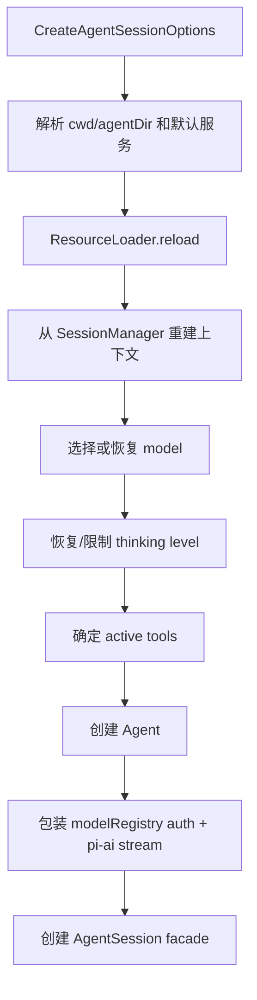

# 7. SDK 创建 AgentSession：服务如何变成可运行 Agent

## 7.1 问题场景

服务装配只得到 settings、auth、models、resources；provider stream 只得到模型协议；Agent loop 只知道消息和工具。它们必须在某个边界汇合，形成一个可监听、可 prompt、可 abort、可持久化、可扩展的运行对象。Pi 的 `createAgentSession()` 就是这个汇合点。复刻时如果没有这一层，CLI、SDK、TUI 会各自拼装 Agent，行为必然漂移。

## 7.2 用户如何使用

CLI 用户不直接调用 SDK，但 SDK 用户会这样思考：

```ts
const { session } = await createAgentSession({ cwd, model });
session.subscribe((event) => console.log(event));
await session.prompt("review the repository");
```

这说明复刻品要提供一个 facade，而不是让外部程序直接操纵 provider 和 session 文件。

## 7.3 源码定位

| 责任 | 当前实现 |
|---|---|
| createAgentSession 入口 | [sdk.ts#L202](packages/coding-agent/src/core/sdk.ts#L202) |
| auth/model/settings/session 默认创建 | [sdk.ts#L207](packages/coding-agent/src/core/sdk.ts#L207) |
| resource reload | [sdk.ts#L216](packages/coding-agent/src/core/sdk.ts#L216) |
| existing session restore | [sdk.ts#L222](packages/coding-agent/src/core/sdk.ts#L222) |
| thinking clamp | [sdk.ts#L273](packages/coding-agent/src/core/sdk.ts#L273) |
| active tools 默认值 | [sdk.ts#L280](packages/coding-agent/src/core/sdk.ts#L280) |
| Agent 创建 | [sdk.ts#L329](packages/coding-agent/src/core/sdk.ts#L329) |
| streamFn 鉴权 | [sdk.ts#L337](packages/coding-agent/src/core/sdk.ts#L337) |
| AgentSession 构造 | [agent-session.ts#L319](packages/coding-agent/src/core/agent-session.ts#L319) |

## 7.4 生命周期图



## 7.5 关键代码片段

源码位置：[sdk.ts#L202](packages/coding-agent/src/core/sdk.ts#L202)。片段之后继续看 session restore 如何影响模型选择：[sdk.ts#L222](packages/coding-agent/src/core/sdk.ts#L222)。

```ts
const cwd = resolvePath(options.cwd ?? options.sessionManager?.getCwd() ?? process.cwd());
const agentDir = options.agentDir ? resolvePath(options.agentDir) : getDefaultAgentDir();
const authStorage = options.authStorage ?? AuthStorage.create(authPath);
const modelRegistry = options.modelRegistry ?? ModelRegistry.create(authStorage, modelsPath);
const settingsManager = options.settingsManager ?? SettingsManager.create(cwd, agentDir);
const sessionManager = options.sessionManager ?? SessionManager.create(cwd, getDefaultSessionDir(cwd, agentDir));
```

解释：输入是可选 SDK 参数；输出是创建 AgentSession 所需的默认服务。这里允许调用者注入已有服务，也允许 SDK 自行创建。复刻时要支持 dependency injection，否则测试、RPC 和多 session host 都会变难。

源码位置：[sdk.ts#L329](packages/coding-agent/src/core/sdk.ts#L329)。片段之后继续看 `AgentSession` 如何订阅 agent 事件：[agent-session.ts#L334](packages/coding-agent/src/core/agent-session.ts#L334)。

```ts
agent = new Agent({
  initialState: {
    systemPrompt: "",
    model,
    thinkingLevel,
    tools: [],
  },
  convertToLlm: convertToLlmWithBlockImages,
  streamFn: async (model, context, options) => {
    const auth = await modelRegistry.getApiKeyAndHeaders(model);
    if (!auth.ok) {
      throw new Error(auth.error);
    }
```

解释：`Agent` 的输入是初始状态、消息转换器和 stream function。`streamFn` 把 model registry 的鉴权解析接进 provider stream，但仍然不让 Agent 直接知道 auth 文件。复刻最小版可以省略 block images，但要保留 `streamFn` 注入点。

## 7.6 机制拆解

模型能看到的是 `convertToLlm` 后的 messages 和 tools。runtime 私下处理的是 block image 防线、模型恢复、thinking 限制、active tools、resource reload、extension runner、session persistence。用户通过 SDK/CLI 调用 `session.prompt()`，执行权进入 `AgentSession`，再进入 `Agent`，最后通过注入的 `streamFn` 调用 provider。

`createAgentSession()` 的设计价值是“所有宿主只拿一个 facade”。这个 facade 隐藏内部服务组合，同时暴露订阅事件、发送 prompt、切模型、切工具和关闭资源的能力。

## 7.7 设计不变量

- 不变量：SDK 入口接受依赖注入。原因：测试和 host 需要替换 services。违反后果：只能从 CLI 跑。复刻建议：options 允许传入 sessionManager/modelRegistry/resourceLoader。
- 不变量：Agent 不直接读 auth。原因：auth 属于产品 runtime。违反后果：核心 loop 不可复用。复刻建议：用 `streamFn` 包装鉴权。
- 不变量：已有 session 可恢复模型和 thinking。原因：继续会话要保持语义。违反后果：resume 后模型能力变化。复刻建议：session context 记录 model/thinking entry。
- 不变量：active tools 在 session 创建时确定，但可被 runtime 刷新。原因：工具可由设置和扩展影响。违反后果：模型看到的工具与执行器不一致。复刻建议：工具 registry 和 prompt snippets 同步更新。

## 7.8 失败模式与最小复刻任务

常见失败模式：

- SDK 直接调用 provider，跳过 session persistence。
- CLI 和 SDK 各自创建 Agent，事件格式不同。
- 复用旧 model object，导致 OAuth/headers 更新不生效。

最小可用版：实现 `createAgentSession(options)`，返回 `{ session }`，session 支持 `prompt()` 和 `subscribe()`。

接近 Pi 的增强版：加入 session restore、model fallback、thinking clamp、active tools、resource loader、extension runner。

生产级暂缓项：block images、防 stale context、tool prompt snippets、diagnostics 聚合。

## 7.9 验收清单

- 能解释 `createAgentSession()` 为什么是汇合点。
- 能用注入的 faux provider 创建 session。
- 能让 CLI 和 SDK 共享同一个 session facade。
- 能在 streamFn 中请求前解析 auth。
- 能从旧 session 恢复模型或给出 fallback。

## 7.10 本章实现关卡

本章实现 mini 版 `createAgentSession()`，让 CLI 和未来 SDK 都拿同一个 facade。

新增文件：

- `src/runtime/create-agent-session.ts`：汇合 services、session store、provider registry、tool registry。
- `src/runtime/agent-session.ts`：暴露 `prompt()`、`abort()`、`subscribe()`、`dispose()`。
- `src/runtime/subscriber.ts`：实现事件订阅。

最小 facade：

```ts
export interface AgentSessionFacade {
  prompt(input: string): Promise<void>;
  abort(): void;
  subscribe(listener: (event: AgentEvent) => void): () => void;
  dispose(): void;
}
```

运行观察：

```bash
npm run mini -- --mode json -p "hello"
```

真实 Pi JSON mode 的第一行是 session header，随后输出 `AgentSessionEvent`，格式见 [json.md#L58](packages/coding-agent/docs/json.md#L58)。mini 版这一关至少应输出 `turn_start`、`message_update`、`turn_end` 这类真实事件名；如果内部先用 `session_start`、`assistant_delta` 这样的教学事件，必须在 public JSON host 前转换，不能称为 Pi JSON 兼容。失败样例是 CLI 直接调用 provider，绕过 session persistence。下一章会实现 agent loop。
