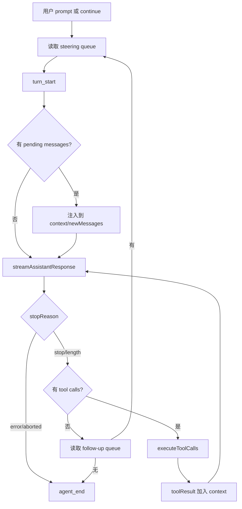

# 8. Agent Core Loop：turn、stream、tool-use、steer 与 follow-up

## 8.1 问题场景

传统聊天程序是一问一答；coding agent 是闭环：用户提出目标，模型请求工具，runtime 执行工具，结果回灌给模型，模型继续决策，直到停止或被中断。Pi 的 Agent loop 还要处理 steering、follow-up、abort、工具串并行、流式事件和错误终止。如果复刻品只实现一次 completion，就无法完成真实代码修改。

## 8.2 用户如何使用

用户看到的行为是：

```text
User: fix the failing test
Assistant: reads files
Tool: read/grep/bash/edit
Assistant: explains and continues
User: midway types "focus on Windows"
Assistant: injects steering before next response
```

中途输入不是简单追加到 transcript；abort 也不是只停 UI。复刻品要把这些行为建模为 loop 状态。

## 8.3 源码定位

| 责任 | 当前实现 |
|---|---|
| runAgentLoop | [agent-loop.ts#L95](packages/agent/src/agent-loop.ts#L95) |
| runAgentLoopContinue | [agent-loop.ts#L120](packages/agent/src/agent-loop.ts#L120) |
| 主循环 | [agent-loop.ts#L155](packages/agent/src/agent-loop.ts#L155) |
| steering 注入 | [agent-loop.ts#L166](packages/agent/src/agent-loop.ts#L166) |
| assistant stream | [agent-loop.ts#L275](packages/agent/src/agent-loop.ts#L275) |
| 请求前 key 解析 | [agent-loop.ts#L300](packages/agent/src/agent-loop.ts#L300) |
| 工具调度 | [agent-loop.ts#L373](packages/agent/src/agent-loop.ts#L373) |
| 工具准备 | [agent-loop.ts#L562](packages/agent/src/agent-loop.ts#L562) |
| 工具执行 | [agent-loop.ts#L628](packages/agent/src/agent-loop.ts#L628) |

## 8.4 生命周期图



## 8.5 关键代码片段

源码位置：[agent-loop.ts#L155](packages/agent/src/agent-loop.ts#L155)。片段之后继续看工具结果如何回灌到 context：[agent-loop.ts#L208](packages/agent/src/agent-loop.ts#L208)。

```ts
while (true) {
  let hasMoreToolCalls = true;

  while (hasMoreToolCalls || pendingMessages.length > 0) {
    const message = await streamAssistantResponse(currentContext, config, signal, emit, streamFn);
    newMessages.push(message);

    const toolCalls = message.content.filter((c) => c.type === "toolCall");
    if (toolCalls.length > 0) {
      const executedToolBatch = await executeToolCalls(currentContext, message, config, signal, emit);
      hasMoreToolCalls = !executedToolBatch.terminate;
    }
  }
}
```

解释：外层循环处理 follow-up，内层循环处理 tool calling 和 steering。输入是当前 context、新消息和 loop config；输出是一串 Agent events 和追加到 context 的 assistant/toolResult messages。复刻时不要把 loop 写成递归 provider call；用显式 while 更容易处理中断和队列。

源码位置：[agent-loop.ts#L275](packages/agent/src/agent-loop.ts#L275)。片段之后继续看 tool 执行入口：[agent-loop.ts#L373](packages/agent/src/agent-loop.ts#L373)。

```ts
const llmMessages = await config.convertToLlm(messages);
const llmContext: Context = {
  systemPrompt: context.systemPrompt,
  messages: llmMessages,
  tools: context.tools,
};

const resolvedApiKey =
  (config.getApiKey ? await config.getApiKey(config.model.provider) : undefined) || config.apiKey;

const response = await streamFunction(config.model, llmContext, {
  ...config,
  apiKey: resolvedApiKey,
  signal,
});
```

解释：模型请求前先转换消息、构建 LLM context、解析 key、传入 abort signal。模型能看到 `llmContext`；runtime 保留原始 Agent context 和事件处理。复刻时这一步是 provider 与 harness 的分界线。

## 8.6 机制拆解

模型能看到当前 system prompt、历史消息和可用 tools。runtime 私下保留 steering/follow-up 队列、newMessages、emit sink、tool execution mode、before/after hook、abort signal。用户输入如果发生在 stream 中，进入 steering 或 follow-up；工具调用发生后，执行权转给 runtime 工具；工具结果作为 `toolResult` 进入下一轮模型上下文。

错误和中断通过 stop reason 与 tool error result 传播。provider aborted 生成 aborted assistant message；tool aborted 生成 error tool result；loop 再决定是否终止。

## 8.7 设计不变量

- 不变量：toolResult 必须回灌再让模型继续。原因：模型需要观察 runtime 执行结果。违反后果：模型只能猜测文件状态。复刻建议：tool result 是下一轮 context message。
- 不变量：stream 和 tool 都接收同一个 abort signal。原因：用户中断要跨网络和本地进程。违反后果：UI 停了但进程还在。复刻建议：每轮创建 AbortController。
- 不变量：steering 在下一次 assistant response 前注入。原因：中途引导不能污染正在生成的消息。违反后果：当前 turn transcript 不一致。复刻建议：pending queue 在 stream 前 drain。
- 不变量：工具串并行由 tool metadata 决定。原因：文件写入必须串行，读操作可并行。违反后果：写冲突。复刻建议：tool 定义带 `executionMode`。

## 8.8 失败模式与最小复刻任务

常见失败模式：

- 工具执行后不把结果加入 context，模型下一轮不知道发生了什么。
- abort 只改 UI 状态，provider 请求继续扣费。
- steering 直接插入正在流式输出的 assistant message。

最小可用版：实现 text stream loop，支持一个 tool call 后回灌 toolResult 再请求模型。

接近 Pi 的增强版：加入 steering、follow-up、abort、parallel/sequential tools、beforeToolCall block、event emit。

生产级暂缓项：auto retry、compaction trigger、diagnostic spans、partial tool execution updates。

## 8.9 验收清单

- 能解释 Pi 的 Agent loop 为什么不是一次 chat completion。
- 能实现两轮 tool calling 闭环。
- 能在 provider stream 前解析 API key。
- 能让用户中断同时影响 stream 和工具。
- 能说明 steering 与 follow-up 的差异。

## 8.10 本章实现关卡

本章实现 mini Pi 的核心闭环：用户消息、模型流、工具调用、toolResult、再次请求模型。

新增文件：

- `src/agent/agent-loop.ts`：显式 `while` 循环，不使用递归 completion。
- `src/agent/context.ts`：把 session context 转成 provider context。
- `src/agent/abort.ts`：每轮创建 `AbortController`。

最小循环骨架：

```ts
while (true) {
  const assistant = await streamAssistant(context, provider, signal);
  const calls = assistant.content.filter((part) => part.type === "toolCall");
  if (calls.length === 0) break;
  const results = await executeToolCalls(calls, tools, signal);
  context.messages.push(assistant, ...results);
}
```

运行观察：

```bash
npm run mini -- --provider faux -p "read package"
```

期望 faux provider 第一次请求工具，runtime 执行工具后第二次请求模型并输出总结。失败样例是工具结果没有进入下一轮 context。下一章会实现工具 registry 和 executor。
