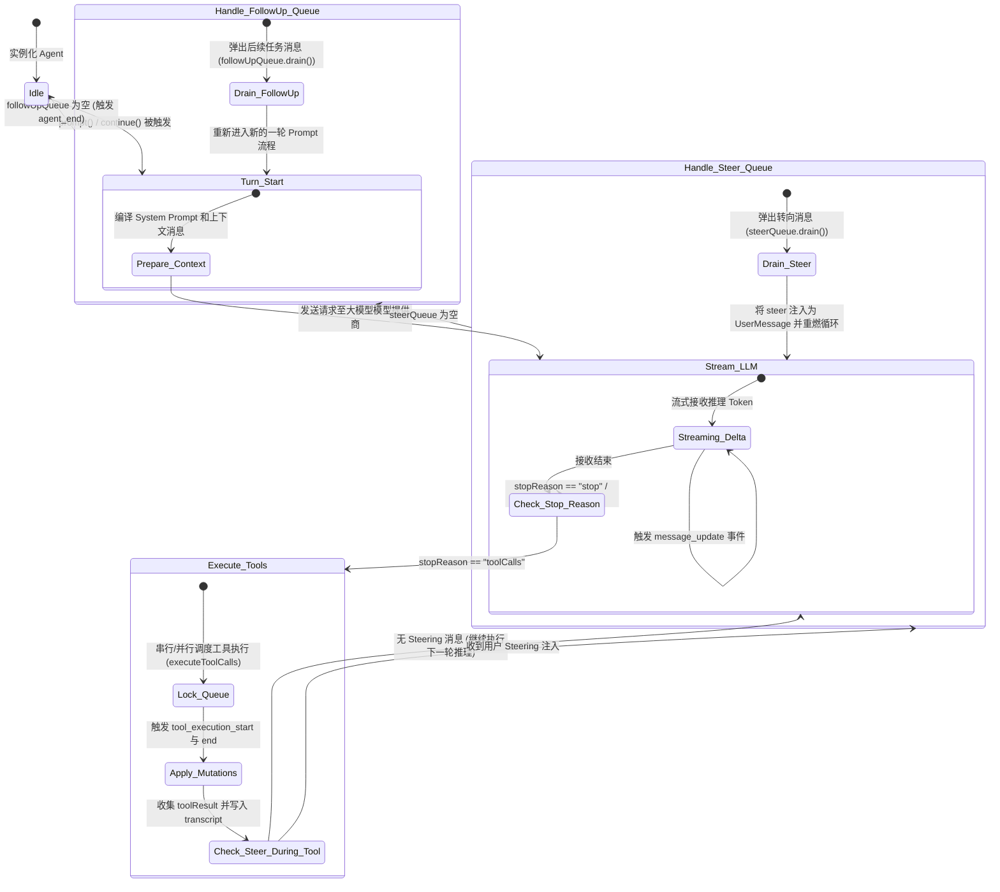

# 8. Agent 循环与状态机

## 8.1 真实场景下的问题

在传统的“单次 Request-Response”模式中，我们将 Prompt 丢给大模型，然后等待它返回一段纯文本。但在实际的自动化编码（Auto-Coding）任务中，事情要复杂得多：
1. **多步骤长流程**：大模型通常需要先查看文件（`read`），发现依赖后进行搜索（`find`/`grep`），接着编辑代码（`edit`），最后运行测试（`bash`）。整个决策-执行链路可能长达数十轮。
2. **多通道中断与控制**：当 Agent 正在高频执行工具调用时，用户可能突然发现代码跑偏，需要立刻进行“转向指导”（Steer）或强制中断任务（Abort）。
3. **上下文回滚与分支跳转**：当工具执行出错或 Agent 修改方案失败时，我们需要将整个执行环境回滚到某个之前的安全状态（Save Point），拉出新分支继续实验。

在复杂的进程生命周期中，前端工程师在开发 Agent 应用时，常会遇到以下技术痛点：
- **状态不一致与状态泄露**：当网络闪断或者流式输出（Streaming Delta）中断时，如何确保模型处于合法的等待态？
- **工具并发竞争**：并发的工具执行和流式输入如果重叠，如何防止消息乱序或状态踩踏？
- **如何优雅解耦**：如何在终端/UI 层实时渲染模型的 Thinking 状态、流式输出以及工具运行状态，同时保持底层 Agent 状态机的纯净？

本章将解剖 Pi Agent 的底层异步事件驱动循环与核心状态机机制。

## 8.2 最小使用示例

我们可以通过 `Agent` 实例手动拉起一个最小循环，模拟大模型的多步推理和工具调用。

以下是一个简化的 TS 脚本，可以直接运行以观察 Loop 的生命周期事件：

```typescript
import { Agent } from "../packages/agent/src/agent.ts";
import { type AgentMessage } from "../packages/agent/src/types.ts";

// 1. 初始化模拟的 Agent 运行上下文与工具
const agent = new Agent({
  model: { api: "openai", provider: "openai", id: "gpt-4o" },
  tools: [
    {
      name: "get_weather",
      description: "Get weather details",
      parameters: { type: "object", properties: { city: { type: "string" } } },
      execute: async (args) => ({ content: [{ type: "text", text: `Sunny in ${args.city}` }] })
    }
  ]
});

// 2. 订阅运行状态机的事件
agent.subscribe((event) => {
  console.log(`[Event Emitted]: ${event.type}`);
  if (event.type === "message_update" && event.message.role === "assistant") {
    console.log(`  Streaming: ${event.message.content[0]?.text || ""}`);
  }
});

// 3. 提交 Prompt，拉起状态机循环
console.log("Starting Agent Prompt...");
await agent.prompt("Check the weather in Beijing.");
console.log("Agent turn finished.");
```

## 8.3 源码结构与数据流

#### 8.3.1 核心执行状态机

Pi Agent 的运行状态完全基于一个核心的**异步事件驱动循环**。下图展示了从用户提交输入到 Agent 最终进入 Idle 挂起状态的完整状态迁移与控制流：



#### 8.3.2 关键实现剖析

Pi 的核心循环逻辑由 `packages/agent` 独立承载，与具体的终端 UI（`packages/tui`）和应用实现解耦。

1. **Agent 循环的底层入口**：
   - `runAgentLoop`（[agent-loop.ts#L95](/source-code/packages/agent/src/agent-loop.ts#L95)）是状态机的底层入口。它接受初始消息、系统提示词、工具列表与事件监听器，并在其内部调用 `runAgentLoopContinue` 进行长程推理的迭代。
   - `runAgentLoopContinue`（[agent-loop.ts#L120](/source-code/packages/agent/src/agent-loop.ts#L120)）通过 `while (true)` 结构驱动整个转向（Steering）与后续（Follow-up）消息的处理，它是整个 Agent 生命周期的“发动机”。

2. **流式响应接收器**：
   - `streamAssistantResponse`（[agent-loop.ts#L275](/source-code/packages/agent/src/agent-loop.ts#L275)）负责对接 `@earendil-works/pi-ai` 库，流式拉取大模型的生成结果，同时在此处拦截 `stopReason` 并抛出实时的 `message_start`、`message_update` 及 `message_end` 事件。

3. **工具调度器与并发控制**：
   - 当模型返回的 `stopReason` 为 `toolCalls` 时，循环会调用 `executeToolCalls`（[agent-loop.ts#L373](/source-code/packages/agent/src/agent-loop.ts#L373)）。
   - 该方法会根据底层配置决定调用 `executeToolCallsSequential` 串行执行工具，还是调用 `executeToolCallsParallel` 展开并发运行。
   - 每一个工具调用的子生命周期，都会经过 `prepareToolCall`、`executePreparedToolCall` 及 `finalizeExecutedToolCall` 等多阶段状态监控，确保在执行出现崩溃或网络超时（Timeout）时，能够干净地把错误包装为 `isError: true` 格式的 toolResult 返回给大模型，避免状态机彻底卡住。

4. **转向控制与后续队列**：
   - `Agent` 类（[agent.ts#L166](/source-code/packages/agent/src/agent.ts#L166)）提供了状态机的对外包装。其暴露的 `steer`（[agent.ts#L264](/source-code/packages/agent/src/agent.ts#L264)）用于向当前的推理 Turn 注入插队提示，使模型在下一次迭代中调整方向；而 `followUp`（[agent.ts#L269](/source-code/packages/agent/src/agent.ts#L269)）则会将消息压入后续队列，在当前推理链路彻底 Idle 后，再拉起新一轮循环。

## 8.4 设计考量与折中方案

#### 8.4.1 为什么要将 Stream 接收和 Turn 结束剥离？
在简单的 LLM Chat 应用中，流式响应（Delta stream）结束就意味着该次请求的终结。但是在 Agent 中，响应接收完毕只是“大模型决策”的终点，随之而来的是“工具运行阶段”（Execution Phase）。
- **非阻塞控制**：为了避免工具执行（例如执行耗时数分钟的构建脚本）阻塞终端交互，Pi 必须在收到 `stopReason === "toolCalls"` 时立刻触发 `turn_end` 挂起事件，把控制权在事件链上交还给 Harness 资源管理器。
- **状态快照（Turn Snapshot）**：每一轮推理的起止均会保存完整的 transcript 快照。这允许即使在工具调用中途进程被 Abort 中断，底层 transcript 的上下文也依旧完整、干净。

#### 8.4.2 转向排队（Steering）与后续排队（Follow-up）的策略选择
- **Steering**：在工具调用间隙插入（[agent.ts#L264](/source-code/packages/agent/src/agent.ts#L264)）。这种模式适合用于紧急纠偏（“请停止修改 utils 目录，改写 libs 目录”），避免模型顺着错误的路线把整张卡点资源消耗殆尽。
- **Follow-up**：在当前 Turn 完全收敛（即模型不再提出任何 Tool Calls）后触发（[agent.ts#L269](/source-code/packages/agent/src/agent.ts#L269)）。这适合执行链式业务逻辑。

## 8.5 常见误解与排错指南

#### 8.5.1 误区：在状态机运行时强行修改全局设置
- **现象**：Agent 正在流式输出时，你在后台更改了 `defaultProvider` 或 `defaultModel`，结果发现 Agent 并没有切换模型，或者抛出 `Agent is already processing` 错误。
- **原因**：根据 [agent.ts#L328](/source-code/packages/agent/src/agent.ts#L328)，在 `activeRun` 不为空时，任何重新发起 `prompt()` 的请求都会被拦截。
- **排查**：状态变更必须放在 `waitForIdle()`（[agent.ts#L309](/source-code/packages/agent/src/agent.ts#L309)）之后进行。如果需要动态调整，应通过 `steer()` 或在 Harnees 层面利用事件钩子（如 `before_provider_request`）修改单次 Request 的 Payload。

#### 8.5.2 误区：工具执行异常导致状态机永远挂起
- **现象**：当自定义工具执行由于死循环无法退出时，终端卡住且不抛出任何事件。
- **原因**：工具未接入 `AbortSignal` 或未设置 Timeout。
- **排查**：检查自定义工具在 `execute` 内是否透传并监听了 `options.abortSignal`，并且在 Harness 层利用 [agent-harness.ts#L97](/source-code/packages/agent/src/harness/agent-harness.ts#L97) 的 `timeoutMs` 强制进行超时兜底。

## 8.6 课后练习

#### 8.6.1 使用级练习
使用 `Agent` 编写一个单测脚本，输入一个包含 3 轮交互的任务，观察并使用 `console.log` 打印出 `turn_start`、`message_update`、`tool_execution_start`、`turn_end` 和 `agent_end` 的触发先后顺序，验证你的理解。

#### 8.6.2 原理级练习
阅读源码 `packages/agent/src/agent-loop.ts`：
1. 请问在 [agent-loop.ts#L451](/source-code/packages/agent/src/agent-loop.ts#L451) 的 `executeToolCallsParallel` 中，如果其中一个并发运行的工具抛出了未捕获的 Error，状态机是如何进行异常处理以防整个 Loop 卡死的？
2. 在 [agent-loop.ts#L628](/source-code/packages/agent/src/agent-loop.ts#L628) 的 `executePreparedToolCall` 中，`abortSignal` 是如何与具体的执行体进行关联的？

#### 8.6.3 扩展级练习
为 `Agent` 状态机开发一个插件或者修改其 core 机制，添加一个新的 `AgentEvent` 类型：`turn_pause`。
- **要求**：当模型流式生成过程中触发包含 `"[PAUSE]"` 的特殊字符串时，状态机暂停发送后续 LLM 请求，抛出 `turn_pause` 并挂起，等待用户执行特定的 API 调用激活才继续执行后续的循环。编写对应的单测 case 验证。
