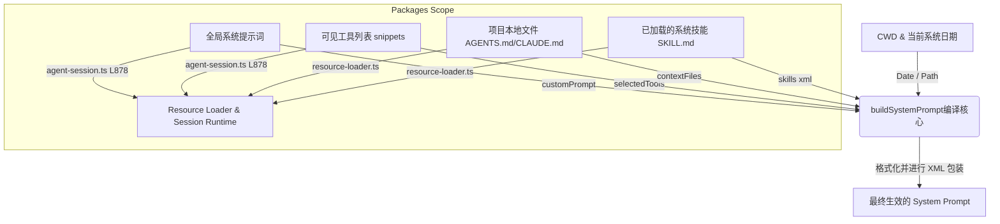

# 9. 系统提示词与行为契约

## 9.1 真实场景下的问题

当一个团队引入 AI Agent 辅助日常开发时，往往会面临各种“失控”的场景：
1. **指令不配合与风格踩踏**：AI 自作主张地删除了重要的调试注释，引入了团队禁用的三方库，或者把原本规整的 TypeScript 代码改写得混乱不堪。
2. **上下文污染与 Token 爆炸**：为了约束 AI 的行为，开发团队将大量的“架构说明”、“代码规范”、“测试要点”塞进 System Prompt 中。结果导致每一次对话的首屏输入高达 20KB，开发效率直线下降，API 费用开销失控。
3. **环境感知失效**：模型不知道自己当前在什么时间运行、位于什么目录下，导致它给出的路径和参考命令与开发者的本地环境完全脱节。

为了让 Agent 在没有全局大内存膨胀的前提下，自适应地感知当前项目的特殊规则并遵守编码契约，我们需要一套**动态编译与渐进式披露（Progressive Disclosure）**的系统提示词管理系统。

本章将详细剖析 Pi Agent 的系统提示词编译机制。

## 9.2 最小使用示例

在 Pi Agent 中，你可以通过在项目根目录下放置规则文件，或者在 `.pi` 隐藏目录中写入自定义提示词，来实现无需重新编译即可动态干预 Agent 行为的效果。

1. **设置项目级行为规则**：
   在你的项目根目录下创建一个 `AGENTS.md` 文件，写入以下内容：
   ```markdown
   ## 编码规范
   - 必须使用 TypeScript  erasable syntax (Node.js strip-only 格式)。
   - 禁止在任何代码中引入 `any` 类型。
   - 所有新增的方法必须附加标准的 JSDoc 注解。
   ```
2. **启动 Pi 终端**：
   在项目根目录下运行交互终端。
3. **验证规则加载情况**：
   在交互终端中向 Agent 提问：
   ```text
   我应该遵守什么编码规范？
   ```
   Agent 会在回复中准确引用 `AGENTS.md` 中定义的规则，并在执行 `edit` 或 `write` 操作时主动遵守这些编码契约。

## 9.3 源码结构与数据流

#### 9.3.1 系统提示词编译流程

下图展示了 Pi Agent 如何在每次对话开始前，将 CWD、当前时间、动态工具列表、项目规则文件以及系统技能（Skills）拼装为最终 System Prompt 的编译链条：



#### 9.3.2 关键实现剖析

编译和控制的核心源于 `packages/coding-agent/src/core/system-prompt.ts`。

1. **编译入口与配置接口**：
   - `buildSystemPrompt`（[system-prompt.ts#L28](packages/coding-agent/src/core/system-prompt.ts#L28)）是系统提示词拼接的执行体。它接收 `BuildSystemPromptOptions`（[system-prompt.ts#L8](packages/coding-agent/src/core/system-prompt.ts#L8)）参数，根据传入的配置来组装不同的规则和上下文。
   - 如果外部调用者传入了 `customPrompt` 参数（[system-prompt.ts#L53](packages/coding-agent/src/core/system-prompt.ts#L53)），该函数会采用极简组装模式，直接附带必要的项目上下文、技能列表和运行路径，最大程度尊重用户的深度定制意图。

2. **工具可用性引导（Dynamic Tool Guidelines）**：
   - 模型并不总是需要知道所有内置工具。Pi 会根据实际启用的 `selectedTools`（[system-prompt.ts#L91](packages/coding-agent/src/core/system-prompt.ts#L91)）动态选择输出对应的指南规范。
   - 例如，如果开启了 `bash` 且禁用了特定的搜索工具，编译逻辑会自动在 Guidelines 中增加：“Use bash for file operations like ls, rg, find”；反之如果高级搜索工具（如 `find` / `grep`）被加载，则改为：“Prefer grep/find/ls tools over bash for file exploration (faster, respects .gitignore)”以指导大模型选用高效率接口。

3. **技能动态拼装与渐进披露**：
   - 技能（Skills）包含完整的执行指令，如果直接一股脑塞进提示词，不仅会导致 Token 浪费，还会干扰模型的普通推理。
   - Pi 对此采用了“渐进披露”设计：它通过 `formatSkillsForSystemPrompt`（[system-prompt.ts#L3](packages/agent/src/harness/system-prompt.ts#L3)）将可见技能的 `name`、`description` 和 `filePath` 等核心元数据格式化成一个紧凑的 `<available_skills>` XML 树。
   - 大模型在看到这个列表后，只有在任务目标与之匹配时，才会利用 `read` 工具去物理读取对应的 `filePath`，实现低开销的指令按需加载。

4. **Session 运行时的提示词重建机制**：
   - `packages/coding-agent` 的 `AgentSession` 类通过私有方法 `_rebuildSystemPrompt`（[agent-session.ts#L878](packages/coding-agent/src/core/agent-session.ts#L878)）在每次启用不同工具集或重新装载项目资源时（例如用户在 TUI 运行过程中动态注册了新扩展），重新触发系统提示词重构，保证状态机持有的 `systemPrompt` 与运行时状态时刻保持同步。

## 9.4 设计考量与折中方案

#### 9.4.1 全量塞入 vs 按需加载技能
在设计 Agent 指令库时，业界通常会将所有的规范和 Skill 的内容直接拼接在 System Prompt 头部。
- **优点**：模型能瞬间读取，无需发起额外的文件读取请求。
- **缺点**：Token 消耗高昂；极易引发长文本大模型的注意力涣散（Lost in the Middle），导致模型在执行中遗忘核心的行为规范。
- **Pi 的折中方案**：提示词中仅保留技能的“说明书元数据”（Name/Description/FilePath）。把完整的行为指令退化为普通的静态文件，强迫大模型在遇到相关任务时“自主查阅”，以此换取极高的稳定度与低廉的 Token 成本。

#### 9.4.2 项目契约文件（AGENTS.md / CLAUDE.md）的合并优先级
Pi 会在运行时读取项目目录下的特异性配置文件。这些文件所代表的行为规范（[system-prompt.ts#L156](packages/coding-agent/src/core/system-prompt.ts#L156)）会被包裹在 `<project_context>` 标签中并置于提示词的尾部。根据 LLM 针对 Prompt 尾部注意力偏置（Recency Bias）的特征，这种排序可以确保项目独有的契约规范拥有比全局通用规则更高的执行权重。

## 9.5 常见误解与排错指南

#### 9.5.1 误区：项目规则文件更新了，但 Agent 依然在用老规则行事
- **现象**：修改了项目根目录下的 `AGENTS.md`，但是在与之对话时，模型依然输出以前的规范代码。
- **原因**：Agent 的 systemPrompt 是在 Turn 启动时或者加载时一次性编译的，如果没有正确触发重构，可能当前会话依然缓存着旧的 Prompt。
- **排查**：在交互终端中执行 `/reload` 强制刷新 Resource Loader 并重建 System Prompt，或者重新启动 Pi 进程以确保修改重新落盘。

#### 9.5.2 误区：在没有提供 `read` 工具时期望技能（Skills）生效
- **现象**：大模型识别到了有对应的技能可以解决任务，但在调用时直接报错，或者无法加载技能的具体指令。
- **原因**：根据 [system-prompt.ts#L166](packages/coding-agent/src/core/system-prompt.ts#L166)，Skills 的动态加载强依赖 `read` 工具的存在。如果调用者在 `selectedTools` 中排除了 `read` 工具，Skills 的拼接逻辑将不会把它们注入提示词。
- **排查**：确保分配给模型的工具链中至少包含基础的文件读取器（`read` 或者是自定义的等效读取工具）。

## 9.6 课后练习

#### 9.6.1 使用级练习
在本地测试项目中，分别在根目录创建 `AGENTS.md` 和 `.pi/APPEND_SYSTEM.md`。往其中写入互相冲突的格式化要求，执行 Pi Agent 提问其行为标准，记录并观察大模型最终服从了哪一方的约束，分析原因。

#### 9.6.2 原理级练习
仔细研究 `packages/coding-agent/src/core/system-prompt.ts` 中的 `buildSystemPrompt` 函数实现：
1. 请问在 [system-prompt.ts#L40](packages/coding-agent/src/core/system-prompt.ts#L40) 中，为什么要使用 `.replace(/\\/g, "/")` 将 resolvedCwd 里的反斜杠全部替换为正斜杠？
2. 在 [system-prompt.ts#L77](packages/coding-agent/src/core/system-prompt.ts#L77) 处，为什么要在 Prompt 尾端追加 `Current date` 和 `Current working directory`，它们在哪些具体的 Agent 内置工具决策中会起到关键作用？

#### 9.6.3 扩展级练习
扩展 `buildSystemPrompt` 的编译参数。
- **任务**：实现一个 `authorGuidelines` 选项，支持从 `.gitconfig` 中动态提取当前的 Git 用户名和邮箱，并将其作为“当前运行者身份契约”自动编译进 Guidelines。
- **要求**：在 `BuildSystemPromptOptions` 中增加对应字段，添加完整的换行过滤逻辑，并编写测试代码验证编译出来的 Prompt 包含了对应的 Git 身份。
