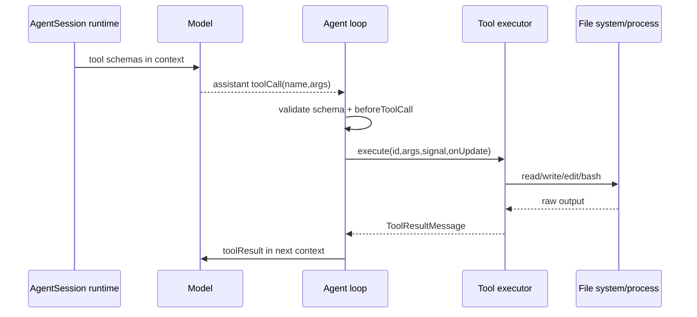

# 9. 工具系统：内置工具、active tools、校验与结果回灌

## 9.1 问题场景

Coding agent 的能力来自工具，但安全边界也来自工具。模型不能直接读文件、写文件或执行 shell；它只能看到工具名称、描述和参数 schema，然后提出结构化 tool call。runtime 校验参数、执行本地动作、截断输出、串行化写入，再把结果回灌给模型。如果复刻品让模型“自由生成 shell 文本并执行”，就无法做权限控制、参数校验、会话审计和可重复测试。

## 9.2 用户如何使用

用户通过工具白名单改变执行能力：

```bash
pi --tools read,grep,find,ls -p "review only"
pi --no-builtin-tools
pi "edit the file and run the targeted check"
```

读者复刻时应先实现 read/write/bash 三个工具，再加入 edit、grep、find、ls。默认工具不等于所有工具；active tools 是每个 session/turn 中模型能看到并能调用的集合。

## 9.3 源码定位

| 责任 | 当前实现 |
|---|---|
| 工具名称集合 | [index.ts#L81](packages/coding-agent/src/core/tools/index.ts#L81) |
| 创建 tool definition | [index.ts#L96](packages/coding-agent/src/core/tools/index.ts#L96) |
| 创建 runtime tool | [index.ts#L117](packages/coding-agent/src/core/tools/index.ts#L117) |
| read schema/execute | [read.ts#L206](packages/coding-agent/src/core/tools/read.ts#L206) |
| bash schema/execute | [bash.ts#L269](packages/coding-agent/src/core/tools/bash.ts#L269) |
| write schema/execute | [write.ts#L181](packages/coding-agent/src/core/tools/write.ts#L181) |
| edit schema/execute | [edit.ts#L291](packages/coding-agent/src/core/tools/edit.ts#L291) |
| file mutation queue | [file-mutation-queue.ts#L32](packages/coding-agent/src/core/tools/file-mutation-queue.ts#L32) |
| Agent loop 工具准备 | [agent-loop.ts#L562](packages/agent/src/agent-loop.ts#L562) |
| Agent loop 工具执行 | [agent-loop.ts#L628](packages/agent/src/agent-loop.ts#L628) |

## 9.4 生命周期图



## 9.5 关键代码片段

源码位置：[index.ts#L96](packages/coding-agent/src/core/tools/index.ts#L96)。片段之后继续看 runtime tool 如何创建：[index.ts#L117](packages/coding-agent/src/core/tools/index.ts#L117)。

```ts
export function createToolDefinition(toolName: ToolName, cwd: string, options?: ToolsOptions): ToolDef {
  switch (toolName) {
    case "read":
      return createReadToolDefinition(cwd, options?.read);
    case "bash":
      return createBashToolDefinition(cwd, options?.bash);
    case "edit":
      return createEditToolDefinition(cwd, options?.edit);
    case "write":
      return createWriteToolDefinition(cwd, options?.write);
  }
}
```

解释：tool definition 是给模型看的 schema、描述、prompt snippet 和渲染信息。输入是 tool name、cwd 和 options；输出是模型可见定义。复刻时要区分 definition 和 executor：definition 暴露给模型，executor 留在 runtime。

源码位置：[file-mutation-queue.ts#L32](packages/coding-agent/src/core/tools/file-mutation-queue.ts#L32)。片段之后继续看 write 如何使用队列：[write.ts#L201](packages/coding-agent/src/core/tools/write.ts#L201)。

```ts
export async function withFileMutationQueue<T>(filePath: string, fn: () => Promise<T>): Promise<T> {
  const registration = registrationQueue.then(async () => {
    const key = await getMutationQueueKey(filePath);
    const currentQueue = fileMutationQueues.get(key) ?? Promise.resolve();
    const nextQueue = new Promise<void>((resolveQueue) => {
      releaseNext = resolveQueue;
    });
    fileMutationQueues.set(key, currentQueue.then(() => nextQueue));
    return { key, currentQueue, chainedQueue, releaseNext };
  });
  const { currentQueue, releaseNext } = await registration;
  await currentQueue;
  try {
    return await fn();
  } finally {
    releaseNext();
  }
}
```

解释：输入是目标文件路径和一次 mutation；输出是串行化后的执行结果。同一文件的写入串行，不同文件仍可并行。复刻时这是防止模型连续发出多个 edit/write tool call 时互相覆盖的关键机制。

## 9.6 机制拆解

模型能看到工具描述、参数 schema 和 prompt guidelines。runtime 私下保留 cwd、路径解析、文件锁、bash spawn、输出截断、signal、onUpdate 和 before/after hook。用户通过 CLI/settings/extensions 改变 active tools；模型只能调用 active tools 中的 schema。错误分支必须生成 tool result，而不是让 loop 崩溃，否则下一轮模型无法观察失败原因。

`read` 和 `grep/find/ls` 是观察工具，`write/edit/bash` 是变更工具；复刻品可以先把变更工具默认关闭，在只读审查模式中只暴露观察工具。

## 9.7 设计不变量

- 不变量：schema 给模型看，execute 在 runtime 跑。原因：模型没有本地权限。违反后果：无法审计和禁用。复刻建议：tool object 包含 `parameters` 和 `execute`。
- 不变量：工具结果必须进入 session。原因：恢复和调试依赖执行记录。违反后果：模型上下文和真实文件状态脱节。复刻建议：每个 tool call 对应 toolResult。
- 不变量：同一文件 mutation 串行。原因：模型可能并行请求多个修改。违反后果：后写覆盖先写。复刻建议：按 realpath 建队列。
- 不变量：输出要截断但保留完整路径。原因：上下文窗口有限但用户可追溯。违反后果：长 bash 输出压爆上下文或丢证据。复刻建议：tail 给模型，full output 写临时文件。

## 9.8 失败模式与最小复刻任务

常见失败模式：

- 工具参数不校验，模型传错字段后本地异常泄漏。
- `edit` 和 `write` 并行修改同一文件，结果不确定。
- bash 输出直接塞进上下文，长日志触发 overflow。

最小可用版：实现 `read/write/bash`，每个工具有 schema、description、execute、error result。

接近 Pi 的增强版：加入 `edit/grep/find/ls`、active tools、mutation queue、output truncation、beforeToolCall block。

生产级暂缓项：富渲染、扩展工具、审批 UI、沙箱执行。

## 9.9 验收清单

- 能解释模型为什么不能直接操作文件系统。
- 能实现 schema 校验失败转 toolResult。
- 能让 toolResult 回灌给下一轮模型。
- 能串行化同一文件写入。
- 能构造只读工具模式。
