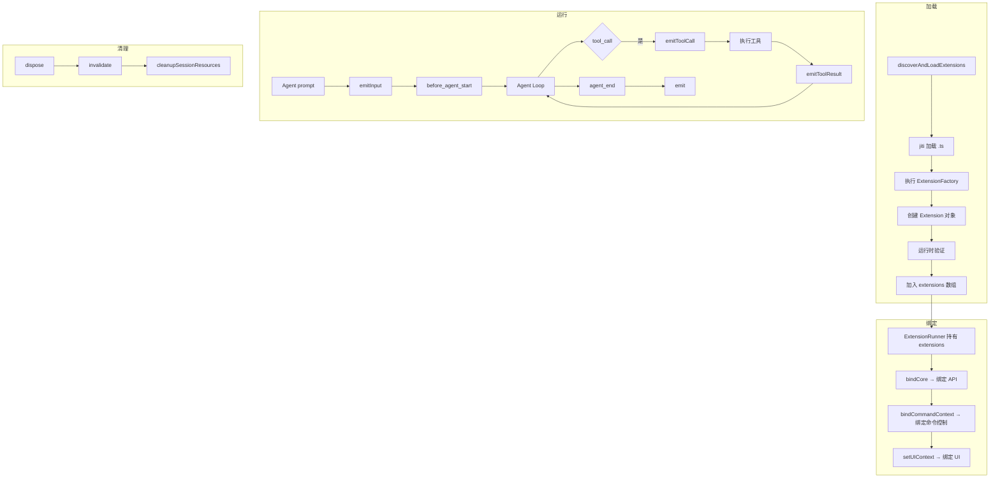

# 第10章 扩展系统：pi 的插件架构

> **本章目标**：深入理解 pi 的扩展系统——ExtensionRunner 的生命周期、事件体系、工具注册、命令注册、以及 jiti 动态加载机制。
>
> **pi 源码对照**：
> - `packages/coding-agent/src/core/extensions/types.ts` — 扩展类型定义（约 700 行）
> - `packages/coding-agent/src/core/extensions/runner.ts` — ExtensionRunner 实现（约 700 行）
> - `packages/coding-agent/src/core/extensions/loader.ts` — jiti 动态加载（约 250 行）
> - `packages/coding-agent/src/core/extensions/wrapper.ts` — 工具包装
>
> **本章结束能做什么**：能解释 pi 扩展的完整生命周期、事件分发机制、ExtensionContext 的 API、工具注册流程，以及 jiti 如何在 Bun 编译产物中加载 TypeScript 扩展。
> **前置阅读**：第1章（架构总览）、第3章（工具系统）。

---

## 1. 扩展解决的问题

pi 的核心功能是固定的（工具执行、session 管理、压缩），但不同用户有不同的扩展需求：

- 自定义 UI 组件
- 新工具
- 新命令
- 第三方 API 集成
- 自定义权限策略

**扩展的本质**：让用户在 pi 运行时动态注入自定义逻辑，而不需要修改 pi 本身。

---

## 2. 扩展架构总览

### 2.1 三层架构

```
┌─────────────────────────────────────────────────────┐
│  Extension（用户写的 .ts 文件）                        │
│  定义 tools、commands、handlers、shortcuts            │
└─────────────────────┬───────────────────────────────┘
                      │ 工厂函数
                      ▼
┌─────────────────────────────────────────────────────┐
│  ExtensionRunner（pi 核心管理）                       │
│  生命周期管理、事件分发、API 绑定                      │
└─────────────────────┬───────────────────────────────┘
                      │ 事件
                      ▼
┌─────────────────────────────────────────────────────┐
│  AgentSession / Agent Core                          │
│  实际执行业务逻辑                                    │
└─────────────────────────────────────────────────────┘
```

### 2.2 ExtensionRunner 核心职责

```typescript
// core/extensions/runner.ts
export class ExtensionRunner {
    // 生命周期
    bindCore(actions, contextActions, providerActions): void
    bindCommandContext(actions?): void
    setUIContext(uiContext?): void
    shutdown(): void

    // 事件发射（按事件类型分发到各扩展的 handlers）
    emit(event): Promise<RunnerEmitResult>
    emitMessageEnd(event): Promise<AgentMessage | undefined>   // 可替换消息
    emitToolCall(event): Promise<ToolCallEventResult | undefined>  // 可阻止工具
    emitToolResult(event): Promise<ToolResultEventResult | undefined> // 可修改结果
    emitContext(messages): Promise<AgentMessage[]>
    emitBeforeAgentStart(...): Promise<BeforeAgentStartCombinedResult>
    emitInput(text, images, source): Promise<InputEventResult>

    // 工具和命令查询
    getAllRegisteredTools(): RegisteredTool[]
    getToolDefinition(name): ToolDefinition | undefined
    getRegisteredCommands(): ResolvedCommand[]
    getCommand(name): ResolvedCommand | undefined

    // 上下文
    createContext(): ExtensionContext  // 创建扩展可用的 API
    createCommandContext(): ExtensionCommandContext  // + 命令控制
}
```

---

## 3. Extension 类型定义

### 3.1 Extension 接口

```typescript
// core/extensions/types.ts
export interface Extension {
    path: string                    // 扩展文件路径
    name: string                   // 扩展名称
    tools: Map<string, RegisteredTool>     // 注册的工具
    commands: Map<string, RegisteredCommand> // 注册的命令
    shortcuts: Map<string, ExtensionShortcut> // 键盘快捷键
    flags: Map<string, ExtensionFlag>       // 配置标志
    handlers: Map<string, ExtensionHandler[]>  // 事件处理器
    messageRenderers: Map<string, MessageRenderer>  // 消息渲染器
}
```

### 3.2 ExtensionFactory

用户写的扩展本质上是一个工厂函数：

```typescript
// core/extensions/types.ts
export type ExtensionFactory = (
    runtime: ExtensionRuntime,  // 扩展可用的 API
    context: ExtensionContext   // 上下文（cwd、sessionManager 等）
) => Extension | Promise<Extension>

// 示例用户扩展：
export default function myExtension(runtime, ctx) {
    return {
        name: 'my-extension',
        tools: new Map([['my-tool', { definition, handler }]]),
        commands: new Map(),
        shortcuts: new Map(),
        flags: new Map(),
        handlers: new Map([
            ['before_agent_start', [handleBeforeAgentStart]]
        ]),
        messageRenderers: new Map(),
    }
}
```

### 3.3 ExtensionAPI：扩展可用的 Runtime API

```typescript
// core/extensions/types.ts
export interface ExtensionAPI {
    // 消息
    sendMessage(message, options?): Promise<void>
    sendUserMessage(content, options?): Promise<void>

    // Session
    appendEntry(type, data): Promise<void>
    setSessionName(name): Promise<void>
    getSessionName(): Promise<string | undefined>

    // 标签
    setLabel(entryId, label): Promise<void>

    // 工具
    getActiveTools(): Promise<string[]>
    getAllTools(): Promise<ToolInfo[]>
    setActiveTools(toolNames): Promise<void>
    refreshTools(): Promise<void>

    // 模型
    setModel(model): Promise<void>
    getThinkingLevel(): Promise<ThinkingLevel>
    setThinkingLevel(level): Promise<void>

    // 命令
    getCommands(): Promise<ResolvedCommand[]>

    // 提供商（注册自定义 LLM provider）
    registerProvider(name, config): void
    unregisterProvider(name): void

    // 标志
    getFlag(name: string): boolean | string | undefined
}
```

---

## 4. 事件体系

### 4.1 完整事件列表

pi 的扩展事件覆盖 Agent 生命周期的每个阶段：

| 事件类型 | 时机 | 可返回值 | 说明 |
|----------|------|----------|------|
| `input` | 用户输入时 | `InputEventResult` | 可拦截/转换输入 |
| `before_agent_start` | LLM 调用前 | `{ messages?, systemPrompt? }` | 可注入消息/修改 prompt |
| `context` | 构建 context 时 | `AgentMessage[]` | 可修改历史消息 |
| `tool_call` | 工具调用前 | `{ block?: true, ... }` | 可阻止工具执行 |
| `tool_result` | 工具结果后 | `{ content?, details?, isError? }` | 可修改工具输出 |
| `message_end` | 消息结束时 | `AgentMessage` | 可替换消息内容 |
| `before_provider_request` | LLM 请求前 | `unknown` | 可修改请求 payload |
| `after_provider_response` | LLM 响应后 | `unknown` | 可修改响应内容 |
| `agent_start` | Agent 开始时 | - | 通知 |
| `agent_end` | Agent 结束时 | - | 通知 |
| `turn_start` | Turn 开始时 | - | 通知 |
| `turn_end` | Turn 结束时 | `{ message, toolResults }` | 通知 |
| `session_before_compact` | 压缩前 | `{ cancel?: true }` | 可阻止压缩 |
| `session_before_fork` | fork 前 | `{ cancel?: true }` | 可阻止分支 |
| `session_before_tree` | tree 导航前 | `{ cancel?: true }` | 可阻止切换 |
| `session_before_switch` | 切换 session 前 | `{ cancel?: true }` | 可阻止切换 |
| `user_bash` | 用户 bash !cmd | `UserBashEventResult` | 可拦截/处理 |
| `resources_discover` | 资源发现时 | `{ skillPaths?, promptPaths?, themePaths? }` | 可扩展资源路径 |

### 4.2 事件发射链

```mermaid
flowchart TD
    subgraph Agent Core
        A[agent event] --> B[_emitExtensionEvent]
    end

    subgraph ExtensionRunner
        B --> C{事件类型匹配?}
        C -->|普通事件| D[emit(event)]
        C -->|message_end| E[emitMessageEnd(event)]
        C -->|tool_call| F[emitToolCall(event)]
        C -->|tool_result| G[emitToolResult(event)]
        C -->|context| H[emitContext(event)]
        C -->|input| I[emitInput(event)]

        D --> J[遍历 extensions]
        E --> J
        F --> J
        G --> J
        H --> J
        I --> J

        J --> K{handlers?}
        K -->|是| L[执行 handler]
        L --> M[收集返回值]
        M --> N{事件可取消?}
        N -->|是| O{cancel=true?}
        O -->|是| P[停止分发]
        O -->|否| Q[继续分发]
        N -->|否| Q
    end
```

### 4.3 emit 的类型分发

```typescript
// core/extensions/runner.ts
async emit<TEvent extends RunnerEmitEvent>(event: TEvent): Promise<RunnerEmitResult<TEvent>> {
    const ctx = this.createContext()

    for (const ext of this.extensions) {
        const handlers = ext.handlers.get(event.type)
        if (!handlers || handlers.length === 0) continue

        for (const handler of handlers) {
            try {
                const handlerResult = await handler(event, ctx)

                // session_before_* 事件可取消
                if (this.isSessionBeforeEvent(event) && handlerResult) {
                    result = handlerResult
                    if (result.cancel) return result
                }
            } catch (err) {
                this.emitError({ extensionPath: ext.path, event: event.type, ... })
            }
        }
    }
    return result
}
```

---

## 5. ExtensionContext：扩展的 API 表面

### 5.1 核心属性

```typescript
// core/extensions/runner.ts: createContext()
createContext(): ExtensionContext {
    return {
        get ui() { runner.assertActive(); return runner.uiContext },
        get hasUI() { runner.assertActive(); return runner.hasUI() },
        get cwd() { runner.assertActive(); return runner.cwd },
        get sessionManager() { runner.assertActive(); return runner.sessionManager },
        get modelRegistry() { runner.assertActive(); return runner.modelRegistry },
        get model() { runner.assertActive(); return getModel() },

        isIdle: () => { runner.assertActive(); return runner.isIdleFn() },
        get signal() { runner.assertActive(); return runner.getSignalFn() },
        abort: () => { runner.assertActive(); runner.abortFn() },
        hasPendingMessages: () => { runner.assertActive(); return runner.hasPendingMessagesFn() },
        shutdown: () => { runner.assertActive(); runner.shutdownHandler() },
        getContextUsage: () => runner.getContextUsageFn(),
        compact: (options) => runner.compactFn(options),
        getSystemPrompt: () => runner.getSystemPromptFn(),
    }
}
```

> **设计意图**：所有属性都是 lazy getter，当扩展尝试用过期的上下文时会抛出明确的错误。

### 5.2 invalidate 机制

当 session 被替换或扩展被重载时：

```typescript
// core/extensions/runner.ts
invalidate(message: string): void {
    if (!this.staleMessage) {
        this.staleMessage = message
        this.runtime.invalidate(message)
    }
}
```

这确保用过期的 `ExtensionContext` 会抛出明确错误，而不是静默失败。

---

## 6. 工具注册

### 6.1 defineTool 工厂

```typescript
// core/extensions/types.ts: defineTool()
export function defineTool<Input, Result>(
    definition: ToolDefinition<Input, Result>,
    handler: (input: Input, ctx: ExtensionContext) => Promise<Result>
): RegisteredTool {
    return { definition, handler }
}
```

### 6.2 getAllRegisteredTools 的合并规则

```typescript
// core/extensions/runner.ts
getAllRegisteredTools(): RegisteredTool[] {
    const toolsByName = new Map<string, RegisteredTool>()
    for (const ext of this.extensions) {
        for (const tool of ext.tools.values()) {
            if (!toolsByName.has(tool.definition.name)) {
                toolsByName.set(tool.definition.name, tool)  // 先到先得
            }
        }
    }
    return Array.from(toolsByName.values())
}
```

### 6.3 工具到 Agent 的注入

AgentSession 在初始化时调用 `wrapRegisteredTools()`：

```typescript
// core/extensions/wrapper.ts
export function wrapRegisteredTools(
    tools: RegisteredTool[],
    extensionRunner: ExtensionRunner,
): AgentTool[] {
    return tools.map(tool => ({
        name: tool.definition.name,
        description: tool.definition.description,
        inputSchema: tool.definition.parameters,
        execute: async (input, ctx) => {
            // 通过 extension runner 执行，允许拦截
            const result = await extensionRunner.runTool(tool, input)
            return result
        }
    }))
}
```

---

## 7. jiti 动态加载

### 7.1 为什么用 jiti

pi 的扩展是 TypeScript 文件，但 pi 运行时需要加载这些 `.ts` 文件。jiti 是 TypeScript/JavaScript 运行时编译器，支持：

- 直接加载 `.ts` 文件
- 支持 `import` / `require`
- 缓存编译结果

### 7.2 Bun 编译产物的特殊处理

Bun 编译后，扩展不能再用 `jiti` 加载（TS 被编译掉了）。pi 用**虚拟模块**机制：

```typescript
// core/extensions/loader.ts
const VIRTUAL_MODULES: Record<string, unknown> = {
    'typebox': _bundledTypebox,
    '@earendil-works/pi-agent-core': _bundledPiAgentCore,
    '@earendil-works/pi-ai': _bundledPiAi,
    // ... 更多包
}

export function createExtensionRuntime(): ExtensionRuntime {
    // 在 Bun binary 模式，jiti 被虚拟模块替代
    if (isBunBinary()) {
        return createRuntimeWithVirtualModules()
    }
    // Node.js 开发模式，用 jiti
    return createRuntimeWithJiti()
}
```

### 7.3 别名解析

```typescript
// core/extensions/loader.ts: getAliases()
const _aliases = {
    '@earendil-works/pi-coding-agent': piCodingAgentEntry,
    '@earendil-works/pi-agent-core': piAgentCoreEntry,
    // 支持 @mariozechner/* 别名（向后兼容）
    '@mariozechner/pi-coding-agent': piCodingAgentEntry,
    typebox: typeboxEntry,
}
```

---

## 8. 扩展发现与加载

### 8.1 discoverAndLoadExtensions

```typescript
// core/extensions/loader.ts
export async function discoverAndLoadExtensions(
    extensionsPaths: string[],
    cwd: string,
    sessionManager: SessionManager,
    modelRegistry: ModelRegistry,
): Promise<LoadExtensionsResult> {
    const extensions: Extension[] = []

    for (const extPath of extensionsPaths) {
        const ext = await loadExtensionFromFactory(extPath, ...)
        if (ext) extensions.push(ext)
    }

    const runtime = createExtensionRuntime()
    return { extensions, runtime }
}
```

### 8.2 加载错误处理

```typescript
// loadExtensionFromFactory()
try {
    const factory = await jiti.import(extPath)
    const ext = await factory.default(runtime, context)
    extensions.push(ext)
} catch (err) {
    // 记录错误但继续加载其他扩展
    diagnostics.push({ type: 'error', message: err.message, path: extPath })
}
```

---

## 9. UI Context：扩展的 UI 能力

### 9.1 ExtensionUIContext 接口

```typescript
// core/extensions/types.ts
export interface ExtensionUIContext {
    select(title, options, opts?): Promise<string | undefined>
    confirm(title, message, opts?): Promise<boolean>
    input(title, placeholder?, opts?): Promise<string | undefined>
    notify(message, type?): void

    setStatus(key, text | undefined): void
    setWorkingMessage(message?): void
    setWorkingVisible(visible): void
    setWorkingIndicator(options?): void

    setWidget(key, content, options?): void
    setFooter(factory): void
    setHeader(factory): void
    setTitle(title): void

    getToolsExpanded(): boolean
    setToolsExpanded(visible): void
}
```

> **设计意图**：不同 Mode（interactive/rpc/print）提供不同的 UIContext 实现。扩展写一次，各模式通用。

---

## 10. 快捷键系统

### 10.1 冲突检测

```typescript
// core/extensions/runner.ts: getShortcuts()
for (const ext of this.extensions) {
    for (const [key, shortcut] of ext.shortcuts) {
        const builtIn = builtinKeybindings[normalizedKey]
        if (builtIn?.restrictOverride === true) {
            // 内置快捷键被保护，扩展快捷键被跳过
            addDiagnostic(`'${key}' conflicts with built-in shortcut`)
            continue
        }
        // ...
    }
}
```

### 10.2 保留的快捷键

```typescript
const RESERVED_KEYBINDINGS = [
    'app.interrupt', 'app.clear', 'app.exit', 'app.suspend',
    'app.thinking.cycle', 'app.model.cycleForward',
    'app.tools.expand', 'app.message.followUp',
    // ...
]
```

---

## 11. 完整生命周期图



---

## 12. 设计亮点

| 特性 | 实现方式 | 为什么 |
|------|----------|--------|
| 事件可取消 | `cancel: true` 返回值 | 让扩展能阻止危险操作 |
| 先到先得 | Map 覆盖规则 | 简单高效 |
| lazy API | getter 每次检查 | 过期上下文立即报错 |
| 虚拟模块 | Bun 编译产物专用 | 避免 jiti 在二进制中失效 |
| 多命名空间 | `pi__name` 工具名 | 防止不同扩展的工具名冲突 |

---

> **下一步阅读**：[第14章 Slash Commands](./chapter-14-slash-commands.md) — 理解命令的完整注册与分发机制。
