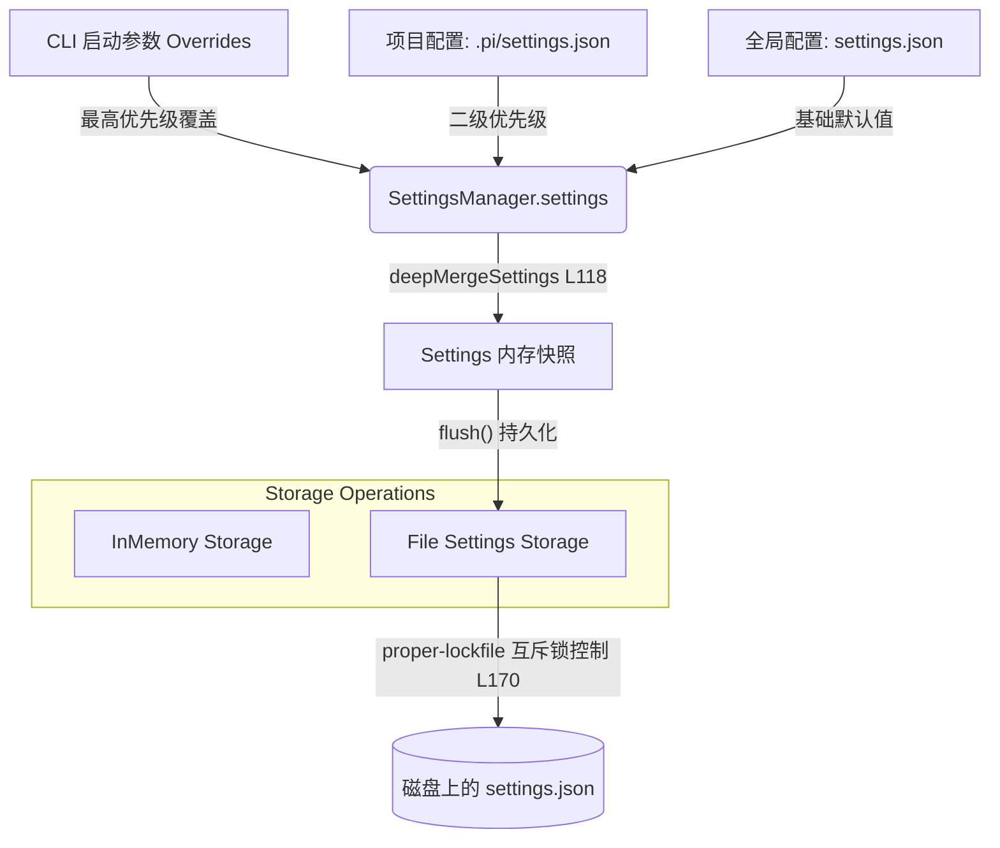

# 10. 设置合并系统

## 10.1 真实场景下的问题

在开发和配置开发辅助 Agent 时，开发团队经常会在配置管理上面临极具代表性的工程痛点：
1. **全局规范与项目特征的冲突**：开发者习惯在全局配置中设定首选的 LLM 模型、UI 主题等；然而，当他切换到特定的业务项目时，该项目可能强制要求使用某个私有部署的特定模型（为了数据安全），或需要启用项目独有的自动化插件。
2. **多终端并发写入导致文件损坏**：当开发者在 VS Code 插件、物理终端 CLI，以及多个并发运行的 Pi Agent 实例中同时修改诸如 `lastChangelogVersion` 或首选模型等设置时，如果缺少并发互斥锁保护，很容易导致 JSON 配置文件因“脏写（Dirty Write）”或并发截断而损坏。
3. **老版本配置迁移历史包袱**：随着 Agent 核心架构的迭代，某些配置字段的名字会发生改变。如果直接废弃旧配置，会导致老用户升级后所有配置失效；如果保留大量向后兼容逻辑，又会让核心设置代码充满各种脏逻辑分支。

我们需要一套层级分明、支持多进程文件锁保护、且具备平滑迁移能力的动态**设置合并系统（Settings Merge System）**。

## 10.2 最小使用示例

我们可以通过在不同层级放置 `settings.json` 来体验层级覆盖的效果，并利用 CLI 指令持久化修改设置。

1. **设置全局配置**：
   在 Pi 的全局配置目录（通常为 `~/.gemini/antigravity/settings.json`）中写入全局首选模型：
   ```json
   {
     "defaultProvider": "openai",
     "defaultModel": "gpt-4o",
     "theme": "nord"
   }
   ```
2. **设置项目级配置**：
   在当前开发项目的根目录创建特异性配置文件 `.pi/settings.json`，覆盖主题和模型：
   ```json
   {
     "theme": "monokai",
     "retry": {
       "maxRetries": 5
     }
   }
   ```
3. **在终端中查看合并结果**：
   启动 Pi Agent 终端，并在输入框中输入命令持久化修改设置：
   ```text
   /theme dracula
   ```
   此时，设置管理系统会将全局的主题覆盖为 `dracula`。而打开底层的两个文件会发现：全局设置中的 `"theme"` 变为了 `"dracula"`，而项目本地设置中的 `"theme"` 依旧为 `"monokai"`（因为项目级配置拥有更高的合并优先级，且终端内默认修改的行为通常持久化于全局作用域中）。

## 10.3 源码结构与数据流

#### 10.3.1 配置层次与优先级

下图展示了 Pi Agent 中多源配置的加载、深层合并（Deep Merge）、持久化以及多进程互斥锁运作的过程：



#### 10.3.2 关键实现剖析

设置系统的主要逻辑位于 `packages/coding-agent/src/core/settings-manager.ts` 中。

1. **多作用域寻址**：
   - 当 `FileSettingsStorage` 初始化时（[settings-manager.ts#L163](packages/coding-agent/src/core/settings-manager.ts#L163)），它会使用传入的 `cwd` 和 `agentDir` 锁定两个物理路径：
     - 全局配置路径 `globalSettingsPath`：对应 `agentDir/settings.json`（[settings-manager.ts#L166](packages/coding-agent/src/core/settings-manager.ts#L166)）。
     - 项目级配置路径 `projectSettingsPath`：对应当前工作目录下的 `.pi/settings.json`（[settings-manager.ts#L167](packages/coding-agent/src/core/settings-manager.ts#L167)）。

2. **深层递归合并算法**：
   - 仅仅使用浅拷贝（`Object.assign`）合并对象，会导致子对象属性（例如 `retry.provider`）被整体替换而丢失其他默认字段。
   - `deepMergeSettings`（[settings-manager.ts#L118](packages/coding-agent/src/core/settings-manager.ts#L118)）实现了解析合并：如果覆盖属性和原始属性都是非数组的对象类型，则进入递归分支继续深度合并；而对于数组或者基础数据类型，则直接用覆盖值替换，确保了像 `retry` 或 `compaction` 这种复杂的嵌套配置块能被优雅地局部重写。

3. **物理文件并发锁控制**：
   - 为了应对多终端或多子进程的读写冲突，`FileSettingsStorage.withLock`（[settings-manager.ts#L197](packages/coding-agent/src/core/settings-manager.ts#L197)）封装了写入保护机制。
   - 它在写入前，会通过 `acquireLockSyncWithRetry`（[settings-manager.ts#L170](packages/coding-agent/src/core/settings-manager.ts#L170)）调用 `proper-lockfile` 获取独占锁。
   - 如果锁被其他实例占用（抛出 `ELOCKED` 错误），它会启动自适应重试逻辑进行同步避让，直至最大重试次数以防死锁；在写入成功后，在 `finally` 块中安全释放文件锁（[settings-manager.ts#L221](packages/coding-agent/src/core/settings-manager.ts#L221)）。

4. **遗留字段平滑迁移（Migration）**：
   - 配置系统的迁移发生在 `migrateSettings`（[settings-manager.ts#L338](packages/coding-agent/src/core/settings-manager.ts#L338)）中。
   - 它通过模式匹配拦截旧的设置字段，将其重写为最新标准：
     - `queueMode` 重命名为 `steeringMode`（[settings-manager.ts#L339](packages/coding-agent/src/core/settings-manager.ts#L339)）。
     - 旧的布尔型 `websockets` 迁移为枚举型 `transport`（[settings-manager.ts#L345](packages/coding-agent/src/core/settings-manager.ts#L345)）。
     - 将老版的对象形式的 `skills` 字段重塑为现代数组形式（[settings-manager.ts#L351](packages/coding-agent/src/core/settings-manager.ts#L351)）。
     - 将 `retry.maxDelayMs` 转换到 `retry.provider.maxRetryDelayMs` 嵌套配置中（[settings-manager.ts#L372](packages/coding-agent/src/core/settings-manager.ts#L372)）。

## 10.4 设计考量与折中方案

#### 10.4.1 为什么采用 Sync Lock 而不是 Async Promisified Lock？
Node.js 中操作文件通常推荐使用异步 `fs.promises`。然而，在 Pi 中，配置文件的加锁与读取却采用了 Sync Lock 方案（[settings-manager.ts#L170](packages/coding-agent/src/core/settings-manager.ts#L170)）。
- **生命周期约束**：设置的读取往往发生在 CLI 启动阶段或状态机同步初始化的极早期（Sync bootstrapping phase）。如果配置加载是异步的，整个 Agent-core 的所有 Getter 属性和工厂方法都必须重构为异步返回（`Promise<Settings>`），这会引发严重的“异步传染性”，大幅恶化代码的可读性。
- **折中代价**：虽然同步阻塞（Sync blocking）会导致事件循环短暂挂起数毫秒，但因为设置文件通常非常小（小于 5KB），其带来的物理磁盘 I/O 开销微乎其微。

#### 10.4.2 内存快照机制与写入队列（Queueing Writes）
为了避免频繁读写导致的性能惩罚，`SettingsManager` 在内存中持有 `globalSettings` 与 `projectSettings`（[settings-manager.ts#L247](packages/coding-agent/src/core/settings-manager.ts#L247)）。只有在显式调用 setter 时才标记 `modifiedFields`（[settings-manager.ts#L441](packages/coding-agent/src/core/settings-manager.ts#L441)）并排队写入磁盘。利用 `enqueueWrite`（[settings-manager.ts#L478](packages/coding-agent/src/core/settings-manager.ts#L478)）将多次变更合并为单次串行 write 任务，极大缓解了磁盘负载。

## 10.5 常见误解与排错指南

#### 10.5.1 误区：在项目设置中覆盖了配置，但是全局设置的 setter 把项目设置洗掉了
- **现象**：在 `.pi/settings.json` 中配置了 `"theme": "nord"`，但是在 TUI 中执行修改了其他无关配置后，项目专属配置中的 `"theme"` 居然不见了或被改写了。
- **原因**：当调用 `SettingsManager.save()` 持久化全局变量时，如果合并与写回逻辑没有区分 Scope，很容易发生把内存中合并后的最终状态直接写回到 Scope 文件的错误。
- **排查**：Pi 在 `persistScopedSettings`（[settings-manager.ts#L497](packages/coding-agent/src/core/settings-manager.ts#L497)）中，仅对已标记为修改的 `modifiedFields`（[settings-manager.ts#L508](packages/coding-agent/src/core/settings-manager.ts#L508)）进行精准写入覆盖，而未修改的属性则维持原文件中的面貌，防止 Scope 之间的配置污染。

#### 10.5.2 误区：Concurrent processes 同时读写导致 settings 文件长度变 0
- **现象**：运行了多个 Pi terminal 实例后， settings.json 文件损坏，大小变为了 0 字节，打开报 JSON 解析错误。
- **原因**：由于竞争条件（Race Condition），一个进程在打开文件进行 truncate 写入时被另一个进程强行抢占或读取。
- **排查**：确保运行环境的临时目录及配置文件目录没有禁用文件系统锁定（锁文件需要写入权限）。若在没有锁支持的沙盒容器内运行，应采用 `InMemorySettingsStorage`（[settings-manager.ts#L305](packages/coding-agent/src/core/settings-manager.ts#L305)）规避物理锁定开销。

## 10.6 课后练习

#### 10.6.1 使用级练习
在项目目录的 `.pi/settings.json` 中，配置 `retry` 策略为 `maxRetries: 2`；而在全局配置中将其设为 `maxRetries: 4` 并开启 `enabled: false`。写一段 TS 验证最终合并出来的 retry 参数各字段的值是什么，检验 `deepMergeSettings` 的行为。

#### 10.6.2 原理级练习
阅读 `packages/coding-agent/src/core/settings-manager.ts` 的 `migrateSettings`（[settings-manager.ts#L338](packages/coding-agent/src/core/settings-manager.ts#L338)）方法：
1. 请问在此处，对 `websockets` 的迁移是如何在兼顾旧版布尔型变量的同时，平滑映射为现代 `transport` 字符串枚举型的？
2. 如果用户在旧版中同时配置了 `websockets` 与 `transport`，根据目前的代码逻辑，哪一个配置值会最终生效？

#### 10.6.3 扩展级练习
为 `SettingsManager` 扩展一个支持**环境变量注入优先级覆盖**的功能。
- **任务**：允许开发者通过设置环境变量 `PI_DEFAULT_MODEL=xxx`，在不修改任何 json 文件的状态下，临时干预启动时的默认 model 设置。
- **要求**：在 `SettingsManager` 加载完成 global 与 project 配置后，注入一层针对特定前缀（`PI_`）的环境变量合并逻辑。合并优先级必须满足：CLI Overrides > Env Overrides > Project Settings > Global Settings，并编写测试验证此优先级链条。
