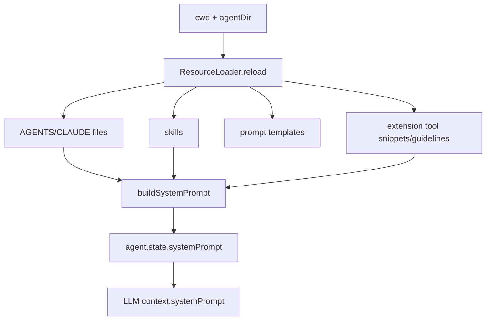

# 10. System Prompt 与资源注入：AGENTS、skills、templates、tool snippets

## 10.1 问题场景

模型行为不是由一个静态 system prompt 决定的。Pi 要把全局和项目规则、当前日期、cwd、工具说明、skills、templates、extension tool snippets、append system prompt 合并成运行时上下文。如果复刻品只写死一段 prompt，项目规则不会生效，skills 不能按需加载，扩展工具也无法教会模型如何使用。

## 10.2 用户如何使用

用户通过文件和资源影响模型：

```text
AGENTS.md
CLAUDE.md
.pi/settings.json
.pi/skills/*.md
.pi/prompts/*.md
pi --append-system-prompt extra.md
```

用户不需要知道最终 prompt 长什么样，但复刻品必须能解释哪些内容进入模型，哪些只留在 runtime。

## 10.3 源码定位

| 责任 | 当前实现 |
|---|---|
| system prompt options | [system-prompt.ts#L8](packages/coding-agent/src/core/system-prompt.ts#L8) |
| buildSystemPrompt | [system-prompt.ts#L28](packages/coding-agent/src/core/system-prompt.ts#L28) |
| context files 注入 | [system-prompt.ts#L60](packages/coding-agent/src/core/system-prompt.ts#L60) |
| ResourceLoader 接口 | [resource-loader.ts#L28](packages/coding-agent/src/core/resource-loader.ts#L28) |
| AGENTS/CLAUDE 查找 | [resource-loader.ts#L57](packages/coding-agent/src/core/resource-loader.ts#L57) |
| 祖先目录加载 | [resource-loader.ts#L75](packages/coding-agent/src/core/resource-loader.ts#L75) |
| prompt templates | [prompt-templates.ts#L194](packages/coding-agent/src/core/prompt-templates.ts#L194) |
| skills loading | [skills.ts#L387](packages/coding-agent/src/core/skills.ts#L387) |
| AgentSession prompt base | [agent-session.ts#L315](packages/coding-agent/src/core/agent-session.ts#L315) |

## 10.4 生命周期图



## 10.5 关键代码片段

源码位置：[system-prompt.ts#L28](packages/coding-agent/src/core/system-prompt.ts#L28)。片段之后继续看 context files 如何进入 prompt：[system-prompt.ts#L60](packages/coding-agent/src/core/system-prompt.ts#L60)。

```ts
export function buildSystemPrompt(options: BuildSystemPromptOptions): string {
  const {
    customPrompt,
    selectedTools,
    toolSnippets,
    promptGuidelines,
    appendSystemPrompt,
    cwd,
    contextFiles: providedContextFiles,
    skills: providedSkills,
  } = options;
  const promptCwd = cwd.replace(/\\/g, "/");
}
```

解释：输入是 runtime 已解析的资源和工具信息；输出是一个交给 LLM 的 system prompt 字符串。`cwd` 会被规范化后写入 prompt。复刻时不要让 `buildSystemPrompt()` 自己扫描文件；扫描属于 ResourceLoader。

源码位置：[resource-loader.ts#L57](packages/coding-agent/src/core/resource-loader.ts#L57)。片段之后继续看祖先目录如何向上查找：[resource-loader.ts#L75](packages/coding-agent/src/core/resource-loader.ts#L75)。

```ts
function loadContextFileFromDir(dir: string): { path: string; content: string } | null {
  const candidates = ["AGENTS.md", "AGENTS.MD", "CLAUDE.md", "CLAUDE.MD"];
  for (const filename of candidates) {
    const filePath = join(dir, filename);
    if (existsSync(filePath)) {
      return {
        path: filePath,
        content: readFileSync(filePath, "utf-8"),
      };
    }
  }
  return null;
}
```

解释：输入是目录；输出是该目录中的规则文件。ResourceLoader 再按全局、祖先、当前项目顺序组合。复刻最小版可以只加载当前 cwd 的 `AGENTS.md`，但要保留 path 以便诊断和展示。

## 10.6 机制拆解

模型能看到的是最终 system prompt、skills 文本、项目规则、tool snippets 和当前 cwd。runtime 私下保留资源来源路径、冲突诊断、prompt template registry、extension 实例和是否启用某类资源。用户输入如果使用 prompt template，host 会展开成用户消息；如果启用 skill，skill 文本进入 prompt 或上下文；如果加载 extension tool，tool snippet 进入 prompt，executor 留在 runtime。

资源注入要保持“可解释”：读者应能从最终行为反查是哪一个文件、哪个 skill、哪个 extension 改变了模型指令。

## 10.7 设计不变量

- 不变量：ResourceLoader 负责发现，buildSystemPrompt 负责拼接。原因：扫描文件有副作用，拼接应是纯逻辑。违反后果：prompt 构建不可测试。复刻建议：传入 `contextFiles`。
- 不变量：tool snippet 必须与 active tool 同步。原因：模型不应学习不可用工具。违反后果：模型调用被禁用工具。复刻建议：按 active tools 过滤。
- 不变量：skills 是给模型的说明，不是执行代码。原因：执行权仍在 runtime 工具/扩展。违反后果：安全边界模糊。复刻建议：skills 只进入文本上下文。
- 不变量：资源来源要可诊断。原因：项目规则冲突很常见。违反后果：用户不知道模型为何听错规则。复刻建议：保存 `{ path, source, diagnostics }`。

## 10.8 失败模式与最小复刻任务

常见失败模式：

- 每轮都重新扫描文件，导致 prompt 与 session 记录不一致。
- 禁用了 write 工具，但 prompt 仍告诉模型可以写文件。
- skill 被当成插件执行，产生不可审计副作用。

最小可用版：加载 `AGENTS.md`，构建包含日期、cwd、工具列表、项目规则的 system prompt。

接近 Pi 的增强版：加入全局/祖先加载、skills、templates、append system prompt、extension snippets、diagnostics。

生产级暂缓项：package resource priority、resource collision UI、tool-specific prompt guidelines。

## 10.9 验收清单

- 能说明哪些内容进入模型，哪些只留在 runtime。
- 能实现 ResourceLoader 与 prompt builder 分离。
- 能加载 AGENTS/CLAUDE 并注入 system prompt。
- 能让 active tools 与工具说明一致。
- 能解释 skill、prompt template、extension 的差异。
