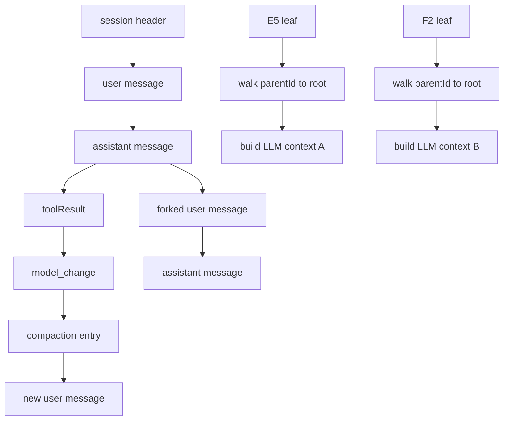

# 11. Session DAG 与 JSONL 持久化

## 11.1 问题场景

Pi 的 session 不是一段线性聊天文本，而是 append-only 的事件/entry 日志。每个 entry 有 id、parentId、timestamp 和类型，能形成分支；恢复上下文时从 leaf 往 root 走，再把 model change、thinking change、compaction、branch summary、message 解析成当前 LLM context。如果复刻品只保存 messages 数组，resume/fork/tree/label/compaction 都无法可靠实现。

## 11.2 用户如何使用

用户通过这些操作触发 session DAG：

```bash
pi --continue
pi --resume
/fork
/tree
/label
/compact
```

用户看到的是“继续一个会话”或“从某一条消息分叉”，但底层是 JSONL entry 图。复刻品要让用户能恢复任意 leaf 的上下文。

## 11.3 源码定位

| 责任 | 当前实现 |
|---|---|
| SessionManager 状态 | [session-manager.ts#L711](packages/coding-agent/src/core/session-manager.ts#L711) |
| setSessionFile/load entries | [session-manager.ts#L739](packages/coding-agent/src/core/session-manager.ts#L739) |
| persist JSONL | [session-manager.ts#L843](packages/coding-agent/src/core/session-manager.ts#L843) |
| appendMessage | [session-manager.ts#L876](packages/coding-agent/src/core/session-manager.ts#L876) |
| label entry | [session-manager.ts#L1048](packages/coding-agent/src/core/session-manager.ts#L1048) |
| branch walk | [session-manager.ts#L1076](packages/coding-agent/src/core/session-manager.ts#L1076) |
| harness context builder | [session.ts#L22](packages/agent/src/harness/session/session.ts#L22) |
| async append message | [session.ts#L128](packages/agent/src/harness/session/session.ts#L128) |
| JsonlSessionRepo create | [jsonl-repo.ts#L75](packages/agent/src/harness/session/jsonl-repo.ts#L75) |
| JsonlSessionRepo fork | [jsonl-repo.ts#L133](packages/agent/src/harness/session/jsonl-repo.ts#L133) |

## 11.4 生命周期图



## 11.5 关键代码片段

源码位置：[session-manager.ts#L876](packages/coding-agent/src/core/session-manager.ts#L876)。片段之后继续看 branch walk 如何重建路径：[session-manager.ts#L1076](packages/coding-agent/src/core/session-manager.ts#L1076)。

```ts
appendMessage(message: Message | CustomMessage | BashExecutionMessage): string {
  const entry: SessionMessageEntry = {
    type: "message",
    id: generateId(this.byId),
    parentId: this.leafId,
    timestamp: new Date().toISOString(),
    message,
  };
  this._appendEntry(entry);
  return entry.id;
}
```

解释：输入是一条消息；输出是新 entry id。`parentId` 指向当前 leaf，追加后 leaf 前进。复刻时不要只 `messages.push()`；要给每条 entry id 和 parentId，后面才能 fork。

源码位置：[session.ts#L22](packages/agent/src/harness/session/session.ts#L22)。片段之后继续看 `Session.buildContext()` 如何调用它：[session.ts#L110](packages/agent/src/harness/session/session.ts#L110)。

```ts
for (const entry of pathEntries) {
  if (entry.type === "thinking_level_change") {
    thinkingLevel = entry.thinkingLevel;
  } else if (entry.type === "model_change") {
    model = { provider: entry.provider, modelId: entry.modelId };
  } else if (entry.type === "compaction") {
    compaction = entry;
  }
}
```

解释：输入是某个 leaf 到 root 的路径；输出是当前 thinking、model、compaction 和 messages。session context 是从 entry path 计算出来的，不是单独存一份。复刻时要把“事实日志”和“给模型的上下文视图”分开。

## 11.6 机制拆解

模型能看到的是 `buildSessionContext()` 后的 messages、model 和 thinking 状态。runtime 私下保留完整 JSONL、所有分支、labels、session header、parent session path 和 compaction entry。用户触发 fork/tree 时，执行权在 SessionManager/Runtime；Agent loop 只拿最终 context。错误传播主要来自 JSONL 文件缺失、header 损坏、parentId 不存在和 cwd 缺失。

compaction 不是删除历史，而是在未来 context 中用 summary 替代旧历史；原 JSONL 仍保留事实，便于审计和导出。

## 11.7 设计不变量

- 不变量：JSONL append-only。原因：中断时更容易恢复和审计。违反后果：半写入破坏整段历史。复刻建议：每条 entry 一行 JSON。
- 不变量：上下文由 leaf path 计算。原因：分支共享同一文件。违反后果：fork 后上下文混入别的分支。复刻建议：`getBranch(leafId)`。
- 不变量：session entry 类型不只 message。原因：model/thinking/label/compaction 都是状态事实。违反后果：resume 后丢运行配置。复刻建议：定义 union entry type。
- 不变量：compaction entry 是未来 context 的替身。原因：历史仍需审计。违反后果：导出和回放丢证据。复刻建议：保存 summary 和 firstKeptEntryId。

## 11.8 失败模式与最小复刻任务

常见失败模式：

- fork 复制整个 messages 数组，无法表达共享祖先。
- resume 只恢复消息，不恢复模型和 thinking。
- compaction 直接删除旧 JSONL 行，导致导出不完整。

最小可用版：实现 JSONL header、message entry、append、load、getBranch、buildContext。

接近 Pi 的增强版：加入 model_change、thinking_level_change、label、branch_summary、compaction、fork。

生产级暂缓项：corruption repair、import/export、session tree UI、parent session metadata。

## 11.9 验收清单

- 能解释 session 为什么是 DAG 而不是 transcript。
- 能写出一条 message entry 的 JSON 结构。
- 能从 leafId 重建上下文。
- 能实现 fork 不复制全部历史。
- 能说明 compaction entry 如何影响未来 context。

## 11.10 本章实现关卡

本章把 mini Pi 从内存 transcript 升级为 append-only JSONL session DAG。

新增文件：

- `src/session/entry.ts`：定义 header、message、model_change、compaction entry。
- `src/session/jsonl-store.ts`：一行一个 entry，append 时更新 leaf。
- `src/session/build-context.ts`：从 leaf 沿 parentId 回溯上下文。

最小 entry：

```json
{"type":"message","id":"e2","parentId":"e1","timestamp":"2026-05-31T00:00:00.000Z","message":{"role":"user","content":"hello"}}
```

运行观察：

```bash
npm run mini -- --session tmp/session.jsonl -p "hello"
npm run mini -- --session tmp/session.jsonl --dump-context
```

期望第二条命令从 leaf 重建 user/assistant messages。失败样例是 fork 复制整个 messages 数组，无法表达共享祖先。下一章会加入 compaction entry。
