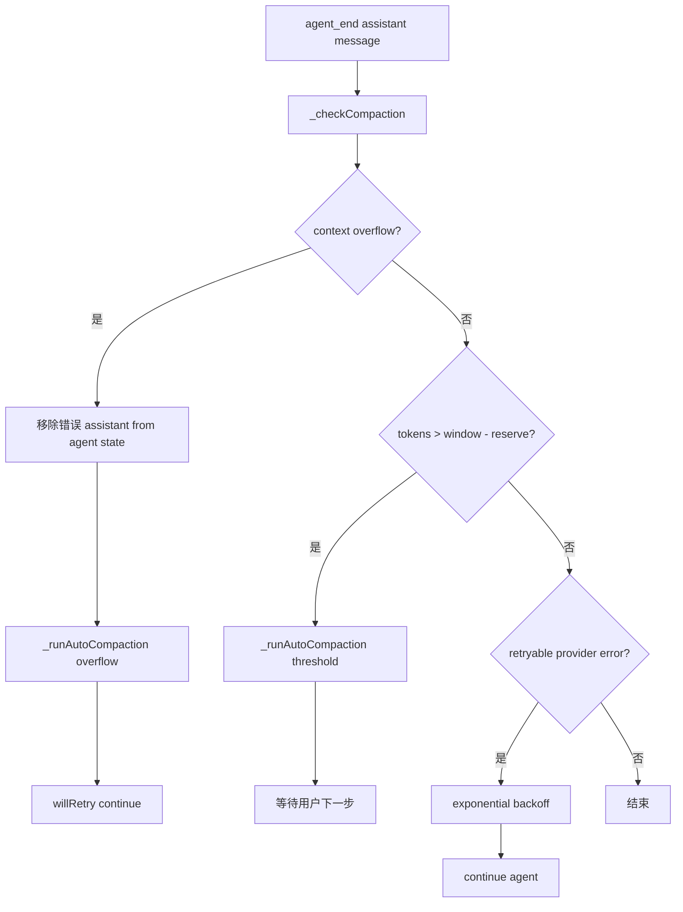

# 12. 压缩、分支摘要、重试与 Overflow 恢复

## 12.1 问题场景

长任务必然撞上上下文窗口、provider 抖动和分支导航成本。Pi 的 compaction 不是“删掉旧消息”，而是生成 summary entry，保留最近上下文，并把未来 LLM context 改写为“summary + recent tail”。Overflow 时还要删除失败 assistant message 的上下文影响，压缩后自动重试；普通阈值压缩则不自动继续。复刻品如果把 overflow 当普通 500 retry，就会无限失败。

## 12.2 用户如何使用

用户看到这些行为：

```text
/compact
自动 compaction threshold
context overflow 后 compact-and-retry
provider 429/500 自动 retry
```

用户关心的是任务不中断、历史可审计、压缩后模型仍知道关键上下文。复刻品要把 compaction、retry、overflow 三者分清。

## 12.3 源码定位

| 责任 | 当前实现 |
|---|---|
| compaction result | [compaction.ts#L102](packages/coding-agent/src/core/compaction/compaction.ts#L102) |
| compaction settings | [compaction.ts#L115](packages/coding-agent/src/core/compaction/compaction.ts#L115) |
| default compaction settings | [compaction.ts#L121](packages/coding-agent/src/core/compaction/compaction.ts#L121) |
| shouldCompact | [compaction.ts#L219](packages/coding-agent/src/core/compaction/compaction.ts#L219) |
| token estimate | [compaction.ts#L232](packages/coding-agent/src/core/compaction/compaction.ts#L232) |
| overflow detection | [overflow.ts#L122](packages/ai/src/utils/overflow.ts#L122) |
| check compaction | [agent-session.ts#L1768](packages/coding-agent/src/core/agent-session.ts#L1768) |
| auto compaction | [agent-session.ts#L1851](packages/coding-agent/src/core/agent-session.ts#L1851) |
| persist compaction | [agent-session.ts#L1972](packages/coding-agent/src/core/agent-session.ts#L1972) |
| retry classifier | [agent-session.ts#L2429](packages/coding-agent/src/core/agent-session.ts#L2429) |
| retry backoff | [agent-session.ts#L2447](packages/coding-agent/src/core/agent-session.ts#L2447) |

## 12.4 生命周期图



## 12.5 关键代码片段

源码位置：[compaction.ts#L102](packages/coding-agent/src/core/compaction/compaction.ts#L102)。片段之后继续看触发阈值判断：[compaction.ts#L219](packages/coding-agent/src/core/compaction/compaction.ts#L219)。

```ts
export interface CompactionResult<T = unknown> {
  summary: string;
  firstKeptEntryId: string;
  tokensBefore: number;
  details?: T;
}

export const DEFAULT_COMPACTION_SETTINGS: CompactionSettings = {
  enabled: true,
  reserveTokens: 16384,
  keepRecentTokens: 20000,
};
```

解释：输入是待压缩路径和设置；输出是 summary、保留起点和压缩前 token 数。`firstKeptEntryId` 是上下文重建的锚点。复刻时不要只保存 summary；没有保留起点就无法正确拼接 recent tail。

源码位置：[agent-session.ts#L1768](packages/coding-agent/src/core/agent-session.ts#L1768)。片段之后继续看自动压缩如何保存 entry 并重建 agent state：[agent-session.ts#L1972](packages/coding-agent/src/core/agent-session.ts#L1972)。

```ts
if (sameModel && isContextOverflow(assistantMessage, contextWindow)) {
  if (this._overflowRecoveryAttempted) {
    this._emit({ type: "compaction_end", reason: "overflow", willRetry: false });
    return false;
  }

  this._overflowRecoveryAttempted = true;
  const messages = this.agent.state.messages;
  if (messages.length > 0 && messages[messages.length - 1].role === "assistant") {
    this.agent.state.messages = messages.slice(0, -1);
  }
  return await this._runAutoCompaction("overflow", true);
}
```

解释：输入是失败的 assistant message；输出是一次压缩并标记是否 retry。错误 message 保留在 session 历史中，但从 agent state 移除，避免 retry 时再次把 overflow 错误送给模型。复刻时这是 overflow 恢复和普通 retry 的关键差异。

## 12.6 机制拆解

模型能看到的是 compaction summary 和 recent tail，不再看到全部旧历史。runtime 私下保留完整 JSONL、压缩 entry、tokensBefore、firstKeptEntryId、extension details、retry attempt 和 abort controller。用户手动 `/compact` 触发 manual compaction；agent_end 触发 threshold/overflow 检查；provider transient error 触发 retry。

错误传播分三类：overflow 走 compact-and-retry；retryable server/network error 走指数退避；不可恢复错误保留在 session 并结束本轮。三类不能混用。

## 12.7 设计不变量

- 不变量：compaction 不删除历史。原因：审计和导出需要完整事实。违反后果：无法解释旧工具结果。复刻建议：append compaction entry。
- 不变量：overflow 最多自动恢复一次。原因：重复 overflow 表示 summary 或模型选择仍不够。违反后果：无限 compact/retry。复刻建议：session 内设置 `_overflowRecoveryAttempted`。
- 不变量：threshold compaction 不自动 retry。原因：没有失败请求需要重放。违反后果：用户未授权的新请求继续执行。复刻建议：`willRetry` 只在 overflow 为 true。
- 不变量：retry 不处理 context overflow。原因：窗口错误不会因等待消失。违反后果：指数退避浪费时间和费用。复刻建议：retry classifier 先排除 overflow。

## 12.8 失败模式与最小复刻任务

常见失败模式：

- 压缩后没有重建 agent state，下一轮仍带旧历史。
- overflow 错误 assistant 进入 retry context，模型被错误内容污染。
- provider 429 被误判为 overflow，触发无意义压缩。

最小可用版：实现 `shouldCompact()`、manual compaction entry、`buildContext()` 中 summary 替换。

接近 Pi 的增强版：加入 threshold auto-compaction、overflow compact-and-retry、retry classifier、extension before_compact。

生产级暂缓项：结构化 compaction details、branch summary、provider-specific overflow matrix、UI progress。

## 12.9 验收清单

- 能解释 compaction 是未来 context 的替身，不是删除历史。
- 能实现 `summary + recent tail` 的上下文重建。
- 能区分 overflow recovery 和 ordinary retry。
- 能保证 overflow 自动恢复最多一次。
- 能说明 `firstKeptEntryId` 的作用。

## 12.10 本章实现关卡

本章给 mini Pi 添加教学级 compaction：不调用真实总结模型，先用 faux summarizer 生成 summary entry。

新增文件：

- `src/session/compaction.ts`：按 token 估算决定是否压缩。
- `src/session/summary.ts`：生成 summary 和 `firstKeptEntryId`。
- `src/agent/retry.ts`：区分 overflow、429/500、普通错误。

最小 compaction entry：

```json
{"type":"compaction","id":"c1","parentId":"e9","summary":"User asked to inspect package metadata.","firstKeptEntryId":"e7","tokensBefore":41000}
```

运行观察：

```bash
npm run mini -- --session tmp/long.jsonl --compact
```

期望 JSONL 只追加 compaction entry，不删除历史行。失败样例是压缩时删除旧 JSONL，导致审计和 fork 无法恢复。下一章会把 extension 作为可选增强边界。
