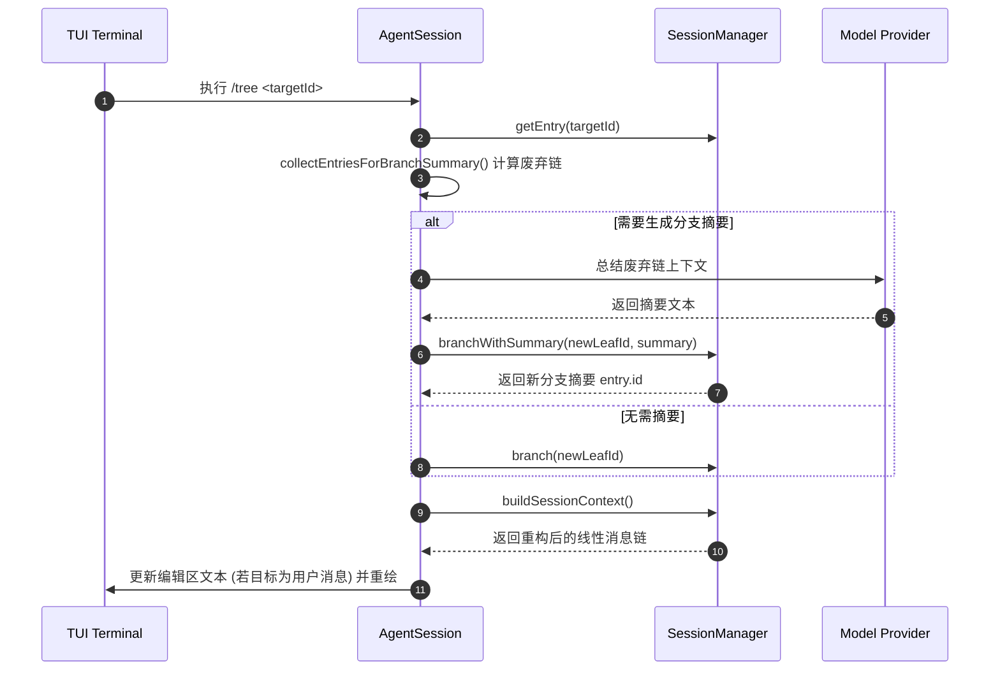

# 12. 恢复、分支与会话树

## 12.1 本章解决的问题

在实际开发中，Agent 任务很少是完全线性的。工程师可能需要继续昨天的会话，从早期的某个决策点尝试不同的分支方案，或者将当前的会话路径复制为独立的 Session。如果缺乏系统化的会话管理，开发人员将不得不手动复制终端或繁琐地维护多个 Session 文件。

Pi Agent 的分支机制（通过 `/tree`、`/fork`、`/clone` 和 `/resume` 等命令）解决了非线性会话的维护问题。本章旨在指导工程师深入理解 Pi 如何利用 JSONL 树结构维护事件历史，如何在内存和磁盘中安全地切换和复制分支，并说明分支重定向时的上下文处理逻辑。

## 12.2 最小可运行路径

通过以下实验，可直观体验非线性分支的管理：

1. **创建基础会话**：启动 Pi 并提出一个问题，例如“请提供两种实现快速排序的算法设计”。
2. **切回早期分支**：在 Pi 终端中输入 `/tree` 打开会话树形视图。选中早期的用户提示词节点，编辑为新的指令，例如“只使用迭代法实现快速排序”，并提交。此时，同一个 JSONL 文件中会生成一个新的子节点分支。
3. **执行 Fork 操作**：输入 `/fork`，选择早期用户问题节点。Pi 会将其之前的历史提取并保存为全新的 Session JSONL 文件，新会话自动以旧会话为父节点。
4. **会话克隆（Clone）**：输入 `/clone`（或通过 `/export` 生成副本），将当前活动分支的完整链条克隆到指定的新 Session 文件中。

命令行入口与 session 选项映射关系如下：

| 选项/命令 | 对应操作 | 写入与读取机制 |
| --- | --- | --- |
| `pi -c` | 继续最近会话 | 扫描目录，加载修改时间最新的 JSONL 恢复当前 leafId |
| `pi -r` | 会话选择器 | 载入所有历史会话列表及元数据供用户交互选择 |
| `/tree` | 树导航 | 在同个会话 JSONL 中改变 leaf 指针，可选生成 `BranchSummaryEntry` |
| `/fork` | 历史分叉 | 提取当前节点及祖先链，写入新的 JSONL 文件并自动挂载 parentSession |

## 12.3 核心机制与数据流

#### 12.3.1 会话加载与继续（Resume）

继续最近会话的入口为 [SessionManager.continueRecent](/source-code/packages/coding-agent/src/core/session-manager.ts#L1338)。它会扫描指定的工作目录（通常由 `~/.pi/agent/sessions/--<path>--/` 约定），读取修改时间最新的 `.jsonl` 文件。如果没有找到历史会话，它将自动调用 [SessionManager.newSession](/source-code/packages/coding-agent/src/core/session-manager.ts#L772) 创建一个带有全新 UUID 的会话。

#### 12.3.2 分支分叉（Fork）与克隆（Clone）

Fork 的静态核心方法位于 [SessionManager.forkFrom](/source-code/packages/coding-agent/src/core/session-manager.ts#L1359)。它接受源会话文件路径，创建新的 Session 实例，将旧会话文件路径作为 `parentSession` 写入新会话的 `SessionHeader`。

当用户克隆当前活动分支时，底层的 [SessionManager.createBranchedSession](/source-code/packages/coding-agent/src/core/session-manager.ts#L1212) 将过滤掉无关的分支，仅沿着从 `leafId` 回溯至根节点（Root）的路径，将该链条上的所有 entries 写入新的 JSONL 文件，从而保持会话上下文的精简与纯净。

#### 12.3.3 树节点切换与摘要（Tree Navigation）

在同一个会话文件内切换节点的动作由 [AgentSession.navigateTree](/source-code/packages/coding-agent/src/core/agent-session.ts#L2657) 实现。其具体执行流程如下：

1. **计算共同祖先**：通过 [collectEntriesForBranchSummary](/source-code/packages/coding-agent/src/core/compaction/branch-summarization.ts#L98) 算法找到当前活动叶子节点 `oldLeafId` 与目标节点 `targetId` 的共同祖先，从而确定被抛弃的分支段（Branch Segment）。
2. **发射拦截事件**：发射 `session_before_tree` 事件，允许扩展程序拦截或提供自定义的分支摘要。
3. **生成分支摘要（Branch Summary）**：如果开启了分支摘要且被抛弃分支不为空，系统会调用语言模型生成这段历史的摘要，并由 [SessionManager.branchWithSummary](/source-code/packages/coding-agent/src/core/session-manager.ts#L1188) 写入一条 `branch_summary` 类型的记录。
4. **重定位叶子节点**：
   - 若目标节点是用户消息（`user`），则将 `leafId` 移动到该用户消息的 `parentId`，并把该用户消息的文本填入 TUI 编辑器中，以便用户修改后重新提交。
   - 若目标是系统或助手消息，则直接将 `leafId` 移动至该节点。
5. **重构上下文**：调用 `buildSessionContext` 重新提取消息链，并重新装填 `agent.state.messages` 以供下一次推理使用。

#### 12.3.4 数据流与生命周期

#### 12.3.5 源码责任表

| 环节 | 系统责任 | 源码证据 | 关键确认点 |
|---|---|---|---|
| 自动恢复最近会话 | 匹配当前项目 CWD 对应的最新 JSONL 会话记录并加载 | [session-manager.ts#L1338](/source-code/packages/coding-agent/src/core/session-manager.ts#L1338) | 检查是否正确处理了文件缺失及 CWD 校验 |
| 分叉新会话文件 | 读取源会话条目，重写 SessionHeader 并在目标目录落地新文件 | [session-manager.ts#L1359](/source-code/packages/coding-agent/src/core/session-manager.ts#L1359) | 确认 parentSession 指针是否正确写入头部 |
| 分支线性截取 | 提取指定 leaf 到 root 的完整链，剔除其他无关分叉并写入新文件 | [session-manager.ts#L1212](/source-code/packages/coding-agent/src/core/session-manager.ts#L1212) | 确认是否正确过滤和重构了 LabelEntry |
| 树导航调度 | 控制节点跳转流程、触发钩子、装填编辑器并重新计算状态上下文 | [agent-session.ts#L2657](/source-code/packages/coding-agent/src/core/agent-session.ts#L2657) | 确认在发生错误或取消时，状态能否安全回滚 |
| 运行态会话替换 | 处理会话切换、新会话创建、Fork 时底层的生命周期解绑与重新绑定 | [agent-session-runtime.ts#L187](/source-code/packages/coding-agent/src/core/agent-session-runtime.ts#L187) | 确认切换时旧 session 是否调用 dispose 释放资源 |

## 12.4 为什么这样设计

#### 12.4.1 基于节点类型的差异化跳转响应

当用户导航回某条用户消息（`user`）时，Pi 并不把叶子节点直接设为该消息本身，而是将其设为该消息的 `parentId`（即父节点），同时把该消息的文本填充到编辑区。
这种设计允许用户直接**编辑并修正**之前的输入，然后重新发送。如果直接把 `leafId` 设为该 `user` 节点，用户将无法修改它，且再次发送会导致生成多余的同层分支。
相反，当导航到助手消息（`assistant`）或工具执行结果时，系统直接将叶子设为该节点，因为这些是系统生成的确定性状态，继续会话时，应当在这些状态之后 append 新的用户输入。

#### 12.4.2 局部废弃段摘要

跳转分支时，若要将废弃分支的成果保留（例如前一条分支已经摸清了某个 bug 的原因，但代码写乱了，需要换一种写法重新开始），Pi 不会将整棵树强行压缩进上下文。相反，它通过 `collectEntriesForBranchSummary` 提取出两条路径分叉点以后的废弃段，对其进行总结并转化为一条 `branch_summary` 插入目标位置。这确保了跨分支的知识传递，同时避免了无关历史污染 LLM 的上下文窗口。

## 12.5 常见误解与排查

#### 12.5.1 误区：认为 `/tree` 只是历史记录浏览器，不会影响当前状态

`/tree` 的导航操作是**具有写副作用**的。一旦在树视图中选择并确认跳转到某个历史节点，当前会话的 `leafId` 会立即变更。如果用户此时输入新文本并发送，新产生的所有消息都会附加到跳转后的节点之下，从而隐式地创建一条新分支。如果误跳转了节点，必须重新通过 `/tree` 导航回原本的叶子节点。

#### 12.5.2 误区：`parentSession` 记录会导致上下文无限累加

当 Fork 一个新会话时，`SessionHeader` 会记录 `parentSession`，但这纯粹用于溯源和审计。读取新会话时，Pi 绝对不会去并行加载 `parentSession` 文件中的消息，更不会把它们累加到当前模型的 Context 窗口中。新会话是一个完全干净独立的开始，仅以 Fork 时的快照为基础。

#### 12.5.3 故障排查：跳转回空 CWD 会话导致运行时报错

若通过 `/import` 载入了一个在其他机器或不同工作目录下生成的 JSONL 会话，如果该会话头部的 `cwd` 目录在当前机器上不存在，运行时会抛出 `MissingSessionCwdError`。此时 [AgentSessionRuntime.importFromJsonl](/source-code/packages/coding-agent/src/core/agent-session-runtime.ts#L340) 会捕获此错误并要求 TUI 引导用户重新指定可用的工作目录，之后才能安全完成会话重建。

## 12.6 本章训练

#### 12.6.1 基础练习：分支生命周期观测

启动一个交互式 Pi 会话，先后输入三次问题，通过 `/tree` 切换回第二次输入节点并重新输入其他内容。打开对应的 `.jsonl` 文件，找到最后写入的几条数据，观察它们的 `id` 和 `parentId`，画出此时底层的树状拓扑图。

#### 12.6.2 原理练习：追踪共同祖先算法

阅读 [collectEntriesForBranchSummary](/source-code/packages/coding-agent/src/core/compaction/branch-summarization.ts#L98) 的源码。手动模拟当 `oldLeafId` 位于 `A -> B -> C -> D` 分支，而目标 `targetId` 位于 `A -> B -> E -> F` 分支时，该算法返回的共同祖先节点是谁，哪些 entries 会被归入废弃汇总列表（`entriesToSummarize`）。

#### 12.6.3 扩展练习：分支前钩子扩展

编写一个简易的 Pi 扩展插件，注册监听 `session_before_tree` 事件。当用户试图跳转回一个包含错误日志的分支时，在控制台弹出警告，询问用户是否确认废弃当前的进度；若废弃，自动提取错误日志生成一个自定义的 `label` 附加到新节点上。
