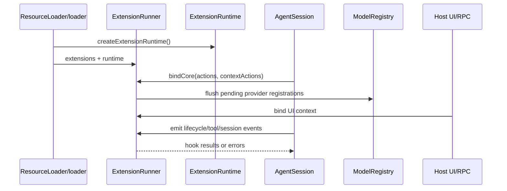

# 13. Extension Runtime：加载、注册、hook、命令、工具、UI bridge

## 13.1 问题场景

Pi 的扩展不是 skill，也不是 prompt template。Skill 只改变模型行为；prompt template 只复用用户输入；extension 是运行在本地的代码，可以注册工具、命令、provider、事件 hook、UI bridge 和资源路径。这个能力必须通过 runtime 边界进入系统，不能直接侵入 Agent loop。否则第三方扩展会持有全局状态、绕过 session 生命周期，或在 reload/fork 后写入 stale session。

## 13.2 用户如何使用

用户通过本地文件、package 或 CLI flag 启用扩展：

```bash
pi --extension ./my-extension.ts
pi package install team-workflow
/reload
```

扩展可以添加命令、工具、provider 或 UI，但用户仍然期待它遵守当前 cwd、当前 session、当前 host 能力和中断信号。

## 13.3 源码定位

| 责任 | 当前实现 |
|---|---|
| Extension UI context | [types.ts#L88](packages/coding-agent/src/core/extensions/types.ts#L88) |
| ToolDefinition | [types.ts#L426](packages/coding-agent/src/core/extensions/types.ts#L426) |
| ExtensionRunner 类 | [runner.ts#L224](packages/coding-agent/src/core/extensions/runner.ts#L224) |
| bindCore actions | [runner.ts#L266](packages/coding-agent/src/core/extensions/runner.ts#L266) |
| provider registration flush | [runner.ts#L301](packages/coding-agent/src/core/extensions/runner.ts#L301) |
| loadExtensions | [loader.ts#L413](packages/coding-agent/src/core/extensions/loader.ts#L413) |
| package resolved resources | [package-manager.ts#L54](packages/coding-agent/src/core/package-manager.ts#L54) |
| PackageManager API | [package-manager.ts#L92](packages/coding-agent/src/core/package-manager.ts#L92) |
| runtime session replacement | [agent-session-runtime.ts#L161](packages/coding-agent/src/core/agent-session-runtime.ts#L161) |

## 13.4 生命周期图



## 13.5 关键代码片段

源码位置：[loader.ts#L413](packages/coding-agent/src/core/extensions/loader.ts#L413)。片段之后继续看 runner 如何绑定核心能力：[runner.ts#L266](packages/coding-agent/src/core/extensions/runner.ts#L266)。

```ts
export async function loadExtensions(paths: string[], cwd: string, eventBus?: EventBus): Promise<LoadExtensionsResult> {
  const extensions: Extension[] = [];
  const errors: Array<{ path: string; error: string }> = [];
  const resolvedCwd = resolvePath(cwd);
  const resolvedEventBus = eventBus ?? createEventBus();
  const runtime = createExtensionRuntime();

  for (const extPath of paths) {
    const { extension, error } = await loadExtension(extPath, resolvedCwd, resolvedEventBus, runtime);
  }
}
```

解释：输入是扩展路径和 cwd；输出是 extension 实例、错误和共享 runtime。加载阶段可以产生 pending provider registration，但真正绑定 session 能力要等 `bindCore()`。复刻时要把“加载扩展代码”和“给扩展 session 权限”分开。

源码位置：[runner.ts#L266](packages/coding-agent/src/core/extensions/runner.ts#L266)。片段之后继续看 pending provider registration 如何刷新进 ModelRegistry：[runner.ts#L301](packages/coding-agent/src/core/extensions/runner.ts#L301)。

```ts
bindCore(actions: ExtensionActions, contextActions: ExtensionContextActions, providerActions?: {
  registerProvider?: (name: string, config: ProviderConfig) => void;
  unregisterProvider?: (name: string) => void;
}): void {
  this.runtime.sendMessage = actions.sendMessage;
  this.runtime.sendUserMessage = actions.sendUserMessage;
  this.runtime.getActiveTools = actions.getActiveTools;
  this.runtime.setActiveTools = actions.setActiveTools;
  this.runtime.setModel = actions.setModel;
  this.getModel = contextActions.getModel;
  this.abortFn = contextActions.abort;
}
```

解释：输入是 session 提供的动作和上下文 getter；输出是被填充的 extension runtime。扩展拿到的是受控能力，不是 `AgentSession` 裸对象。复刻时要提供窄接口，避免扩展直接改内部状态。

## 13.6 机制拆解

模型能看到 extension 注册的工具 schema、tool snippets 和可能追加的 prompt 内容。runtime 私下保留 extension 实例、hook 列表、command registry、UI bridge、provider registration、stale context 状态和错误监听器。用户触发命令或生命周期事件时，执行权进入 runner；runner 聚合 extension 结果，再返回给 `AgentSession` 或 host。

extension UI 必须适配 host：interactive 可以弹出终端组件，RPC 可以发 UI request，print 可以提供 no-op 或默认值。扩展不能假设所有 host 都有同样 UI。

## 13.7 设计不变量

- 不变量：extension 通过 runner/runtime 进入系统。原因：需要生命周期、错误隔离和 stale 防护。违反后果：扩展直接污染 Agent loop。复刻建议：暴露 `ExtensionRuntime` 而不是内部 session。
- 不变量：provider registration 进入 ModelRegistry。原因：模型选择和 auth 统一处理。违反后果：自定义 provider 无法被 `/login` 或 `--model` 看见。复刻建议：runner flush pending registrations。
- 不变量：UI bridge 按 host 能力实现。原因：print/RPC/TUI 能力不同。违反后果：headless 模式卡死等待弹窗。复刻建议：每个 host 传入自己的 UI context。
- 不变量：session replacement 后旧 ctx 失效。原因：cwd/services/session 都可能变化。违反后果：旧扩展写入新旧混合状态。复刻建议：shutdown 时 invalidate captured context。

## 13.8 失败模式与最小复刻任务

常见失败模式：

- 扩展加载时直接调用 session 方法，reload 后保留旧引用。
- extension provider 注册了 stream，但没有进入 model registry。
- print 模式中扩展请求 UI，进程永远等待。

最小可用版：实现 extension loader、runner、`on(event, handler)`、自定义工具注册。

接近 Pi 的增强版：加入 command、provider、session hooks、UI no-op/RPC/interactive adapters、package resources。

生产级暂缓项：stale ctx enforcement、extension error diagnostics、resource collision priority、theme/widget integration。

## 13.9 验收清单

- 能区分 skill、prompt template、extension。
- 能实现扩展注册一个工具并让模型看到 schema。
- 能让扩展通过 runner 监听 session 事件。
- 能解释不同 host 下 UI bridge 的差异。
- 能处理 reload/session replacement 后旧扩展上下文失效。

## 13.10 本章实现关卡

本章给 mini Pi 增加最小 extension runner，但默认不启用第三方代码执行。

新增文件：

- `src/extensions/types.ts`：定义 extension、hook、command、custom tool。
- `src/extensions/runner.ts`：注册 hook 并在 session 生命周期触发。
- `src/extensions/noop-ui.ts`：headless host 下的 UI adapter。

最小 extension：

```ts
export interface MiniExtension {
  name: string;
  tools?: Tool[];
  onEvent?(event: AgentEvent): Promise<void>;
  beforeToolCall?(call: ToolCall): Promise<"allow" | "block">;
}
```

运行观察：

```bash
npm run mini -- --extension examples/log-events.js -p "hello"
```

期望扩展只能通过 runner 收到 event，不能直接拿到内部 session store。失败样例是扩展保存旧 session 引用，resume 后继续写旧文件。下一章会把 host adapter 抽成可替换外壳。
