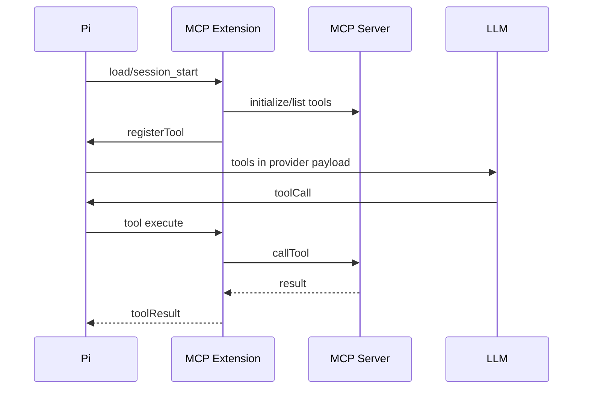

# 第13章 MCP 协议：不在核心，但可以作为扩展接入

## 13.1 先校准事实

当前 pi 核心不把 MCP 作为内置协议层。usage 文档明确说明 pi 不内置 MCP，但可以通过 extensions/packages 或外部工具实现相关工作流。因此本章讲的是“如何把 MCP 作为 pi 扩展接入”，不是解释一个不存在的核心模块。

这个边界很重要。复刻 agent harness 时，不要把 MCP 当成 agent loop 的前提。agent loop 只需要工具接口；MCP 是工具、资源、prompt 的来源之一。

## 13.2 MCP 在 agent 中解决的问题

MCP 的价值是把外部系统能力协议化：tools、resources、prompts、server lifecycle。对 pi 来说，最自然的接入点是 extension：

1. extension 在启动或 `session_start` 时启动 MCP client。
2. MCP client 连接 server 并发现 tools/resources/prompts。
3. extension 用 `pi.registerTool()` 把 MCP tools 注册成 pi tools。
4. extension 用 `resources_discover` 暴露 skill/prompt/resource 路径。
5. 模型通过普通 tool call 使用这些能力。
6. tool result 仍走 pi 的 tool events、session、UI 和 RPC。

## 13.3 关键边界

MCP 工具不能绕开 pi 的工具管道。即使实际执行发生在外部 server，也应该经过：

- tool schema。
- before tool hook。
- tool execution events。
- output truncation。
- after tool hook。
- tool result message。
- session persistence。

如果 MCP extension 直接把外部结果塞进 prompt，TUI/RPC/eval/security 都无法观察真实副作用。

## 13.4 用户视角

从用户视角，MCP 应表现为一种 package/extension 能力，而不是核心启动参数。用户安装某个 MCP package 后，相关工具、命令或资源出现在 pi 中。用户仍可用 `--tools` 控制 active tools，用 `/reload` 重新加载资源，用 session 导出看到过程。

## 13.5 复刻原则

MVP 不需要 MCP。先实现稳定工具接口。生产级如果接入 MCP，应做成 extension/package：连接管理、server diagnostics、工具注册、资源发现、错误归一化、输出预算、安全审批、session 可观察。
