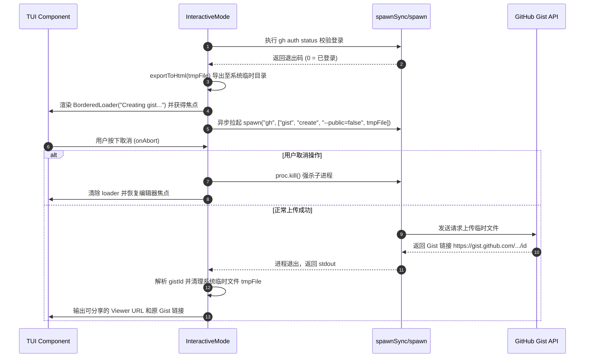

# 14. 导出与共享会话

## 14.1 本章解决的问题

在团队协作、系统审计或问题复盘中，仅仅依靠终端窗口中的文本输出是远远不够的。工程师经常需要将与 Agent 的对话路径、历史修改细节、以及工具的运行轨迹以高度可读的形式进行归档或共享；而在进行 CI/CD 集成或构建自定义 TUI/Web UI 面板时，也需要获取结构化的事件流输出。

Pi Agent 的导出与共享机制（包括 `/export` 生成静态 HTML、`/share` 一键生成 GitHub Gist 链接，以及面向机器的 JSON 模式事件流输出）解决了上述问题。本章旨在指导工程师深入掌握静态 HTML 的多端渲染细节、自定义工具模板的前后端分离渲染逻辑、一键 Gist 分享时的临时异步安全管道，以及 JSON mode 的事件流转换过程。

## 14.2 最小可运行路径

#### 14.2.1 本地 HTML 导出

在一个活跃的 Pi 会话中，输入命令：
```text
/export ./session-report.html
```
Pi 会将当前的会话路径（包括对话、工具输出、分支摘要）导出为一个单一的 HTML 文件。打开导出的网页，你会看到完整的 Markdown 渲染效果、终端样式的工具调用框，以及支持按节点展开/收起的多轴会话树呈现。

#### 14.2.2 一键云端分享

在已安装 GitHub CLI (`gh`) 并已完成登录授权的终端中，输入：
```text
/share
```
Pi 将执行如下交互流程：
1. 本地临时渲染生成 HTML 文件。
2. 异步拉起 `gh gist create` 将文件发布为私有的 Secret Gist。
3. 从输出的 stdout 中提取 Gist ID，拼接为可分享的云端预览链接并打印给用户（例如 `https://pi.dev/session/<gistId>`）。

#### 14.2.3 机器集成 JSON 事件流

若要使用其他程序来审计 Pi 的运行过程，可带上 `--mode json` 启动：
```bash
pi --mode json -p "List files" 2>/dev/null
```
执行后，每一行都会以独立 JSON 对象的形式向 stdout 输出当前的运行事件，如 `{"type":"agent_start"}`、`{"type":"tool_execution_start"}` 等。

## 14.3 核心机制与架构

#### 14.3.1 HTML 渲染管线与模板合成

静态 HTML 导出的核心入口为 [exportSessionToHtml](/source-code/packages/coding-agent/src/core/export-html/index.ts#L236)，而底层针对文件导出的 CLI 封装则为 [exportFromFile](/source-code/packages/coding-agent/src/core/export-html/index.ts#L288)。它们的执行流程包括以下关键步骤：

1. **载入静态资源**：从全局配置目录读取基础 of `template.html`、`template.css`、`template.js`，以及 vendored 版本的 `marked.min.js` 与 `highlight.min.js`。
2. **提取主题色彩**：通过 `getResolvedThemeColors` 获取当前的 TUI 终端色彩配置，为 HTML 文件中 CSS 的 `--exportPageBg`、`--exportCardBg` 等变量动态注入一致的颜色方案，达到“所见即所得”的配色统一。
3. **数据打爆与编码**：将当前的会话条目（`entries`）、系统提示词（`systemPrompt`）与工具集合打包为 JSON 字符串，经 Base64 编码后作为全局变量 `SESSION_DATA` 注入到 HTML 的 `<script>` 标签内，避免在 HTML 字符流中因为引号与转义符问题导致结构被意外破坏。
4. **前端自水合运行**：用户在浏览器中打开 HTML 时，当前页面的 `template.js` 会在客户端解析 `SESSION_DATA`，利用前端版的 marked 及 highlight 自主渲染出高亮的 Markdown 和优雅的树形折叠组件。

#### 14.3.2 自定义工具的 TUI-to-HTML 渲染桥接

为了实现扩展性，Pi 引入了 [ToolHtmlRenderer](/source-code/packages/coding-agent/src/core/export-html/index.ts#L15) 渲染器接口。
对于普通的内置工具（如 `bash`、`read`、`write`），其结构非常标准，由前端 `template.js` 内置的渲染模板在浏览器端直接生成 HTML DOM；
对于由扩展自定义开发的工具，由于其包含特制的 UI 组件或经过转义的 ANSI 终端彩字，Pi 在导出时会调用 [preRenderCustomTools](/source-code/packages/coding-agent/src/core/export-html/index.ts#L183) 阶段。它在后端通过 `toolRenderer.renderCall` 和 `toolRenderer.renderResult` 先将这些特殊工具块预先转换好（把 ANSI 转义码转换成带颜色标签的 HTML 片段），然后存入 `renderedTools` 表中一同编码输出。当浏览器端发现该 `toolCallId` 存在预渲染内容时，直接展示该 HTML 块，实现了完美的跨环境渲染映射。

#### 14.3.3 /share 分享底层流程

在交互 TUI 中执行的 `/share` 控制逻辑位于 [interactive-mode.ts#L5042](/source-code/packages/coding-agent/src/modes/interactive/interactive-mode.ts#L5042)。其内部机制如下：



#### 14.3.4 JSON mode 事件封装

在 CLI 模式下如果指定了 `--mode json`，事件的发射流由 [AgentSessionEvent](/source-code/packages/coding-agent/src/core/agent-session.ts#L123) 提供定义支持。
它是对低层 Agent 抽象事件（`AgentEvent`）的包装和重构，丢弃了容易引起机器解析混乱的流式块片段，将 `compaction` 改变、自动重试状态以及会话信息改变包装成标准的一行一行的 JSON string 输出到 stdout，确保任何消费它的进程都能像读取结构化数据库变化一样监控 Agent。

#### 14.3.5 源码责任表

| 环节 | 系统责任 | 源码证据 | 关键确认点 |
|---|---|---|---|
| 核心模板拼装 | 读取文件模版，将 Base64 编码 of entries 以及 CSS 变量组装并写入磁盘 | [index.ts#L236](/source-code/packages/coding-agent/src/core/export-html/index.ts#L236) | 检查是否能在会话为空或未落地时抛出合理的异常 |
| 任意文件转 HTML | 独立在无运行时状态下直接解析 JSONL 并利用 SM 进行渲染 | [index.ts#L288](/source-code/packages/coding-agent/src/core/export-html/index.ts#L288) | 检查目标路径在不存在时是否有友好提示 |
| 扩展工具预渲染 | 针对非模板渲染工具，在后端将复杂的 ANSI 块转换为静态可折叠的 HTML 字符串 | [index.ts#L183](/source-code/packages/coding-agent/src/core/export-html/index.ts#L183) | 检查没有提供 toolRenderer 时是否会自动跳过 |
| 分享任务调度 | 控制 Loader 加载指示器，拉起异步 gh 进程并拦截取消信号进行子进程销毁 | [interactive-mode.ts#L5042](/source-code/packages/coding-agent/src/modes/interactive/interactive-mode.ts#L5042) | 确认在发生错误时是否能安全地执行 tmpFile 删除清理 |
| 运行时事件广播 | 定义跨 turn、跨重试及压缩边界的规范化 JSON 流式事件协议 | [agent-session.ts#L123](/source-code/packages/coding-agent/src/core/agent-session.ts#L123) | 确认 `agent_end` 是否携带了最终的完整消息链 |
| 外部导出入口 | 提供高阶的 AgentSession 封装，负责拼装 toolRenderer 后下传给导出管线 | [agent-session.ts#L2973](/source-code/packages/coding-agent/src/core/agent-session.ts#L2973) | 确认导出时的色彩主题是否符合 settings.json 的配置 |

## 14.4 为什么这样设计

#### 14.4.1 基于 Base64-JSON 的数据打爆防护

如果采用传统的服务器端 HTML 渲染方案，需要在拼装 HTML 时对消息文本中的 HTML 标签（如 `<div>`）或特殊符号（如 `&`、`<`）进行严苛的转义处理。由于 Agent 对话中经常包含大片的代码片段、Markdown 标记和 shell 代码，任何转义的纰漏都会导致网页排版彻底崩溃，甚至造成 XSS 安全漏洞。
Pi 选择的**数据打爆防护设计**将所有 Entries 作为一个大的 JSON 数组进行序列化，并在此之上执行一层 Base64 编码。Base64 字符集只包含安全的 ASCII 字符（`a-z`, `A-Z`, `0-9`, `+`, `/`, `=`），可以安然无恙地作为纯文本常量置入 HTML 代码中，然后交由客户端脚本在本地沙箱里反解并水合（Hydration）。这在根本上杜绝了拼装时转义出错的可能。

#### 14.4.2 拦截式强杀的 Gh 生命周期绑定

在交互 TUI 界面中，Gist 的网络上传可能因为网络波动非常缓慢。此时，如果用户按下 Esc 或点击取消，如果不加以控制，已经派生（spawn）出去的 `gh` 命令行子进程将会孤立运行在后台（变成僵尸进程），继续消耗网络和系统资源，最终可能会有出乎意料的上传结果污染用户的 Gist 列表。
Pi 的 `/share` 设计没有使用 `execSync` 这种阻塞式的方法，而是利用 `spawn` 获得了子进程句柄 `proc`。当 `BorderedLoader` 的 `onAbort` 被触发时，显式执行：
```typescript
proc?.kill();
```
这立刻中断了正在进行中的 HTTP 请求，保障了用户在交互网络波动时的决定权和主控安全性。

## 14.5 常见误解与排查

#### 14.5.1 误区：认为 `/share` 包含了高级的权限控制访问控制

`/share` 调用 `gh gist create --public=false` 生成的是 **Secret Gist**（不公开 Gist），它的性质是“虽然不在公开列表中索引展示，但是只要拿到该 URL，任何人不需要任何登录权限即可直接查看”。如果导出的会话包含商业机密、私钥配置、数据库连接串或内部敏感代码，**绝对不要使用 `/share`**。应当仅使用本地 `/export` 生成 HTML，并通过内部加密渠道发给同事。

#### 14.5.2 误区：`/export` 会同时物理导出项目底下的所有资源文件

很多网页导出工具在遇到图片或大文件时会要求伴随生成一个 `_files` 目录。但 Pi 导出的 HTML 是一个完全**自主内聚的单文件（Single File Self-contained）**。它里面包含了所有的样式表、依赖的解析 JS、主题色变量。如果对话中包含了图像，Pi 会将其序列化为 Base64 内嵌。因此，可以直接在各处复制和双击打开该 HTML，不需要额外携带任何关联文件夹。

#### 14.5.3 故障排查：/share 无法正常执行，提示 `gh` 权限问题

若输入 `/share` 抛出错误 `GitHub CLI is not logged in`，应在宿主控制台中退出 Pi 并运行 `gh auth login` 重新认证；若在 Windows 环境下由于权限或 PowerShell 执行策略导致无法找到 `gh`，请确保 GitHub CLI 的 bin 目录在操作系统的全局 `PATH` 环境变量中，然后再重新唤起 TUI 会话。

## 14.6 本章训练

#### 14.6.1 基础练习：会话导出与高亮验证

启动一次会话，让 Pi 用 C++ 写一个带有复杂模板和宏定义的快速排序程序。完成并生成回答后，执行 `/export qsort.html`。双击在 Chrome 中打开网页，按下 F12 查看 `SESSION_DATA` 所在的节点，并观察代码高亮是否正确生效，背景色是否与你在 TUI 中配置的一致。

#### 14.6.2 原理练习：追踪 preRenderCustomTools 拦截细节

阅读 [preRenderCustomTools](/source-code/packages/coding-agent/src/core/export-html/index.ts#L183) 的源码。如果在 session.jsonl 中记录了一条自定义的扩展工具消息，但在调用 `exportSessionToHtml` 时没有向 options 传入 `toolRenderer`，该自定义工具在 HTML 中会呈现为什么格式？

#### 14.6.3 扩展练习：构建 JSON mode 重演播放器

使用 Node.js 编写一个独立的小脚本，启动 `pi --mode json -p "List all ts files"` 并通过管道（stdout）监听其输出。只要发现某一行 JSON 包含 `{"type":"tool_execution_start"}`，就在你的脚本控制台里输出一行绿色的 `[Tool Run Started]: <ToolName>`，并记录其耗时。
