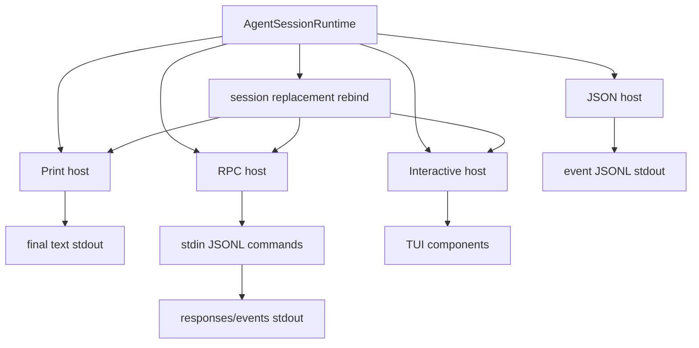

# 14. Host Adapters：print、json、rpc、interactive 共享同一 session

## 14.1 问题场景

Host 是外壳，不是 agent。print 模式、JSON 模式、RPC 模式和 interactive TUI 都应该共享同一个 `AgentSessionRuntime`，只是输入来源、输出协议和 UI 能力不同。如果每个 host 都自己实现 agent loop，工具事件顺序、session persistence、扩展 hook、compaction 和 retry 都会分叉。

## 14.2 用户如何使用

同一个任务可以用不同 host 运行：

```bash
pi -p "summarize this repo"
pi --mode json -p "summarize this repo"
pi --mode rpc
pi
```

text print 输出最终 assistant 文本；json 输出事件流；RPC 接收 JSONL 命令；interactive 渲染 TUI。它们的核心 session 语义必须一致。

真实使用面以 docs 为准：CLI mode 说明见 [usage.md#L144](packages/coding-agent/docs/usage.md#L144)，JSON mode 说明见 [json.md#L1](packages/coding-agent/docs/json.md#L1)，RPC mode 的 command/response/event/framing 说明见 [rpc.md#L19](packages/coding-agent/docs/rpc.md#L19)。

## 14.3 源码定位

| 责任 | 当前实现 |
|---|---|
| print mode | [print-mode.ts#L32](packages/coding-agent/src/modes/print-mode.ts#L32) |
| print mode rebind | [print-mode.ts#L67](packages/coding-agent/src/modes/print-mode.ts#L67) |
| JSON event subscribe | [print-mode.ts#L102](packages/coding-agent/src/modes/print-mode.ts#L102) |
| text final output | [print-mode.ts#L128](packages/coding-agent/src/modes/print-mode.ts#L128) |
| RPC mode | [rpc-mode.ts#L53](packages/coding-agent/src/modes/rpc/rpc-mode.ts#L53) |
| JSONL serializer | [jsonl.ts#L10](packages/coding-agent/src/modes/rpc/jsonl.ts#L10) |
| RPC request/response types | [rpc-types.ts#L19](packages/coding-agent/src/modes/rpc/rpc-types.ts#L19) |
| interactive mode class | [interactive-mode.ts#L237](packages/coding-agent/src/modes/interactive/interactive-mode.ts#L237) |
| stdout guard | [output-guard.ts#L45](packages/coding-agent/src/core/output-guard.ts#L45) |
| runtime rebind | [agent-session-runtime.ts#L178](packages/coding-agent/src/core/agent-session-runtime.ts#L178) |

## 14.4 生命周期图



## 14.5 关键代码片段

源码位置：[print-mode.ts#L67](packages/coding-agent/src/modes/print-mode.ts#L67)。片段之后继续看 JSON 模式如何订阅事件：[print-mode.ts#L102](packages/coding-agent/src/modes/print-mode.ts#L102)。

```ts
runtimeHost.setRebindSession(async () => {
  await rebindSession();
});

const rebindSession = async (): Promise<void> => {
  session = runtimeHost.session;
  await session.bindExtensions({ commandContextActions: { ... } });

  unsubscribe?.();
  unsubscribe = session.subscribe((event) => {
    if (mode === "json") {
      writeRawStdout(`${JSON.stringify(event)}\n`);
    }
  });
};
```

解释：输入是 runtime 当前 session；输出是 host 对当前 session 的订阅。session replacement 后，runtime 调用 rebind，host 不需要重启进程。复刻时每个 host 都要实现 rebind，否则 `/resume`、`/fork` 后事件会丢。

源码位置：[output-guard.ts#L45](packages/coding-agent/src/core/output-guard.ts#L45)。片段之后继续看原始 stdout 写入如何排队：[output-guard.ts#L85](packages/coding-agent/src/core/output-guard.ts#L85)。

```ts
export function takeOverStdout(): void {
  if (stdoutTakeoverState) {
    return;
  }

  const rawStdoutWrite = process.stdout.write.bind(process.stdout);
  const rawStderrWrite = process.stderr.write.bind(process.stderr);
  const originalStdoutWrite = process.stdout.write;

  process.stdout.write = ((chunk, encodingOrCallback, callback): boolean => {
    return rawStderrWrite(String(chunk), callback);
  }) as typeof process.stdout.write;
}
```

解释：机器协议模式中，普通 `console.log` 会被重定向到 stderr，只有 `writeRawStdout()` 写协议 stdout。复刻时这是 JSON/RPC 可被脚本可靠消费的关键。

## 14.6 机制拆解

模型不直接知道 host。它只通过 Agent loop 产出事件和消息。runtime 私下保留 host 的订阅、UI context、stdout guard、signal handlers 和 session replacement rebind。用户输入在不同 host 中来源不同：print 来自 argv/stdin，RPC 来自 JSONL command，interactive 来自 editor；最终都调用 `session.prompt()`、`session.continue()`、`session.abort()` 或 runtime replacement 方法。

错误传播也由 host 决定呈现方式：print 返回 exit code，json 输出 error event，RPC 输出 response error，interactive 渲染错误组件。

## 14.7 设计不变量

- 不变量：host 不拥有业务状态。原因：session/runtime 是事实来源。违反后果：host 切换语义不同。复刻建议：host 只订阅事件和发送命令。
- 不变量：机器协议 stdout 必须纯净。原因：外部程序按行解析。违反后果：CI/RPC 客户端死锁或解析失败。复刻建议：take over stdout。
- 不变量：session replacement 后 host rebind。原因：订阅对象已换。违反后果：新 session 无事件输出。复刻建议：runtime 暴露 `setRebindSession()`。
- 不变量：RPC framing 以 LF 分隔 JSON。原因：跨语言简单可靠。违反后果：粘包/拆包错误。复刻建议：只按 `\n` 切记录。

## 14.8 失败模式与最小复刻任务

常见失败模式：

- JSON 模式打印普通日志到 stdout。
- RPC mode 在 session switch 后仍向旧 session prompt。
- print host 只输出最终文本，不保存 session 事件。

最小可用版：实现 print text host 和 JSON event host，共用 `AgentSessionRuntime`。

接近 Pi 的增强版：加入 RPC JSONL commands、extension UI request/response、session replacement event、signal cleanup。

生产级暂缓项：backpressure flush、unexpected stdout redirection、full RPC command set。

## 14.9 验收清单

- 能解释 host adapter 和 AgentSession 的区别。
- 能让 print/json 共享同一个 session。
- 能保证 JSON stdout 不被日志污染。
- 能实现 session replacement 后 rebind。
- 能用 JSONL framing 写一个简单 RPC client。

## 14.10 本章实现关卡

本章把 mini Pi 的 text/json/rpc 都实现为 host adapter。

新增文件：

- `src/host/text-host.ts`：订阅事件并打印最终 assistant 文本。
- `src/host/json-host.ts`：每个 event 一行 JSON。
- `src/host/rpc-host.ts`：stdin/stdout JSONL request/response/event。
- `src/host/stdout-guard.ts`：机器协议模式下普通日志写 stderr。

真实 Pi JSON mode 输出的是 `AgentSessionEvent`。第一行是 session header，之后是 `agent_start`、`turn_start`、`message_start`、`message_update`、`tool_execution_start` 等事件，文档入口见 [json.md#L58](packages/coding-agent/docs/json.md#L58)，事件类型表见 [json.md#L9](packages/coding-agent/docs/json.md#L9)。

真实事件样例：

```json
{"type":"message_update","message":{...},"assistantMessageEvent":{"type":"text_delta","contentIndex":0,"delta":"Hello","partial":{...}}}
```

mini JSON host 可以先输出更小的事件子集，但必须标注为 mini host event，不要把它当成 Pi JSON mode 兼容格式：

```json
{"type":"assistant_delta","sessionId":"s1","delta":"I will inspect package.json"}
```

运行观察：

```bash
npm run mini -- --mode json -p "hello" | node scripts/assert-json-lines.js
```

期望 stdout 每一行都是合法 JSON。真实 RPC mode 还要求只按 LF 分隔 JSON record，不能使用会按 Unicode line separator 切分的通用 line reader，见 [rpc.md#L27](packages/coding-agent/docs/rpc.md#L27)。失败样例是 `console.log("debug")` 污染 stdout。下一章会把 interactive TUI 实现为同一 host contract 的可选增强。
