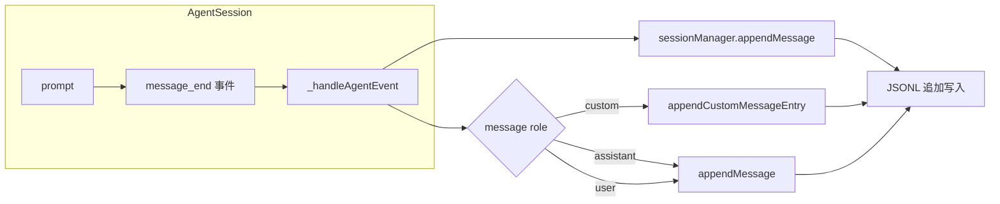

# 第14章 Session 管理：持久化与树形结构

> **本章目标**：深入理解 pi 的 SessionManager——JSONL 存储格式、树形会话结构、SessionEntry 类型体系、以及分支/fork/切换的实现。
>
> **pi 源码对照**：
> - `packages/coding-agent/src/core/session-manager.ts` — 核心实现（约 1500 行）
> - `packages/coding-agent/src/core/messages.ts` — 自定义消息到 entry 的转换
>
> **本章结束能做什么**：能解释 JSONL session 格式的设计、SessionEntry 类型的角色映射、branch/fork/switch 的实现差异，以及 session 迁移机制。
> **前置阅读**：第1章（架构总览）、第7章（Context Engineering）。

---

## 1. Session 管理解决的问题

Code Agent 的每次对话都是一个"会话"。pi 需要：

1. **持久化**：对话历史不丢失，crash 可恢复
2. **分支**：用户 fork 当前会话，探索不同路径
3. **树形结构**：多个分支形成会话树
4. **切换**：在分支间自由导航
5. **摘要**：分支太长时生成摘要以便返回时恢复上下文

---

## 2. 存储格式：追加写入的 JSONL

### 2.1 为什么不覆盖写入

Agent 运行时可能崩溃。如果用"读取→修改→覆盖写入"：

- 读取时 crash → 数据损坏
- 写入时 crash → 覆盖了旧数据

**JSONL（JSON Lines）**：每次写入一行，从不覆盖。

```
{"type":"session","version":3,"id":"abc123","timestamp":"2026-05-25T10:00:00Z","cwd":"..."}
{"type":"message","id":"msg1","parentId":"abc123","timestamp":"...","message":{...}}
{"type":"message","id":"msg2","parentId":"abc123","timestamp":"...","message":{...}}
{"type":"branch_summary","id":"bs1","parentId":"abc123","timestamp":"...","summary":"..."}
```

### 2.2 Session 文件位置

```typescript
// session-manager.ts
const sessionsDir = getSessionsDir()  // ~/.pi/sessions/
const sessionFile = join(sessionsDir, `${sessionId}.jsonl`)
```

### 2.3 版本管理

```typescript
// session-manager.ts
export const CURRENT_SESSION_VERSION = 3
```

Session 文件头部记录版本，迁移时自动升级。

---

## 3. SessionEntry 类型体系

### 3.1 完整类型列表

```typescript
// session-manager.ts
export type SessionEntry =
    | SessionMessageEntry          // user/assistant/toolResult 消息
    | ThinkingLevelChangeEntry    // 思考级别变更
    | ModelChangeEntry           // 模型切换
    | CompactionEntry            // 压缩记录
    | BranchSummaryEntry         // 分支摘要
    | CustomEntry               // 扩展自定义数据（不进 LLM）
    | CustomMessageEntry         // 扩展注入消息（进 LLM）
    | LabelEntry               // 标签/书签
    | SessionInfoEntry         // 会话元信息（名称等）
```

### 3.2 每种 Entry 的结构

```typescript
// SessionMessageEntry
interface SessionMessageEntry extends SessionEntryBase {
    type: 'message'
    message: AgentMessage  // 内部消息格式
}

// BranchSummaryEntry
interface BranchSummaryEntry<T = unknown> extends SessionEntryBase {
    type: 'branch_summary'
    fromId: string         // 从哪个 entry 分支出去
    summary: string
    details?: T            // 扩展用（如文件追踪）
    fromHook?: boolean     // true = 扩展生成
}

// CompactionEntry
interface CompactionEntry<T = unknown> extends SessionEntryBase {
    type: 'compaction'
    summary: string
    firstKeptEntryId: string  // 压缩后第一个保留的 entry ID
    tokensBefore: number
    details?: T             // 扩展数据
    fromHook?: boolean      // true = 扩展触发
}

// CustomMessageEntry（进 LLM 上下文）
interface CustomMessageEntry<T = unknown> extends SessionEntryBase {
    type: 'custom_message'
    customType: string
    content: string | (TextContent | ImageContent)[]
    details?: T
    display: boolean  // false = 对用户隐藏
}

// CustomEntry（不进 LLM 上下文）
interface CustomEntry<T = unknown> extends SessionEntryBase {
    type: 'custom'
    customType: string
    data?: T
}
```

### 3.3 Entry 的树形关系

```typescript
// session-manager.ts
interface SessionEntryBase {
    type: string
    id: string           // 全局唯一 UUID
    parentId: string | null  // 父 entry（null = root）
    timestamp: string
}
```

每个 Entry 通过 `id` + `parentId` 形成树结构。

---

## 4. SessionHeader

每个 session 文件以 header 开始：

```typescript
// session-manager.ts
interface SessionHeader {
    type: 'session'
    version?: number  // v1 没有这个字段
    id: string
    timestamp: string
    cwd: string
    parentSession?: string  // fork 来源的 session
}
```

---

## 5. SessionManager 核心 API

### 5.1 只读接口（ReadonlySessionManager）

```typescript
// session-manager.ts
export type ReadonlySessionManager = Pick<
    SessionManager,
    | 'getCwd'
    | 'getSessionDir'
    | 'getSessionId'
    | 'getSessionFile'
    | 'getLeafId'          // 当前叶子节点
    | 'getLeafEntry'       // 当前 entry
    | 'getEntry'           // 按 ID 查询
    | 'getLabel'           // 查询标签
    | 'getBranch'          // 获取到 root 的路径
    | 'getHeader'
    | 'getEntries'         // 所有 entries
    | 'getTree'            // 完整树结构
    | 'getSessionName'
>
```

### 5.2 写入接口

```typescript
// SessionManager
appendMessage(message: AgentMessage): string  // 返回 entry id
appendCustomMessageEntry(customType, content, display, details?): string
appendThinkingLevelChange(level: string): void
appendModelChange(provider: string, modelId: string): void
appendCompaction(summary, firstKeptEntryId, tokensBefore, details?): string
appendBranchSummary(summary, fromId, details?): string
setLabel(targetId, label): void
setSessionName(name): void
```

### 5.3 树导航接口

```typescript
// SessionManager
getTree(): SessionTreeNode[]  // 完整树
getBranch(entryId: string): SessionEntry[]  // 从 root 到指定 entry 的路径
getLeafId(): string  // 当前叶子（最新 entry）
getLeafEntry(): SessionEntry
```

---

## 6. 分支（Fork）与切换（Switch）

### 6.1 fork vs switch vs navigateTree

| 操作 | 目标 | 当前分支 | 实现 |
|------|------|----------|------|
| fork | 新建分支 | 保留 | 新 entry 加到当前 leaf 下 |
| switch | 切换到已有分支 | 保留 | 直接改 leafId |
| navigateTree | 跳转到树中任意节点 | 摘要后切换 | 先生成 branchSummary，再跳转 |

### 6.2 fork 实现

```typescript
// session-manager.ts
fork(entryId: string, options?): { newEntryId: string }
```

fork 在当前 leaf 下创建一个新的 `branch_summary` entry，然后新的用户消息作为其子节点。

### 6.3 navigateTree 实现

```typescript
// session-manager.ts
async navigateTree(
    targetId: string,
    options?: {
        summarize?: boolean      // 是否摘要当前分支
        customInstructions?: string
        replaceInstructions?: boolean
        label?: string
    }
)
```

---

## 7. SessionContext：LLM 看到的上下文

```typescript
// session-manager.ts
export interface SessionContext {
    messages: AgentMessage[]        // 所有消息（用于 LLM）
    thinkingLevel: string
    model: { provider: string; modelId: string } | null
}
```

```typescript
// session-manager.ts: buildSessionContext()
export function buildSessionContext(entries: SessionEntry[]): SessionContext {
    const messages: AgentMessage[] = []

    for (const entry of entries) {
        if (entry.type === 'message') {
            messages.push(entry.message)
        } else if (entry.type === 'custom_message') {
            // CustomMessageEntry → AgentMessage
            messages.push(createCustomMessage(...))
        } else if (entry.type === 'branch_summary') {
            messages.push(createBranchSummaryMessage(...))
        } else if (entry.type === 'compaction') {
            messages.push(createCompactionSummaryMessage(...))
        }
        // 其他类型不进入 messages
    }

    return { messages, thinkingLevel, model }
}
```

---

## 8. 迁移机制

### 8.1 为什么需要迁移

Session 格式会演进。pi 用版本号管理：

```typescript
// session-manager.ts
export const CURRENT_SESSION_VERSION = 3

// 迁移链：
// v1 → v2: 添加 version 字段
// v2 → v3: 添加 compaction 的 details 字段
```

### 8.2 migrateSessionEntries

```typescript
// session-manager.ts
export function migrateSessionEntries(
    entries: SessionEntry[],
    fromVersion: number,
    toVersion: number
): SessionEntry[]
```

---

## 9. JSONL 的读写实现

### 9.1 追加写入

```typescript
// session-manager.ts
appendEntry(entry: FileEntry): void {
    const line = JSON.stringify(entry) + '\n'
    appendFileSync(this.sessionFile, line, 'utf-8')
}
```

### 9.2 读取

```typescript
// session-manager.ts
loadEntries(): SessionEntry[] {
    const content = readFileSync(this.sessionFile, 'utf-8')
    const lines = content.split('\n').filter(line => line.trim())

    const entries: SessionEntry[] = []
    for (const line of lines) {
        try {
            entries.push(JSON.parse(line))
        } catch (e) {
            // 跳过损坏的行
        }
    }
    return entries
}
```

---

## 10. 树形结构操作

### 10.1 getTree 的实现

```typescript
// session-manager.ts
getTree(): SessionTreeNode[] {
    // 1. 读取所有 entries
    // 2. 构建 id → entry 的 Map
    // 3. 构建 id → children 的 Map
    // 4. 递归构建树
}
```

### 10.2 getBranch 的实现

```typescript
// session-manager.ts
getBranch(entryId: string): SessionEntry[] {
    const branch: SessionEntry[] = []
    let current: SessionEntry | undefined = this.getEntry(entryId)

    while (current) {
        branch.unshift(current)
        current = current.parentId
            ? this.getEntry(current.parentId)
            : undefined
    }

    return branch
}
```

---

## 11. 设计亮点

| 特性 | 实现方式 | 为什么 |
|------|----------|--------|
| JSONL 追加写入 | `appendFileSync` | crash-safe，从不覆盖 |
| Entry 版本化 | `CURRENT_SESSION_VERSION` + migrate 函数 | 平滑演进格式 |
| Tree 结构 | `id` + `parentId` 自引用 | 灵活，支持任意深度的分支 |
| 分离 CustomEntry / CustomMessageEntry | 前者不进 LLM，后者进 | 扩展可存元数据不浪费 context |
| LabelEntry | 独立 entry，不修改原 entry | 非破坏性书签 |

---

## 12. 与 AgentSession 的关系



---

> **下一步阅读**：[第10章 扩展系统](./chapter-10-extension-system.md) — 理解 pi 的插件架构完整实现。
