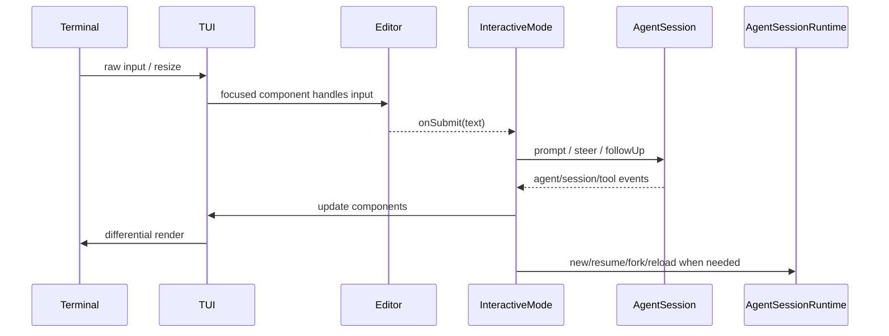

# 15. Interactive TUI：编辑器、渲染、快捷键、队列与扩展 UI

## 15.1 问题场景

TUI 是 Pi 最可见的部分，但它不是 agent 内核。它订阅 session 事件、渲染消息和工具状态、管理输入队列、处理快捷键、承载 extension UI，然后把用户意图交回 `AgentSession` 或 `AgentSessionRuntime`。如果复刻品让 TUI 拥有业务状态，print/json/RPC 就无法共享同一行为，TUI 崩溃也会破坏 session。

## 15.2 用户如何使用

用户在 TUI 中做这些事：

```text
输入 prompt
按 Escape 中断
用 Ctrl+P 切模型
用 /resume /fork /tree 切 session
粘贴多行文本或图片
使用扩展弹窗或自定义 editor
```

复刻 TUI 时可以先做事件日志 + 单行输入，再逐步加入多行 editor、markdown、工具折叠、autocomplete、快捷键和 extension UI。

## 15.3 源码定位

| 责任 | 当前实现 |
|---|---|
| InteractiveMode 类 | [interactive-mode.ts#L237](packages/coding-agent/src/modes/interactive/interactive-mode.ts#L237) |
| streaming/tool tracking | [interactive-mode.ts#L275](packages/coding-agent/src/modes/interactive/interactive-mode.ts#L275) |
| TUI 根组件 | [tui.ts#L239](packages/tui/src/tui.ts#L239) |
| Terminal 接口 | [terminal.ts#L28](packages/tui/src/terminal.ts#L28) |
| ProcessTerminal | [terminal.ts#L75](packages/tui/src/terminal.ts#L75) |
| Input 组件 | [input.ts#L18](packages/tui/src/components/input.ts#L18) |
| Editor 组件 | [editor.ts#L217](packages/tui/src/components/editor.ts#L217) |
| Markdown 组件 | [markdown.ts#L78](packages/tui/src/components/markdown.ts#L78) |
| app keybindings | [keybindings.ts#L13](packages/coding-agent/src/core/keybindings.ts#L13) |
| default keybindings | [keybindings.ts#L63](packages/coding-agent/src/core/keybindings.ts#L63) |

## 15.4 生命周期图



## 15.5 关键代码片段

源码位置：[interactive-mode.ts#L237](packages/coding-agent/src/modes/interactive/interactive-mode.ts#L237)。片段之后继续看 streaming 和工具组件状态如何存储：[interactive-mode.ts#L275](packages/coding-agent/src/modes/interactive/interactive-mode.ts#L275)。

```ts
export class InteractiveMode {
  private runtimeHost: AgentSessionRuntime;
  private ui: TUI;
  private chatContainer: Container;
  private defaultEditor: CustomEditor;
  private editor: EditorComponent;
  private keybindings: KeybindingsManager;
  private streamingComponent: AssistantMessageComponent | undefined = undefined;
  private pendingTools = new Map<string, ToolExecutionComponent>();
}
```

解释：输入是 runtime host 和 TUI 组件；输出是一个事件驱动的 interactive shell。它持有 UI 状态和 pending render state，但不持有业务事实。复刻时可以保留 `runtimeHost`、`ui`、`editor`、`pendingTools` 四类状态。

源码位置：[tui.ts#L239](packages/tui/src/tui.ts#L239)。片段之后继续看 terminal abstraction：[terminal.ts#L28](packages/tui/src/terminal.ts#L28)。

```ts
export class TUI extends Container {
  public terminal: Terminal;
  private previousLines: string[] = [];
  private focusedComponent: Component | null = null;
  private inputListeners = new Set<InputListener>();
  private overlayStack: {
    component: Component;
    options?: OverlayOptions;
    preFocus: Component | null;
  }[] = [];
}
```

解释：TUI 输入是组件树和 terminal events；输出是终端字符 diff。`previousLines` 让渲染可以做差量更新，`focusedComponent` 和 overlay stack 让 editor、弹窗、extension UI 共享输入焦点。复刻最小版可以先全量重绘，再优化 diff。

## 15.6 机制拆解

模型看不到 TUI 组件；它只看到用户消息和工具结果。runtime 私下保留 TUI focus、editor buffer、autocomplete、pending tool components、loader、footer data、extension widgets 和 keybindings。用户按键先由 terminal 读入，TUI 分发给 focused component；如果是 app keybinding，则 interactive mode 转成 abort、model switch、session command 或 follow-up/dequeue 操作。

错误和中断要回到 session：Escape 应调用 abort，而不是只清空 editor；session replacement 后 TUI 必须 detach 旧 extension UI，再 rebind 新 session。

## 15.7 设计不变量

- 不变量：TUI 是事件视图。原因：业务事实在 session/runtime。违反后果：headless 模式不一致。复刻建议：所有消息渲染来自 session events。
- 不变量：输入焦点只属于一个组件。原因：editor、autocomplete、modal 不能同时消费按键。违反后果：快捷键混乱。复刻建议：TUI 管理 focused component 和 overlay stack。
- 不变量：快捷键走 keybindings registry。原因：用户和扩展需要配置。违反后果：硬编码按键不可替换。复刻建议：命令用 action id，不写死 key。
- 不变量：extension UI 通过 host adapter。原因：TUI 是一种 host，不是 extension 的必需环境。违反后果：RPC/print 模式无法运行扩展。复刻建议：interactive 提供完整 UI context，headless 提供 no-op 或 RPC bridge。

## 15.8 失败模式与最小复刻任务

常见失败模式：

- Escape 只停止 spinner，没有 abort provider/tool。
- session fork 后 TUI 继续显示旧 pending tool。
- 多行粘贴被当成一串按键，破坏 editor 状态。

最小可用版：实现事件日志、单行 input、submit 调用 `session.prompt()`、Escape 调用 `session.abort()`。

接近 Pi 的增强版：加入多行 editor、markdown render、tool component、footer、keybindings、pending messages、extension modal。

生产级暂缓项：IME、Kitty keyboard、bracketed paste marker、image paste、diff render 优化、terminal progress。

## 15.9 验收清单

- 能解释为什么 TUI 不属于 Agent loop。
- 能实现一个订阅 session events 的最小终端 UI。
- 能让 Escape 中断真实运行中的任务。
- 能在 session replacement 后重新绑定 UI。
- 能说明 keybinding action id 和具体按键的区别。

## 15.10 本章实现关卡

本章只实现 mini TUI 的最小可用交互，不追求 Pi 完整终端体验。

新增文件：

- `src/host/interactive-host.ts`：订阅 session events，维护输入状态。
- `src/tui/terminal.ts`：封装 raw input、resize、write。
- `src/tui/event-log.ts`：渲染 assistant delta、tool start、tool result。
- `src/tui/keybindings.ts`：用 action id 表达 `abort`、`submit`、`newline`。

最小行为：

```text
> read package
assistant: I will inspect package.json
tool read package.json: ok
assistant: package name is ...
```

运行观察：

```bash
npm run mini -- --mode interactive
```

期望按 Escape 会触发 `session.abort()`，不是只停 spinner。失败样例是 TUI 自己保存 transcript，导致 json host 和 interactive host 看到不同历史。下一章会把所有执行能力纳入安全策略。
