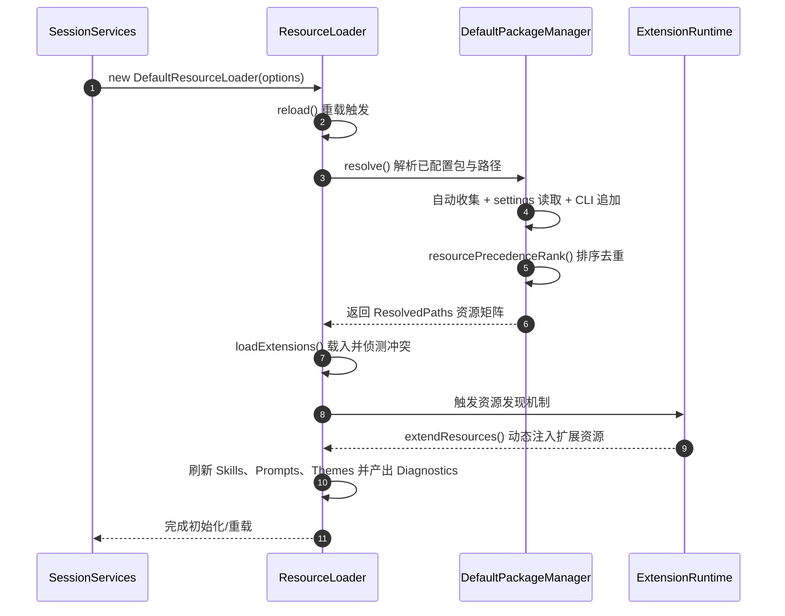

# 15. 资源加载与优先级

## 15.1 本章解决的问题

在企业级落地或复杂开发场景中，Agent 需要适配各类自定义提示词、特定垂直领域的 Skills（例如自动化部署或数据库操作能力）、针对团队规范的 TUI 主题，以及用 TypeScript/JavaScript 编写的定制化扩展插件。这些资源通常分散在全局用户配置、项目特定工作区、网络包（npm/git）以及各个临时命令行参数中。若缺乏统一的资源发现、冲突裁决和热重载引擎，系统极易陷入“资源定位混乱”、“多版本插件冲突”和“更新配置需频繁重启”的泥潭。

Pi Agent 的资源加载（ResourceLoader）与包管理器（PackageManager）子系统解决了这一难题。它建立了一套清晰的**多级优先级覆盖算法**，对 Skills、Prompts、Themes、Extensions 以及工作区上下文文件（如 `AGENTS.md`）进行统一治理，并支持无损的热重载与命名冲突诊断。本章旨在指导工程师从头设计或深度定制该资源底座。

## 15.2 最小可运行路径

可以通过以下实验体验资源的优先级重载与覆盖：

1. **准备两份 Prompt 模板**：
   - 在用户全局配置中建立：`~/.pi/prompts/review.md`，内容为：`[Global Review]`。
   - 在当前项目工作区中建立：`.pi/prompts/review.md`，内容为：`[Project Review]`。
2. **加载并测试重用**：在交互模式中，运行 `/review`（或 `/reload` 刷新后）。观察模型拉起的提示词模版。根据优先级规则，Pi 应当选择项目级的 `[Project Review]` 并屏蔽全局的配置。
3. **命令行临时加载**：退出 Pi，通过命令行指定追加：
   ```bash
   pi --prompt-template review:d:\custom-path\review.md
   ```
   此时，命令行明确指定的 "review.md" 拥有最高优先级，将会覆盖前面的 project 级别文件。
4. **运行诊断审计**：在运行期间，所有的覆盖冲突均会被诊断器记录。你可以通过扩展开发接口读取 `getPrompts().diagnostics` 来验证碰撞细节。

## 15.3 核心机制与优先级算法

#### 15.3.1 ResourceLoader 的统一接口与多态

资源加载器的核心抽象为 [ResourceLoader](/packages/coding-agent/src/core/resource-loader.ts#L28) 接口。它的实现类 [DefaultResourceLoader](/packages/coding-agent/src/core/resource-loader.ts#L152) 承担着将底层的包分发与文件搜索状态聚合为内存运行时视图的责任：
- `getExtensions()`、`getSkills()`、`getPrompts()`、`getThemes()` 用于输出准备就绪的无冲突资源集合及其对应的诊断日志。
- `extendResources()` 允许运行中的扩展在被唤起后，继续动态贡献更多的资源路径。

#### 15.3.2 优先级等级与排序（Precedence Ranking）

当多个路径下包含同名的 Prompt 或 Skill 时，系统依赖 [resourcePrecedenceRank](/packages/coding-agent/src/core/package-manager.ts#L173) 做出的排序规则决定保留哪一个。
数值越小代表优先级越高，具体排序如下：

| Rank 权重 | 来源级别 | 源码元数据判定规则 | 典型路径示例 |
| :---: | --- | --- | --- |
| **0** | 项目级配置 | `source: "local"`, `scope: "project"` | 显式声明在 `.pi/settings.json` 中的文件 |
| **1** | 项目自动发现 | `source: "auto"`, `scope: "project"` | 置于当前项目 `.pi/prompts/` 目录下的普通文件 |
| **2** | 用户全局配置 | `source: "local"`, `scope: "user"` | 显式声明在 `~/.pi/agent/settings.json` 中的文件 |
| **3** | 用户自动发现 | `source: "auto"`, `scope: "user"` | 置于全局用户 `~/.pi/agent/prompts/` 目录下的文件 |
| **4** | 外部包资源 | `origin: "package"` | 来源于 npm、git 依赖包内的资源文件 |

#### 15.3.3 去重与冲突裁决（Deduplication & First Wins）

包管理器解析出路径列表后，使用 [toResolvedPaths](/packages/coding-agent/src/core/package-manager.ts#L2415) 将所有路径规范化（Canonicalize），并根据上述优先级由高到低进行降序排列。
对于 Prompt Template 和 Skill，具体的资源文件加载器（如 `loadPromptTemplates` 和 `loadSkills`）会采用 **First Wins（先入为主）** 逻辑：
- 沿着已排序的路径数组顺次解析，将资源名称绑定给第一个遇到的物理文件。
- 如果后文中再次遇到同名的资源，则判定为发生命名碰撞（Collision）。系统不会终止进程，而是把被屏蔽的低优先级路径包装成 `ResourceDiagnostic` 警告，加入到诊断队列中供审计或排错使用。

#### 15.3.4 项目级上下文文件发现

Pi 会在启动和 reload 时调用 [loadProjectContextFiles](/packages/coding-agent/src/core/resource-loader.ts#L75)。它不仅加载当前目录下的 `.md` 文件，还会递归向上攀爬宿主系统的物理目录（最高到 Git 仓库根目录或系统根目录），寻找所有合规的 `AGENTS.md` 和 `CLAUDE.md` 文件（通过 [loadContextFileFromDir](/packages/coding-agent/src/core/resource-loader.ts#L57)）。这使得在单仓库多子包（Monorepo）的架构下，处于深层子目录的 Agent 仍然可以顺着继承链找回全局的项目开发规章制度，并拼接作为系统提示词的基础上下文。

#### 15.3.5 数据流与生命周期



#### 15.3.6 源码责任表

| 环节 | 系统责任 | 源码证据 | 关键确认点 |
|---|---|---|---|
| 资源统一路由管理 | 维护资源快照，调度包管理器，加载并组装系统提示词基座 | [resource-loader.ts#L152](/packages/coding-agent/src/core/resource-loader.ts#L152) | 确认在发生初始化失败时是否能回退到安全默认态 |
| 扩展资源动态注入 | 提供扩充入口，更新 lastPaths 路径并在合并时保持来源信息 | [resource-loader.ts#L281](/packages/coding-agent/src/core/resource-loader.ts#L281) | 检查是否处理了路径规范化（Canonicalize） |
| 上下文逐级回溯 | 沿着 CWD 顺着父级目录回溯搜寻 AGENTS.md 写入 agentsFiles 数组 | [resource-loader.ts#L75](/packages/coding-agent/src/core/resource-loader.ts#L75) | 确认到达系统根目录 `/` 时循环能否正常终结 |
| 资源优先级打分 | 根据 Metadata 规则为 ResolvedResource 计算 0-4 级的 Precedence 数值 | [package-manager.ts#L173](/packages/coding-agent/src/core/package-manager.ts#L173) | 确认 settings entries 的优先级是否必定高于 auto-discovered |
| 规范化路径整理 | 将资源去重排序，排除由于符号链接或大小写引起的多余路径 | [package-manager.ts#L2415](/packages/coding-agent/src/core/package-manager.ts#L2415) | 检查是否正确过滤和重构了包中的子路径配置 |
| 外部实例化注入 | 绑定 Settings 与 EventBus，控制 Loader 创建并传递给 SDK 等环境 | [agent-session-services.ts#L138](/packages/coding-agent/src/core/agent-session-services.ts#L138) | 确认 cwd 变化时 services 能否安全销毁旧的 loader 实例 |

## 15.4 为什么这样设计

#### 15.4.1 双向热重载（Hot Reloading）

在开发 Agent 插件或调试 Prompt 提示词时，工程师最反感频繁杀死并重启 CLI 进程，因为这会彻底清空当前 TUI 编辑器的状态和已积累的模型历史。
Pi 采用了**双向热重载设计**。在 [reload](/packages/coding-agent/src/core/resource-loader.ts#L321) 中：
- `reload` 会同时调用 `settingsManager.reload()` 重新读取磁盘上的 JSON 文件。
- 然后重新激活包管理器和文件发现逻辑，把内存中的技能表、主题包、提示词模板抹去并重新装填，最后再次执行 `extendResources` 整合扩展内容。
这保证了无论是修改了代码扩展（如新增加了一个命令行工具）、还是修改了 Markdown 提示词，用户只需要在终端输入 `/reload` 即可无损重载，上下文不受任何影响。

#### 15.4.2 基于 package.json 的 pi 过滤机制

如果引入的 npm/git 外部包包含成百上千个 skills 和 themes，而用户可能只想要使用其中的某一个特定扩展，若全部强行载入，必然会引起严重的性能消耗和命名碰撞冲突。
为此，[DefaultPackageManager](/packages/coding-agent/src/core/package-manager.ts#L757) 引入了基于 `package.json` manifest 字段的 pi 过滤机制：
- 支持 `[]` 来完全禁用整个 package 中的某类资源（如 `"skills": []`）。
- 支持 glob 模式过滤和排除（如使用 `!pattern` 排除不想要的文件）。
- 支持 `+path` 和 `-path` 进行强制加白与强力拉黑。
这使得包的分发既保持了完整性，又给予了项目工作区细粒度的覆盖控制权。

## 15.5 常见误解与排查

#### 15.5.1 误区：认为 npm 安装的包，里面的资源必然会自动加载

即使你用 `npm install` 或 `pi package add` 安装了第三方包，如果该包的 `package.json` 中的 `pi` 元数据没有声明 `skills` 目录或 `extensions` 入口，ResourceLoader 会因为找不到 manifest 字段而忽略所有文件。必须确保发布或本地挂载的资源包拥有符合 [PiManifest](/packages/coding-agent/src/core/package-manager.ts#L147) 契约的声明。

#### 15.5.2 误区：觉得修改了 `AGENTS.md` 必须要手动跑 `/reload`

项目根目录下的 `AGENTS.md` 是通过 [loadProjectContextFiles](/packages/coding-agent/src/core/resource-loader.ts#L75) 被读取并附加到 system prompt 中的。在交互模式下，每次你向模型发送指令前，Pi 都会动态去读取该文件最新的文本状态，因此**不需要**为了生效修改而特意去跑 `/reload`。而技能文件（`SKILL.md`）和命令扩展则是由 ResourceLoader 编译常驻内存的，修改它们则**必须**输入 `/reload` 进行重载。

#### 15.5.3 故障排查：诊断器警告 `Prompt review has collision`

当遇到此类警告时，说明你的全局目录与本地目录拥有相同的提示词。你可以检查 `getPrompts().diagnostics` 输出的 `diagnostics`。
排查步骤：
1. 确认生效的是否是你想要的本地版本（First Wins 会优先选择 Rank 0 的项目本地路径）。
2. 如果想让全局的版本重新生效，可修改本地配置的名称，或者在 `.pi/settings.json` 的 `prompts` 过滤黑名单中将本地路径排除。

## 15.6 本章训练

#### 15.6.1 基础练习：验证 Canonicalize 去重

在 `.pi/settings.json` 的 `skills` 中故意加入两条指向同一个 `SKILL.md` 的路径（一条是 `./.pi/skills/demo.md`，另一条是其绝对路径 `d:/chengle/.../.pi/skills/demo.md`）。跑 `/reload` 后查看 diagnostics 警告，并根据 [toResolvedPaths](/packages/coding-agent/src/core/package-manager.ts#L2415) 的路径规范化逻辑，解释它为什么被合并为只有一个，而没有发生 Collision。

#### 15.6.2 原理练习：理解 First Wins 与优先级 Rank

仔细阅读 [resourcePrecedenceRank](/packages/coding-agent/src/core/package-manager.ts#L173) 源码。如果一个资源来源于 CLI 追加（临时指定），在 package-manager 中它的优先级等级被分配为了多少？如果它与项目本地自动发现的同名，谁会在此后的 ResourceLoader 中获胜？

#### 15.6.3 扩展练习：诊断日志导出插件

编写一个简单的 Pi CLI 命令扩展，注册一个 `/diagnose` 终端指令。当输入它时，直接从当前的 `resourceLoader` 中拉取所有的 `skillDiagnostics`、`promptDiagnostics` 和 `themeDiagnostics`，并把所有的 Collision 以及找不到路径的文件错误以带颜色的格式化列表形式打印在交互控制台上。
