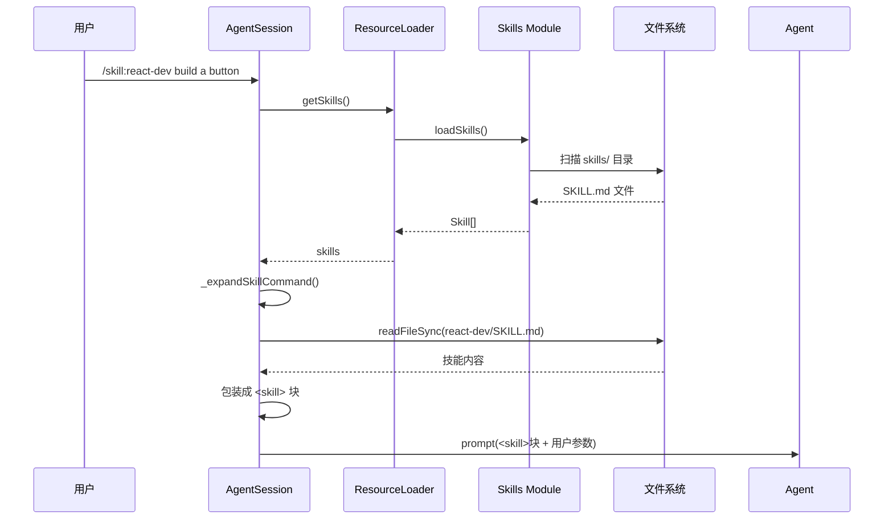

# 第15章 Skills 系统：Markdown 技能框架

> **本章目标**：深入理解 pi 的 Markdown 技能系统——如何用 frontmatter 定义技能、如何加载和验证、如何注入到 system prompt。
>
> **pi 源码对照**：
> - `packages/coding-agent/src/core/skills.ts` — 核心实现（约 500 行）
>
> **本章结束能做什么**：能写出符合规范的 SKILL.md，理解 skill 的发现机制、冲突处理、frontmatter 验证，以及 `formatSkillsForPrompt` 的 XML 输出格式。
> **前置阅读**：第1章（架构总览）。

---

## 1. Skills 解决的问题

pi 是一个通用 Agent 框架，但用户在不同项目中有不同的技能需求：

- Web 开发团队需要 `react-dev` 技能
- Python 团队需要 `poetry` 技能
- 数据库团队需要 `sql-queries` 技能

这些技能不应该硬编码在 pi 里，而应该**用户自己定义、按需加载、随项目复用**。

**Skills 的本质**：把 Markdown 文件当作技能定义文件，用 frontmatter 声明元数据，文件内容作为技能指令。

---

## 2. SKILL.md 格式

### 2.1 最小完整示例

```markdown
---
name: my-skill
description: Build React components following team conventions
---

# My Skill

这是技能的详细指令。当任务匹配 description 时，模型会读取这个文件。

## 使用方法

- 先运行 `npm install`
- 然后执行构建

## 注意事项

- 文件路径都相对于技能目录
```

### 2.2 frontmatter 字段

```typescript
// core/skills.ts
export interface SkillFrontmatter {
    name?: string           // 可选，默认用父目录名
    description?: string    // ⭐ 必需，模型用来判断何时调用
    'disable-model-invocation'?: boolean  // true = 只通过 /skill:name 调用
    [key: string]: unknown  // 允许扩展
}
```

### 2.3 name 验证规则

```typescript
// core/skills.ts: validateName()
function validateName(name: string): string[] {
    const errors = []

    if (name.length > MAX_NAME_LENGTH)  // 64 chars
        errors.push(`name exceeds ${MAX_NAME_LENGTH} characters`)

    if (!/^[a-z0-9-]+$/.test(name))  // 必须小写 + 数字 + 连字符
        errors.push(`name contains invalid characters`)

    if (name.startsWith('-') || name.endsWith('-'))
        errors.push(`name must not start or end with a hyphen`)

    if (name.includes('--'))
        errors.push(`name must not contain consecutive hyphens`)

    return errors
}
```

> **设计意图**：`name` 会出现在 `/skill:name` 命令中，所以必须 URL-safe、可读、小写。

### 2.4 description 验证规则

```typescript
// core/skills.ts: validateDescription()
function validateDescription(description: string | undefined): string[] {
    if (!description || description.trim() === '')
        return ['description is required']
    if (description.length > MAX_DESCRIPTION_LENGTH)  // 1024 chars
        errors.push(`description exceeds ${MAX_DESCRIPTION_LENGTH} characters`)
    return errors
}
```

> **设计意图**：`description` 是模型决定何时调用技能的依据，必须有且可读。

---

## 3. 技能发现机制

### 3.1 三种来源

```mermaid
flowchart TD
    A[技能来源] --> B[用户级<br/>~/.pi/skills/]
    A --> C[项目级<br/>.pi/skills/]
    A --> D[显式路径<br/>--skill-paths]

    B --> E[loadSkillsFromDir<br/>source='user']
    C --> E2[loadSkillsFromDir<br/>source='project']
    D --> E3[loadSkillsFromDir<br/>source='path']

    E --> F[skillMap 合并<br/>去重 + 冲突检测]
    E2 --> F
    E3 --> F
    F --> G[返回 Skill[]]
```

### 3.2 目录扫描规则

```typescript
// core/skills.ts: loadSkillsFromDirInternal()
// 发现规则：
// 1. 如果目录包含 SKILL.md → 把该目录当作技能根目录，不再递归
// 2. 否则，加载根目录的直接 .md 子文件
// 3. 递归扫描子目录，寻找 SKILL.md
```

示例目录结构：

```
~/.pi/skills/
├── react-dev/
│   └── SKILL.md        ← 整个 react-dev 目录是一个技能
├── vue-best-practices/
│   └── SKILL.md        ← 整个 vue-best-practices 是一个技能
└── snippets.md         ← 直接的 .md 文件也是一个技能（用文件名作为 name）
```

### 3.3 忽略规则

```typescript
// 支持 .gitignore / .ignore / .fdignore 语法
function addIgnoreRules(ig, dir, rootDir): void {
    for (const filename of IGNOREFileNames) {
        const ignorePath = join(dir, filename)
        const content = readFileSync(ignorePath, 'utf-8')
        const patterns = parseIgnoreFile(content)
        ig.add(patterns)
    }
}
```

---

## 4. 加载链路

### 4.1 loadSkills 的完整流程

```mermaid
flowchart TD
    A[loadSkills options] --> B[resolve agentDir + cwd]
    B --> C{includeDefaults?}
    C -->|是| D[loadSkillsFromDir<br/>user 级]
    C -->|是| E[loadSkillsFromDir<br/>project 级]
    D --> F[skillMap]
    E --> F
    C -->|否| G[跳过默认路径]
    G --> H[处理 --skill-paths 显式路径]
    H --> I{是目录?}
    I -->|是| J[loadSkillsFromDir]
    I -->|否 .md| K[loadSkillFromFile]
    J --> F
    K --> F
    F --> L[冲突检测<br/>同名 skill 警告]
    L --> M[返回 { skills, diagnostics }]
```

### 4.2 loadSkillFromFile 细节

```typescript
// core/skills.ts: loadSkillFromFile()
function loadSkillFromFile(filePath, source) {
    const rawContent = readFileSync(filePath, 'utf-8')
    const { frontmatter } = parseFrontmatter(rawContent)
    const skillDir = dirname(filePath)
    const parentDirName = basename(skillDir)

    // 1. 验证 description（缺少则拒绝加载）
    // 2. name = frontmatter.name || parentDirName
    // 3. 验证 name（警告但仍加载）
    // 4. 返回 Skill 对象

    return {
        skill: {
            name,
            description: frontmatter.description,
            filePath,
            baseDir: skillDir,
            sourceInfo: createSkillSourceInfo(filePath, skillDir, source),
            disableModelInvocation: frontmatter['disable-model-invocation'] === true,
        },
        diagnostics: [...]  // 验证警告
    }
}
```

---

## 5. 冲突处理

### 5.1 同名冲突

两个技能不能有相同的 `name`。pi 用 `Map<name, Skill>` 存储，**第一个加载的生效**：

```typescript
// core/skills.ts: loadSkills() 中的冲突处理
for (const skill of result.skills) {
    const realPath = canonicalizePath(skill.filePath)

    if (realPathSet.has(realPath)) continue  // 相同文件（symlink），跳过

    const existing = skillMap.get(skill.name)
    if (existing) {
        // 冲突！记录警告，第一个加载的优先
        collisionDiagnostics.push({
            type: 'collision',
            message: `name "${skill.name}" collision`,
            path: skill.filePath,
            collision: {
                winnerPath: existing.filePath,  // 先到先得
                loserPath: skill.filePath,
            }
        })
    } else {
        skillMap.set(skill.name, skill)
    }
}
```

### 5.2 Symlink 去重

```typescript
// 同一个文件通过 symlink 加载两次，只保留一份
const realPath = canonicalizePath(skill.filePath)
if (realPathSet.has(realPath)) continue
realPathSet.add(realPath)
```

---

## 6. formatSkillsForPrompt：技能注入 System Prompt

### 6.1 输出格式

```typescript
// core/skills.ts: formatSkillsForPrompt()
export function formatSkillsForPrompt(skills: Skill[]): string {
    const visibleSkills = skills.filter(s => !s.disableModelInvocation)

    if (visibleSkills.length === 0) return ""

    const lines = [
        "\n\nThe following skills provide specialized instructions for specific tasks.",
        "Use the read tool to load a skill's file when the task matches its description.",
        "When a skill file references a relative path, resolve it against the skill directory...",
        "",
        "<available_skills>",
    ]

    for (const skill of visibleSkills) {
        lines.push("  <skill>")
        lines.push(`    <name>${escapeXml(skill.name)}</name>`)
        lines.push(`    <description>${escapeXml(skill.description)}</description>`)
        lines.push(`    <location>${escapeXml(skill.filePath)}</location>`)
        lines.push("  </skill>")
    }

    lines.push("</available_skills>")
    return lines.join("\n")
}
```

### 6.2 XML 格式的优点

1. **LLM 容易解析**：比 JSON 更像自然语言
2. **防止注入**：`<skill>` 块内的内容不会被误解析为指令
3. **可扩展**：未来可以加 `<category>`、`<version>` 等字段

### 6.3 disable-model-invocation 的作用

```typescript
// SKILL.md 中设置 disable-model-invocation: true
// → 不出现在 <available_skills> 中
// → 只能通过 /skill:name 显式调用
const visibleSkills = skills.filter(s => !s.disableModelInvocation)
```

---

## 7. 技能如何被调用

### 7.1 /skill:name 命令

```typescript
// core/agent-session.ts: _expandSkillCommand()
private _expandSkillCommand(text: string): string {
    if (!text.startsWith('/skill:')) return text

    const skillName = text.slice(7, text.indexOf(' ') || undefined)
    const skill = this.resourceLoader.getSkills().skills.find(s => s.name === skillName)

    if (!skill) return text  // 未找到，原样传递

    const content = readFileSync(skill.filePath, 'utf-8')
    const body = stripFrontmatter(content).trim()

    // 包装成 <skill> 块，附加参数
    const skillBlock = `<skill name="${skill.name}" location="${skill.filePath}">
References are relative to ${skill.baseDir}.

${body}
</skill>`

    return args ? `${skillBlock}\n\n${args}` : skillBlock
}
```

### 7.2 技能调用时的文件路径解析

`<skill>` 块中包含：

```
References are relative to ${skill.baseDir}.
```

这让技能中的相对路径引用能被正确解析为绝对路径。

---

## 8. 技能在 System Prompt 中的位置

```mermaid
flowchart LR
    A[system prompt] --> B[customPrompt?]
    B -->|是| C[直接使用]
    B -->|否| D[默认构建]

    D --> E[tools list]
    D --> F[guidelines]
    D --> G[pi docs 路径]
    D --> H[appendSystemPrompt]
    H --> I[contextFiles]
    I --> J[skills<br/>formatSkillsForPrompt()]
    J --> K[date + cwd]
```

skills 被放在 `contextFiles` **之后**、`date + cwd` **之前**。

---

## 9. SourceInfo：技能的来源追踪

```typescript
// core/skills.ts: createSkillSourceInfo()
function createSkillSourceInfo(filePath, baseDir, source) {
    switch (source) {
        case 'user':
            return createSyntheticSourceInfo(filePath, {
                source: 'local', scope: 'user', baseDir
            })
        case 'project':
            return createSyntheticSourceInfo(filePath, {
                source: 'local', scope: 'project', baseDir
            })
        case 'path':
            return createSyntheticSourceInfo(filePath, { source: 'local', baseDir })
        default:
            return createSyntheticSourceInfo(filePath, { source, baseDir })
    }
}
```

`sourceInfo` 用于调试和诊断，让用户知道一个技能是从哪里加载的。

---

## 10. 诊断信息

```typescript
export interface ResourceDiagnostic {
    type: 'warning' | 'collision' | 'error'
    message: string
    path: string
    collision?: {
        resourceType: 'skill'
        name: string
        winnerPath: string
        loserPath: string
    }
}
```

返回的 `diagnostics` 数组包含所有验证警告和冲突信息，UI 可以展示给用户。

---

## 11. 完整调用示例



---

## 12. 设计亮点

| 特性 | 实现方式 | 为什么 |
|------|----------|--------|
| 目录作为技能单元 | 扫描 SKILL.md 识别根目录 | 技能需要多个文件时很自然 |
| 同名冲突先到先得 | Map + collisionDiagnostics | 简单高效，用户可见警告 |
| disable-model-invocation | filter 排除 | 需要手动触发的技能不污染 prompt |
| XML 格式注入 | formatSkillsForPrompt | LLM 友好，可扩展 |
| 相对路径标注 | 硬编码 "References are relative to..." | 让相对路径引用可被解析 |

---

> **下一步阅读**：[第14章 Slash Commands](./chapter-14-slash-commands.md) — 理解 /skill 命令和 slash commands 的完整解析逻辑。
