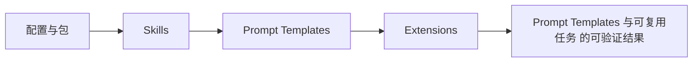

# 16. Prompt Templates 与可复用任务

## 16.1 Prompt Template 解决什么问题

Prompt template 把“每次都手写的一段任务描述”变成可命名、可审查、可分发的 Markdown 资源。对前端工程师来说，它像 npm script 和代码片段的结合：输入 `/review`，实际发送给模型的是同名 Markdown 模板正文；输入 `/component Button "click handler"`，模板参数会被替换成当前这次任务的具体内容。

`packages/coding-agent/docs/prompt-templates.md` 直接说明：`Prompt templates are Markdown snippets that expand into full prompts`，并规定 review 文件会变成 `/review`。这解释了它和 slash command 的区别：template 不执行本地代码，不接管 UI，不新增模型工具；它只在用户消息进入 agent loop 之前，把短命令展开成完整 prompt。源码的 `PromptTemplate` 结构也很小：`name`、`description`、`argumentHint`、`content`、`sourceInfo`、`filePath`，见 [prompt-templates.ts#L11](packages/coding-agent/src/core/prompt-templates.ts#L11)。

## 16.2 如何使用

最小文件是一个 Markdown 文件。文档里的位置包括 `~/.pi/agent/prompts/*.md`、`.pi/prompts/*.md`、package 的 `prompts/` 目录、settings 的 `prompts` 数组，以及 CLI 的 `--prompt-template <path>`。最小格式是可选 frontmatter 加正文：`description` 用于 autocomplete；`argument-hint` 用于提示参数形状，比如 `<PR-URL>`。

使用时在编辑器输入 `/` 加文件名。`/review` 展开同名 review 模板；`/component Button` 会把 `Button` 作为 `$1`；多个参数支持引号，所以 `/component Button "click handler"` 会得到两个参数。实现上，`parseCommandArgs()` 手写了简单的 bash-style 引号解析，见 [prompt-templates.ts#L24](packages/coding-agent/src/core/prompt-templates.ts#L24)。`substituteArgs()` 支持 `$1`、`$2`、`$@`、`$ARGUMENTS`、`${@:N}`、`${@:N:L}`，见 [prompt-templates.ts#L68](packages/coding-agent/src/core/prompt-templates.ts#L68)。

这意味着 template 适合固定流程，不适合复杂条件分支。比如“审查 staged diff，关注 bug、安全、错误处理”很适合；“根据 GitHub API 拉 PR、下载日志、更新 issue 状态”就应该做 extension command 或外部脚本。

## 16.3 加载与展开机制

Prompt template 是 ResourceLoader 管理的一类资源。`DefaultResourceLoader.reload()` 解析 enabled prompts 后调用 `updatePromptsFromPaths()`，再进入 `loadPromptTemplates()`，见 [resource-loader.ts#L436](packages/coding-agent/src/core/resource-loader.ts#L436)。加载器会从默认目录和显式路径读取 `.md`，目录扫描是非递归的，这和 docs 的 `Template discovery in prompts/ is non-recursive` 一致；子目录需要通过 settings 或 package manifest 显式加入，见 [prompt-templates.ts#L135](packages/coding-agent/src/core/prompt-templates.ts#L135)。

展开发生在用户 prompt 进入 agent loop 的早期。AgentSession 先检查扩展命令，再发 `input` 事件，之后才展开 `/skill:name` 和 prompt template，见 [agent-session.ts#L968](packages/coding-agent/src/core/agent-session.ts#L968) 和 [agent-session.ts#L998](packages/coding-agent/src/core/agent-session.ts#L998)。这个顺序很重要：扩展命令可以优先消费 `/foo`；input 事件可以改写用户输入；只有未被处理的文本才进入 template 展开。

`expandPromptTemplate()` 只在文本以 `/` 开头时工作；找不到同名 template 就返回原文，见 [prompt-templates.ts#L269](packages/coding-agent/src/core/prompt-templates.ts#L269)。所以未知 `/abc` 不会被 template 层报错，它可能继续作为普通 prompt 或被其他 slash 处理逻辑处理。

**生命周期图**

**源码责任表**

| 环节 | 系统责任 | 源码证据 | 读源码时要确认什么 |
|---|---|---|---|
| 配置与包 | 声明资源来源和优先级 | [resource-loader.ts#L398](packages/coding-agent/src/core/resource-loader.ts#L398) | 输入从哪里来，输出交给谁，失败由哪一层裁决 |
| Skills | 模型行为说明书 | [resource-loader.ts#L510](packages/coding-agent/src/core/resource-loader.ts#L510) | 输入从哪里来，输出交给谁，失败由哪一层裁决 |
| Prompt Templates | 可复用任务入口 | [resource-loader.ts#L533](packages/coding-agent/src/core/resource-loader.ts#L533) | 输入从哪里来，输出交给谁，失败由哪一层裁决 |
| Extensions | 代码能力与 UI/provider 注册 | [types.ts#L1084](packages/coding-agent/src/core/extensions/types.ts#L1084) | 输入从哪里来，输出交给谁，失败由哪一层裁决 |

**关键代码说明**

读源码时不要只顺着函数名跳转，而要检查四个边界：输入边界、状态边界、裁决边界、输出边界。输入边界回答“谁把数据交进来”；状态边界回答“哪些信息会跨 turn、跨 session 或跨进程保留”；裁决边界回答“谁有权继续、停止、执行或拒绝”；输出边界回答“结果给人看、给模型看，还是给外部系统看”。本章涉及的源码只有放进这四个边界中才有解释力。

## 16.4 为什么不把它做成扩展命令

Prompt template 的设计取舍是“可读、可 diff、低权限”。一个 `.md` 文件可以进入代码评审，可以随项目共享，也不会在加载时执行任意代码。相比 extension command，它没有 `ctx.ui`、没有 shell、没有 session 写入权限；这不是能力不足，而是安全边界。

对团队流程来说，template 适合把约定写进仓库，例如 `/wr` 表示“完成当前任务端到端”，`/cl` 表示“审查 changelog”。前端工程师不需要学 ExtensionAPI，也不需要发布 package，只要维护 Markdown。参数替换也刻意简单：替换发生在模板字符串上，参数值不会递归触发 `$1` 或 `$ARGUMENTS`，源码注释明确了这一点，见 [prompt-templates.ts#L65](packages/coding-agent/src/core/prompt-templates.ts#L65)。这能避免用户参数意外二次展开。

本章放在 ResourceLoader 之后，是因为 template 的“好不好用”首先取决于能不能被发现、是否同名冲突、来源如何显示。它放在 skills 之前，是因为 template 是用户主动触发的完整 prompt；skill 则是模型根据描述按需加载的行为说明。

**创建者视角的设计不变量**

资源系统是 Pi 小内核的主要出口。稳定行为进入核心，团队差异进入资源；资源必须保留 sourceInfo、加载顺序和冲突边界，否则用户无法解释为什么某个 skill、命令、主题或工具生效。

**如果省略本章会发生什么**

省略本章，读者会把 Prompt Templates 与可复用任务 当成单点功能，而不是 Pi 架构中的责任边界。直接后果是：使用时不知道该改配置、写资源、写扩展、接 provider 还是调用 SDK；排查时也会把 provider、工具、TUI、session 和资源加载混为一谈。专家级学习必须把每章能力放回系统生命周期中验证。

## 16.5 常见误解与排查

误解一：template 是 slash command。不是。它共享 `/name` 的入口形式，但本质是文本展开。扩展命令先被检查，template 后展开；如果同名扩展命令存在，用户看到的行为可能不是 Markdown 展开。

误解二：`prompts/` 会递归扫描所有子目录。不会。docs 明确说 discovery is non-recursive，源码也只遍历当前目录的 `.md` 文件，见 [prompt-templates.ts#L146](packages/coding-agent/src/core/prompt-templates.ts#L146)。要分目录组织，就在 settings 或 package manifest 里显式配置。

误解三：`description` 会进入模型上下文。不会。`description` 用于展示和命令信息；真正发送给模型的是 `content` 展开后的正文。加载函数把 frontmatter 和 body 分开，只把 body 放到 `content`，见 [prompt-templates.ts#L104](packages/coding-agent/src/core/prompt-templates.ts#L104)。

排查时先看文件名是否就是命令名，再看资源是否 enabled，再看同名 collision，再看输入是否先被 extension command 或 `input` 事件消费。

## 16.6 本章训练

写一个 `.pi/prompts/component.md`，frontmatter 放 `description` 和 `argument-hint: "<name> [features]"`，正文使用 `$1` 和 `${@:2}`。输入 `/component Button "keyboard support" "loading state"` 后，预测展开文本。然后解释为什么这个能力应该用 template，而不是 skill 或 extension：它是用户主动触发、纯文本、无权限副作用、可随项目评审的任务入口。

能完成这个训练，就具备了后续阅读 skills 的基础：你已经理解“资源加载”和“用户输入展开”是两件事，skill 只是换了触发者和上下文注入方式。

**专家验收任务**

完成本章后，读者应该能交付三件东西：一张自己画出的 Prompt Templates 与可复用任务 数据流图；一份包含源码链接、输入、输出、失败边界的责任表；一个最小实践任务，证明自己能在不改错层级的情况下使用或扩展该能力。若三件事缺一件，就说明还停留在“会用命令”的阶段，没有达到能设计和审计 Pi 方案的水平。

