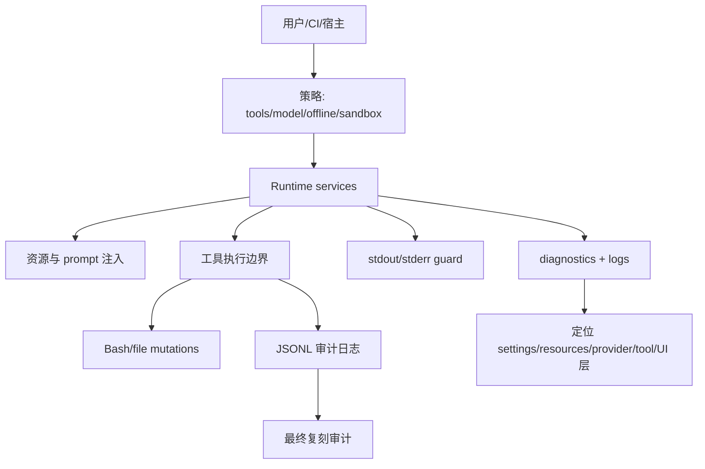

# 16. 安全、诊断与生产化不变量

## 16.1 问题场景

Pi 是本地执行型 coding agent，天然拥有危险能力：读写工作区、运行 shell、加载第三方扩展、持久化凭证、输出机器协议、压缩和重试长任务。能跑通 demo 不等于能生产使用。复刻品必须明确安全边界、诊断通道和质量门禁，否则一次 prompt injection、stdout 污染、凭证泄露或 stuck process 就会让系统不可用。

## 16.2 用户如何使用

用户用这些方式控制风险：

```bash
pi --tools read,grep,find,ls -p "read-only review"
pi --no-tools
PI_OFFLINE=1 pi
PI_TUI_WRITE_LOG=/tmp/pi-logs pi
pi --mode json -p "machine output"
```

生产复刻时，还要在外层使用容器、临时工作区、只读挂载、最小权限 token、CI 专用模型和 faux provider 测试。

## 16.3 源码定位

| 责任 | 当前实现 |
|---|---|
| stdout guard | [output-guard.ts#L45](packages/coding-agent/src/core/output-guard.ts#L45) |
| raw stdout queue | [output-guard.ts#L85](packages/coding-agent/src/core/output-guard.ts#L85) |
| diagnostics 类型 | [diagnostics.ts#L1](packages/coding-agent/src/core/diagnostics.ts#L1) |
| auth file mode | [auth-storage.ts#L67](packages/coding-agent/src/core/auth-storage.ts#L67) |
| auth lock | [auth-storage.ts#L101](packages/coding-agent/src/core/auth-storage.ts#L101) |
| bash executor options | [bash-executor.ts#L22](packages/coding-agent/src/core/bash-executor.ts#L22) |
| bash output temp file | [bash-executor.ts#L64](packages/coding-agent/src/core/bash-executor.ts#L64) |
| tool whitelist source | [index.ts#L83](packages/coding-agent/src/core/tools/index.ts#L83) |
| retry classifier | [agent-session.ts#L2429](packages/coding-agent/src/core/agent-session.ts#L2429) |
| app keybindings | [keybindings.ts#L13](packages/coding-agent/src/core/keybindings.ts#L13) |

## 16.4 生命周期图



## 16.5 关键代码片段

源码位置：[auth-storage.ts#L67](packages/coding-agent/src/core/auth-storage.ts#L67)。片段之后继续看写入时如何加锁和重设权限：[auth-storage.ts#L101](packages/coding-agent/src/core/auth-storage.ts#L101)。

```ts
private ensureFileExists(): void {
  if (!existsSync(this.authPath)) {
    writeFileSync(this.authPath, "{}", "utf-8");
    chmodSync(this.authPath, 0o600);
  }
}

withLock<T>(fn: (current: string | undefined) => LockResult<T>): T {
  this.ensureParentDir();
  this.ensureFileExists();
  const current = existsSync(this.authPath) ? readFileSync(this.authPath, "utf-8") : undefined;
  const { result, next } = fn(current);
}
```

解释：输入是 auth storage 文件；输出是受锁保护的读写结果。凭证文件默认 `0600`，写入后也重设权限。复刻时凭证不是普通配置文件，要有最小权限、锁和来源诊断。

源码位置：[bash-executor.ts#L22](packages/coding-agent/src/core/bash-executor.ts#L22)。片段之后继续看长输出如何写入临时文件：[bash-executor.ts#L64](packages/coding-agent/src/core/bash-executor.ts#L64)。

```ts
export interface BashResult {
  output: string;
  exitCode: number | undefined;
  cancelled: boolean;
  truncated: boolean;
  fullOutputPath?: string;
}

const ensureTempFile = () => {
  const id = randomBytes(8).toString("hex");
  tempFilePath = join(tmpdir(), `pi-bash-${id}.log`);
  tempFileStream = createWriteStream(tempFilePath);
};
```

解释：输入是本地命令输出；输出是截断后的模型可见文本和可追溯 full output path。复刻时要同时控制上下文大小和审计能力：模型不需要完整日志，但用户需要找回完整日志。

## 16.6 机制拆解

模型能看到的是被策略允许的工具、被注入的资源、截断后的输出和错误信息。runtime 私下保留凭证、完整输出路径、诊断、stdout guard、tool whitelist、retry attempt、abort controller 和 session JSONL。用户通过 CLI flags、settings、环境变量和外层沙箱设定策略。生产系统必须把错误定位到层：启动/配置、resource、model/auth、provider stream、tool execution、session、host/TUI。

最终复刻的目标不是“功能像 Pi”，而是“边界像 Pi”：每个危险动作都有执行主体、可审计 entry、可取消 signal、可配置权限和可诊断错误。

## 16.7 设计不变量

- 不变量：凭证最小权限存储。原因：本地 agent 经常运行在源码目录。违反后果：API key 被其他进程或工具泄露。复刻建议：auth 文件 `0600`，敏感输出默认不进日志。
- 不变量：机器协议和诊断分离。原因：JSON/RPC 要可被程序解析。违反后果：自动化管道不稳定。复刻建议：stdout guard + stderr diagnostics。
- 不变量：工具权限显式可配置。原因：不同任务风险不同。违反后果：只读审查也可能写文件。复刻建议：tool whitelist/blacklist。
- 不变量：bash 输出可截断但可追溯。原因：上下文窗口有限，审计需要完整证据。违反后果：不是爆 context 就是丢证据。复刻建议：tail + temp file。
- 不变量：测试默认使用 faux provider。原因：真实 API 有成本、权限和不确定性。违反后果：CI 不可复现。复刻建议：provider adapter contract tests。

## 16.8 失败模式与最小复刻任务

常见失败模式：

- JSON 模式被 debug log 污染。
- auth.json 权限过宽或并发写坏。
- bash 长输出压满 context。
- prompt injection 诱导写文件，而用户以为当前是只读模式。
- retry/compaction 失败没有诊断，用户只能重启。

最小可用版：实现 tool whitelist、auth file permissions、stdout/stderr 分离、diagnostics array、faux provider test。

接近 Pi 的增强版：加入 bash output temp file、retry diagnostics、resource collision diagnostics、abortable operations、session audit export。

生产级暂缓项：容器沙箱、远程 execution env、redaction policy、trace/span observability、golden trajectory replay。

## 16.9 验收清单

- 能用只读工具模式运行一次代码审查。
- 能证明 JSON/RPC stdout 不会被普通日志污染。
- 能说明凭证文件权限和锁的必要性。
- 能在错误时判断属于 provider、tool、session、resource 还是 host。
- 能用 faux provider 跑通 agent loop、tool call、session persistence、compaction 的回归测试。
- 能给自己的 mini Pi 写一份 P0/P1 审计清单：权限、凭证、stdout、工具回灌、session DAG、compaction、extension stale context、TUI abort。

## 16.10 本章实现关卡

本章把 mini Pi 的默认策略固定下来，防止“能跑”但不可审计。

新增文件：

- `src/security/policy.ts`：定义只读、写入、bash、extension 四种策略。
- `src/security/redaction.ts`：避免敏感值进入 JSON/event/log。
- `src/diagnostics/report.ts`：聚合启动、resource、provider、tool、session、host 错误。
- `src/tests/audit-checklist.ts`：检查 P0 不变量。

最小策略矩阵：

| 模式 | read | write | bash | extension |
|---|---:|---:|---:|---:|
| review | 是 | 否 | 否 | 否 |
| edit | 是 | 是 | 否 | 否 |
| local-dev | 是 | 是 | 是 | 否 |
| trusted-extension | 是 | 是 | 是 | 是 |

运行观察：

```bash
npm run mini -- --tools read -p "write a file"
```

期望模型即使请求 `write`，runtime 也返回 blocked toolResult 并写入 session。失败样例是只读模式下 prompt injection 仍能写文件。第 17 章会把前 16 章产物组装成完整 mini agent。
