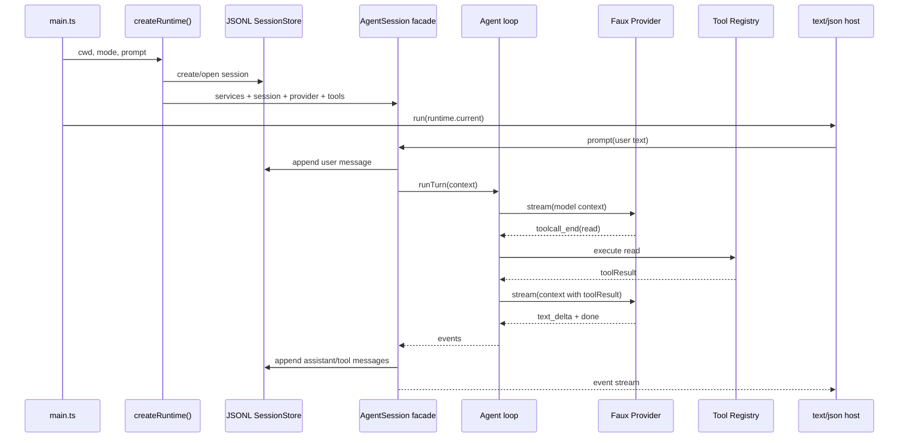

# 17. 从零实现 mini Pi-like Agent

## 17.1 本章要解决的问题

前 16 章解释了 Pi 的稳定源码边界，但复刻者还需要一条连续路径：从空目录开始，写出一个可以运行、可以调用工具、可以保存 session、可以用 faux provider 测试的 mini Pi-like agent。

如果没有这一章，读者会知道 `Provider`、`Tool`、`Session`、`Host` 分别是什么，却不知道这些接口如何按工程顺序落地。成熟实战书的共同经验是：先展示完整系统，再拆局部；先跑最小闭环，再补工业化能力。本章把前文所有边界组装为一个最小项目。

## 17.2 当前 Pi 源码锚点

本章不引入新的 Pi 概念，只把已讲过的真实边界映射到 mini 实现：

| mini 部件 | Pi 源码锚点 |
|---|---|
| 创建 session facade | [sdk.ts#L202](packages/coding-agent/src/core/sdk.ts#L202) |
| Agent loop | [agent-loop.ts#L95](packages/agent/src/agent-loop.ts#L95) |
| Provider stream 分发 | [stream.ts#L43](packages/ai/src/stream.ts#L43) |
| Assistant stream event | [types.ts#L347](packages/ai/src/types.ts#L347) |
| Agent event union | [types.ts#L403](packages/agent/src/types.ts#L403) |
| 工具 definition | [index.ts#L96](packages/coding-agent/src/core/tools/index.ts#L96) |
| JSONL message entry | [session-manager.ts#L876](packages/coding-agent/src/core/session-manager.ts#L876) |
| print/json host | [print-mode.ts#L32](packages/coding-agent/src/modes/print-mode.ts#L32) |

## 17.3 项目目录

mini 项目不复制 Pi 的包结构，而是保留相同边界：

```text
mini-pi/
  src/
    main.ts
    cli/
      args.ts
      mode.ts
    runtime/
      create-services.ts
      create-agent-session.ts
      agent-session.ts
    provider/
      types.ts
      faux.ts
      registry.ts
      model-registry.ts
    agent/
      agent-loop.ts
      context.ts
    tools/
      registry.ts
      read.ts
      write.ts
      bash.ts
    session/
      entry.ts
      jsonl-store.ts
      build-context.ts
    resources/
      prompt-builder.ts
    host/
      text-host.ts
      json-host.ts
      stdout-guard.ts
    security/
      policy.ts
  test/
    golden-trajectory.test.ts
```

关键原则：目录不是技术分层装饰，而是执行权分隔。`provider` 只能产生模型事件；`tools` 才能碰文件系统；`session` 只保存事实；`host` 只渲染事件。

## 17.4 生命周期图



## 17.5 核心接口

下面是最小可用接口。读者可以直接从这里开始编码。这里使用 Pi 的真实消息命名：`ToolCall.arguments`、`ToolResultMessage.role === "toolResult"`、`toolName`、content blocks、`isError` 和 `timestamp`，对应 [types.ts#L277](packages/ai/src/types.ts#L277) 与 [types.ts#L292](packages/ai/src/types.ts#L292)。这样 mini session 以后更容易映射到 [session-format.md#L72](packages/coding-agent/docs/session-format.md#L72)。

```ts
export type TextContent = { type: "text"; text: string };

export type Message =
  | { role: "user"; content: string; timestamp: number }
  | { role: "assistant"; content: AssistantPart[] }
  | { role: "toolResult"; toolCallId: string; toolName: string; content: TextContent[]; isError: boolean; timestamp: number };

export type AssistantPart =
  | { type: "text"; text: string }
  | { type: "toolCall"; id: string; name: string; arguments: Record<string, unknown> };

export interface ModelContext {
  systemPrompt: string;
  messages: Message[];
  tools: ToolSchema[];
}

export type AssistantEvent =
  | { type: "start"; partial: Extract<Message, { role: "assistant" }> }
  | { type: "text_delta"; contentIndex: number; delta: string; partial: Extract<Message, { role: "assistant" }> }
  | { type: "toolcall_end"; contentIndex: number; toolCall: Extract<AssistantPart, { type: "toolCall" }>; partial: Extract<Message, { role: "assistant" }> }
  | { type: "done"; reason: "stop" | "toolUse" | "length"; message: Extract<Message, { role: "assistant" }> }
  | { type: "error"; reason: "error" | "aborted"; error: Extract<Message, { role: "assistant" }> };

export interface Provider {
  stream(context: ModelContext, signal: AbortSignal): AsyncIterable<AssistantEvent>;
}

export interface Tool {
  name: string;
  schema: ToolSchema;
  execute(args: unknown, signal: AbortSignal): Promise<Extract<Message, { role: "toolResult" }>>;
}
```

这些类型仍少于 Pi 的真实类型，但不改变关键字段名。模型只看到 schema，工具只在 runtime 执行，执行结果变成 `role: "toolResult"` 的消息。省略的字段包括真实 `AssistantMessage` 上的 `api`、`provider`、`model`、`usage`、`stopReason`、`timestamp`，完整形状见 [session-format.md#L81](packages/coding-agent/docs/session-format.md#L81)。如果 mini 版为了减少代码量省略 `partial/message/contentIndex`，那是 mini 教学协议；真实 Pi provider stream 不能省略这些字段，见 [types.ts#L347](packages/ai/src/types.ts#L347)。

## 17.6 最小 Agent Loop

mini loop 不需要先支持 compaction、extension、parallel tool execution。先实现闭环：

```ts
export async function runAgentLoop(options: {
  context: ModelContext;
  provider: Provider;
  tools: Map<string, Tool>;
  signal: AbortSignal;
  emit: (event: AgentEvent) => void;
}): Promise<Message[]> {
  const created: Message[] = [];

  while (true) {
    options.emit({ type: "turn_start" });
    const assistantParts: AssistantPart[] = [];

    for await (const event of options.provider.stream(options.context, options.signal)) {
      if (event.type !== "done" && event.type !== "error") {
        options.emit({
          type: "message_update",
          message: { role: "assistant", content: assistantParts },
          assistantMessageEvent: event,
        });
      }
      if (event.type === "text_delta") {
        assistantParts.push({ type: "text", text: event.delta });
      }
      if (event.type === "toolcall_end") {
        assistantParts.push(event.toolCall);
      }
      if (event.type === "error") {
        throw new Error(event.error.content[0]?.type === "text" ? event.error.content[0].text : "Provider error");
      }
    }

    const assistant: Message = { role: "assistant", content: assistantParts };
    created.push(assistant);
    options.context.messages.push(assistant);

    const calls = assistantParts.filter((part) => part.type === "toolCall");
    if (calls.length === 0) {
      options.emit({ type: "turn_end", message: assistant, toolResults: [] });
      return created;
    }

    const toolResults: Extract<Message, { role: "toolResult" }>[] = [];
    for (const call of calls) {
      const tool = options.tools.get(call.name);
      options.emit({ type: "tool_execution_start", toolCallId: call.id, toolName: call.name, args: call.arguments });
      const result = tool
        ? await tool.execute(call.arguments, options.signal)
        : {
            role: "toolResult",
            toolCallId: call.id,
            toolName: call.name,
            content: [{ type: "text", text: "Tool is not active." }],
            isError: true,
            timestamp: Date.now(),
          } satisfies Extract<Message, { role: "toolResult" }>;
      created.push(result);
      options.context.messages.push(result);
      toolResults.push(result);
      options.emit({
        type: "tool_execution_end",
        toolCallId: call.id,
        toolName: call.name,
        result,
        isError: result.isError,
      });
      options.emit({ type: "message_end", message: result });
    }
    options.emit({ type: "turn_end", message: assistant, toolResults });
  }
}
```

这里的实现比 Pi 少很多能力，但数据方向一致。真实 Pi 的完整事件 union 见 [types.ts#L403](packages/agent/src/types.ts#L403)。mini 版可以少实现并发、hook、`message_start`、`tool_execution_update`，但 public JSON/RPC 层不要发明 `provider_event` 或 `tool_result` 作为 Pi 兼容事件。

## 17.7 运行命令

最小 text host：

```bash
npm run mini -- -p "read package"
```

期望输出：

```text
I will read package.json.
package name is pi
```

最小 json host：

```bash
npm run mini -- --mode json -p "read package"
```

期望输出：

```json
{"type":"session","version":3,"id":"s1","timestamp":"2026-05-31T00:00:00.000Z","cwd":"/repo"}
{"type":"turn_start"}
{"type":"message_update","message":{"role":"assistant","content":[{"type":"toolCall","id":"call_1","name":"read","arguments":{"path":"package.json"}}]},"assistantMessageEvent":{"type":"toolcall_end","contentIndex":0,"toolCall":{"type":"toolCall","id":"call_1","name":"read","arguments":{"path":"package.json"}},"partial":{}}}
{"type":"tool_execution_start","toolCallId":"call_1","toolName":"read","args":{"path":"package.json"}}
{"type":"tool_execution_end","toolCallId":"call_1","toolName":"read","result":{"role":"toolResult","toolCallId":"call_1","toolName":"read","content":[{"type":"text","text":"..."}],"isError":false,"timestamp":1767225600000},"isError":false}
{"type":"message_end","message":{"role":"toolResult","toolCallId":"call_1","toolName":"read","content":[{"type":"text","text":"..."}],"isError":false,"timestamp":1767225600000}}
{"type":"turn_end","message":{"role":"assistant","content":[{"type":"toolCall","id":"call_1","name":"read","arguments":{"path":"package.json"}}]},"toolResults":[{"role":"toolResult","toolCallId":"call_1","toolName":"read","content":[{"type":"text","text":"..."}],"isError":false,"timestamp":1767225600000}]}
```

这是向真实 Pi JSON mode 靠拢的输出形状，事件定义见 [json.md#L9](packages/coding-agent/docs/json.md#L9)。如果 mini host 输出 `sessionId`、`provider_event`、`tool_result`，那只能用于内部调试，不能作为本书的真实 Pi 协议样例。

## 17.8 常见错误

- 错误：provider 在 faux script 里直接读文件。后果：以后接真实 provider 时工具权限无法控制。
- 错误：tool 执行失败时抛异常结束 loop。后果：模型看不到失败原因，无法自我修正。
- 错误：session 只保存最终文本。后果：resume 后无法重建 tool call 和 tool result。
- 错误：text host 自己保存 transcript。后果：json host、rpc host、interactive host 行为分叉。

## 17.9 验收清单

- 能从空目录写出本章目录结构。
- 能用 faux provider 产生一次 tool call。
- 能执行 `read` 工具并把 toolResult 回灌下一轮 provider。
- 能用 JSONL session 保存 user、assistant、tool 三类消息。
- 能用 text 和 json 两个 host 复用同一个 session facade。
- 能说明 mini 实现中哪些能力是生产级暂缓项。

## 17.10 源码片段与实现映射

mini 实现的 `createMiniAgent()` 对应 Pi 的 SDK 汇合点。源码位置：[sdk.ts#L202](packages/coding-agent/src/core/sdk.ts#L202)，继续看默认服务创建到 [sdk.ts#L214](packages/coding-agent/src/core/sdk.ts#L214)。

```ts
export async function createAgentSession(options: CreateAgentSessionOptions = {}): Promise<CreateAgentSessionResult> {
	const cwd = resolvePath(options.cwd ?? options.sessionManager?.getCwd() ?? process.cwd());
	const agentDir = options.agentDir ? resolvePath(options.agentDir) : getDefaultAgentDir();
	let resourceLoader = options.resourceLoader;
	const authStorage = options.authStorage ?? AuthStorage.create(authPath);
	const modelRegistry = options.modelRegistry ?? ModelRegistry.create(authStorage, modelsPath);
	const settingsManager = options.settingsManager ?? SettingsManager.create(cwd, agentDir);
	const sessionManager = options.sessionManager ?? SessionManager.create(cwd, getDefaultSessionDir(cwd, agentDir));
```

这段代码说明 `AgentSession` 不是从 provider 直接创建的。输入是 cwd、agentDir 和可注入 services；输出是完整 session facade 所需的 settings、auth、model registry 和 session manager。mini 版可以把这些对象简化，但必须保留“统一汇合点”，否则 CLI、SDK、RPC 会各自拼装 agent。

mini loop 对应 Pi 的主循环。源码位置：[agent-loop.ts#L155](packages/agent/src/agent-loop.ts#L155)，工具结果回灌见 [agent-loop.ts#L208](packages/agent/src/agent-loop.ts#L208)。

```ts
while (true) {
	let hasMoreToolCalls = true;
	while (hasMoreToolCalls || pendingMessages.length > 0) {
		const message = await streamAssistantResponse(currentContext, config, signal, emit, streamFn);
		const toolCalls = message.content.filter((c) => c.type === "toolCall");
		if (toolCalls.length > 0) {
			const executedToolBatch = await executeToolCalls(currentContext, message, config, signal, emit);
			hasMoreToolCalls = !executedToolBatch.terminate;
		}
	}
}
```

这段代码是本书复刻路线的核心。输入是当前 context、loop config、abort signal 和 stream function；输出不是单条文本，而是若干 assistant/tool messages 和 agent events。mini 版必须保留显式循环与 toolResult 回灌，不能退化成一次 completion。
