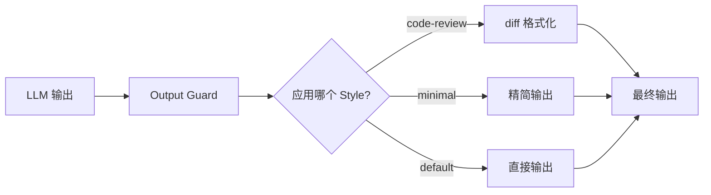

# 第17章 Output Styles：可插拔的输出格式化

> **本章目标**：理解 pi 的 Output Guard 系统——如何通过 frontmatter 控制输出的格式、语气、安全检查。
>
> **pi 源码对照**：
> - `packages/coding-agent/src/core/output-guard.ts` — Output Guard 实现
> - `packages/coding-agent/src/utils/frontmatter.ts` — frontmatter 解析
>
> **本章结束能做什么**：能定义自定义 Output Style，配置输出格式和安全策略。
> **前置阅读**：第1章（架构总览）。

---

## 1. Output Styles 解决的问题

Code Agent 的输出面向不同场景需要不同格式：

- **代码审查**：需要 diff 视图、注释高亮
- **日志记录**：需要时间戳、分类标签
- **用户展示**：需要友好的格式、进度条
- **安全审查**：需要过滤敏感信息、警告标记

**Output Styles 的本质**：用 frontmatter 配置输出格式规则，Agent 自动应用。

---

## 2. frontmatter 配置格式

```markdown
---
name: code-review
description: Output format for code review feedback
output:
  format: diff
  show-line-numbers: true
  max-delta: 50
security:
  filter-secrets: true
  redact-api-keys: true
---
```

---

## 3. Output Guard 架构

```typescript
// core/output-guard.ts
export class OutputGuard {
    constructor(private config: OutputStyleConfig) {}

    process(output: string): ProcessedOutput {
        let result = output

        if (this.config.output?.filterSecrets) {
            result = this.filterSecrets(result)
        }

        if (this.config.output?.redactApiKeys) {
            result = this.redactApiKeys(result)
        }

        return {
            content: result,
            warnings: this.warnings,
            metadata: this.metadata,
        }
    }
}
```

---

## 4. 内置样式

pi 内置几种输出样式：

| 样式 | 用途 | 关键配置 |
|------|------|----------|
| `default` | 通用输出 | 无特殊过滤 |
| `code-review` | diff 视图 | show-line-numbers, max-delta |
| `minimal` | 最小输出 | strip-comments, compact-format |
| `verbose` | 详细日志 | include-timestamps, include-stack-traces |

---

## 5. 与 System Prompt 的关系

Output Style 不是 system prompt 的一部分，而是**输出后处理**：



---

## 6. 安全过滤

### 6.1 敏感信息过滤

```typescript
// core/output-guard.ts
private filterSecrets(text: string): string {
    // 过滤 API Keys
    text = text.replace(/sk-[a-zA-Z0-9]{32,}/g, '[REDACTED_API_KEY]')

    // 过滤 Bearer Tokens
    text = text.replace(/Bearer\s+[a-zA-Z0-9\-_]+\.[a-zA-Z0-9\-_]+\.[a-zA-Z0-9\-_]+/g, '[REDACTED_TOKEN]')

    // 过滤私钥
    text = text.replace(/-----BEGIN\s+(RSA|DSA|EC|OPENSSH)\s+PRIVATE KEY-----/g, '[REDACTED_PRIVATE_KEY]')

    return text
}
```

### 6.2 警告注入

当检测到敏感信息被过滤时，自动注入警告：

```typescript
if (this.filteredCount > 0) {
    this.warnings.push({
        type: 'sensitive-data-filtered',
        count: this.filteredCount,
        suggestion: 'Use environment variables for secrets'
    })
}
```

---

## 7. 自定义 Output Style

### 7.1 定义新的 Style

在 `~/.pi/styles/` 或项目 `.pi/styles/` 中添加 Markdown 文件：

```markdown
---
name: my-project-style
description: Custom output format for my project
output:
  format: custom
  prefix: "[my-project] "
  timestamp: true
security:
  filter-secrets: true
---

# Custom Output Style

This style is used for my project's specific requirements.
```

### 7.2 加载链路

```typescript
// core/output-guard.ts: loadStyles()
export function loadStyles(stylesDir: string): OutputStyle[] {
    const files = readdirSync(stylesDir).filter(f => f.endsWith('.md'))

    return files.map(file => {
        const content = readFileSync(join(stylesDir, file), 'utf-8')
        const { frontmatter } = parseFrontmatter(content)
        return {
            name: frontmatter.name || basename(file, '.md'),
            description: frontmatter.description,
            config: frontmatter,
        }
    })
}
```

---

## 8. 样式优先级

当多个样式匹配时，按以下优先级应用：

1. **命令行指定**：`--style code-review`
2. **项目配置**：`.pi/config.yaml` 中的 `output.style`
3. **会话默认值**：`default` 样式

---

## 9. 实践要点

1. **不要在 prompt 里硬编码格式**——用 Output Style 分离关注点
2. **敏感过滤要保守**——宁可多过滤也不要漏
3. **警告要可操作**——给出修复建议而不仅仅是"发现敏感信息"

---

> **下一步阅读**：[第18章 Eval 与可观测性](./chapter-18-eval-and-observability.md) — 理解 pi 的评测体系。
