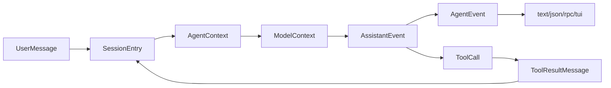

# 18. 协议与数据结构总表

## 18.1 本章要解决的问题

读者复刻失败通常不是因为不知道“要有 provider、tool、session”，而是因为各层数据结构混在一起：provider event 被当成 agent event，tool call 被当成 shell 字符串，session entry 被当成 transcript，RPC line 被当成 stdout 文本。

本章把前 17 章的协议集中成总表。读者可以把这一章当成两张表：真实 Pi 协议表用于对接当前仓库；mini 教学协议表用于从零实现时降低复杂度。两者不能混用。

## 18.2 当前 Pi 源码锚点

| 协议 | Pi 源码锚点 |
|---|---|
| LLM context | [types.ts#L327](packages/ai/src/types.ts#L327) |
| Assistant stream event | [types.ts#L340](packages/ai/src/types.ts#L340) |
| Provider dispatch | [stream.ts#L43](packages/ai/src/stream.ts#L43) |
| Tool definition | [types.ts#L47](packages/agent/src/types.ts#L47) |
| Session context build | [session.ts#L22](packages/agent/src/harness/session/session.ts#L22) |
| JSONL repo | [jsonl-repo.ts#L75](packages/agent/src/harness/session/jsonl-repo.ts#L75) |
| RPC request/response | [rpc-types.ts#L19](packages/coding-agent/src/modes/rpc/rpc-types.ts#L19) |
| JSON mode docs | [json.md#L9](packages/coding-agent/docs/json.md#L9) |
| RPC mode docs | [rpc.md#L19](packages/coding-agent/docs/rpc.md#L19) |
| Session format docs | [session-format.md#L72](packages/coding-agent/docs/session-format.md#L72) |
| Custom provider docs | [custom-provider.md#L448](packages/coding-agent/docs/custom-provider.md#L448) |

## 18.3 协议关系图



## 18.4 Core Interfaces

mini 版只需要这些核心类型：

```ts
export interface Runtime {
  readonly cwd: string;
  readonly session: SessionStore;
  readonly providerRegistry: ProviderRegistry;
  readonly tools: ToolRegistry;
  readonly resources: ResourceLoader;
  createSession(): Promise<AgentSessionFacade>;
}

export interface AgentSessionFacade {
  prompt(input: string): Promise<void>;
  continue(): Promise<void>;
  abort(): void;
  subscribe(listener: (event: AgentEvent) => void): () => void;
}

export interface Host {
  run(session: AgentSessionFacade, initialPrompt?: string): Promise<number>;
  rebind?(session: AgentSessionFacade): Promise<void>;
}
```

禁止依赖：

- `Provider` 禁止依赖 `ToolRegistry`。
- `Tool` 禁止依赖 `Host`。
- `Host` 禁止直接写 JSONL。
- `SessionStore` 禁止调用 provider。

## 18.5 AssistantMessageEvent

真实 Pi provider 输出的是 `AssistantMessageEvent`。字段以 [types.ts#L347](packages/ai/src/types.ts#L347) 为准，custom provider 文档要求相同的 start/content/done-or-error 顺序，见 [custom-provider.md#L448](packages/coding-agent/docs/custom-provider.md#L448)：

```ts
export type AssistantMessageEvent =
  | { type: "start"; partial: AssistantMessage }
  | { type: "text_start"; contentIndex: number; partial: AssistantMessage }
  | { type: "text_delta"; contentIndex: number; delta: string; partial: AssistantMessage }
  | { type: "text_end"; contentIndex: number; content: string; partial: AssistantMessage }
  | { type: "thinking_start"; contentIndex: number; partial: AssistantMessage }
  | { type: "thinking_delta"; contentIndex: number; delta: string; partial: AssistantMessage }
  | { type: "thinking_end"; contentIndex: number; content: string; partial: AssistantMessage }
  | { type: "toolcall_start"; contentIndex: number; partial: AssistantMessage }
  | { type: "toolcall_delta"; contentIndex: number; delta: string; partial: AssistantMessage }
  | { type: "toolcall_end"; contentIndex: number; toolCall: ToolCall; partial: AssistantMessage }
  | { type: "done"; reason: "stop" | "length" | "toolUse"; message: AssistantMessage }
  | { type: "error"; reason: "aborted" | "error"; error: AssistantMessage };
```

真实 tool call block 使用 `arguments` 字段，custom provider 示例见 [custom-provider.md#L489](packages/coding-agent/docs/custom-provider.md#L489)：

```json
{"type":"toolcall_end","contentIndex":1,"toolCall":{"type":"toolCall","id":"call_1","name":"read","arguments":{"path":"package.json"}},"partial":{}}
```

mini 教学协议可以内部省略 `partial` 和 `*_start`/`*_end`，但映射到真实 Pi 时必须恢复 `toolCall`、`arguments` 和 content block index。

## 18.6 AgentEvent 与 AgentSessionEvent

真实 Agent loop 输出 `AgentEvent`，字段以 [types.ts#L403](packages/agent/src/types.ts#L403) 为准。coding-agent 在外层扩展成 `AgentSessionEvent`，加入 queue、compaction、retry 等 session 事件，见 [agent-session.ts#L122](packages/coding-agent/src/core/agent-session.ts#L122)。JSON mode 输出这些 session events，文档见 [json.md#L9](packages/coding-agent/docs/json.md#L9)。

```ts
export type AgentEvent =
  | { type: "agent_start" }
  | { type: "agent_end"; messages: AgentMessage[] }
  | { type: "turn_start" }
  | { type: "turn_end"; message: AgentMessage; toolResults: ToolResultMessage[] }
  | { type: "message_start"; message: AgentMessage }
  | { type: "message_update"; message: AgentMessage; assistantMessageEvent: AssistantMessageEvent }
  | { type: "message_end"; message: AgentMessage }
  | { type: "tool_execution_start"; toolCallId: string; toolName: string; args: any }
  | { type: "tool_execution_update"; toolCallId: string; toolName: string; args: any; partialResult: any }
  | { type: "tool_execution_end"; toolCallId: string; toolName: string; result: any; isError: boolean };
```

真实 JSON event 示例来自 [json.md#L58](packages/coding-agent/docs/json.md#L58)：

```json
{"type":"message_update","message":{...},"assistantMessageEvent":{"type":"text_delta","contentIndex":0,"delta":"Hello","partial":{...}}}
```

关键区别：`AssistantMessageEvent` 来自 provider adapter；`AgentEvent` 来自 harness；`AgentSessionEvent` 是 coding-agent host 看到的扩展事件。mini 版可以定义 `assistant_delta` 之类的 host event，但那不是当前 Pi JSON mode 的真实事件名。

## 18.7 ToolDefinition 与 ToolResult

工具定义给模型看，工具结果给模型和 session 看。真实 Pi 的 tool schema 来自 `pi-ai` 的 `Tool` 接口，见 [types.ts#L327](packages/ai/src/types.ts#L327)；runtime tool 在 agent 层扩展为带 `execute()` 的 `AgentTool`，见 [types.ts#L360](packages/agent/src/types.ts#L360)：

```ts
export interface Tool<TParameters extends TSchema = TSchema> {
  name: string;
  description: string;
  parameters: TParameters;
}

export interface AgentTool<TParameters extends TSchema = TSchema, TDetails = any> extends Tool<TParameters> {
  label: string;
  execute(
    toolCallId: string,
    params: Static<TParameters>,
    signal?: AbortSignal,
    onUpdate?: AgentToolUpdateCallback<TDetails>,
  ): Promise<AgentToolResult<TDetails>>;
  executionMode?: ToolExecutionMode;
}
```

真实 `ToolResultMessage` 来自 [types.ts#L292](packages/ai/src/types.ts#L292)，session format 文档同样列出该形状，见 [session-format.md#L93](packages/coding-agent/docs/session-format.md#L93)：

```ts
export interface ToolResultMessage<TDetails = any> {
  role: "toolResult";
  toolCallId: string;
  toolName: string;
  content: (TextContent | ImageContent)[];
  details?: TDetails;
  isError: boolean;
  timestamp: number;
}
```

错误也必须是 tool result：

```json
{"role":"toolResult","toolCallId":"call_2","toolName":"write","content":[{"type":"text","text":"Tool write is disabled in review mode."}],"isError":true,"timestamp":1767225600000}
```

## 18.8 JSONL Session Entry

真实 Pi session 文件是 JSONL，第一行 `type: "session"`，当前版本为 v3，entry 通过 `id`/`parentId` 形成树，见 [session-format.md#L1](packages/coding-agent/docs/session-format.md#L1) 和 [session-format.md#L184](packages/coding-agent/docs/session-format.md#L184)。`SessionManager.appendMessage()` 写入 message entry 的真实字段见 [session-manager.ts#L876](packages/coding-agent/src/core/session-manager.ts#L876)。

真实 session 片段：

```jsonl
{"type":"session","version":3,"id":"s1","timestamp":"2026-05-31T00:00:00.000Z","cwd":"/repo"}
{"type":"message","id":"e1","parentId":null,"timestamp":"2026-05-31T00:00:01.000Z","message":{"role":"user","content":"read package","timestamp":1767225601000}}
{"type":"message","id":"e2","parentId":"e1","timestamp":"2026-05-31T00:00:02.000Z","message":{"role":"assistant","content":[{"type":"toolCall","id":"call_1","name":"read","arguments":{"path":"package.json"}}],"api":"faux","provider":"faux","model":"scripted","usage":{"input":0,"output":0,"cacheRead":0,"cacheWrite":0,"totalTokens":0,"cost":{"input":0,"output":0,"cacheRead":0,"cacheWrite":0,"total":0}},"stopReason":"toolUse","timestamp":1767225602000}}
{"type":"message","id":"e3","parentId":"e2","timestamp":"2026-05-31T00:00:03.000Z","message":{"role":"toolResult","toolCallId":"call_1","toolName":"read","content":[{"type":"text","text":"{\"name\":\"pi\"}"}],"isError":false,"timestamp":1767225603000}}
```

compaction entry：

```json
{"type":"compaction","id":"c1","parentId":"e20","summary":"The user is inspecting package metadata.","firstKeptEntryId":"e17","tokensBefore":39000}
```

真实 entry 类型还包括 `model_change`、`thinking_level_change`、`branch_summary`、`custom`、`custom_message`、`label`、`session_info`，文档入口见 [session-format.md#L210](packages/coding-agent/docs/session-format.md#L210)。mini 版可以先实现 `session/message/compaction`，但如果要兼容 Pi 的 `/tree`、extension state、labels 和 display name，就必须补齐这些 entry。

## 18.9 RPC JSONL

RPC 是 host 协议，不是 agent 内核。真实 RPC command 是 stdin JSONL，response/event 是 stdout JSONL，LF framing 规则见 [rpc.md#L19](packages/coding-agent/docs/rpc.md#L19)。命令 union 以 [rpc-types.ts#L19](packages/coding-agent/src/modes/rpc/rpc-types.ts#L19) 为准。

```jsonl
{"id":"r1","type":"prompt","message":"read package"}
{"id":"r1","type":"response","command":"prompt","success":true}
{"type":"tool_execution_start","toolCallId":"call_1","toolName":"read","args":{"path":"package.json"}}
```

验收标准：

- 每行必须是完整 JSON。
- response 必须带 request id。
- event 不需要 request id，真实事件类型表见 [rpc.md#L740](packages/coding-agent/docs/rpc.md#L740)。
- 普通日志只能写 stderr。

## 18.10 验收清单

- 能区分 provider event、agent event、session entry、RPC line。
- 能写出一次 tool call 的完整 JSONL session。
- 能解释 tool schema 和 tool executor 的关系。
- 能说明为什么错误 tool call 也要变成 toolResult。
- 能用本章类型实现第 17 章 mini agent。

## 18.11 源码片段与协议映射

mini 的 `ModelContext` 直接映射 Pi 的 LLM context。源码位置：[types.ts#L327](packages/ai/src/types.ts#L327)，stream event union 从 [types.ts#L347](packages/ai/src/types.ts#L347) 开始。

```ts
export interface Tool<TParameters extends TSchema = TSchema> {
	name: string;
	description: string;
	parameters: TParameters;
}

export interface Context {
	systemPrompt?: string;
	messages: Message[];
	tools?: Tool[];
}
```

这段代码定义了模型能看到的全部输入：system prompt、messages、tools。它没有 cwd、session path、auth file、TUI state。mini 版如果把这些 runtime 私有状态塞进 `ModelContext`，就会把模型协议和本地执行边界混在一起。

provider 分发由 `model.api` 决定。源码位置：[stream.ts#L43](packages/ai/src/stream.ts#L43)，返回 provider stream 的位置是 [stream.ts#L48](packages/ai/src/stream.ts#L48)。

```ts
export function streamSimple<TApi extends Api>(
	model: Model<TApi>,
	context: Context,
	options?: SimpleStreamOptions,
): AssistantMessageEventStream {
	const provider = resolveApiProvider(model.api);
	return provider.streamSimple(model, context, options);
}
```

这段代码解释了为什么协议总表必须区分 `provider` 和 `api`。`provider` 面向用户、鉴权和配置；`api` 面向协议适配器。mini 版可以只有 `faux` 一个 api，但类型上仍要保留这个分离。

session entry 的核心字段来自 Pi 的 append 逻辑。源码位置：[session-manager.ts#L876](packages/coding-agent/src/core/session-manager.ts#L876)，`parentId` 写入见 [session-manager.ts#L880](packages/coding-agent/src/core/session-manager.ts#L880)。

```ts
const entry: SessionMessageEntry = {
	type: "message",
	id: generateId(this.byId),
	parentId: this.leafId,
	timestamp: new Date().toISOString(),
	message,
};
```

这段代码是 JSONL DAG 的最小事实。mini 版必须保存 `id`、`parentId`、`timestamp`、`message`；只保存 messages 数组无法实现 fork、tree、compaction 和审计。
