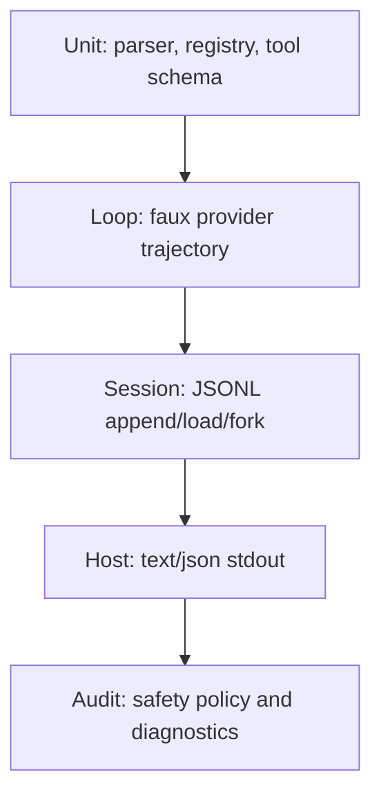

# 19. Faux Provider、测试与回放验收

## 19.1 本章要解决的问题

真实模型不稳定、有成本、需要凭证，也不适合作为复刻项目的第一条质量门禁。Pi 的核心行为必须先能在 faux provider 下被确定性回放：模型发什么 tool call，runtime 执行什么工具，toolResult 如何回灌，session 如何保存，host 输出什么事件。

如果没有 faux provider 和 golden trajectory，读者只能手工观察“看起来能跑”。这达不到“只读此书即可复刻”的标准。

## 19.2 当前 Pi 源码锚点

| 测试关注点 | Pi 源码锚点 |
|---|---|
| Agent loop 入口 | [agent-loop.ts#L95](packages/agent/src/agent-loop.ts#L95) |
| 工具执行入口 | [agent-loop.ts#L628](packages/agent/src/agent-loop.ts#L628) |
| JSONL repo create | [jsonl-repo.ts#L75](packages/agent/src/harness/session/jsonl-repo.ts#L75) |
| message append | [session-manager.ts#L876](packages/coding-agent/src/core/session-manager.ts#L876) |
| compaction result | [compaction.ts#L102](packages/coding-agent/src/core/compaction/compaction.ts#L102) |
| stdout guard | [output-guard.ts#L45](packages/coding-agent/src/core/output-guard.ts#L45) |
| Assistant stream event | [types.ts#L347](packages/ai/src/types.ts#L347) |
| faux provider tool call event | [faux.ts#L378](packages/ai/src/providers/faux.ts#L378) |
| Agent event union | [types.ts#L403](packages/agent/src/types.ts#L403) |
| JSON mode event docs | [json.md#L9](packages/coding-agent/docs/json.md#L9) |

## 19.3 测试金字塔



顺序不能反过来。先测 provider adapter 或 TUI，会让核心 loop 的错误被 UI 噪声掩盖。

## 19.4 Faux Provider Script

faux provider 应该用脚本定义每次模型响应，但脚本事件必须使用 Pi 的真实 assistant stream 命名。真实类型见 [types.ts#L347](packages/ai/src/types.ts#L347)：工具调用完成事件叫 `toolcall_end`，字段是 `toolCall`；工具参数在 `ToolCall.arguments` 上。Pi faux provider 也是用这个形状写出事件，源码见 [faux.ts#L378](packages/ai/src/providers/faux.ts#L378)。

```ts
export interface FauxStep {
  when: "first" | "afterToolResult";
  events: AssistantMessageEvent[];
}

export const readPackageTrajectory: FauxStep[] = [
  {
    when: "first",
    events: [
      { type: "start", partial: firstPartial },
      { type: "text_start", contentIndex: 0, partial: firstPartial },
      { type: "text_delta", contentIndex: 0, delta: "I will read package.json.", partial: firstPartial },
      { type: "text_end", contentIndex: 0, content: "I will read package.json.", partial: firstPartial },
      {
        type: "toolcall_end",
        contentIndex: 1,
        toolCall: { type: "toolCall", id: "call_1", name: "read", arguments: { path: "package.json" } },
        partial: firstMessage,
      },
      { type: "done", reason: "toolUse", message: firstMessage },
    ],
  },
  {
    when: "afterToolResult",
    events: [
      { type: "start", partial: secondPartial },
      { type: "text_delta", contentIndex: 0, delta: "The package name is pi.", partial: secondPartial },
      { type: "done", reason: "stop", message: secondMessage },
    ],
  },
];
```

这里的 `firstPartial`、`firstMessage`、`secondPartial`、`secondMessage` 都是 `AssistantMessage`；完整字段包括 `api`、`provider`、`model`、`usage`、`stopReason`、`timestamp`，真实 session 形状见 [session-format.md#L81](packages/coding-agent/docs/session-format.md#L81)。provider 根据 context 中是否已有 `role: "toolResult"` 的消息选择 step。这样测试能稳定验证两轮闭环。

## 19.5 Golden Trajectory

一次成功回放应产生真实 `AgentEvent`/`AgentSessionEvent`，事件名来自 [types.ts#L403](packages/agent/src/types.ts#L403) 与 [agent-session.ts#L122](packages/coding-agent/src/core/agent-session.ts#L122)。下面是用于 golden test 的关键相位；真实 JSON mode 第一行还会先写 session header，格式见 [json.md#L58](packages/coding-agent/docs/json.md#L58)。

```jsonl
{"type":"agent_start"}
{"type":"turn_start"}
{"type":"message_update","message":{"role":"assistant","content":[{"type":"text","text":"I will read package.json."}]},"assistantMessageEvent":{"type":"text_delta","contentIndex":0,"delta":"I will read package.json.","partial":{}}}
{"type":"message_update","message":{"role":"assistant","content":[{"type":"text","text":"I will read package.json."},{"type":"toolCall","id":"call_1","name":"read","arguments":{"path":"package.json"}}]},"assistantMessageEvent":{"type":"toolcall_end","contentIndex":1,"toolCall":{"type":"toolCall","id":"call_1","name":"read","arguments":{"path":"package.json"}},"partial":{}}}
{"type":"tool_execution_start","toolCallId":"call_1","toolName":"read","args":{"path":"package.json"}}
{"type":"tool_execution_end","toolCallId":"call_1","toolName":"read","result":{"content":[{"type":"text","text":"{\"name\":\"pi\"}"}]},"isError":false}
{"type":"message_end","message":{"role":"toolResult","toolCallId":"call_1","toolName":"read","content":[{"type":"text","text":"{\"name\":\"pi\"}"}],"isError":false,"timestamp":1767225600000}}
{"type":"turn_end","message":{"role":"assistant","content":[{"type":"text","text":"I will read package.json."},{"type":"toolCall","id":"call_1","name":"read","arguments":{"path":"package.json"}}]},"toolResults":[{"role":"toolResult","toolCallId":"call_1","toolName":"read","content":[{"type":"text","text":"{\"name\":\"pi\"}"}],"isError":false,"timestamp":1767225600000}]}
{"type":"turn_start"}
{"type":"message_update","message":{"role":"assistant","content":[{"type":"text","text":"The package name is pi."}]},"assistantMessageEvent":{"type":"text_delta","contentIndex":0,"delta":"The package name is pi.","partial":{}}}
{"type":"agent_end","messages":[]}
```

这些 JSON 行是关键相位，不是完整事件列表；完整实现还会包含 `message_start`、更多 `message_update`、`message_end` 和 `turn_end`。对应 session 必须包含 user、assistant toolCall、toolResult、assistant text 四类消息。只断言最终文本是不够的。`assistant_delta`、`tool_start`、`tool_result`、`sessionId` 不是当前 Pi JSON mode 的真实字段；如果 mini 版为了教学保留这些字段，必须在兼容层之前转换为真实事件。

## 19.6 测试用例

最小测试集：

```ts
test("runs a tool call trajectory", async () => {
  const events: AgentEvent[] = [];
  const session = await createTempSession();
  const agent = await createMiniAgent({
    provider: createFauxProvider(readPackageTrajectory),
    tools: [createReadTool(fixtureCwd)],
    session,
    onEvent: (event) => events.push(event),
  });

  await agent.prompt("read package");

  expect(events.map((event) => event.type)).toContain("tool_execution_start");
  expect(events.map((event) => event.type)).toContain("tool_execution_end");
  expect(events).toContainEqual(
    expect.objectContaining({
      type: "message_update",
      assistantMessageEvent: expect.objectContaining({
        type: "toolcall_end",
        toolCall: expect.objectContaining({
          id: "call_1",
          name: "read",
          arguments: { path: "package.json" },
        }),
      }),
    }),
  );
  expect(await session.buildContext()).toContainEqual(
    expect.objectContaining({ role: "toolResult", toolCallId: "call_1", toolName: "read", isError: false }),
  );
});
```

失败测试也必须存在：

```ts
test("disabled tool becomes a tool result instead of crashing", async () => {
  const agent = await createMiniAgent({
    provider: createFauxProvider(readPackageTrajectory),
    tools: [],
    session: await createTempSession(),
  });

  await agent.prompt("read package");
  const context = await agent.session.buildContext();
  expect(context.messages).toContainEqual(
    expect.objectContaining({ role: "toolResult", toolName: "read", isError: true }),
  );
});
```

## 19.7 验收命令

推荐命令：

```bash
npm run test:mini -- golden-trajectory
npm run mini -- --provider faux --mode json -p "read package" > tmp/events.jsonl
node scripts/assert-json-lines.js tmp/events.jsonl
```

期望：

- 测试能离线运行。
- 不需要 API key。
- JSONL 每行可解析。
- JSON mode 第一行是 session header，后续行是 `AgentSessionEvent`。
- session 文件包含完整工具轨迹。

## 19.8 常见错误

- 错误：测试只断言最终 assistant 文本。后果：toolResult 没回灌也可能通过。
- 错误：faux provider 直接返回最终答案。后果：没有覆盖 tool call 闭环。
- 错误：测试用 `call/args` 或 `role: "tool"` 当作 Pi 协议。后果：mini 通过，真实 JSON/RPC 或 session 兼容失败。
- 错误：测试写死临时目录绝对路径。后果：跨平台失败。
- 错误：JSON host 测试混入 stderr。后果：stdout 协议污染不会被发现。

## 19.9 验收清单

- 能写出至少一条两轮 faux trajectory。
- 能断言 event 顺序、session entry、toolResult 内容。
- 能验证 disabled tool 不崩溃。
- 能验证 abort 会停止 provider 和工具。
- 能用 JSON host 输出做机器解析测试。
- 能说明哪些测试必须 faux，哪些测试可以接真实 provider。

## 19.10 源码片段与测试映射

faux trajectory 要覆盖 Pi loop 的真实分支，而不是只覆盖最终文本。源码位置：[agent-loop.ts#L192](packages/agent/src/agent-loop.ts#L192)，tool call 过滤见 [agent-loop.ts#L202](packages/agent/src/agent-loop.ts#L202)。

```ts
const message = await streamAssistantResponse(currentContext, config, signal, emit, streamFn);
newMessages.push(message);

if (message.stopReason === "error" || message.stopReason === "aborted") {
	await emit({ type: "turn_end", message, toolResults: [] });
	await emit({ type: "agent_end", messages: newMessages });
	return;
}

const toolCalls = message.content.filter((c) => c.type === "toolCall");
```

这段代码给测试设计定了边界：测试必须覆盖成功 assistant、error/aborted assistant、tool call assistant 三类输出。只测试最终 answer 无法证明 loop 正确。

工具 hook 可以阻止执行并生成错误 tool result。源码位置：[types.ts#L49](packages/agent/src/types.ts#L49)，阻止语义见 [types.ts#L52](packages/agent/src/types.ts#L52)。

```ts
/**
 * Returning `{ block: true }` prevents the tool from executing. The loop emits an error tool result instead.
 * `reason` becomes the text shown in that error result. If omitted, a default blocked message is used.
 */
export interface BeforeToolCallResult {
	block?: boolean;
	reason?: string;
}
```

这段代码说明失败测试必须断言“被阻止的工具变成 toolResult”，而不是断言进程抛错。mini 版可以没有完整 hook 系统，但安全策略阻止工具时也要走同样的 toolResult 路径。

JSON host 的测试必须保护 stdout。源码位置：[print-mode.ts#L102](packages/coding-agent/src/modes/print-mode.ts#L102)，JSON 写出见 [print-mode.ts#L105](packages/coding-agent/src/modes/print-mode.ts#L105)。

```ts
unsubscribe = session.subscribe((event) => {
	if (mode === "json") {
		writeRawStdout(`${JSON.stringify(event)}\n`);
	}
});
```

这段代码决定了 `assert-json-lines` 的验收对象：stdout 每一行都必须是 session event JSON。普通日志、warning、debug 不应进入 stdout。
