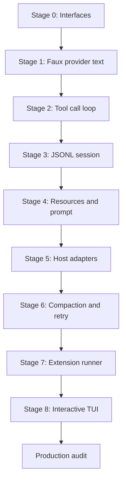

# 20. 最终复刻路线与生产审计

## 20.1 本章要解决的问题

完成 demo 不等于复刻 Pi。一个本地 coding agent 必须能解释边界、回放轨迹、限制权限、恢复会话、诊断错误。最后一章给出阶段路线和审计表，帮助读者判断自己的 mini Pi 是否真正达到本书目标。

## 20.2 当前 Pi 源码锚点

| 审计项 | Pi 源码锚点 |
|---|---|
| stdout guard | [output-guard.ts#L45](packages/coding-agent/src/core/output-guard.ts#L45) |
| auth file permission | [auth-storage.ts#L67](packages/coding-agent/src/core/auth-storage.ts#L67) |
| bash output metadata | [bash-executor.ts#L22](packages/coding-agent/src/core/bash-executor.ts#L22) |
| bash full output temp file | [bash-executor.ts#L64](packages/coding-agent/src/core/bash-executor.ts#L64) |
| active tools | [index.ts#L81](packages/coding-agent/src/core/tools/index.ts#L81) |
| keybinding defaults | [keybindings.ts#L63](packages/coding-agent/src/core/keybindings.ts#L63) |
| retry classifier | [agent-session.ts#L2429](packages/coding-agent/src/core/agent-session.ts#L2429) |

## 20.3 阶段路线



不要跳过 Stage 1-3 直接做 TUI。TUI 是视图，无法证明 agent 内核正确。

## 20.4 P0 审计表

这些项不满足，就不能说已经复刻 Pi 核心：

| P0 项 | 通过标准 | 失败信号 |
|---|---|---|
| Provider 解耦 | agent loop 只消费 `AssistantMessageEvent` | loop 中出现厂商 SDK raw event |
| 协议字段真实 | assistant event 使用 `toolCall/arguments`，tool result 使用 `role: "toolResult"` | `call/args/role: "tool"` 直接出现在 JSON/session/RPC 兼容层 |
| Tool 执行权 | 模型只输出 tool call，runtime 执行 | provider 或 prompt 直接执行 shell |
| ToolResult 回灌 | `ToolResultMessage` 进入下一轮 model context | 模型靠猜测工具执行结果继续回答 |
| Session append-only | 每条事实一行 JSONL | resume 只恢复最终 transcript |
| Host 无业务状态 | text/json/rpc/tui 共享 facade | 不同 host 得到不同历史 |
| stdout 纯净 | json/rpc stdout 只有协议行 | warning/debug 混入 stdout |
| JSON/RPC 可追溯 | JSON 输出 `AgentSessionEvent`，RPC 命令匹配 `RpcCommand` | 自造 `method/sessionId/assistant_delta` 协议 |
| 权限策略 | read/write/bash/extension 可配置 | 只读模式仍能写文件 |
| Faux 测试 | 离线回放 tool trajectory | 测试必须调用真实模型 |

## 20.5 P1 审计表

这些项决定复刻品是否接近 Pi 的生产形态：

| P1 项 | 通过标准 |
|---|---|
| CWD 绑定服务 | resume/fork 后重建 settings/resources/model registry |
| Model registry | 区分 model/provider/api/auth source |
| ResourceLoader | 资源发现和 prompt 拼接分离 |
| Compaction | 追加 summary entry，不删除历史 |
| Retry | overflow、429/500、普通错误分开处理 |
| Extension runner | extension 只能通过 runner/hook 注册能力 |
| TUI abort | Escape 影响 provider stream 和本地工具 |
| Diagnostics | 错误能定位到 resource/provider/tool/session/host 层 |

## 20.6 最终验收脚本

建议读者把最终验收写成一个脚本：

```bash
set -e

npm run test:mini -- interfaces
npm run test:mini -- golden-trajectory
npm run test:mini -- session-jsonl
npm run test:mini -- stdout-json
npm run test:mini -- safety-policy

npm run mini -- --provider faux -p "read package"
npm run mini -- --provider faux --mode json -p "read package" > tmp/events.jsonl
node scripts/assert-json-lines.js tmp/events.jsonl
```

每条命令都应该能离线运行。真实 provider 测试可以作为 smoke test，但不能作为核心回归测试。

## 20.7 读者应能复述的核心原理

读完本书后，读者必须能用自己的话说明：

- Pi 为什么不是 CLI wrapper。
- `AgentSession` 为什么不是 UI，也不是 provider。
- provider stream 为什么不能知道文件系统。
- tool schema 和 tool executor 为什么必须分离。
- toolResult 为什么必须回灌给下一轮模型。
- session 为什么是 DAG，而不是 transcript。
- compaction 为什么是未来 context 的替身，而不是删除历史。
- host adapter 为什么必须 rebind session replacement。
- extension 为什么必须通过 runner/runtime 进入系统。
- stdout guard 为什么是 JSON/RPC 模式的可靠性边界。

## 20.8 不该在 mini 版中强行实现的能力

这些能力可以延后：

- 完整 OAuth/device code flow。
- 多厂商 provider 的全部细节。
- 完整 TUI markdown、图片粘贴、IME 和终端协议。
- package manager 和供应链校验。
- 复杂 extension UI。
- 远程 sandbox。
- 真实 token 估算和高质量 compaction summary。

延后不是省略边界。mini 版仍要保留接口位置，避免将来加能力时破坏核心 DAG。

## 20.9 验收清单

- 能用 P0 表逐项检查自己的 mini Pi。
- 能跑通离线 golden trajectory。
- 能证明 JSON stdout 没有污染。
- 能从 JSONL session 重建上下文。
- 能解释每个生产级暂缓项为什么暂缓，以及未来插入哪个边界。
- 能把 mini 版每个文件映射回 Pi 的源码边界。

## 20.10 源码片段与审计映射

JSON/RPC 的 P0 审计来自 stdout guard。源码位置：[output-guard.ts#L45](packages/coding-agent/src/core/output-guard.ts#L45)，stdout 重定向到 stderr 的实现见 [output-guard.ts#L54](packages/coding-agent/src/core/output-guard.ts#L54)。

```ts
export function takeOverStdout(): void {
	if (stdoutTakeoverState) {
		return;
	}

	const rawStdoutWrite = process.stdout.write.bind(process.stdout) as StdoutTakeoverState["rawStdoutWrite"];
	const rawStderrWrite = process.stderr.write.bind(process.stderr) as StdoutTakeoverState["rawStderrWrite"];
	process.stdout.write = ((chunk, encodingOrCallback, callback): boolean => {
		return rawStderrWrite(String(chunk), callback);
	}) as typeof process.stdout.write;
}
```

这段代码对应 P0 项“stdout 纯净”。mini 版可以不实现完整 queue，但必须保证 JSON/RPC 模式中只有协议函数能写 stdout。

bash 工具的审计来自结构化结果。源码位置：[bash-executor.ts#L22](packages/coding-agent/src/core/bash-executor.ts#L22)，完整输出临时文件见 [bash-executor.ts#L64](packages/coding-agent/src/core/bash-executor.ts#L64)。

```ts
export interface BashResult {
	output: string;
	exitCode: number | undefined;
	cancelled: boolean;
	truncated: boolean;
	fullOutputPath?: string;
}

const ensureTempFile = () => {
	const id = randomBytes(8).toString("hex");
	tempFilePath = join(tmpdir(), `pi-bash-${id}.log`);
	tempFileStream = createWriteStream(tempFilePath);
};
```

这段代码对应 P0/P1 项“工具输出可审计”。mini 版可以先只截断输出，但必须保留 `cancelled`、`truncated`、`fullOutputPath` 这样的结构位置，否则长输出要么压爆上下文，要么无法追溯。

## 20.11 事实追溯与交付物检查

最终审计不只检查 mini Pi 是否能跑，还要检查书里每个“真实 Pi”判断是否能回到当前仓库。不能回到源码或 docs 的内容，只能标成教学假设，不能标成 Pi 行为。

| 主题 | 必须能追溯到 | 失败信号 |
|---|---|---|
| CLI 使用方式 | [usage.md#L32](packages/coding-agent/docs/usage.md#L32)、[usage.md#L120](packages/coding-agent/docs/usage.md#L120) | 书中命令行选项没有 docs 来源 |
| JSON mode | [json.md#L9](packages/coding-agent/docs/json.md#L9)、[print-mode.ts#L102](packages/coding-agent/src/modes/print-mode.ts#L102) | stdout 示例不是 `AgentSessionEvent` |
| RPC mode | [rpc.md#L19](packages/coding-agent/docs/rpc.md#L19)、[rpc-types.ts#L19](packages/coding-agent/src/modes/rpc/rpc-types.ts#L19) | RPC 示例使用自造 request/method 字段 |
| Session JSONL | [session-format.md#L1](packages/coding-agent/docs/session-format.md#L1)、[session-manager.ts#L876](packages/coding-agent/src/core/session-manager.ts#L876) | session 示例只有 transcript，没有 entry/DAG 结构 |
| Assistant stream | [types.ts#L347](packages/ai/src/types.ts#L347)、[custom-provider.md#L448](packages/coding-agent/docs/custom-provider.md#L448) | `call/args` 被写成真实 Pi event 字段 |
| Tool result | [types.ts#L292](packages/ai/src/types.ts#L292)、[session-format.md#L93](packages/coding-agent/docs/session-format.md#L93) | 工具结果用 `role: "tool"` 或布尔 `ok` |
| Agent event | [types.ts#L403](packages/agent/src/types.ts#L403)、[agent-session.ts#L122](packages/coding-agent/src/core/agent-session.ts#L122) | JSON/RPC 测试断言 `assistant_delta/tool_start` |
| stdout guard | [output-guard.ts#L45](packages/coding-agent/src/core/output-guard.ts#L45) | JSON/RPC 模式允许普通日志写 stdout |

交付 EPUB 或生成目录时，还要确认生成产物包含第 17-20 章。最小检查是先跑 `node book/validate.js`，再检查 `book/epub-content/content.opf` 是否包含 `chapter-20-final-replication-audit`。如果源码 Markdown 已更新但 EPUB 内容目录没有更新，读者拿到的仍是旧书。

## 20.12 课程闭环自测

课程型技术材料通常会给读者三样东西：明确收益、连续学习路径、结课测试。本书的对应关系如下：

| 学习闭环 | 本书位置 | 通过标准 |
|---|---|---|
| 明确收益 | README 的“你将获得” | 读者知道读完后要会解释、实现、验证什么 |
| 连续路径 | 第 1-16 章的 `本章实现关卡` | 每章都有新增文件、接口、命令和失败样例 |
| 汇总实现 | 第 17 章 | 能从空目录拼出 mini Pi-like agent |
| 协议参考 | 第 18 章 | 能区分真实 Pi 协议和 mini 教学协议 |
| 离线测试 | 第 19 章 | 能不用 API key 回放 tool trajectory |
| 结课审计 | 第 20 章 | 能用 P0/P1/P2 表判断是否达到目标 |

如果读者只能“看懂概念”，但不能完成第 17-20 章的实现、协议、测试、审计闭环，就还没有达到本书目标。

## 20.13 P2 完整复刻差距表

P0/P1 证明已经复刻 Pi 核心。要声称“一模一样复刻 Pi”，还必须继续补齐 P2。P2 不是本书 mini 版的最低要求，但它们是完整 Pi 产品的一部分，不能在完整复刻中省略。

| P2 项 | 当前 Pi 事实来源 | 完整复刻通过标准 |
|---|---|---|
| Package manager | [package-manager.ts#L92](packages/coding-agent/src/core/package-manager.ts#L92)、[package-manager.ts#L188](packages/coding-agent/src/core/package-manager.ts#L188) | 支持 extensions、skills、prompts、themes 资源类型的安装、启用、禁用和解析 |
| Theme discovery | [config.ts#L354](packages/coding-agent/src/config.ts#L354)、[config.ts#L480](packages/coding-agent/src/config.ts#L480)、[args.ts#L244](packages/coding-agent/src/cli/args.ts#L244) | 支持内置主题、自定义主题、`--theme` 和 `--no-themes` |
| HTML export | [rpc-types.ts#L57](packages/coding-agent/src/modes/rpc/rpc-types.ts#L57)、[index.ts#L236](packages/coding-agent/src/core/export-html/index.ts#L236)、[agent-session.ts#L2983](packages/coding-agent/src/core/agent-session.ts#L2983) | RPC 和 session facade 都能导出 HTML，并能渲染工具结果 |
| RPC extension UI | [rpc-types.ts#L213](packages/coding-agent/src/modes/rpc/rpc-types.ts#L213)、[rpc.md#L990](packages/coding-agent/docs/rpc.md#L990) | RPC client 能处理 select、confirm、input、editor、notify、status、widget、title 等 UI request/response |
| Keybindings | [keybindings.ts#L63](packages/coding-agent/src/core/keybindings.ts#L63)、[keybindings.ts#L205](packages/coding-agent/src/core/keybindings.ts#L205) | app 和 editor 快捷键都可配置，不能在 UI 里硬编码按键判断 |
| Session tree labels | [agent-session.ts#L2195](packages/coding-agent/src/core/agent-session.ts#L2195)、[tree-selector.ts#L302](packages/coding-agent/src/modes/interactive/components/tree-selector.ts#L302) | branch summary、label、session_info 能进入树视图、过滤和标签编辑 |
| Model/settings UI | [settings-selector.ts#L217](packages/coding-agent/src/modes/interactive/components/settings-selector.ts#L217)、[model-selector.ts#L151](packages/coding-agent/src/modes/interactive/components/model-selector.ts#L151) | interactive host 能调整 auto-compact、steering、follow-up、transport、thinking、theme、model scope 等设置 |
| Extension package resources | [package-manager.ts#L2220](packages/coding-agent/src/core/package-manager.ts#L2220)、[package-manager.ts#L2439](packages/coding-agent/src/core/package-manager.ts#L2439) | project/global resources 都能合并，包内 prompts、skills、extensions、themes 都能被发现 |

因此，本书第 1-20 章足以让新人达到 Pi 核心专家级理解，并能复刻核心 harness；如果目标是逐像素、逐命令、逐资源类型地复刻完整 Pi，需要继续阅读第 21-24 章，把 P2 项落实为资源平面、RPC/UI/export、interactive 产品面和最终矩阵。
