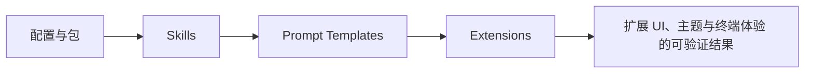

# 21. 扩展 UI、主题与终端体验

## 21.1 本章解决的问题

Pi Agent 不是只有命令行参数和模型输出。它的 interactive mode 是一个终端应用：有编辑器、消息列表、footer、选择器、弹窗、工具渲染、主题、图片、autocomplete、键盘事件。前端工程师要理解这一章，是因为扩展一旦需要用户确认、选择、输入或观察状态，就进入了 UI 层。

`packages/coding-agent/docs/usage.md` 把 interactive screen 拆成 `Startup header`、`Messages`、`Editor`、`Footer`。其中 editor 可以被 `/settings` 或 custom extension UI 临时替换。这说明 Pi 的 UI 不是“console.log 加颜色”，而是一个组件树在终端宽度约束下反复 render。

`packages/coding-agent/docs/tui.md` 给出组件接口：`render(width): string[]`、`handleInput?(data)`、`invalidate()`。这对前端工程师很熟悉：`render` 类似纯视图函数，`handleInput` 类似事件处理器，`invalidate` 类似清缓存和请求重绘前的状态失效。源码中 TUI 组件导出入口在 [index.ts#L31](packages/tui/src/index.ts#L31)，interactive mode 负责把这些组件嵌入 Pi 主界面，入口在 [interactive-mode.ts#L237](packages/coding-agent/src/modes/interactive/interactive-mode.ts#L237)。

本章在全书中承接第 20 章：你已经知道命令和工具怎么注册，现在要知道它们如何给用户一个可操作、可理解、可主题化的界面。它也为第 22 章 packages 铺路，因为 UI 扩展和 themes 最终都可以作为团队包分发。

## 21.2 最小可运行路径

只读这些文档：`packages/coding-agent/docs/tui.md`、`packages/coding-agent/docs/themes.md`、`packages/coding-agent/docs/extensions.md`、`packages/tui/README.md`。

最小 UI 扩展不需要模型。注册一个 `/pick` 命令，在 handler 里调用 `ctx.ui.custom()`，返回一个 `SelectList` 或自定义组件。`packages/coding-agent/docs/tui.md` 的 Pattern 1 已经展示用 `SelectList` 和 `DynamicBorder` 做选择对话框；Pattern 3 展示 `SettingsList`；Pattern 4 展示 `ctx.ui.setStatus()`；Pattern 6 展示 `ctx.ui.setFooter()`；Pattern 7 展示 `ctx.ui.setEditorComponent()`。

主题验证也保持最小：复制 `packages/coding-agent/docs/themes.md` 的 JSON 格式，放到 `~/.pi/agent/themes/my-theme.json`，用 `/settings` 选择。文档明确说 themes 来自 built-in、global、project、packages、settings、CLI，并且 `--no-themes` 可禁用发现。源码中的 theme schema 在 [theme-schema.json#L2](packages/coding-agent/src/modes/interactive/theme/theme-schema.json#L2)，运行时主题实现入口在 [theme.ts#L322](packages/coding-agent/src/modes/interactive/theme/theme.ts#L322)。

验证 UI 时不要只看“能不能显示”。要看四件事：终端变窄时每行是否不超过 width；按 Escape 是否能取消；主题切换后颜色是否更新；组件关闭后编辑器是否恢复。这些都来自 TUI 组件契约，而不是视觉偏好。

## 21.3 核心机制

扩展 UI 的主要入口在 `ExtensionUIContext`。源码从 [types.ts#L124](packages/coding-agent/src/core/extensions/types.ts#L124) 开始定义 `select`、`confirm`、`input`、`editor`、`notify` 等高层方法；`setStatus` 在 [types.ts#L141](packages/coding-agent/src/core/extensions/types.ts#L141)，`setWidget` 在 [types.ts#L163](packages/coding-agent/src/core/extensions/types.ts#L163)，`setFooter` 在 [types.ts#L176](packages/coding-agent/src/core/extensions/types.ts#L176)，`addAutocompleteProvider` 在 [types.ts#L218](packages/coding-agent/src/core/extensions/types.ts#L218)，`setEditorComponent` 在 [types.ts#L253](packages/coding-agent/src/core/extensions/types.ts#L253)。

这些方法不是同一种 UI。`select`、`confirm`、`input` 是临时对话；`setStatus` 是 footer 状态位；`setWidget` 是编辑器附近的持久区域；`setFooter` 替换整个 footer；`setEditorComponent` 替换主输入编辑器；`addAutocompleteProvider` 是在内置 slash command 和 path completion 上叠加补全逻辑。前端工程师可以把它们看作不同 slot，不要把所有 UI 都塞进一个 overlay。

TUI 组件的基础规则来自 `packages/coding-agent/docs/tui.md`：每个 `render(width)` 返回的每一行都不能超过 `width`。这不是建议，而是终端渲染的布局边界。`packages/tui/README.md` 也强调 slash command autocomplete、theme support、keyboard input。键盘识别使用 `matchesKey()` 和 `Key` helper，文档示例包括 `Key.up`、`Key.enter`、`Key.ctrl("c")`，对应源码导出在 [keys.ts#L4](packages/tui/src/keys.ts#L4)。

主题系统的核心不是“颜色文件”，而是稳定 token。`packages/coding-agent/docs/themes.md` 说 `colors` 必须定义所有 51 个 required tokens，包括 core UI、backgrounds、Markdown、diff、syntax、thinking border、bash mode。这样扩展渲染器只依赖 `theme.fg("accent", text)`、`theme.bg("toolPendingBg", text)` 等语义 token，而不是某个硬编码色值。

interactive mode 还负责把扩展 UI 接到当前 session。比如 autocomplete wrapper 会收集到 `autocompleteProviderWrappers`，调用位置在 [interactive-mode.ts#L1991](packages/coding-agent/src/modes/interactive/interactive-mode.ts#L1991)；替换 editor 后，新的 editor 会接收 autocomplete provider，相关逻辑在 [interactive-mode.ts#L2220](packages/coding-agent/src/modes/interactive/interactive-mode.ts#L2220)。

**生命周期图**

**源码责任表**

| 环节 | 系统责任 | 源码证据 | 读源码时要确认什么 |
|---|---|---|---|
| 配置与包 | 声明资源来源和优先级 | [resource-loader.ts#L398](packages/coding-agent/src/core/resource-loader.ts#L398) | 输入从哪里来，输出交给谁，失败由哪一层裁决 |
| Skills | 模型行为说明书 | [resource-loader.ts#L510](packages/coding-agent/src/core/resource-loader.ts#L510) | 输入从哪里来，输出交给谁，失败由哪一层裁决 |
| Prompt Templates | 可复用任务入口 | [resource-loader.ts#L533](packages/coding-agent/src/core/resource-loader.ts#L533) | 输入从哪里来，输出交给谁，失败由哪一层裁决 |
| Extensions | 代码能力与 UI/provider 注册 | [types.ts#L1084](packages/coding-agent/src/core/extensions/types.ts#L1084) | 输入从哪里来，输出交给谁，失败由哪一层裁决 |

**关键代码说明**

读源码时不要只顺着函数名跳转，而要检查四个边界：输入边界、状态边界、裁决边界、输出边界。输入边界回答“谁把数据交进来”；状态边界回答“哪些信息会跨 turn、跨 session 或跨进程保留”；裁决边界回答“谁有权继续、停止、执行或拒绝”；输出边界回答“结果给人看、给模型看，还是给外部系统看”。本章涉及的源码只有放进这四个边界中才有解释力。

## 21.4 为什么这样设计

Pi 的 UI 设计目标是让 terminal app 也具备产品级交互，但不把核心 agent loop 绑死在某个界面框架上。

第一，UI 方法挂在 `ctx.ui` 上，而不是工具或模型对象上。这样扩展可以在事件、命令、工具执行期间向用户确认，但同一个扩展在 print、JSON、RPC 等非交互模式下也能检测 `ctx.hasUI` 并降级。`packages/coding-agent/docs/extensions.md` 的 Mode Behavior 表明确说 interactive 是 Full TUI，RPC 是 JSON protocol，JSON 和 print 中 UI 是 no-op。

第二，主题通过 token 传递，而不是让组件 import 全局主题。`packages/coding-agent/docs/tui.md` 的 Key Rules 第一条是 `Always use theme from callback`。这避免组件在主题切换、热重载、测试环境中拿到陈旧主题。

第三，组件必须实现 `invalidate()`。文档专门解释了“pre-baking theme colors”的问题：如果组件把 `theme.fg()` 产物缓存成字符串，主题变更后只清 render cache 不够，还要重建带颜色的内容。对前端工程师来说，这类似 CSS variable 更新后组件内部 memoized style 没失效。

第四，Pi 提供 `SelectList`、`SettingsList`、`BorderedLoader`、`CustomEditor` 等组合件，是为了让扩展作者复用一致交互，而不是每个扩展重写键盘导航、搜索、取消、边框和主题。`packages/coding-agent/docs/tui.md` 明确说 `SelectList`, `SettingsList`, `BorderedLoader` cover 90% of cases。

**创建者视角的设计不变量**

资源系统是 Pi 小内核的主要出口。稳定行为进入核心，团队差异进入资源；资源必须保留 sourceInfo、加载顺序和冲突边界，否则用户无法解释为什么某个 skill、命令、主题或工具生效。

**如果省略本章会发生什么**

省略本章，读者会把 扩展 UI、主题与终端体验 当成单点功能，而不是 Pi 架构中的责任边界。直接后果是：使用时不知道该改配置、写资源、写扩展、接 provider 还是调用 SDK；排查时也会把 provider、工具、TUI、session 和资源加载混为一谈。专家级学习必须把每章能力放回系统生命周期中验证。

## 21.5 常见误解与排查

误解一：终端 UI 只要字符串能打印就行。不同意。`render(width)` 的行宽约束、ANSI reset、OSC 8 reset、IME cursor marker 都会影响真实用户体验。遇到错位，先检查每行 visible width，再检查 ANSI wrap，再检查组件是否按 width 缓存。

误解二：主题切换后颜色不更新是 theme loader 的问题。未必。先看组件是否把 themed string 存在字段里。`packages/coding-agent/docs/tui.md` 的 invalidation section 说明，如果缓存了 `theme.fg()` 结果，`invalidate()` 必须重建内容。

误解三：扩展可以直接替换 editor 而不用管 Pi 的应用快捷键。不同意。`packages/coding-agent/docs/tui.md` 对 custom editor 的 key point 是 extend `CustomEditor`，不是 base `Editor`，这样才能保留 escape abort、ctrl+d exit、model switching 等 app keybindings。对应类型入口在 [custom-editor.ts#L9](packages/coding-agent/src/modes/interactive/components/custom-editor.ts#L9)。

误解四：主题 JSON 只需要定义自己用到的颜色。不同意。`packages/coding-agent/docs/themes.md` 明确说 every theme must define all 51 color tokens。缺 token 会让某些消息、工具状态、Markdown 或 thinking border 在运行时不可预测。

误解五：扩展状态应该写进 footer 字符串。不同意。简单状态用 `ctx.ui.setStatus(key, text)`，复杂区域用 `setWidget`，完全替换才用 `setFooter`。`setFooter` 是强能力，多个扩展同时使用时更容易互相覆盖。

## 21.6 本章训练

第一，做一个“模型切换前确认”的 UI 设计：如果只是提示风险，用 `ctx.ui.confirm()`；如果要展示模型列表，用 `SelectList`；如果要常驻显示当前 provider，用 `setStatus`；如果要显示 token、branch、provider 的完整自定义 footer，才用 `setFooter`。

第二，解释一个自定义组件的最小 contract：`render(width)` 不能超宽，`handleInput(data)` 处理按键，`invalidate()` 清缓存。要求你能指出 `packages/coding-agent/docs/tui.md` 为什么把 line width 标成 Critical。

第三，读 [types.ts#L124](packages/coding-agent/src/core/extensions/types.ts#L124) 到 [types.ts#L253](packages/coding-agent/src/core/extensions/types.ts#L253)，把每个 UI 方法归类为 dialog、status、widget、footer、editor、autocomplete、theme。这个训练能帮助你避免把所有交互都写成一个复杂 modal。

第四，设计一个团队主题：先定义 `vars`，再映射 51 个 token，重点检查 `toolPendingBg`、`toolSuccessBg`、`toolErrorBg`、`thinkingHigh`、`bashMode`。这能把第 20 章工具执行状态和本章视觉反馈连起来。

**专家验收任务**

完成本章后，读者应该能交付三件东西：一张自己画出的 扩展 UI、主题与终端体验 数据流图；一份包含源码链接、输入、输出、失败边界的责任表；一个最小实践任务，证明自己能在不改错层级的情况下使用或扩展该能力。若三件事缺一件，就说明还停留在“会用命令”的阶段，没有达到能设计和审计 Pi 方案的水平。

