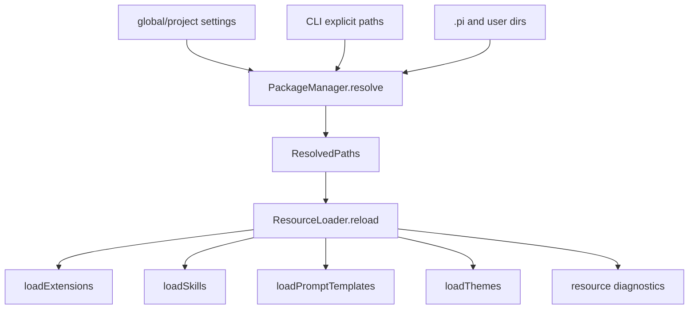

# 21. Package Manager、资源发现与 Theme

## 21.1 本章要解决的问题

如果只实现第 1-20 章，读者能复刻 Pi 的核心 harness，但还不能复刻 Pi 的完整产品资源平面。真实 Pi 不只从 CLI 参数加载一个 extension；它会合并 project/user/package 来源的 extensions、skills、prompts、themes，并把资源诊断反馈到 host。完整复刻必须补齐这一层。

## 21.2 当前 Pi 源码锚点

| 责任 | 当前实现 |
|---|---|
| resolved resource 结构 | [package-manager.ts#L54](packages/coding-agent/src/core/package-manager.ts#L54) |
| PackageManager 接口 | [package-manager.ts#L92](packages/coding-agent/src/core/package-manager.ts#L92) |
| 资源类型集合 | [package-manager.ts#L186](packages/coding-agent/src/core/package-manager.ts#L186) |
| DefaultPackageManager | [package-manager.ts#L757](packages/coding-agent/src/core/package-manager.ts#L757) |
| resolve 主入口 | [package-manager.ts#L863](packages/coding-agent/src/core/package-manager.ts#L863) |
| settings 覆盖来源 | [package-manager.ts#L2217](packages/coding-agent/src/core/package-manager.ts#L2217) |
| resolved paths 输出 | [package-manager.ts#L2436](packages/coding-agent/src/core/package-manager.ts#L2436) |
| ResourceLoader reload | [resource-loader.ts#L321](packages/coding-agent/src/core/resource-loader.ts#L321) |
| theme 加载 | [resource-loader.ts#L553](packages/coding-agent/src/core/resource-loader.ts#L553) |
| CLI 关闭资源发现 | [args.ts#L238](packages/coding-agent/src/cli/args.ts#L238) |

## 21.3 生命周期图



## 21.4 关键数据结构

真实 Pi 的 resource 输出不是路径数组，而是分类型结构。源码位置：[package-manager.ts#L54](packages/coding-agent/src/core/package-manager.ts#L54)。

```ts
export interface ResolvedPaths {
	extensions: ResolvedResource[];
	skills: ResolvedResource[];
	prompts: ResolvedResource[];
	themes: ResolvedResource[];
}
```

资源类型固定为四类。源码位置：[package-manager.ts#L186](packages/coding-agent/src/core/package-manager.ts#L186)。

```ts
type ResourceType = "extensions" | "skills" | "prompts" | "themes";
const RESOURCE_TYPES: ResourceType[] = ["extensions", "skills", "prompts", "themes"];
```

完整复刻时，不能把 `skills/prompts/themes` 简化成 extension 的附属字段。它们在 PackageManager 和 ResourceLoader 中是平级资源。

## 21.5 资源来源合并

`DefaultPackageManager.resolve()` 负责把 package source、全局设置、项目设置、自动发现目录合并成 `ResolvedPaths`。主入口见 [package-manager.ts#L863](packages/coding-agent/src/core/package-manager.ts#L863)，settings 来源见 [package-manager.ts#L2217](packages/coding-agent/src/core/package-manager.ts#L2217)。

```ts
const userOverrides = {
	extensions: (globalSettings.extensions ?? []) as string[],
	skills: (globalSettings.skills ?? []) as string[],
	prompts: (globalSettings.prompts ?? []) as string[],
	themes: (globalSettings.themes ?? []) as string[],
};
```

这段代码说明完整 Pi 的资源不是“当前 cwd 下扫一遍”。它至少要区分 user 和 project scope，并允许 settings 覆盖自动发现。

## 21.6 ResourceLoader 的汇合点

`ResourceLoader.reload()` 消费 package manager 的输出，再加载 extension、skill、prompt、theme。源码位置：[resource-loader.ts#L321](packages/coding-agent/src/core/resource-loader.ts#L321)。

```ts
const resolvedPaths = await this.packageManager.resolve();
const enabledExtensions = getEnabledPaths(resolvedPaths.extensions);
const enabledSkillResources = getEnabledResources(resolvedPaths.skills);
const enabledPrompts = getEnabledPaths(resolvedPaths.prompts);
const enabledThemes = getEnabledPaths(resolvedPaths.themes);
```

theme 加载是同一资源平面的一部分，见 [resource-loader.ts#L553](packages/coding-agent/src/core/resource-loader.ts#L553)。mini 版可以先没有 theme，但完整复刻不能把 theme 当成 TUI 的硬编码颜色表。

## 21.7 设计不变量

- 不变量：资源类型必须保留四类。原因：extension、skill、prompt、theme 的生命周期不同。违反后果：`/reload` 后能力和 UI 不一致。
- 不变量：资源来源必须带 metadata。原因：诊断、冲突提示、优先级排序都依赖来源。违反后果：用户不知道哪个 package 或目录覆盖了资源。
- 不变量：CLI 禁用项必须进入资源发现。原因：`--no-extensions`、`--no-skills`、`--no-themes` 是产品行为，不是 host 私有逻辑。CLI 选项见 [args.ts#L238](packages/coding-agent/src/cli/args.ts#L238)。

## 21.8 完整复刻任务

完整复刻应新增：

- `PackageManager.resolve()`：输出 `extensions/skills/prompts/themes`。
- `ResourceLoader.reload()`：消费 resolved resources 并保留 diagnostics。
- `ThemeRegistry`：加载内置主题、用户主题和项目主题。
- `ResourceDiagnostics`：把缺失路径、冲突、加载错误传给 host。

不要先实现 package install CLI。先把资源解析和 reload 做对，再接安装/更新。

## 21.9 验收清单

- 能解释 `PackageManager` 与 `ResourceLoader` 的边界。
- 能从 user/project/package 三类来源解析四类资源。
- 能关闭 extensions、skills、prompts、themes 的自动发现。
- 能报告资源缺失和冲突，而不是静默忽略。
- 能让 theme 成为资源，而不是硬编码在 TUI 组件里。

## 21.10 与前 20 章的关系

第 10 章讲资源如何进入 prompt，第 13 章讲 extension runner，第 15 章讲 TUI 使用 theme。本章补齐的是“这些资源从哪里来、如何排序、如何诊断”。没有本章，读者能复刻核心 agent，但不能复刻 Pi 的 package/resource 产品面。
