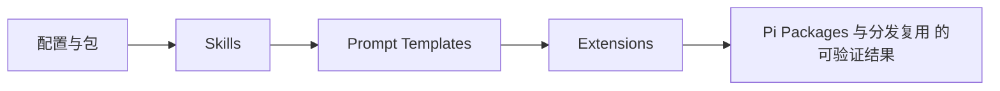

# 22. Pi Packages 与分发复用

## 22.1 本章解决的问题

单个扩展文件适合个人试验，但团队需要可安装、可更新、可审查、可禁用的能力包。Pi packages 解决的就是“把一组 extensions、skills、prompt templates、themes 作为一个版本化交付物分发”。

`packages/coding-agent/docs/packages.md` 开头定义得很清楚：Pi packages bundle extensions, skills, prompt templates, and themes so you can share them through npm or git。包可以在 `package.json` 的 `pi` 字段声明资源，也可以使用 conventional directories。资源类型不是随意的：extensions 运行代码，skills 改变模型行为，prompts 扩展 slash command 输入，themes 改变 TUI 视觉。

本章在全书结构中承接第 17 到 21 章。前面已经分别讲了 skills、prompt templates、extensions、events、tools、UI、themes；本章把这些能力从“本地文件”提升到“团队产品”。如果不理解 packages，团队往往会把 `.pi/extensions`、`~/.pi/agent/themes`、复制粘贴的 `SKILL.md` 混在一起，最后无法版本控制、无法回滚、无法做安全审查。

源码入口是资源加载和包管理。`ResourceLoader` 接口在 [resource-loader.ts#L28](/source-code/packages/coding-agent/src/core/resource-loader.ts#L28)，默认实现 `DefaultResourceLoader` 在 [resource-loader.ts#L152](/source-code/packages/coding-agent/src/core/resource-loader.ts#L152)。包管理接口在 [package-manager.ts#L92](/source-code/packages/coding-agent/src/core/package-manager.ts#L92)，默认实现 `DefaultPackageManager` 在 [package-manager.ts#L757](/source-code/packages/coding-agent/src/core/package-manager.ts#L757)。

## 22.2 最小可运行路径

先读 `packages/coding-agent/docs/packages.md`、`packages/coding-agent/docs/extensions.md`、`packages/coding-agent/docs/skills.md`、`packages/coding-agent/docs/prompt-templates.md`、`packages/coding-agent/docs/themes.md`。

最小包结构可以只有一个 `package.json` 和一个扩展：

```json
{
  "name": "my-pi-package",
  "keywords": ["pi-package"],
  "pi": {
    "extensions": ["./extensions"],
    "skills": ["./skills"],
    "prompts": ["./prompts"],
    "themes": ["./themes"]
  }
}
```

也可以不用 manifest，按 convention directories 放资源：`extensions/`、`skills/`、`prompts/`、`themes/`。文档说没有 `pi` manifest 时，Pi 会自动从这些目录发现资源。

验证路径分三步。第一，用本地路径试跑：`pi -e ./relative/path/to/package`。文档说明 `-e` 会安装到临时目录，只对当前 run 生效，适合开发验证。第二，用 `pi install ./relative/path/to/package` 写入 settings。第三，用 `pi config` 启用或禁用包里的资源，确认团队用户可以按资源粒度控制，而不是只能全开或全关。

注意安装命令管理的是 Pi packages，不是 Pi CLI 本身。`packages/coding-agent/docs/usage.md` 也把 `pi install`、`pi remove`、`pi update --extensions`、`pi list` 放在 package management 下，并提示详见 `packages.md`。

## 22.3 核心机制

PackageManager 的输出不是“安装成功”这么简单，而是一组分类后的资源路径。`ResolvedPaths` 在 [package-manager.ts#L60](/source-code/packages/coding-agent/src/core/package-manager.ts#L60) 定义，包含 extensions、skills、prompts、themes 等资源集合。`DefaultPackageManager.resolve()` 在 [package-manager.ts#L863](/source-code/packages/coding-agent/src/core/package-manager.ts#L863) 读取 global 和 project settings，收集包，再去重和解析资源。

去重规则体现了团队优先级。`packages/coding-agent/docs/packages.md` 写明同一个 package 同时出现在 global 和 project settings 时 project wins，源码的 dedupe 注释在 [package-manager.ts#L1633](/source-code/packages/coding-agent/src/core/package-manager.ts#L1633)。这使项目仓库可以覆盖个人全局配置，避免“我机器上可以，你机器上不行”的资源差异。

包资源来自两条路径。第一，manifest：`readPiManifest` 在 [package-manager.ts#L2121](/source-code/packages/coding-agent/src/core/package-manager.ts#L2121) 读取 `package.json` 的 `pi` 字段；manifest entries 会被展开成文件集合。第二，convention：`collectDefaultResources` 在 [package-manager.ts#L2047](/source-code/packages/coding-agent/src/core/package-manager.ts#L2047) 从 `extensions/`、`skills/`、`prompts/`、`themes/` 等目录收集默认资源。

ResourceLoader 再把这些路径变成运行时资源。`DefaultResourceLoader` 在 [resource-loader.ts#L323](/source-code/packages/coding-agent/src/core/resource-loader.ts#L323) 调用 package manager，随后在 [resource-loader.ts#L398](/source-code/packages/coding-agent/src/core/resource-loader.ts#L398) 加载 extensions，在 [resource-loader.ts#L510](/source-code/packages/coding-agent/src/core/resource-loader.ts#L510) 加载 skills，在 [resource-loader.ts#L533](/source-code/packages/coding-agent/src/core/resource-loader.ts#L533) 加载 prompt templates，在 [resource-loader.ts#L557](/source-code/packages/coding-agent/src/core/resource-loader.ts#L557) 加载 themes。

过滤是包系统的关键能力。`packages/coding-agent/docs/packages.md` 的 object form 支持 `extensions`、`skills`、`prompts`、`themes` 分别过滤，`[]` 表示不加载某类资源，`!pattern` 排除，`+path` 强制包含，`-path` 强制排除。源码中 `applyPackageFilter` 从 [package-manager.ts#L2008](/source-code/packages/coding-agent/src/core/package-manager.ts#L2008) 附近进入。它让团队可以安装一个大包，但只启用当前项目需要的资源。


**生命周期图**



**源码责任表**

| 环节 | 系统责任 | 源码证据 | 读源码时要确认什么 |
|---|---|---|---|
| 配置与包 | 声明资源来源和优先级 | [resource-loader.ts#L398](/source-code/packages/coding-agent/src/core/resource-loader.ts#L398) | 输入从哪里来，输出交给谁，失败由哪一层裁决 |
| Skills | 模型行为说明书 | [resource-loader.ts#L510](/source-code/packages/coding-agent/src/core/resource-loader.ts#L510) | 输入从哪里来，输出交给谁，失败由哪一层裁决 |
| Prompt Templates | 可复用任务入口 | [resource-loader.ts#L533](/source-code/packages/coding-agent/src/core/resource-loader.ts#L533) | 输入从哪里来，输出交给谁，失败由哪一层裁决 |
| Extensions | 代码能力与 UI/provider 注册 | [types.ts#L1084](/source-code/packages/coding-agent/src/core/extensions/types.ts#L1084) | 输入从哪里来，输出交给谁，失败由哪一层裁决 |

**关键代码说明**

读源码时不要只顺着函数名跳转，而要检查四个边界：输入边界、状态边界、裁决边界、输出边界。输入边界回答“谁把数据交进来”；状态边界回答“哪些信息会跨 turn、跨 session 或跨进程保留”；裁决边界回答“谁有权继续、停止、执行或拒绝”；输出边界回答“结果给人看、给模型看，还是给外部系统看”。本章涉及的源码只有放进这四个边界中才有解释力。

## 22.4 为什么这样设计

Pi package 不是通用 npm package 的替代品，而是“Pi 资源分发协议”。它复用 npm、git、本地路径作为 transport，但资源解释权在 Pi。

这样设计有四个实际好处。第一，资源可以版本化。npm spec `npm:@scope/pkg@1.2.3` 是 pinned，git spec 可以固定 tag 或 commit。第二，资源可以跨项目复用。一个公司内部 package 可以同时包含 code review skill、Jira prompt、危险路径保护 extension、统一主题。第三，资源可以按项目覆盖。project settings 比 global settings 优先，让仓库能声明自己的默认能力。第四，资源可以被审查。文档把 security warning 放在 install section：packages run with full system access，extensions execute arbitrary code，skills can instruct the model to perform any action。

依赖设计也服务安全和运行时隔离。`packages/coding-agent/docs/packages.md` 说运行时 dependencies 放在 `dependencies`，而 `@earendil-works/pi-ai`、`@earendil-works/pi-coding-agent`、`@earendil-works/pi-tui`、`typebox` 等 Pi core packages 应列为 `peerDependencies` 且使用 `"*"`，不要 bundle。原因是扩展运行在 Pi 进程里，应使用宿主提供的 API 类型和运行时，而不是把另一份 core 包塞进 package。

对前端工程师可以类比：Pi package 类似一个 design system package 加插件包，但它分发的不只是 UI 组件，还包括模型行为、命令、工具、主题和 prompt。包边界决定的是团队工作流边界。


**创建者视角的设计不变量**

资源系统是 Pi 小内核的主要出口。稳定行为进入核心，团队差异进入资源；资源必须保留 sourceInfo、加载顺序和冲突边界，否则用户无法解释为什么某个 skill、命令、主题或工具生效。

**如果省略本章会发生什么**

省略本章，读者会把 Pi Packages 与分发复用 当成单点功能，而不是 Pi 架构中的责任边界。直接后果是：使用时不知道该改配置、写资源、写扩展、接 provider 还是调用 SDK；排查时也会把 provider、工具、TUI、session 和资源加载混为一谈。专家级学习必须把每章能力放回系统生命周期中验证。

## 22.5 常见误解与排查

误解一：package 只是 extension 的压缩包。不同意。文档定义的资源包括 extensions、skills、prompt templates、themes。一个包可以没有 extension，只分发 prompts 和 themes；也可以只有 skills。

误解二：安装 package 就应该加载所有资源。不同意。`pi config` 和 package filtering 允许按资源类型或路径启用禁用。排查资源未加载时，先看 settings object form 是否把该类型设成 `[]`，再看 manifest 是否包含对应路径，最后看资源文件是否符合 convention。

误解三：npm 依赖都可以放 devDependencies。不同意。文档说明 Pi 安装 npm 或 git package 时运行生产安装，runtime deps 必须在 `dependencies`。如果扩展 import 了第三方库但只写在 devDependencies，用户安装后运行时会找不到模块。

误解四：global package 一定覆盖 project package。不同意。Pi 的 scope and deduplication 是 project wins。排查“为什么我的全局扩展没生效”时，要检查项目 `.pi/settings.json` 是否安装了同 identity 的包。

误解五：package update 总是拉最新。不同意。文档说 versioned npm specs pinned，git refs pinned，`pi update` 不会把 pinned ref 移到新的 ref，只会 reconcile 到配置中的 ref。团队需要升级时，应修改 settings 中的版本或 ref。

## 22.6 本章训练

第一，把一个团队 code review 工作流拆成 package 资源：`skills/review/SKILL.md` 放审查方法，`prompts/review.md` 放 slash template，`extensions/protect.ts` 拦截危险路径，`themes/team.json` 统一颜色。说明每类资源为什么存在。

第二，读 [package-manager.ts#L863](/source-code/packages/coding-agent/src/core/package-manager.ts#L863) 到 [package-manager.ts#L914](/source-code/packages/coding-agent/src/core/package-manager.ts#L914)，解释 global settings、project settings、dedupe、resolve 的顺序。要求你能说出 project wins 解决了什么协作问题。

第三，设计一个 package filtering 场景：同一个包里有 `extensions/plan.ts`、`extensions/legacy.ts`、`skills/review/SKILL.md`、`themes/dark.json`。某项目只想加载 review skill 和 dark theme，不想加载任何 extension。写出 settings object form，并解释 `[]` 和 `!pattern` 的差别。

第四，做安全审查清单：检查 extension 是否执行 shell、是否读取 secrets、是否注册 provider、是否改变 active tools；检查 skills 是否要求模型运行外部命令；检查 package dependencies 是否合理。这个训练把本章和第 31 章安全边界提前连起来。


**专家验收任务**

完成本章后，读者应该能交付三件东西：一张自己画出的 Pi Packages 与分发复用 数据流图；一份包含源码链接、输入、输出、失败边界的责任表；一个最小实践任务，证明自己能在不改错层级的情况下使用或扩展该能力。若三件事缺一件，就说明还停留在“会用命令”的阶段，没有达到能设计和审计 Pi 方案的水平。

