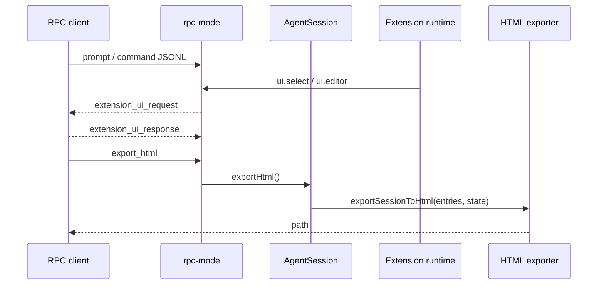

# 22. RPC Extension UI 与 HTML Export

## 22.1 本章要解决的问题

Pi 的 RPC mode 不只是 prompt/response。完整产品还要让 headless client 处理 extension UI，并支持把 session 导出成 HTML。否则 VS Code、Web UI、自动化脚本只能调用 agent，不能完整承载 extension 交互和会话审计。

## 22.2 当前 Pi 源码锚点

| 责任 | 当前实现 |
|---|---|
| `export_html` command | [rpc-types.ts#L57](packages/coding-agent/src/modes/rpc/rpc-types.ts#L57) |
| `export_html` response | [rpc-types.ts#L173](packages/coding-agent/src/modes/rpc/rpc-types.ts#L173) |
| extension UI request 类型 | [rpc-types.ts#L213](packages/coding-agent/src/modes/rpc/rpc-types.ts#L213) |
| extension UI response 类型 | [rpc-types.ts#L255](packages/coding-agent/src/modes/rpc/rpc-types.ts#L255) |
| RPC UI 文档 | [rpc.md#L990](packages/coding-agent/docs/rpc.md#L990) |
| RPC UI 输出 | [rpc-mode.ts#L128](packages/coding-agent/src/modes/rpc/rpc-mode.ts#L128) |
| extension UI context | [types.ts#L124](packages/coding-agent/src/core/extensions/types.ts#L124) |
| HTML tool renderer | [index.ts#L15](packages/coding-agent/src/core/export-html/index.ts#L15) |
| HTML export 函数 | [index.ts#L236](packages/coding-agent/src/core/export-html/index.ts#L236) |
| AgentSession export | [agent-session.ts#L2976](packages/coding-agent/src/core/agent-session.ts#L2976) |

## 22.3 生命周期图



## 22.4 RPC UI 协议

真实 RPC extension UI request 是一组 union。源码位置：[rpc-types.ts#L213](packages/coding-agent/src/modes/rpc/rpc-types.ts#L213)。

```ts
export type RpcExtensionUIRequest =
	| { type: "extension_ui_request"; id: string; method: "select"; title: string; options: string[]; timeout?: number }
	| { type: "extension_ui_request"; id: string; method: "confirm"; title: string; message: string; timeout?: number };
```

response 也有真实 union，见 [rpc-types.ts#L255](packages/coding-agent/src/modes/rpc/rpc-types.ts#L255)。

```ts
export type RpcExtensionUIResponse =
	| { type: "extension_ui_response"; id: string; value: string }
	| { type: "extension_ui_response"; id: string; confirmed: boolean }
	| { type: "extension_ui_response"; id: string; cancelled: true };
```

文档明确 dialog 方法会阻塞等待 response，fire-and-forget 方法只发 request，见 [rpc.md#L990](packages/coding-agent/docs/rpc.md#L990)。完整复刻不能只实现 prompt 命令。

## 22.5 RPC host 如何桥接 extension UI

RPC mode 创建 `ExtensionUIContext`，把 extension UI 调用变成 stdout JSONL。输出 request 的代码见 [rpc-mode.ts#L128](packages/coding-agent/src/modes/rpc/rpc-mode.ts#L128)。

```ts
output({ type: "extension_ui_request", id, ...request } as RpcExtensionUIRequest);
```

这说明 extension UI 不直接操作 terminal。interactive host 可以弹 UI，RPC host 必须把 UI 请求序列化成协议，让 client 决定如何展示。

## 22.6 HTML Export

HTML export 不是简单把 transcript 拼成字符串。它支持自定义工具 HTML renderer。接口见 [index.ts#L15](packages/coding-agent/src/core/export-html/index.ts#L15)。

```ts
export interface ToolHtmlRenderer {
	renderCall(toolCallId: string, toolName: string, args: unknown): string | undefined;
	renderResult(toolCallId: string, toolName: string, result: unknown, isError: boolean): RenderedToolResultHtml | undefined;
}
```

`AgentSession` 创建 tool renderer 后调用 export，源码位置：[agent-session.ts#L2976](packages/coding-agent/src/core/agent-session.ts#L2976)。

```ts
const toolRenderer: ToolHtmlRenderer = createToolHtmlRenderer({
	extensionRunner: this.extensionRunner,
});
```

完整复刻时，HTML export 要经过 session manager、agent state、tool renderer 三个输入，而不是只导出最后一屏 UI 文本。

## 22.7 设计不变量

- 不变量：RPC UI request 必须带 `id`。原因：client response 要和 pending request 配对。违反后果：多个 extension dialog 并发时无法恢复。
- 不变量：dialog 和 fire-and-forget 方法分开。原因：有些 UI 调用不应阻塞 extension。违反后果：状态栏、widget、title 更新卡住 agent。
- 不变量：HTML export 从 session entries 生成。原因：导出是审计产物，不是 TUI 截图。违反后果：resume/fork/custom tool 轨迹丢失。

## 22.8 完整复刻任务

完整复刻应新增：

- RPC pending UI request map。
- `extension_ui_request` stdout 输出。
- `extension_ui_response` stdin 解析和配对。
- `export_html` command 和 response。
- session-to-HTML exporter，支持 custom tool render hooks。

## 22.9 验收清单

- 能处理 `select/confirm/input/editor` 并返回 response。
- 能处理 `notify/setStatus/setWidget/setTitle/set_editor_text`，且不等待 response。
- 能导出包含 user、assistant、toolResult、custom message、branch summary 的 HTML。
- 能让 extension 自定义工具的 call/result 参与 HTML 渲染。
- 能证明 RPC stdout 仍然只有 JSONL 协议行。

## 22.10 与前 20 章的关系

第 14 章只要求 host adapter 保持核心协议纯净。本章补齐 RPC 作为完整产品宿主的能力：extension UI 和 HTML export。没有本章，读者能写机器模式，但不能复刻 Pi 的 headless 集成面。
