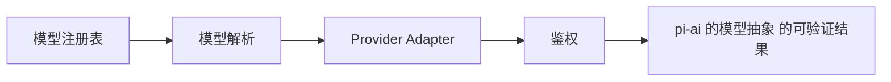

# 23. pi-ai 的模型抽象

## 23.1 本章解决的问题

`@earendil-works/pi-ai` 是 Pi Agent 和各家模型 API 之间的抽象层。前端工程师可以把它理解成一个 typed client SDK，但它解决的问题比“发 HTTP 请求”更复杂：统一 provider、model、message、tool call、stream event、thinking、usage、cost、context serialization、cross-provider handoff。

`packages/ai/README.md` 第一段说它是 `Unified LLM API with automatic model discovery, provider configuration, token and cost tracking, and simple context persistence and hand-off to other models mid-session.` 这句话就是本章主线。Pi Agent 之所以能在 TUI 里切换 Anthropic、OpenAI、Google、Copilot、Bedrock、OpenRouter 等 provider，是因为 agent loop 面对的是 `pi-ai` 的统一 `Model`、`Context`、`AssistantMessageEvent`，而不是每家 API 的原始响应。

本章在全书结构中承接第 5 章 provider/model/streaming，并为第 24 章 models registry 做底层准备。第 24 章讲 Pi CLI 如何发现、选择、覆盖模型；本章讲被选择的模型如何真正被调用，以及为什么不同 provider 能进入同一个 agent loop。

核心源码入口是 `stream()`、API registry、类型定义。`stream()` 在 [stream.ts#L25](packages/ai/src/stream.ts#L25)，API provider registry 在 [api-registry.ts#L40](packages/ai/src/api-registry.ts#L40)，`Context` 在 [types.ts#L333](packages/ai/src/types.ts#L333)，`AssistantMessageEvent` 在 [types.ts#L347](packages/ai/src/types.ts#L347)，`Model` 在 [types.ts#L538](packages/ai/src/types.ts#L538)。

## 23.2 最小可运行路径

先读 `packages/ai/README.md`、`packages/coding-agent/docs/providers.md`、`packages/coding-agent/docs/models.md`。

最小 mental model 是四个对象。第一，`Model` 描述 provider、api、id、输入能力、reasoning、contextWindow、maxTokens、cost。第二，`Context` 包含 systemPrompt、messages、tools。第三，`stream(model, context, options)` 返回事件流。第四，最终 assistant message 追加回 context，工具调用结果也作为 `toolResult` message 追加回 context。

`packages/ai/README.md` 的 Quick Start 展示了完整闭环：`getModel('openai', 'gpt-4o-mini')`，定义 TypeBox tools，构造 `Context`，调用 `stream(model, context)`，处理 `text_delta`、`thinking_delta`、`toolcall_delta`、`toolcall_end`，最后 `await s.result()` 得到 final message。这个路径不依赖 Pi TUI，说明 `pi-ai` 是可复用的底层包。

验证时不要马上写自定义 provider。先读 stream event 表，确认事件语义：`start`、`text_start`、`text_delta`、`text_end`、`thinking_start`、`thinking_delta`、`thinking_end`、`toolcall_start`、`toolcall_delta`、`toolcall_end`、`done`、`error`。文档特别强调 streaming events for different content blocks are not guaranteed to be contiguous，消费者必须用 `contentIndex` 关联同一个 block。

对前端工程师来说，这类似处理多个并发 DOM patch 或 websocket message：不要假设事件顺序是一段 text 完全结束后才开始 tool call；UI 要按 `contentIndex` 更新对应块。

## 23.3 核心机制

`stream()` 的实现很短，但非常关键。它先根据 `model.api` 找到 provider，再调用 provider 的 stream。源码在 [stream.ts#L17](packages/ai/src/stream.ts#L17) 解析 API provider，不存在就抛 `No API provider registered for api`；[stream.ts#L25](packages/ai/src/stream.ts#L25) 暴露统一入口；[stream.ts#L43](packages/ai/src/stream.ts#L43) 暴露 `streamSimple()`。

API registry 用 `api` 字符串，而不是 provider 名称。`registerApiProvider()` 在 [api-registry.ts#L66](packages/ai/src/api-registry.ts#L66) 注册某种 API 实现，例如 `openai-completions`、`openai-responses`、`anthropic-messages`、`google-generative-ai`。这解释了为什么多个 provider 可以共享同一个 API 类型，也解释了 `models.json` 里 provider 配置要声明 `api`。

内置 provider 采用 lazy registration。`packages/ai/src/providers/register-builtins.ts` 里为 Anthropic、OpenAI、Google、Mistral、Bedrock 等 provider 创建 lazy stream wrapper，导出点从 [register-builtins.ts#L326](packages/ai/src/providers/register-builtins.ts#L326) 开始，实际注册表从 [register-builtins.ts#L348](packages/ai/src/providers/register-builtins.ts#L348) 开始。这减少启动时加载所有 provider 实现的成本，也让 optional/provider-specific 依赖更容易隔离。

类型系统把 agent 需要的消息协议固定下来。`ToolCall` 在 [types.ts#L246](packages/ai/src/types.ts#L246)，`AssistantMessage` 在 [types.ts#L277](packages/ai/src/types.ts#L277)，`Tool` 在 [types.ts#L327](packages/ai/src/types.ts#L327)。工具参数验证由 `validateToolCall()` 完成，入口在 [validation.ts#L277](packages/ai/src/utils/validation.ts#L277)。`packages/ai/README.md` 说明 agentLoop 会自动验证工具参数；如果自己用 `stream()` 或 `complete()` 实现 loop，就要手动调用 `validateToolCall`。

模型 discovery 的底层 registry 在 `packages/ai/src/models.ts`。模块加载时把 generated `MODELS` 写入 `modelRegistry`，入口在 [models.ts#L4](packages/ai/src/models.ts#L4)，`getModel()` 在 [models.ts#L20](packages/ai/src/models.ts#L20)，`getProviders()` 在 [models.ts#L28](packages/ai/src/models.ts#L28)，`getModels()` 在 [models.ts#L32](packages/ai/src/models.ts#L32)。第 24 章的 coding-agent registry 会在这个基础上叠加 auth、models.json、extension provider。

**生命周期图**

**源码责任表**

| 环节 | 系统责任 | 源码证据 | 读源码时要确认什么 |
|---|---|---|---|
| 模型注册表 | 内置模型 + models.json + extension provider | [model-registry.ts#L335](packages/coding-agent/src/core/model-registry.ts#L335) | 输入从哪里来，输出交给谁，失败由哪一层裁决 |
| 模型解析 | CLI / scoped models / saved defaults | [model-resolver.ts#L340](packages/coding-agent/src/core/model-resolver.ts#L340) | 输入从哪里来，输出交给谁，失败由哪一层裁决 |
| Provider Adapter | 消息、工具、流式事件归一 | [index.ts#L9](packages/ai/src/index.ts#L9) | 输入从哪里来，输出交给谁，失败由哪一层裁决 |
| 鉴权 | API key / OAuth / request headers | [utils/oauth/index.ts#L55](packages/ai/src/utils/oauth/index.ts#L55) | 输入从哪里来，输出交给谁，失败由哪一层裁决 |

**关键代码说明**

读源码时不要只顺着函数名跳转，而要检查四个边界：输入边界、状态边界、裁决边界、输出边界。输入边界回答“谁把数据交进来”；状态边界回答“哪些信息会跨 turn、跨 session 或跨进程保留”；裁决边界回答“谁有权继续、停止、执行或拒绝”；输出边界回答“结果给人看、给模型看，还是给外部系统看”。本章涉及的源码只有放进这四个边界中才有解释力。

## 23.4 为什么这样设计

Pi 选择统一抽象，不是为了抹平所有 provider 差异，而是为了把差异关在 provider adapter 和 model metadata 里。

第一，agent loop 需要稳定消息协议。无论上游是 OpenAI Responses、Anthropic Messages 还是 Google Generative AI，Pi 都需要统一地展示 streaming text、thinking、tool call、tool result、usage。否则每个 UI component、session serializer、tool runner 都要写 provider 分支。

第二，工具调用需要统一 schema。`packages/ai/README.md` 说明 tools 使用 TypeBox schemas，是因为 TypeBox schema 可序列化为 JSON，适合分布式系统。模型输出的 arguments 不可信，验证失败要作为 tool result 返回给模型重试，而不是让本地进程崩掉。

第三，provider 差异仍然保留。`StreamOptions` 从 [types.ts#L84](packages/ai/src/types.ts#L84) 开始，具体 provider 还可以有 Anthropic、OpenAI、Google 等选项。文档也有 provider-specific options section。统一入口接受通用 options，但直接调用 provider-specific stream 时 TypeScript 能约束更细的选项。

第四，context serialization 和 handoff 是 Pi 工作流的核心。`packages/ai/README.md` 说 `Context` 可以 JSON serialize/deserialize，并且支持 cross-provider handoffs。Pi 的会话树、resume、fork、模型切换都依赖这个能力。没有统一 context，切换模型会变成“重新开始一次聊天”。

**创建者视角的设计不变量**

模型不是字符串，而是带 provider、api、context window、reasoning、headers、auth 和 stream 能力的对象。上层可以统一调用，但不能假设所有 provider 都支持同样的工具、thinking、缓存或图片能力。

**如果省略本章会发生什么**

省略本章，读者会把 pi-ai 的模型抽象 当成单点功能，而不是 Pi 架构中的责任边界。直接后果是：使用时不知道该改配置、写资源、写扩展、接 provider 还是调用 SDK；排查时也会把 provider、工具、TUI、session 和资源加载混为一谈。专家级学习必须把每章能力放回系统生命周期中验证。

## 23.5 常见误解与排查

误解一：`pi-ai` 只是一层 fetch wrapper。不同意。它定义了模型 metadata、stream event、tool schema、usage、thinking、image input、OAuth helper、context handoff。fetch 只是 provider adapter 内部的一步。

误解二：stream events 一定按 block 连续出现。不同意。`packages/ai/README.md` 明确说不同 content blocks 的 streaming events 不保证连续，消费者必须用 `contentIndex`。如果 TUI 把 toolcall_delta 渲染到错误位置，先检查是不是用数组最后一项而不是 `contentIndex`。

误解三：模型支持图片、reasoning、tool calling 可以运行时试错。不同意。`Model` metadata 已经有 `input`、`reasoning`、`contextWindow`、`maxTokens`、`cost`。文档说传图片给非 vision model 会被 silently ignored；这类行为应在 UI 和选择策略里提前解释。

误解四：image generation 可以用 `stream()`。不同意。`packages/ai/README.md` 说 image generation uses a separate API surface，使用 `getImageModel()`、`getImageModels()`、`getImageProviders()`、`generateImages()`，不要用 `stream()` 或 `complete()`。

误解五：浏览器里可以直接放 API key。不同意。README 的 Browser Usage 有明确 security warning：exposing API keys in frontend code is dangerous。前端工程师要把 `pi-ai` 的 browser support 理解成内部工具或 demo 能力，生产环境应走后端代理。

## 23.6 本章训练

第一，画出一次 tool call 的 message 流：user message 进入 `Context.messages`，assistant message 产生 `toolCall` block，本地执行工具，追加 `toolResult` message，再调用 `complete()` 或继续 `stream()`。要求你能指出 `ToolCall`、`ToolResultMessage`、`Context` 的源码位置。

第二，解释为什么 `toolcall_delta` 的 arguments 只能用于 progressive UI，不能直接执行工具。README 说 partial arguments 是 best-effort parse，字段可能缺失或截断，真正执行应等 `toolcall_end` 并验证。

第三，比较 `stream()` 和 `streamSimple()`：前者直接走 provider API options，后者把简化 reasoning 等选项映射到 provider-specific options。要求你能在 [stream.ts#L25](packages/ai/src/stream.ts#L25) 和 [stream.ts#L43](packages/ai/src/stream.ts#L43) 解释两者共同的 provider resolution。

第四，给一个前端产品设计安全边界：浏览器端只保存 conversation UI state，后端用 `pi-ai` 调 provider，API key 留在服务器。这个训练说明本章不仅服务 Pi CLI，也服务嵌入式 SDK 和团队内部工具。

**专家验收任务**

完成本章后，读者应该能交付三件东西：一张自己画出的 pi-ai 的模型抽象 数据流图；一份包含源码链接、输入、输出、失败边界的责任表；一个最小实践任务，证明自己能在不改错层级的情况下使用或扩展该能力。若三件事缺一件，就说明还停留在“会用命令”的阶段，没有达到能设计和审计 Pi 方案的水平。

