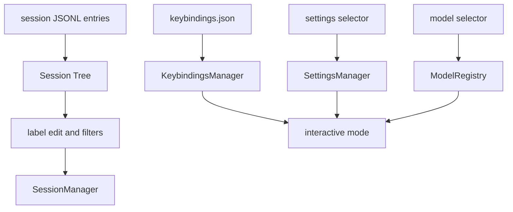

# 23. Interactive 产品面：Keybindings、Settings、Model 与 Session Tree

## 23.1 本章要解决的问题

第 15 章讲 TUI 是事件视图和输入调度器。但完整 Pi 的 interactive mode 还包含可配置快捷键、设置面板、模型选择器、session tree、标签和过滤。缺这些能力，复刻品可以聊天，却不像 Pi 的交互产品。

## 23.2 当前 Pi 源码锚点

| 责任 | 当前实现 |
|---|---|
| keybinding registry | [keybindings.ts#L63](packages/coding-agent/src/core/keybindings.ts#L63) |
| legacy key migration | [keybindings.ts#L204](packages/coding-agent/src/core/keybindings.ts#L204) |
| keybindings config path | [keybindings.ts#L349](packages/coding-agent/src/core/keybindings.ts#L349) |
| settings selector | [settings-selector.ts#L204](packages/coding-agent/src/modes/interactive/components/settings-selector.ts#L204) |
| settings 项 | [settings-selector.ts#L217](packages/coding-agent/src/modes/interactive/components/settings-selector.ts#L217) |
| model selector | [model-selector.ts#L34](packages/coding-agent/src/modes/interactive/components/model-selector.ts#L34) |
| available models | [model-selector.ts#L151](packages/coding-agent/src/modes/interactive/components/model-selector.ts#L151) |
| tree filter mode | [tree-selector.ts#L39](packages/coding-agent/src/modes/interactive/components/tree-selector.ts#L39) |
| tree entry 类型 | [tree-selector.ts#L302](packages/coding-agent/src/modes/interactive/components/tree-selector.ts#L302) |
| label editor | [tree-selector.ts#L1078](packages/coding-agent/src/modes/interactive/components/tree-selector.ts#L1078) |

## 23.3 生命周期图



## 23.4 Keybindings

真实 Pi 用统一 registry 管理 app 和 TUI 快捷键。源码位置：[keybindings.ts#L63](packages/coding-agent/src/core/keybindings.ts#L63)。

```ts
export const KEYBINDINGS = {
	...TUI_KEYBINDINGS,
	"app.clear": { defaultKeys: "ctrl+c", description: "Clear editor" },
	"app.exit": { defaultKeys: "ctrl+d", description: "Exit when editor is empty" },
};
```

完整复刻不能在组件里写死 `ctrl+x` 这类判断。新增行为要先进入 keybinding defaults，再由组件用 keybinding manager 匹配。

## 23.5 Settings Selector

settings selector 集中管理 auto-compact、steering、follow-up、transport、thinking、theme、tree filter、image 等设置。组件入口见 [settings-selector.ts#L204](packages/coding-agent/src/modes/interactive/components/settings-selector.ts#L204)，设置项从 [settings-selector.ts#L217](packages/coding-agent/src/modes/interactive/components/settings-selector.ts#L217) 开始。

```ts
{
	id: "auto-compact",
	label: "Auto-compact",
}
```

这说明完整 Pi 的设置不是散落在 slash command 中。TUI 设置面板、settings manager、runtime 行为必须连接到同一状态。

## 23.6 Model Selector

model selector 依赖 `ModelRegistry.getAvailable()`，并按 provider/model 展示。源码位置：[model-selector.ts#L151](packages/coding-agent/src/modes/interactive/components/model-selector.ts#L151)。

```ts
const availableModels = await this.modelRegistry.getAvailable();
models = availableModels.map((model) => ({
	provider: model.provider,
	id: model.id,
	model,
}));
```

完整复刻必须保留 provider 维度。只做一个 model 字符串下拉，无法支持 OAuth/provider auth、scoped models 和 provider fallback。

## 23.7 Session Tree 与标签

session tree 不只显示 user/assistant。它识别 label、model_change、thinking_level_change、session_info 等 entry。过滤类型见 [tree-selector.ts#L39](packages/coding-agent/src/modes/interactive/components/tree-selector.ts#L39)，entry 识别见 [tree-selector.ts#L302](packages/coding-agent/src/modes/interactive/components/tree-selector.ts#L302)。

```ts
export type FilterMode = "default" | "no-tools" | "user-only" | "labeled-only" | "all";
```

label 编辑组件见 [tree-selector.ts#L1078](packages/coding-agent/src/modes/interactive/components/tree-selector.ts#L1078)。完整复刻中，session tree 是 DAG 的可视化和导航面，不是普通聊天历史列表。

## 23.8 设计不变量

- 不变量：快捷键可配置。原因：TUI、editor、tree、model/settings 面板共享输入系统。违反后果：用户配置失效，扩展编辑器也无法遵循同一键位。
- 不变量：settings selector 写回 settings manager。原因：UI 只是设置入口。违反后果：reload/resume 后状态漂移。
- 不变量：model selector 保留 provider/id。原因：model registry、auth、RPC set_model 都使用 provider + modelId。违反后果：同名模型无法区分。
- 不变量：session tree 消费 JSONL entry。原因：tree 是 session DAG 的视图。违反后果：branch、label、model change 无法复原。

## 23.9 完整复刻任务

完整复刻应新增：

- `KeybindingsManager` 和 user keybindings file。
- Settings selector 面板和每个 setting 的回调。
- Model selector，支持 provider/id、scope、搜索。
- Session tree，支持 filter、branch、label、label timestamp。
- Reload 时重新加载 keybindings、extensions、skills、prompts、themes。

## 23.10 验收清单

- 能修改快捷键配置并影响 TUI 行为。
- 能从 settings 面板切换 auto-compact、steering、follow-up、transport、thinking、theme。
- 能从 model selector 选择 provider/model，并写入默认设置。
- 能在 session tree 中看到 branch summary、label、session_info、model change。
- 能编辑 label 并写回 session JSONL。
